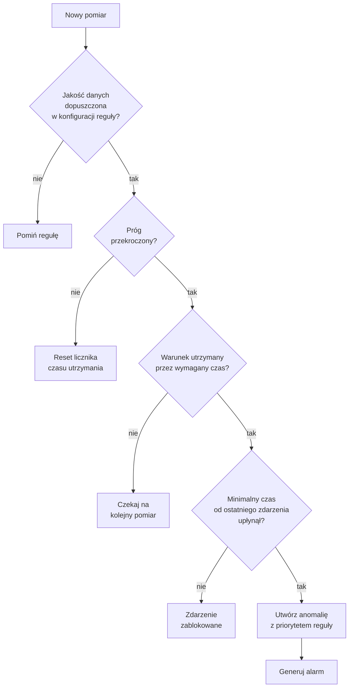
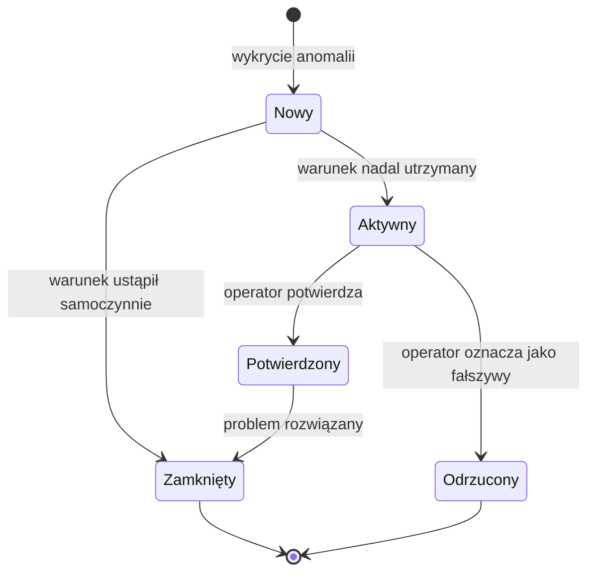
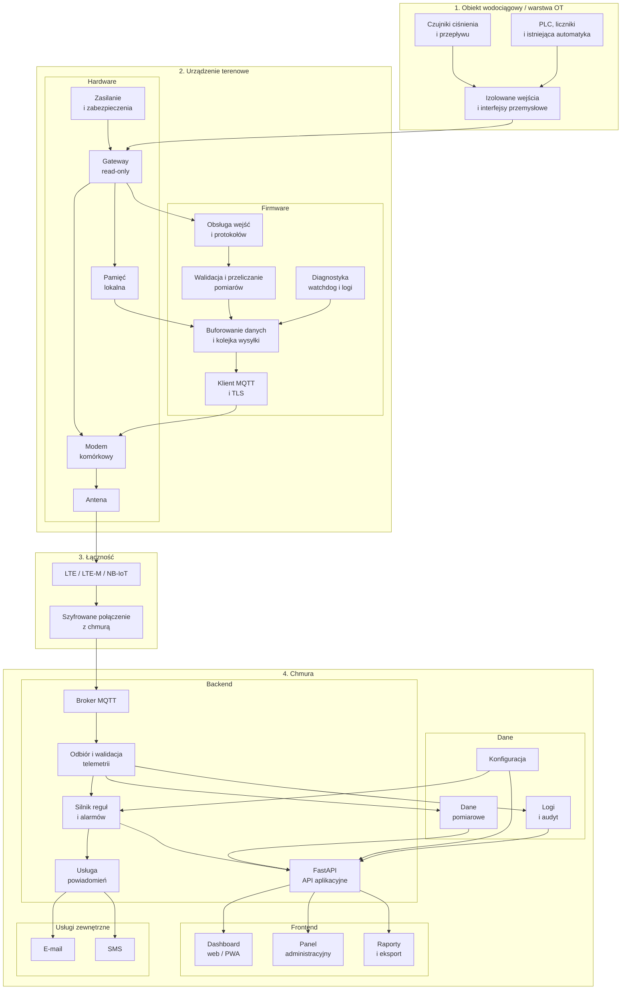
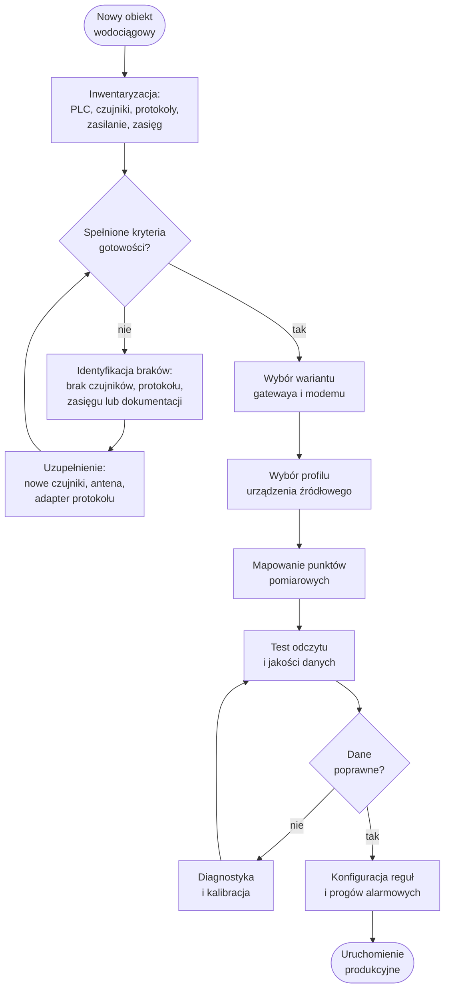
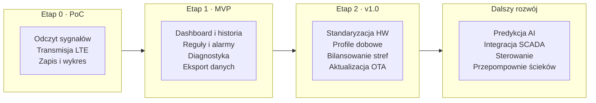

# System monitoringu infrastruktury wodociągowej

## Dokument koncepcyjny i zakres MVP

**Wersja:** 1.4  
**Data:** 2026-07-27  
**Status:** gotowa dokumentacja produktu  
**Autor materiału źródłowego:** Łukasz Piasecki

---

## Spis treści

- [System monitoringu infrastruktury wodociągowej](#system-monitoringu-infrastruktury-wodociągowej)
  - [Dokument koncepcyjny i zakres MVP](#dokument-koncepcyjny-i-zakres-mvp)
  - [Spis treści](#spis-treści)
  - [1. Cel projektu](#1-cel-projektu)
  - [2. Problem klienta](#2-problem-klienta)
  - [3. Propozycja wartości](#3-propozycja-wartości)
  - [4. Zakres obiektów](#4-zakres-obiektów)
    - [4.1. Zakres podstawowy](#41-zakres-podstawowy)
    - [4.2. Zakres przyszły](#42-zakres-przyszły)
  - [5. Zakres MVP](#5-zakres-mvp)
    - [5.1. MVP obejmuje](#51-mvp-obejmuje)
    - [5.2. MVP nie obejmuje](#52-mvp-nie-obejmuje)
  - [6. Kluczowe przypadki użycia](#6-kluczowe-przypadki-użycia)
    - [UC-01: Podgląd bieżącego stanu](#uc-01-podgląd-bieżącego-stanu)
    - [UC-02: Analiza historii](#uc-02-analiza-historii)
    - [UC-03: Wykrycie możliwego wycieku lub pęknięcia](#uc-03-wykrycie-możliwego-wycieku-lub-pęknięcia)
    - [UC-04: Utrata komunikacji](#uc-04-utrata-komunikacji)
    - [UC-05: Raport i eksport](#uc-05-raport-i-eksport)
  - [7. Dane i punkty pomiarowe](#7-dane-i-punkty-pomiarowe)
    - [7.1. Dane podstawowe](#71-dane-podstawowe)
    - [7.2. Metadane każdego pomiaru](#72-metadane-każdego-pomiaru)
    - [7.3. Jakość danych](#73-jakość-danych)
  - [8. Wykrywanie anomalii](#8-wykrywanie-anomalii)
  - [9. Alarmy i powiadomienia](#9-alarmy-i-powiadomienia)
  - [10. Architektura logiczna](#10-architektura-logiczna)
    - [10.1. Przepływ danych](#101-przepływ-danych)
  - [11. Urządzenie terenowe](#11-urządzenie-terenowe)
    - [11.1. Wymagania funkcjonalne](#111-wymagania-funkcjonalne)
    - [11.2. Kandydaci do prototypu](#112-kandydaci-do-prototypu)
  - [12. Integracja z istniejącą automatyką](#12-integracja-z-istniejącą-automatyką)
  - [13. Częstotliwość pomiarów i transmisji](#13-częstotliwość-pomiarów-i-transmisji)
  - [14. Bezpieczeństwo i nieingerencja](#14-bezpieczeństwo-i-nieingerencja)
  - [15. Ograniczenia wykrywania pęknięć rur](#15-ograniczenia-wykrywania-pęknięć-rur)
  - [16. Kryteria gotowości koncepcji technicznej](#16-kryteria-gotowości-koncepcji-technicznej)
  - [17. Klient docelowy i użytkownicy](#17-klient-docelowy-i-użytkownicy)
    - [17.1. Klient docelowy](#171-klient-docelowy)
    - [17.2. Użytkownicy operacyjni](#172-użytkownicy-operacyjni)
    - [17.3. Wstępne role systemowe](#173-wstępne-role-systemowe)
  - [18. Zakres aplikacji użytkownika](#18-zakres-aplikacji-użytkownika)
    - [18.1. Dashboard główny](#181-dashboard-główny)
    - [18.2. Widok obiektu](#182-widok-obiektu)
    - [18.3. Widok alarmów](#183-widok-alarmów)
    - [18.4. Konfiguracja](#184-konfiguracja)
  - [19. Katalog zdarzeń i alarmów wodociągowych](#19-katalog-zdarzeń-i-alarmów-wodociągowych)
    - [19.1. Alarmy krytyczne](#191-alarmy-krytyczne)
    - [19.2. Ostrzeżenia](#192-ostrzeżenia)
    - [19.3. Zdarzenia informacyjne](#193-zdarzenia-informacyjne)
  - [20. Diagnostyka urządzenia terenowego](#20-diagnostyka-urządzenia-terenowego)
  - [21. Minimalna definicja sukcesu MVP](#21-minimalna-definicja-sukcesu-mvp)
  - [22. Rejestr głównych ryzyk](#22-rejestr-głównych-ryzyk)
    - [22.1. Różnorodna automatyka](#221-różnorodna-automatyka)
    - [22.2. Niewystarczająca liczba punktów pomiarowych](#222-niewystarczająca-liczba-punktów-pomiarowych)
    - [22.3. Błędne lub nieskalibrowane czujniki](#223-błędne-lub-nieskalibrowane-czujniki)
    - [22.4. Słaby zasięg komórkowy](#224-słaby-zasięg-komórkowy)
    - [22.5. Nadmiar alarmów](#225-nadmiar-alarmów)
    - [22.6. Utrata lub duplikacja danych](#226-utrata-lub-duplikacja-danych)
    - [22.7. Ryzyko urządzenia prototypowego](#227-ryzyko-urządzenia-prototypowego)
    - [22.8. Cyberbezpieczeństwo](#228-cyberbezpieczeństwo)
    - [22.9. Niejasna odpowiedzialność za alarm](#229-niejasna-odpowiedzialność-za-alarm)
  - [23. Roadmapa produktu](#23-roadmapa-produktu)
    - [23.1. Etap 0: proof of concept](#231-etap-0-proof-of-concept)
    - [23.2. Etap 1: MVP](#232-etap-1-mvp)
    - [23.3. Etap 2: wersja 1.0](#233-etap-2-wersja-10)
    - [23.4. Dalszy rozwój](#234-dalszy-rozwój)
  - [24. Decyzje podjęte](#24-decyzje-podjęte)
  - [25. Decyzje otwarte](#25-decyzje-otwarte)
    - [25.1. Pilne przed projektem urządzenia](#251-pilne-przed-projektem-urządzenia)
    - [25.2. Do ustalenia później](#252-do-ustalenia-później)
  - [26. Źródła kierunkowe](#26-źródła-kierunkowe)

---

## 1. Cel projektu

Celem projektu jest stworzenie systemu zdalnego monitoringu infrastruktury wodociągowej w małych gminach. System ma zbierać dane z przepompowni wody, hydroforni oraz wybranych punktów sieci wodociągowej, przesyłać je do platformy centralnej i przedstawiać w postaci aktualnych parametrów, historii, statusów oraz alarmów.

Pierwszy zakres biznesowy koncentruje się na:

- monitorowaniu ciśnienia,
- monitorowaniu przepływu,
- tworzeniu historii pomiarów,
- wykrywaniu anomalii mogących wskazywać na pęknięcie rury lub wyciek,
- centralnym podglądzie rozproszonych obiektów.

System nie zastępuje lokalnej automatyki i na pierwszym etapie nie steruje pompami, zaworami ani przepustnicami.

## 2. Problem klienta

Małe gminy i lokalne zakłady wodociągowe często nie mają jednego systemu prezentującego aktualny stan rozproszonych obiektów i sieci. Dane z czujników, wodomierzy, przepływomierzy oraz sterowników mogą być dostępne wyłącznie lokalnie albo nie są archiwizowane w sposób umożliwiający analizę.

Skutki:

- brak bieżącej informacji o ciśnieniu i przepływie,
- opóźnione wykrywanie wycieków i awarii,
- wykrywanie problemów dopiero po zgłoszeniu mieszkańców,
- konieczność ręcznych kontroli i objazdów,
- brak spójnej historii danych,
- trudność w ocenie miejsca i czasu powstania nieprawidłowości,
- brak danych do późniejszej optymalizacji działania sieci.

## 3. Propozycja wartości

System zapewnia gminie jedno miejsce do obserwacji ciśnienia, przepływu i stanu infrastruktury wodociągowej. Pozwala szybciej zauważyć nieprawidłowości, ograniczyć czas od wystąpienia problemu do jego wykrycia oraz gromadzić dane potrzebne do późniejszej analizy sieci.

Najważniejsza wartość dla klienta:

- wcześniejsze wykrywanie potencjalnych awarii,
- centralny podgląd obiektów,
- historia pracy sieci,
- identyfikowanie nietypowych zmian ciśnienia i przepływu,
- podstawa do późniejszego wykrywania wycieków, predykcji i automatyzacji.

## 4. Zakres obiektów

### 4.1. Zakres podstawowy

Pierwsza wersja systemu jest przeznaczona dla:

- przepompowni wody,
- hydroforni,
- ujęć i stacji uzdatniania, jeśli udostępniają wymagane sygnały,
- punktów pomiarowych na sieci wodociągowej,
- komór pomiarowych z przepływomierzem, wodomierzem lub czujnikiem ciśnienia.

Typowa gmina może posiadać od kilku do kilkunastu rozproszonych obiektów, oddalonych od siebie nawet o około 20 km. Zakłada się, że w głównych obiektach dostępne jest zasilanie elektryczne.

### 4.2. Zakres przyszły

Przepompownie ścieków stanowią osobny przypadek użycia. Mogą zostać obsłużone przez tę samą platformę w późniejszym etapie, ale wymagają innego zestawu parametrów i alarmów, takich jak poziom ścieków, przepełnienie, czas pracy pomp i brak odpompowywania.

Nie należy mieszać wymagań dla sieci wodociągowej i przepompowni ścieków w pierwszym zakresie produktu.

## 5. Zakres MVP

### 5.1. MVP obejmuje

- rejestrację organizacji, obiektów, urządzeń i punktów pomiarowych,
- odczyt danych z istniejącej automatyki lub dodatkowych czujników,
- pomiar ciśnienia i przepływu,
- przesyłanie danych przez sieć komórkową,
- odbiór i walidację telemetrii w chmurze,
- centralny dashboard,
- aktualny status obiektów i punktów pomiarowych,
- historię pomiarów,
- wykresy,
- podstawowe reguły wykrywania anomalii,
- ogólny mechanizm alarmów i powiadomień,
- diagnostykę urządzenia terenowego i łączności,
- eksport danych.

### 5.2. MVP nie obejmuje

- sterowania pompami,
- sterowania zaworami i przepustnicami,
- automatycznego ograniczania dobowego przepływu,
- pełnego systemu SCADA,
- gwarantowanego wskazywania dokładnego miejsca pęknięcia rury,
- zaawansowanych modeli predykcyjnych,
- automatycznej optymalizacji hydraulicznej,
- monitoringu przepompowni ścieków jako podstawowego scenariusza,
- integracji z każdym istniejącym urządzeniem bez wcześniejszej analizy technicznej.

## 6. Kluczowe przypadki użycia

### UC-01: Podgląd bieżącego stanu

Użytkownik widzi listę obiektów wraz z aktualnym statusem, ostatnim kontaktem, ciśnieniem, przepływem i aktywnymi nieprawidłowościami.

### UC-02: Analiza historii

Użytkownik wybiera obiekt i analizuje zmiany ciśnienia oraz przepływu w określonym okresie. System pokazuje czas pomiaru, jakość danych i przerwy w komunikacji.

### UC-03: Wykrycie możliwego wycieku lub pęknięcia

System rozpoznaje nietypową kombinację parametrów, na przykład nagły spadek ciśnienia połączony ze wzrostem przepływu, i tworzy zdarzenie wymagające weryfikacji.

Zdarzenie powinno być opisane jako **podejrzenie wycieku lub awarii**, a nie jako pewne wykrycie pęknięcia. Jednoznaczna detekcja będzie wymagała odpowiedniego rozmieszczenia punktów pomiarowych, danych bazowych, bilansowania stref i poznania normalnej charakterystyki sieci.

### UC-04: Utrata komunikacji

Jeśli urządzenie nie przesyła danych przez skonfigurowany czas, system oznacza obiekt jako niedostępny i tworzy zdarzenie techniczne.

### UC-05: Raport i eksport

Użytkownik pobiera dane historyczne lub raport prezentujący parametry, anomalie, dostępność urządzeń i zarejestrowane zdarzenia.

## 7. Dane i punkty pomiarowe

### 7.1. Dane podstawowe

- ciśnienie w bar lub kPa,
- przepływ chwilowy w m³/h,
- stan licznika lub objętość sumaryczna w m³, jeśli urządzenie ją udostępnia,
- stan zasilania,
- stan komunikacji,
- status urządzenia terenowego,
- jakość sygnału sieci komórkowej.

### 7.2. Metadane każdego pomiaru

Każdy pomiar powinien zawierać:

- identyfikator organizacji,
- identyfikator obiektu,
- identyfikator urządzenia,
- identyfikator punktu pomiarowego,
- typ parametru,
- wartość,
- jednostkę,
- czas wykonania pomiaru,
- czas wysłania,
- czas odebrania przez platformę,
- jakość danych,
- numer sekwencyjny wiadomości.

### 7.3. Jakość danych

Minimalne statusy jakości:

- `good` – poprawny pomiar,
- `stale` – pomiar nieaktualny,
- `out_of_range` – wartość poza zakresem technicznym,
- `sensor_error` – błąd źródła pomiaru,
- `communication_error` – problem komunikacji lokalnej,
- `delayed` – dane dostarczone z opóźnieniem,
- `unknown` – brak możliwości określenia jakości.

Ostatnia poprawna wartość nie może być prezentowana jako bieżąca bez informacji o czasie pomiaru i jakości.

## 8. Wykrywanie anomalii

W MVP wykrywanie nieprawidłowości powinno opierać się na konfigurowalnych regułach, a nie na obietnicy predykcji AI.

Przykładowe reguły:

- ciśnienie poniżej ustalonego minimum,
- ciśnienie powyżej ustalonego maksimum,
- nagły spadek ciśnienia w określonym czasie,
- przepływ powyżej ustalonego maksimum,
- przepływ występujący w nietypowej porze,
- jednoczesny spadek ciśnienia i wzrost przepływu,
- różnica bilansu pomiędzy wejściem i wyjściem wydzielonej strefy,
- brak zmiany wartości przez nienaturalnie długi czas,
- brak danych z urządzenia.

Każda reguła powinna obsługiwać:

- próg aktywacji,
- czas utrzymania warunku,
- histerezę,
- warunek zakończenia,
- priorytet,
- minimalny czas pomiędzy kolejnymi zdarzeniami,
- stan jakości danych wymagany do wykonania reguły.

Poniższy diagram przedstawia logikę ewaluacji pojedynczej reguły:

## 9. Alarmy i powiadomienia

Na obecnym etapie nie przesądza się kanałów powiadomień ani szczegółowej procedury eskalacji. System powinien jednak rozdzielać:

- zdarzenie pomiarowe,
- wykrytą anomalię,
- alarm wymagający reakcji,
- powiadomienie wysłane do użytkownika.

Minimalne statusy alarmu:

- nowy,
- aktywny,
- potwierdzony,
- zamknięty,
- odrzucony jako fałszywy.

Docelowe kanały mogą obejmować e-mail, SMS, powiadomienie web/PWA lub integrację z systemem klienta. Wybór kanałów pozostaje decyzją otwartą.

## 10. Architektura logiczna

### 10.1. Przepływ danych

1. Gateway odczytuje dane z istniejącego źródła.
2. Pomiar otrzymuje czas, identyfikator i status jakości.
3. Dane trafiają do lokalnego bufora.
4. Gateway wysyła dane przez połączenie komórkowe.
5. Platforma uwierzytelnia urządzenie i waliduje wiadomość.
6. Dane są zapisywane w bazie historycznej.
7. Silnik reguł analizuje nowe pomiary.
8. Dashboard prezentuje aktualne i historyczne dane.
9. Wykryta nieprawidłowość może utworzyć alarm i powiadomienie.

## 11. Urządzenie terenowe

Na obecnym etapie nie należy przesądzać konkretnego modelu gatewaya ani modemu. Najpierw trzeba wykonać inwentaryzację pierwszego obiektu.

### 11.1. Wymagania funkcjonalne

Gateway powinien:

- działać w trybie read-only względem infrastruktury,
- obsługiwać wymagany interfejs obiektowy,
- odczytywać i oznaczać czas pomiaru,
- buforować dane podczas braku łączności,
- automatycznie wznowić transmisję,
- raportować stan urządzenia i modemu,
- posiadać watchdog,
- używać unikalnej tożsamości urządzenia,
- zestawiać wyłącznie połączenia wychodzące,
- umożliwiać bezpieczną zmianę konfiguracji.

### 11.2. Kandydaci do prototypu

ESP32 wraz z modułem LTE może zostać użyte do stanowiska laboratoryjnego i proof of concept. Decyzja o wykorzystaniu takiego zestawu w obiekcie produkcyjnym wymaga oceny:

- interfejsów wejściowych,
- separacji galwanicznej,
- warunków środowiskowych,
- niezawodności zasilania,
- ochrony przeciwprzepięciowej,
- kompatybilności elektromagnetycznej,
- sposobu montażu w szafie,
- dostępności serwisu i części.

## 12. Integracja z istniejącą automatyką

Preferowaną strategią jest wykorzystanie istniejących czujników, liczników i sterowników. Dodatkowe czujniki powinny być montowane tylko wtedy, gdy potrzebne dane nie są dostępne albo ich jakość jest niewystarczająca.

Podczas inwentaryzacji należy sprawdzić:

- producenta i model PLC,
- producenta i model przepływomierza lub wodomierza,
- producenta i model czujnika ciśnienia,
- dostępność Modbus RTU lub Modbus TCP,
- dostępność RS485,
- sygnały 4-20 mA,
- sygnały 0-10 V,
- wyjścia impulsowe,
- styki bezpotencjałowe,
- mapę rejestrów,
- możliwość bezpiecznego równoległego odczytu,
- dostępne zasilanie,
- zasięg operatorów komórkowych,
- miejsce na urządzenie i antenę,
- dokumentację techniczną szafy.

Dopiero po inwentaryzacji należy wybrać moduły wejściowe, gateway i modem.

## 13. Częstotliwość pomiarów i transmisji

Należy rozdzielić:

- częstotliwość odczytu czujnika,
- częstotliwość lokalnego zapisu,
- częstotliwość wysyłania paczki,
- częstotliwość odświeżania dashboardu,
- natychmiastowe wysyłanie zdarzeń alarmowych.

Przykładowy punkt wyjścia do testów:

- odczyt co 1-10 sekund,
- obliczenie wartości minimalnej, maksymalnej i średniej w oknie 1 minuty,
- wysłanie paczki co 1-5 minut,
- natychmiastowe wysłanie istotnego zdarzenia,
- lokalny bufor co najmniej 24-72 godzin.

Są to parametry robocze, które trzeba dopasować do dynamiki sieci, kosztu transmisji i wartości diagnostycznej danych.

## 14. Bezpieczeństwo i nieingerencja

Podstawowa zasada:

> Awaria urządzenia telemetrycznego nie może zmienić stanu pompy, zaworu, przepustnicy, PLC ani lokalnego układu zabezpieczeń.

Minimalne wymagania:

- brak zdalnego sterowania infrastrukturą w MVP,
- brak wystawiania PLC do internetu,
- szyfrowana komunikacja,
- unikalne poświadczenia każdego urządzenia,
- ograniczenie uprawnień urządzenia do własnych kanałów komunikacji,
- separacja danych klientów,
- rejestrowanie dostępu i zmian konfiguracji,
- kopie zapasowe,
- bezpieczne przechowywanie sekretów,
- separacja galwaniczna tam, gdzie jest wymagana,
- dokumentacja sposobu podłączenia,
- możliwość odłączenia telemetryki bez zatrzymania obiektu.

## 15. Ograniczenia wykrywania pęknięć rur

System nie wykryje niezawodnie każdego pęknięcia wyłącznie na podstawie pojedynczego czujnika. Skuteczność zależy od:

- rozmieszczenia punktów pomiarowych,
- podziału sieci na strefy,
- dokładności i częstotliwości pomiarów,
- znajomości normalnych profili zużycia,
- jakości danych,
- wpływu pracy pomp i hydroforni,
- poborów przemysłowych, hydrantów i prac serwisowych,
- możliwości porównania przepływów na wejściu i wyjściu strefy.

Dlatego pierwsza wersja powinna używać określenia **wykrywanie anomalii wskazujących na możliwy wyciek lub awarię**. Po zebraniu historii można rozwijać:

- przepływ minimalny nocny,
- profile dobowe,
- bilansowanie stref,
- detekcję zmian względem linii bazowej,
- korelację ciśnienia i przepływu,
- modele predykcyjne.

## 16. Kryteria gotowości koncepcji technicznej

Przejście do szczegółowego projektu technicznego wymaga ustalenia dla pierwszego obiektu:

1. rodzaju obiektu i jego roli w sieci,
2. dostępnych urządzeń i czujników,
3. dostępnych protokołów i sygnałów,
4. zakresów oraz jednostek pomiarowych,
5. miejsc bezpiecznego podłączenia,
6. wymagań dotyczących izolacji,
7. jakości zasięgu operatorów,
8. oczekiwanej częstotliwości danych,
9. parametrów uznawanych przez klienta za nieprawidłowe,
10. osób uprawnionych do zatwierdzenia instalacji.

Poniższy diagram pokazuje pełny proces od nowego obiektu do uruchomienia produkcyjnego, łącząc inwentaryzację (sekcja 12), kryteria gotowości (sekcja 16) i proces wdrożenia (sekcja 26.8):

## 17. Klient docelowy i użytkownicy

### 17.1. Klient docelowy

Pierwszym segmentem są małe gminy, lokalne zakłady komunalne oraz małe i średnie przedsiębiorstwa wodociągowe, które posiadają rozproszone obiekty, ale nie mają jednego spójnego systemu monitoringu.

Typowy klient:

- posiada od kilku do kilkunastu przepompowni, hydroforni lub punktów pomiarowych,
- utrzymuje obiekty oddalone od siebie nawet o kilkanaście lub kilkadziesiąt kilometrów,
- korzysta z urządzeń i automatyki różnych producentów,
- wykonuje część kontroli ręcznie,
- nie ma kompletnej, centralnej historii ciśnienia i przepływu,
- chce szybciej wykrywać potencjalne awarie i wycieki.

### 17.2. Użytkownicy operacyjni

Pracownik terenowy powinien móc szybko sprawdzić:

- który obiekt wymaga uwagi,
- kiedy wystąpiła nieprawidłowość,
- jakie były wartości ciśnienia i przepływu,
- czy dane są aktualne,
- czy działa zasilanie i komunikacja,
- czy wyjazd na obiekt jest uzasadniony.

Kierownik lub dyspozytor powinien mieć dostęp do:

- aktualnego stanu wszystkich obiektów,
- aktywnych oraz historycznych alarmów,
- trendów ciśnienia i przepływu,
- informacji o dostępności urządzeń,
- raportów i eksportu danych,
- historii reakcji na zdarzenia.

Zarząd zakładu lub urząd gminy może korzystać z informacji zagregowanych:

- liczby i rodzaju wykrytych nieprawidłowości,
- dostępności monitorowanych obiektów,
- czasu wykrycia i obsługi zdarzeń,
- trendów strat oraz zużycia wody,
- efektów wdrożenia systemu.

### 17.3. Wstępne role systemowe

- **Administrator platformy** – zarządza klientami, urządzeniami i konfiguracją techniczną.
- **Administrator klienta** – zarządza obiektami, użytkownikami i progami w obrębie własnej organizacji.
- **Użytkownik operacyjny** – obserwuje dane, potwierdza alarmy i dodaje informacje dotyczące obsługi zdarzenia.
- **Użytkownik tylko do odczytu** – przegląda dashboard, historię i raporty bez możliwości zmiany konfiguracji.

Każda organizacja powinna widzieć wyłącznie swoje obiekty i dane. Szczegółowy model wielokliencki pozostaje do ustalenia na etapie projektu aplikacji.

## 18. Zakres aplikacji użytkownika

### 18.1. Dashboard główny

Dashboard powinien odpowiadać przede wszystkim na pytanie: **który obiekt wymaga uwagi i dlaczego?**

Minimalny zakres:

- lista obiektów,
- status: poprawny, ostrzeżenie, alarm, brak komunikacji lub brak danych,
- aktualne ciśnienie i przepływ, jeśli są dostępne,
- czas ostatniego poprawnego pomiaru,
- czas ostatniego kontaktu z gatewayem,
- aktywne alarmy,
- typ ostatniego zdarzenia,
- filtrowanie po statusie, typie obiektu i lokalizacji,
- przejście do szczegółów obiektu.

Mapa obiektów może być funkcją dodatkową, ale nie powinna zastępować czytelnej listy operacyjnej.

### 18.2. Widok obiektu

Widok powinien zawierać:

- nazwę, typ i lokalizację obiektu,
- bieżący status,
- aktualne wartości i jednostki,
- jakość oraz czas każdego pomiaru,
- wykresy dla wybranego okresu,
- aktywne i historyczne alarmy,
- historię komunikacji,
- informacje o źródłach pomiaru,
- stan gatewaya i modemu,
- wersję konfiguracji urządzenia,
- możliwość eksportu danych.

### 18.3. Widok alarmów

Widok powinien umożliwiać:

- filtrowanie po stanie, priorytecie, obiekcie i czasie,
- wyświetlenie wartości, które uruchomiły regułę,
- potwierdzenie alarmu,
- dodanie komentarza,
- zamknięcie lub oznaczenie alarmu jako fałszywego,
- przejście do wykresu obejmującego okres przed i po zdarzeniu,
- wyświetlenie historii wysłanych powiadomień.

### 18.4. Konfiguracja

Docelowo panel konfiguracyjny powinien obejmować:

- organizacje i użytkowników,
- obiekty,
- urządzenia,
- punkty pomiarowe,
- mapowanie sygnałów na parametry,
- zakresy i jednostki,
- reguły alarmowe,
- odbiorców powiadomień,
- retencję danych,
- ustawienia raportów.

## 19. Katalog zdarzeń i alarmów wodociągowych

### 19.1. Alarmy krytyczne

- bardzo niski poziom ciśnienia,
- bardzo wysokie ciśnienie,
- nagły spadek ciśnienia,
- nagły wzrost przepływu,
- jednoczesny spadek ciśnienia i wzrost przepływu,
- duża i utrzymująca się różnica bilansu strefy,
- brak komunikacji z obiektem krytycznym,
- zanik zasilania urządzenia lub obiektu, jeśli sygnał jest dostępny.

### 19.2. Ostrzeżenia

- ciśnienie poza typowym zakresem,
- przepływ poza typowym zakresem,
- nietypowy przepływ nocny,
- stopniowe odchylenie od profilu bazowego,
- słaby sygnał sieci komórkowej,
- opóźnione dane,
- brak odczytu z pojedynczego czujnika,
- wartość poza zakresem technicznym czujnika,
- zapełniający się bufor lokalny.

### 19.3. Zdarzenia informacyjne

- powrót komunikacji,
- powrót zasilania,
- powrót parametru do normalnego zakresu,
- restart urządzenia,
- aktualizacja konfiguracji,
- zmiana progu alarmowego,
- wymiana lub ponowna kalibracja czujnika.

Katalog jest punktem wyjścia. Aktywne reguły i ich progi muszą zostać uzgodnione dla konkretnego obiektu. System nie powinien generować alarmów na podstawie danych o jakości innej niż dopuszczona w konfiguracji reguły.

## 20. Diagnostyka urządzenia terenowego

Gateway powinien raportować co najmniej:

- identyfikator urządzenia,
- wersję firmware,
- wersję konfiguracji,
- czas działania od restartu,
- czas ostatniego restartu,
- przyczynę ostatniego restartu, jeśli jest dostępna,
- siłę i jakość sygnału sieci komórkowej,
- operatora i technologię połączenia,
- czas ostatniej poprawnej transmisji,
- stan lokalnego bufora,
- liczbę oczekujących rekordów,
- stan komunikacji z lokalnymi urządzeniami,
- błędy odczytu interfejsów,
- stan zasilania,
- temperaturę urządzenia lub szafy, jeśli jest mierzona.

Diagnostyka musi umożliwić odróżnienie problemu infrastruktury wodociągowej od awarii czujnika, gatewaya, modemu, zasilania lub platformy.

Zdalny restart gatewaya może zostać rozważony jako przyszła funkcja serwisowa. Musi dotyczyć wyłącznie urządzenia telemetrycznego, być autoryzowany i rejestrowany oraz nie może wpływać na PLC ani urządzenia wykonawcze.

## 21. Minimalna definicja sukcesu MVP

MVP można uznać za technicznie udane, jeśli:

- nie wpływa na lokalną automatykę,
- stabilnie pobiera dane z rzeczywistego obiektu,
- zachowuje czas i jakość pomiarów,
- odzyskuje transmisję po przerwie w łączności,
- przechowuje dane podczas awarii sieci zgodnie z wymaganym buforem,
- poprawnie prezentuje aktualne i historyczne dane,
- generuje alarmy zgodnie ze skonfigurowanymi regułami,
- pozwala rozróżnić awarię infrastruktury od awarii telemetryki.

## 22. Rejestr głównych ryzyk

### 22.1. Różnorodna automatyka

Każdy obiekt może posiadać inne urządzenia, protokoły i standardy wykonania. Ograniczenie ryzyka: inwentaryzacja, katalog obsługiwanych interfejsów, konfiguracja zamiast kodowania każdej instalacji od początku oraz standaryzowane warianty urządzenia.

### 22.2. Niewystarczająca liczba punktów pomiarowych

Pojedynczy czujnik może nie wystarczyć do wiarygodnego wykrywania wycieku. Ograniczenie ryzyka: analiza topologii sieci, wydzielanie stref, porównanie przepływów, rozbudowa punktów pomiarowych i ostrożne formułowanie alarmów.

### 22.3. Błędne lub nieskalibrowane czujniki

System może poprawnie przesłać nieprawidłową wartość źródłową. Ograniczenie ryzyka: kontrola zakresów, status jakości, ewidencja kalibracji, porównywanie sygnałów i alarmy diagnostyczne.

### 22.4. Słaby zasięg komórkowy

Metalowa szafa lub lokalizacja obiektu mogą powodować przerwy transmisji. Ograniczenie ryzyka: test kilku operatorów, antena zewnętrzna, bufor lokalny, automatyczne wznowienie sesji i SIM M2M.

### 22.5. Nadmiar alarmów

Źle ustawione progi mogą spowodować utratę zaufania do systemu. Ograniczenie ryzyka: histereza, opóźnienia, priorytety, deduplikacja, okres uczenia profilu i analiza fałszywych alarmów.

### 22.6. Utrata lub duplikacja danych

Przerwy łączności i ponowne wysyłanie mogą powodować braki albo duplikaty. Ograniczenie ryzyka: bufor, numery sekwencyjne, idempotentny odbiór, rozdzielenie czasu pomiaru, wysłania i odbioru.

### 22.7. Ryzyko urządzenia prototypowego

Zestaw deweloperski może nie spełniać wymagań środowiskowych i niezawodnościowych. Ograniczenie ryzyka: oddzielenie PoC od produktu, izolowane moduły wejściowe, odpowiednia obudowa i zasilanie oraz przejście na urządzenie przemysłowe lub własny certyfikowany moduł.

### 22.8. Cyberbezpieczeństwo

Niewłaściwa architektura może utworzyć niebezpieczne połączenie pomiędzy internetem a automatyką. Ograniczenie ryzyka: read-only, połączenia wychodzące, brak ekspozycji PLC, unikalne tożsamości, minimalne uprawnienia, szyfrowanie, logi i zarządzanie podatnościami.

### 22.9. Niejasna odpowiedzialność za alarm

Klient może potraktować platformę jako gwarancję wykrycia każdej awarii. Ograniczenie ryzyka: zdefiniowanie zakresu usługi, jakości danych, dostępności, procedur reakcji i ograniczeń detekcji.

## 23. Roadmapa produktu

### 23.1. Etap 0: proof of concept

- odczyt jednego lub kilku sygnałów,
- transmisja przez modem komórkowy,
- podstawowy format telemetrii,
- zapis danych,
- prosty wykres,
- test przerwy w łączności i restartu.

### 23.2. Etap 1: MVP

- obsługa organizacji, obiektów, urządzeń i punktów pomiarowych,
- ciśnienie, przepływ i stan komunikacji,
- jakość danych,
- dashboard i historia,
- reguły progowe,
- alarmy,
- ogólny mechanizm powiadomień,
- bufor danych,
- diagnostyka gatewaya,
- eksport danych,
- tryb read-only.

### 23.3. Etap 2: wersja 1.0

- standaryzowane warianty sprzętowe,
- SIM M2M i zarządzanie flotą kart,
- zarządzanie konfiguracją urządzeń,
- bezpieczna aktualizacja firmware,
- bardziej rozbudowane raporty,
- profile dobowe i nocny przepływ minimalny,
- bilansowanie wydzielonych stref,
- integracje z systemami klienta,
- rozwinięta eskalacja powiadomień.

### 23.4. Dalszy rozwój

- detekcja anomalii względem profilu bazowego,
- prognozowanie zużycia,
- ocena prawdopodobieństwa wycieku,
- korelacja wielu punktów pomiarowych,
- monitoring przepompowni ścieków jako osobny moduł,
- integracja ze SCADA,
- sterowanie zaworami lub przepustnicami po osobnej analizie bezpieczeństwa,
- lokalne algorytmy sterujące z trybem fail-safe.

## 24. Decyzje podjęte

- Pierwszy zakres obejmuje przepompownie lub hydrofornie wody oraz sieć wodociągową.
- Najważniejsze parametry to ciśnienie i przepływ.
- Główny cel analityczny to wykrywanie anomalii mogących wskazywać na pęknięcie rury lub wyciek.
- Przepompownia ścieków jest odrębnym, późniejszym przypadkiem użycia.
- System w MVP działa read-only.
- Sterowanie i automatyczne zawory pozostają poza MVP.
- Dane są przesyłane przez sieć komórkową do platformy centralnej.
- Szczegóły pilotażu, powiadomień, hostingu i modelu biznesowego nie są jeszcze rozstrzygane.
- Hardware zostanie dobrany po inwentaryzacji pierwszego obiektu.

## 25. Decyzje otwarte

### 25.1. Pilne przed projektem urządzenia

- modele istniejących urządzeń,
- dostępne protokoły i sygnały,
- liczba punktów pomiarowych w pierwszym obiekcie,
- zakresy ciśnienia i przepływu,
- częstotliwość pomiarów,
- miejsce montażu,
- wymagania środowiskowe,
- zasięg sieci komórkowej,
- możliwość wykorzystania istniejących danych z PLC.

### 25.2. Do ustalenia później

- liczba obiektów w pilotażu,
- kanały i eskalacja powiadomień,
- wybór chmury i technologii dashboardu,
- szczegółowa architektura wielokliencka,
- retencja danych,
- poziom SLA,
- model własności sprzętu,
- odpowiedzialność serwisowa,
- model cenowy.

---

## 26. Źródła kierunkowe

- Ministerstwo Infrastruktury, informacje dotyczące cyberbezpieczeństwa sektorów zaopatrzenia w wodę pitną i jej dystrybucji oraz NIS2.
- Portal gov.pl, informacje o obowiązkach podmiotów kluczowych i ważnych wynikających z nowelizacji KSC.
- Eclipse Foundation, specyfikacja Sparkplug dla systemów MQTT/IIoT.
- Materiały branżowe dotyczące monitoringu przepływu i ciśnienia w sieciach wodociągowych.
- Informacje operatorów dotyczące LTE-M, NB-IoT oraz kart M2M.

