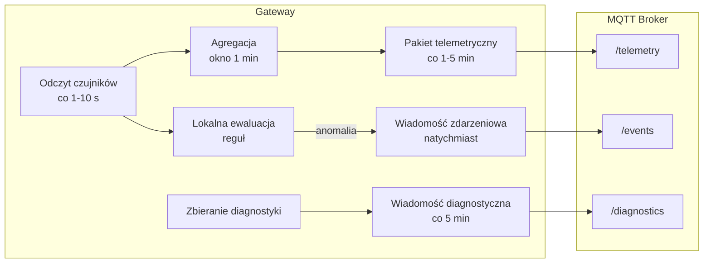
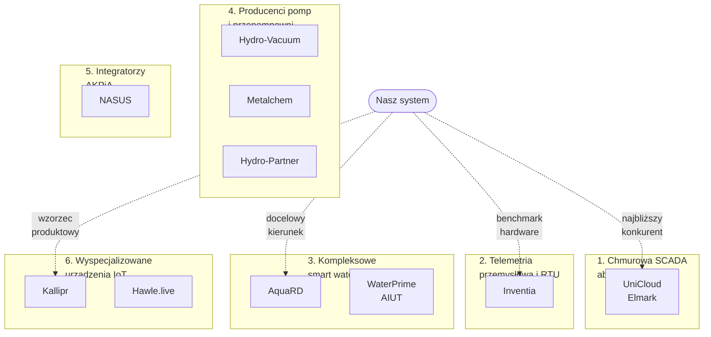
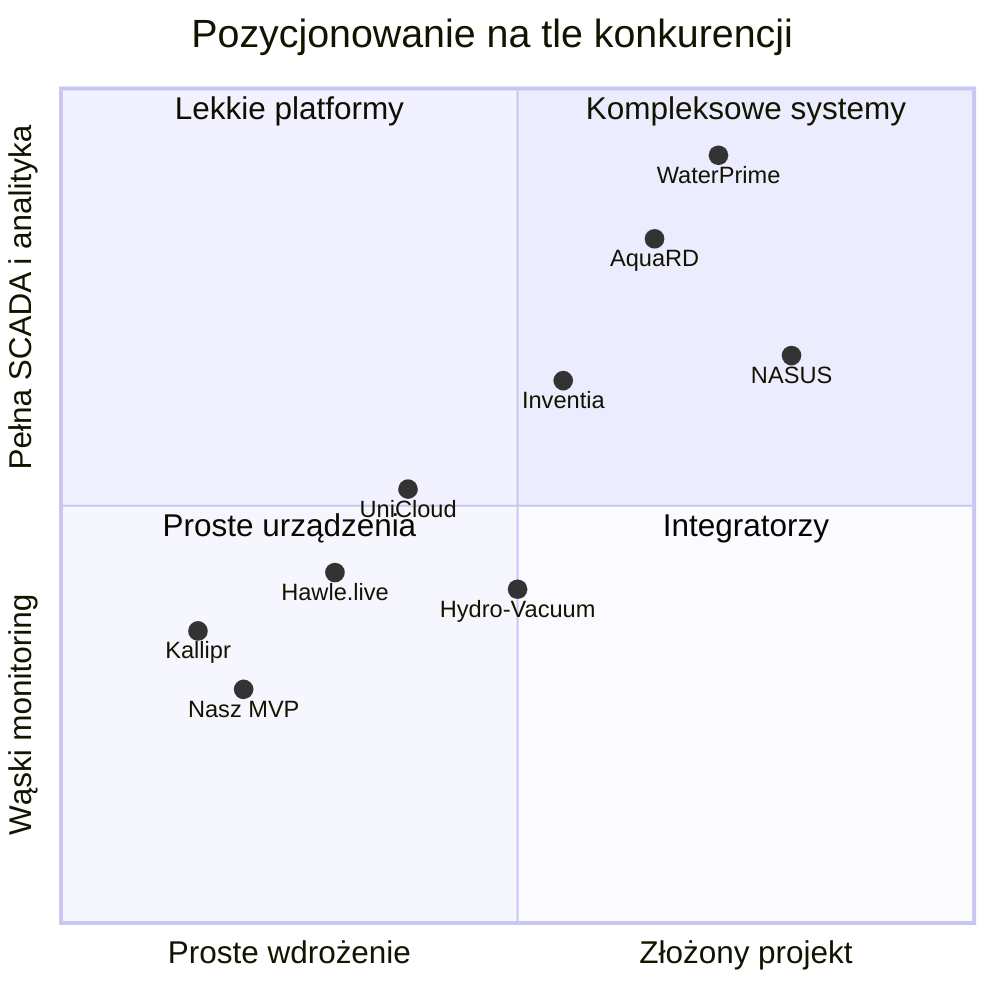
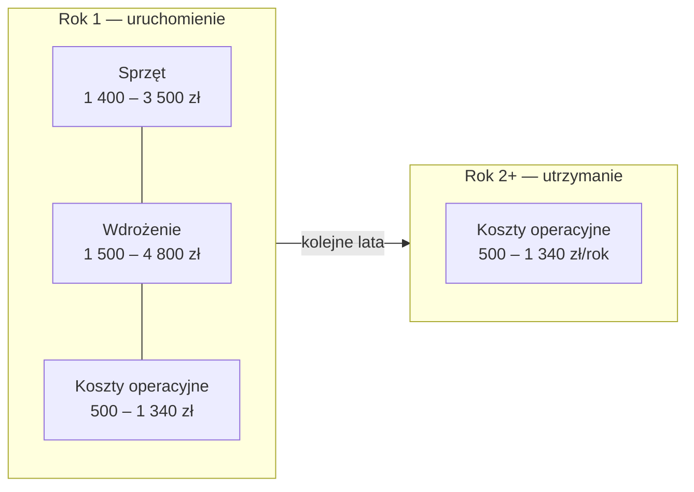
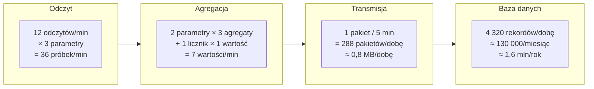
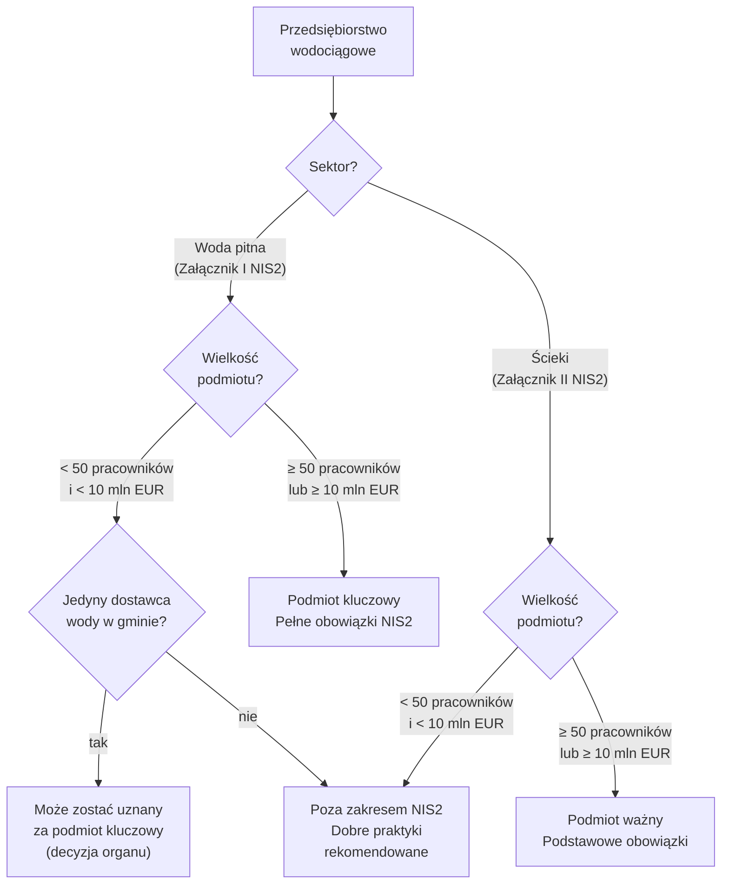

# Materiały uzupełniające — system monitoringu wodociągów MVP


**Dokument towarzyszący:** 01_analiza_biznesowa.md
**Data:** 2026-07-27  
**Autor:** przygotowane na podstawie dokumentacji produktu


---


## Spis treści


1. [Format wiadomości telemetrycznej](#1-format-wiadomości-telemetrycznej)
2. [Analiza konkurencji](#2-analiza-konkurencji)
3. [Szacunek kosztów jednostkowych](#3-szacunek-kosztów-jednostkowych)
4. [Szacunek wolumenu danych](#5-szacunek-wolumenu-danych)
5. [NIS2 i KSC — wpływ na projekt](#6-nis2-i-ksc--wpływ-na-projekt)


---


## 1. Format wiadomości telemetrycznej


Poniższe formaty opierają się na wymaganiach z sekcji 7 (dane i metadane), sekcji 13 (częstotliwość) oraz sekcji 20 (diagnostyka) dokumentacji głównej.


### 1.1. Struktura tematów MQTT


```
v1/{org_id}/{device_id}/telemetry      — pomiary agregowane
v1/{org_id}/{device_id}/diagnostics    — stan urządzenia
v1/{org_id}/{device_id}/events         — zdarzenia alarmowe (natychmiastowe)
```


Wszystkie tematy wychodzące — gateway publikuje, platforma subskrybuje. Brak tematów sterujących w MVP (tryb read-only).


### 1.2. Wiadomość pomiarowa


Wysyłana co 1–5 minut. Zawiera agregaty (min, max, avg) z okien 1-minutowych lub pojedyncze wartości dla liczników i stanów.


```json
{
  "v": 1,
  "device_id": "gw-2026-0001",
  "org_id": "gmina-przykład",
  "object_id": "przepompownia-01",
  "seq": 10542,
  "sent_at": "2026-07-27T14:30:00Z",
  "windows": [
    {
      "window_start": "2026-07-27T14:25:00Z",
      "window_seconds": 60,
      "points": [
        {
          "point_id": "pressure-inlet",
          "type": "pressure",
          "unit": "bar",
          "quality": "good",
          "avg": 3.42,
          "min": 3.38,
          "max": 3.45
        },
        {
          "point_id": "flow-main",
          "type": "flow_rate",
          "unit": "m3/h",
          "quality": "good",
          "avg": 12.8,
          "min": 12.1,
          "max": 13.4
        },
        {
          "point_id": "counter-main",
          "type": "total_volume",
          "unit": "m3",
          "quality": "good",
          "value": 154832.45
        },
        {
          "point_id": "power-mains",
          "type": "power_status",
          "unit": "bool",
          "quality": "good",
          "value": 1
        }
      ]
    },
    {
      "window_start": "2026-07-27T14:26:00Z",
      "window_seconds": 60,
      "points": [
        {
          "point_id": "pressure-inlet",
          "type": "pressure",
          "unit": "bar",
          "quality": "good",
          "avg": 3.40,
          "min": 3.35,
          "max": 3.44
        },
        {
          "point_id": "flow-main",
          "type": "flow_rate",
          "unit": "m3/h",
          "quality": "good",
          "avg": 13.1,
          "min": 12.6,
          "max": 13.8
        },
        {
          "point_id": "counter-main",
          "type": "total_volume",
          "unit": "m3",
          "quality": "good",
          "value": 154832.67
        }
      ]
    }
  ]
}
```


**Konwencje:**


| Pole | Opis |
|---|---|
| `v` | Wersja formatu wiadomości |
| `seq` | Numer sekwencyjny — umożliwia wykrycie luk i duplikatów |
| `sent_at` | Czas wysłania pakietu (zegar gatewaya) |
| `window_start` | Początek okna agregacji (czas pomiaru) |
| `avg`, `min`, `max` | Agregaty z odczytów w oknie — dla ciśnienia i przepływu |
| `value` | Pojedyncza wartość — dla liczników, stanów binarnych, RSSI |
| `quality` | Status jakości wg sekcji 7.3 dokumentacji głównej |


**Reguły:**


- Parametry ciągłe (ciśnienie, przepływ) → `avg`, `min`, `max`.
- Liczniki i kumulaty (objętość sumaryczna) → `value` (ostatni odczyt w oknie).
- Stany binarne (zasilanie, komunikacja) → `value` (0 lub 1).
- Platforma ustawia `received_at` przy odbiorze — nie jest częścią wiadomości z urządzenia.
- Idempotentny odbiór: para `(device_id, seq)` identyfikuje pakiet jednoznacznie.


### 1.3. Wiadomość diagnostyczna


Wysyłana co 5 minut lub na żądanie. Oparta na wymaganiach sekcji 20 dokumentacji głównej.


```json
{
  "v": 1,
  "device_id": "gw-2026-0001",
  "org_id": "gmina-przykład",
  "seq": 10543,
  "sent_at": "2026-07-27T14:30:01Z",
  "diagnostics": {
    "firmware_version": "1.0.0",
    "config_version": "2026-07-01-001",
    "uptime_seconds": 864000,
    "last_restart_at": "2026-07-17T14:30:00Z",
    "restart_reason": "watchdog",
    "cellular": {
      "rssi_dbm": -67,
      "technology": "LTE-M",
      "operator": "Plus",
      "last_successful_tx": "2026-07-27T14:25:00Z"
    },
    "buffer": {
      "records_pending": 0,
      "buffer_usage_percent": 0,
      "buffer_capacity_hours": 72
    },
    "interfaces": {
      "modbus_rtu_status": "ok",
      "modbus_rtu_errors_last_hour": 0,
      "analog_input_1_status": "ok"
    },
    "power": {
      "source": "mains",
      "voltage_v": 23.8
    },
    "temperature_c": 28.5
  }
}
```


### 1.4. Wiadomość zdarzeniowa (alarm)


Wysyłana natychmiast po wykryciu anomalii przez gateway (sekcja 8, 19).


```json
{
  "v": 1,
  "device_id": "gw-2026-0001",
  "org_id": "gmina-przykład",
  "object_id": "przepompownia-01",
  "seq": 10544,
  "sent_at": "2026-07-27T14:30:05Z",
  "event": {
    "event_type": "anomaly",
    "rule_id": "pressure-low-critical",
    "priority": "critical",
    "point_id": "pressure-inlet",
    "trigger_value": 1.85,
    "trigger_unit": "bar",
    "threshold": 2.0,
    "condition_duration_seconds": 120,
    "data_quality": "good",
    "detected_at": "2026-07-27T14:29:55Z",
    "message": "Ciśnienie na wejściu poniżej progu krytycznego"
  }
}
```


### 1.5. Relacje między typami wiadomości





## 2. Analiza konkurencji


### 2.1. Ogólny obraz rynku


Rynek jest rozwinięty i obejmuje kilka nakładających się kategorii:


1. **Chmurowa SCADA w modelu abonamentowym** – gotowa platforma, urządzenie lub router w obiekcie, alarmy, historia i dostęp przez przeglądarkę.
2. **Przemysłowa telemetria i RTU** – własne moduły telemetryczne, komunikacja komórkowa, integracja z PLC i systemami SCADA.
3. **Kompleksowe systemy smart water** – pomiary, GIS, SCADA, bilansowanie stref, wykrywanie strat, modelowanie i analityka.
4. **Monitoring producenta pomp lub przepompowni** – telemetria sprzedawana razem z rozdzielnicą, pompą albo całym obiektem.
5. **Integratorzy automatyki i AKPiA** – indywidualne projekty, modernizacje szaf, PLC, telemetria, wizualizacja i serwis.
6. **Wyspecjalizowane urządzenia IoT** – szybki montaż, zasilanie bateryjne, LTE-M lub NB-IoT, platforma chmurowa i zarządzanie flotą urządzeń.


Wniosek podstawowy:


> Samo zbieranie ciśnienia i przepływu, przesyłanie danych do chmury, alarmowanie oraz prezentowanie wykresów nie stanowi unikalnej przewagi. Przewaga musi wynikać ze sposobu integracji, prostoty wdrożenia, kosztu całkowitego, neutralności sprzętowej, obsługi małych gmin albo jakości procesu utrzymania.


Poniższa mapa pokazuje sześć kategorii rynkowych i przypisanie konkurentów. Linie przerywane wskazują strategiczne relacje projektowanego systemu z poszczególnymi kategoriami:





### 2.2. Najważniejsi konkurenci bezpośredni


#### 2.2.1. UniCloud WOD-KAN / Unitronics / Elmark Automatyka


UniCloud jest jednym z najbliższych konkurentów dla planowanego modelu. Rozwiązanie jest pozycjonowane jako chmurowa SCADA dla gmin i obiektów wod-kan, niewymagająca własnego serwera ani rozbudowanego zaplecza IT.


Publicznie komunikowany zakres obejmuje:


- monitoring SUW i przepompowni,
- dane historyczne i wykresy,
- alarmy,
- raportowanie i eksport CSV,
- dostęp przez przeglądarkę lub telefon,
- automatyczne kopie zapasowe i aktualizacje,
- router IIoT lub sterownik UniStream w obiekcie,
- szyfrowane połączenie wychodzące do chmury bez otwierania portów.


Dostawca komunikuje koszt platformy na poziomie około 1-3 tys. zł rocznie za obiekt, koszt startowy do około 10 tys. zł oraz ponad 50 lokalizacji w Polsce. Są to deklaracje marketingowe dostawcy i nie przesądzają pełnego kosztu integracji, urządzeń, montażu oraz serwisu.


**Mocne strony:**


- produkt skierowany dokładnie do małych gmin,
- gotowy model subskrypcyjny,
- dojrzały ekosystem automatyki Unitronics,
- chmurowa architektura i niski próg wejścia,
- mocna komunikacja korzyści dla urzędu i technika.


**Możliwe ograniczenia lub obszary do weryfikacji:**


- stopień zależności od sprzętu i ekosystemu Unitronics,
- koszt integracji niejednorodnych urządzeń innych producentów,
- swoboda budowania własnych profili i adapterów,
- możliwość podłączenia prostych sygnałów bez wymiany istniejącej automatyki,
- eksport danych i integracja z systemami zewnętrznymi.


**Znaczenie dla projektu:** bardzo wysokie. UniCloud potwierdza istnienie popytu na prostszy model chmurowy, ale jednocześnie ustanawia benchmark funkcjonalny oraz cenowy.


Źródła:


- [UniCloud dla wod-kan – strona rozwiązania](https://smart.elmark.com.pl/uni/umc/branze/wod-kan)
- [Opis modelu chmurowej SCADA dla małej gminy](https://www.elmark.com.pl/blog/system-scada-dla-maej-gminy-czy-to-musi-by-drogie-)


#### 2.2.2. Inventia


Inventia oferuje przemysłowe moduły telemetryczne, RTU, urządzenia bateryjne, bramy komunikacyjne oraz platformę DataPortal do wizualizacji, alarmowania i raportowania.


Zakres wod-kan obejmuje między innymi:


- przepompownie i tłocznie,
- stacje uzdatniania wody,
- zestawy hydroforowe,
- studnie głębinowe i ujęcia,
- komory pomiarowe i sieć wodociągową,
- pomiar ciśnienia, przepływu, poziomu, jakości wody i przewodności,
- integrację przez RS-232, RS-485, Ethernet, Modbus RTU i Modbus TCP,
- transmisję 2G/LTE, LTE Cat M1, NB-IoT i innych technologii,
- integrację z istniejącymi SCADA, bazami danych i platformami analitycznymi.


Inventia podkreśla cyberodporność, ciągłość wsparcia, dokumentację, zarządzanie podatnościami oraz certyfikację ISO 9001 i ISO/IEC 27001. Posiada sieć autoryzowanych partnerów wdrożeniowych.


**Mocne strony:**


- dojrzałe, przemysłowe urządzenia,
- szeroki katalog interfejsów i technologii komunikacyjnych,
- własna platforma nadzoru,
- doświadczenie w infrastrukturze krytycznej,
- sieć partnerów i wsparcie cyklu życia,
- rozwinięte podejście do cyberbezpieczeństwa.


**Możliwe ograniczenia lub obszary do weryfikacji:**


- koszt sprzętu i wdrożenia dla bardzo małej gminy,
- prostota konfiguracji przez lokalnego instalatora,
- zakres samodzielnej konfiguracji profili urządzeń,
- stopień, w jakim kolejne integracje wymagają udziału wyspecjalizowanego integratora.


**Znaczenie dla projektu:** bardzo wysokie po stronie urządzenia terenowego, telemetrii i cyberbezpieczeństwa. To konkurent oraz istotny benchmark jakości produktu przemysłowego.


Źródła:


- [Inventia – rozwiązania WOD-KAN](https://www.inventia.pl/wod-kan/)
- [Inventia – rozwiązania telemetryczne i DataPortal](https://inventia.online/)
- [Inventia – cyberodporna telemetria dla wod-kan](https://www.inventia.pl/baza-wiedzy-telemetron-1-2026-wydanie-o-cyberodpornej-telemetrii-dla-branzy-wod-kan/)


#### 2.2.3. AquaRD


AquaRD oferuje kompleksowy ekosystem dla wodociągów: urządzenia CellBOX, HydraNET, AquaGIS, SCADA, automatykę, szafy sterownicze, zdalny odczyt wodomierzy, zarządzanie kartami SIM i usługi serwisowe.


Publicznie prezentowane możliwości obejmują:


- zbieranie i transmisję danych,
- bilansowanie wody,
- monitoring ciśnienia i przepływu,
- wsparcie odczytów wodomierzy,
- GIS i zarządzanie majątkiem,
- SCADA, sterowanie i alarmowanie,
- integrację z istniejącą infrastrukturą,
- komunikację GSM/GPRS, LTE Cat M1, NB-IoT i radiową,
- urządzenia własnej rodziny CellBOX.


Firma deklaruje ponad 23 lata działania w branży, ponad 2 800 projektów, ponad 1 000 zamontowanych szaf oraz ponad 250 klientów.


**Mocne strony:**


- rozwiązanie end-to-end,
- własny hardware i software,
- doświadczenie w modernizacji działających obiektów,
- SCADA, GIS, bilansowanie i telemetria w jednym portfolio,
- doświadczenie w wykrywaniu strat i optymalizacji pracy sieci,
- serwis oraz wsparcie techniczne.


**Możliwe ograniczenia lub obszary do weryfikacji:**


- prawdopodobnie większy zakres i koszt niż potrzebny dla prostego MVP,
- możliwa przewaga podejścia projektowego nad lekkim samoobsługowym SaaS,
- sposób licencjonowania i koszt małej instalacji,
- otwartość profili urządzeń oraz API.


**Znaczenie dla projektu:** bardzo wysokie jako kompleksowy konkurent w obszarze sieci wodociągowej, pomiarów, transmisji i analityki.


Źródła:


- [AquaRD – zarządzanie siecią wodociągową i kanalizacyjną](https://aquard.pl/)
- [AquaRD – CellBOX µH](https://aquard.pl/cellbox-uh/)
- [SUEZ – opis urządzeń CellBOX](https://www.suez.com/pl-pl/polska/inteligentne-rozwiazania/urzadzenia-cellbox)


#### 2.2.4. NASUS


NASUS jest integratorem automatyki, systemów pomiarowych, telemetrii, SCADA i HMI. Oferuje projektowanie, prefabrykację szaf, montaż, transmisję GSM/GPRS przez prywatny APN, hosting danych i dostęp przez WWW.


Firma działa między innymi dla wodociągów, kanalizacji, energetyki i ciepłownictwa, a wśród publikowanych klientów wymienia przedsiębiorstwa wodociągowe i gospodarki komunalnej.


**Mocne strony:**


- pełne kompetencje integracyjne i AKPiA,
- doświadczenie z PLC, SCADA, HMI i szafami,
- możliwość realizacji trudnych, indywidualnych wdrożeń,
- prywatny APN oraz rozwiązania telemetryczne dla infrastruktury sieciowej.


**Możliwe ograniczenia lub obszary do weryfikacji:**


- model bardziej usługowy i projektowy niż produktowy,
- prawdopodobnie wyższy udział prac inżynierskich w każdym wdrożeniu,
- brak publicznego, prostego cennika SaaS,
- możliwie mniejsza samoobsługowość konfiguracji.


**Znaczenie dla projektu:** wysokie w zakresie integracji z istniejącymi szafami i automatyką.


Źródła:


- [NASUS – automatyka i telemetria](http://www.nasus.pl/index.php)
- [NASUS – wybrani klienci](https://www.nasus.pl/pl/klienci.html)


### 2.3. Konkurenci związani z producentami pomp i szaf


#### 2.3.1. Hydro-Vacuum


Hydro-Vacuum oferuje zdalny monitoring tłoczni i przepompowni oparty o GSM/GPRS. Moduł telemetryczny może pełnić funkcję sterownika, modułu SMS i modułu transmisji. System prezentuje stan obiektu, historię, czas pracy i liczbę załączeń pomp, a także umożliwia zdalną ingerencję w obiekt.


**Mocne strony:** marka producenta pomp, integracja sprzętu z monitoringiem, znajomość układów pompowych, możliwość sprzedaży monitoringu razem z obiektem.


**Ryzyko konkurencyjne:** przy zakupie lub modernizacji pomp klient może otrzymać monitoring jako element większej dostawy bez potrzeby wyboru niezależnej platformy.


**Potencjalna przewaga projektu:** neutralność wobec producenta pomp oraz integracja obiektów różnych marek w jednym systemie.


Źródło:


- [Hydro-Vacuum – zdalny monitoring układów pompowych](https://www.hydro-vacuum.com.pl/monitoring.php)


#### 2.3.2. Metalchem-Warszawa


Metalchem oferuje monitoring przepompowni w dwóch wariantach:


- MRT-GSM z alarmami i raportami przez SMS,
- MRM-GPRS z podglądem online, historią i zdalnym sterowaniem.


System monitoruje między innymi stan pomp, poziom, zasilanie, włamanie, suchobieg i stany alarmowe. Rozwiązanie jest powiązane z rozdzielnicami i przepompowniami dostawcy.


**Mocne strony:** prosty wariant SMS, rozwiązanie gotowe razem z rozdzielnicą, doświadczenie w przepompowniach.


**Potencjalna przewaga projektu:** szerzej rozumiana sieć wodociągowa, ciśnienie i przepływ, platforma chmurowa oraz niezależność od jednego producenta szafy.


Źródło:


- [Metalchem-Warszawa – monitoring przepompowni](https://www.metalchemsa.com.pl/monitoring-przepompowni/)


#### 2.3.3. Hydro-Partner


Hydro-Partner realizuje systemy SCADA, monitoring, wizualizację i zdalne sterowanie procesami. Firma obsługuje szeroką gamę łączy komunikacyjnych oraz wiele popularnych systemów SCADA.


**Mocne strony:** kompetencje wykonawcze, modernizacje, automatyka, znajomość wielu platform SCADA oraz możliwość dostarczenia kompletnego rozwiązania.


**Potencjalna przewaga projektu:** węższy, prostszy produkt chmurowy, szybsze wdrożenie i mniejsza zależność od ciężkiego projektu SCADA.


Źródło:


- [Hydro-Partner – monitoring i SCADA](https://hydro-partner.pl/automatyka-2/monitoring/)


### 2.4. Konkurenci w obszarze monitoringu sieci i strat wody


#### 2.4.1. Hawle.live


Hawle.live obejmuje stację IoT Hawle.live BOX, aplikację, cyfrowe hydranty i elementy do modernizacji istniejącej armatury. Rozwiązanie monitoruje między innymi ciśnienie, przepływ, poziom i jakość wody, umożliwia alarmowanie, raportowanie i geograficzną prezentację urządzeń.


**Mocne strony:** połączenie armatury z platformą cyfrową, gotowe urządzenia terenowe, produktowa forma rozwiązania, monitoring istniejących hydrantów i zasuw.


**Potencjalna przewaga projektu:** integracja nie tylko armatury Hawle, lecz również istniejących czujników, PLC i szaf różnych producentów.


Źródło:


- [Hawle.live – inteligentny monitoring sieci](https://www.hawle.com/pl/dla-klienta/serwis-hawle/hawle-live)


#### 2.4.2. AIUT WaterPrime


WaterPrime jest platformą informatyczno-analityczną integrującą dane z różnych baz, modeli hydraulicznych, punktów pomiarowych i zdalnych odczytów. Obejmuje bilansowanie stref DMA, wykrywanie anomalii i wycieków, predykcję, poprawę jakości danych oraz zarządzanie majątkiem z użyciem IBM Maximo.


**Mocne strony:** zaawansowana analityka, integracja danych, modele hydrauliczne, wykrywanie strat, wsparcie ekspertów i dojrzały dostawca automatyki.


**Możliwe ograniczenia względem pierwszego segmentu:** rozwiązanie jest znacznie szersze od planowanego MVP i może wymagać większego opomiarowania, audytu, modelu hydraulicznego oraz budżetu.


**Znaczenie dla projektu:** konkurent dla późniejszego etapu analityki, bilansowania stref i predykcji, a nie tylko dla podstawowego gatewaya i dashboardu.


Źródła:


- [WaterPrime – platforma analityczna](https://waterprime.eu/)
- [AIUT – opis WaterPrime](https://aiut.com/us/solutions/iot-utility-monitoring-systems/waterprime/)


### 2.5. Zagraniczny wzorzec produktowy


#### 2.5.1. Kallipr


Kallipr oferuje przemysłowe rejestratory i sensory połączone z platformą Kallipr Kloud. W scenariuszu pompowni system zbiera stan pompy, poziom i napływ, wykorzystuje LTE Cat M1 lub NB-IoT, generuje alarmy i prezentuje trendy. Dostawca deklaruje szybki, mało inwazyjny montaż i możliwość integracji z istniejącym SCADA.


**Mocne strony:** gotowe urządzenia do trudnych warunków, szybka instalacja, długi czas pracy bateryjnej, device management oraz powtarzalny proces wdrożenia.


**Znaczenie dla projektu:** bardzo dobry benchmark dla docelowego produktu sprzętowego, konfiguratora i zarządzania flotą urządzeń. Pokazuje, że przewaga może wynikać z szybkiego uruchomienia i standaryzacji instalacji, nie tylko z funkcji dashboardu.


Źródło:


- [Kallipr – monitoring pompowni](https://kallipr.com/solutions/pump-station-monitoring/)


### 2.6. Macierz porównawcza


| Dostawca | Główna kategoria | Chmura / WWW | Własny hardware | Integracja z istniejącą automatyką | Alarmy i historia | Zaawansowana analityka | Model dla małych gmin |
|---|---|---|---|---|---|---|---|
| UniCloud / Unitronics / Elmark | chmurowa SCADA | tak | tak / router lub PLC | tak, zakres do weryfikacji | tak | podstawowa / zależna od wdrożenia | bardzo wyraźny |
| Inventia | telemetria przemysłowa i RTU | tak | tak | bardzo szeroka | tak | częściowo | tak, przez pakiety i partnerów |
| AquaRD | kompleksowy smart water | tak | tak | szeroka | tak | szeroka | możliwy, ale oferta jest kompleksowa |
| NASUS | integrator AKPiA i telemetrii | tak | integruje rozwiązania wielu producentów | bardzo szeroka projektowo | tak | zależna od projektu | możliwy |
| Hydro-Vacuum | producent pomp i systemów pompowych | tak / system dyspozytorski | tak | głównie własne systemy i szafy | tak | analiza pracy pomp | tak przy własnych obiektach |
| Metalchem | producent przepompowni i szaf | tak lub SMS | tak | głównie własne rozwiązania | tak | ograniczona | tak |
| Hawle.live | monitoring sieci i armatury | tak | tak | głównie ekosystem produktowy | tak | analiza sieci i zdarzeń | możliwy |
| WaterPrime | analityka sieci i strat | tak | wykorzystuje dane i urządzenia IoT | szeroka na poziomie danych | tak | bardzo szeroka | możliwy, lecz bardziej zaawansowany |
| Kallipr | przemysłowe IoT i device management | tak | tak | tak, przez wejścia i integracje | tak | korelacje i trendy | zagraniczny wzorzec |


Legenda: tabela przedstawia ocenę jakościową na podstawie publicznych informacji, a nie formalnego audytu produktów.


### 2.8. Możliwa przewaga konkurencyjna projektowanego systemu


Najbardziej obiecująca pozycja rynkowa to:


> **Lekki, read-only system monitoringu dla małych gmin, który łączy istniejące czujniki, PLC i szafy różnych producentów w jednej platformie bez konieczności wymiany lokalnej automatyki.**


Przewaga powinna opierać się na kilku elementach jednocześnie:





#### 2.8.1. Neutralność sprzętowa


System powinien obsługiwać najczęściej spotykane standardy:


- wejścia cyfrowe i styki bezpotencjałowe,
- impulsy licznikowe,
- 4-20 mA,
- 0-10 V,
- Modbus RTU,
- Modbus TCP.


Nie należy deklarować zgodności ze wszystkimi urządzeniami. Wiarygodna obietnica brzmi:


> „Obsługujemy najpopularniejsze standardy przemysłowe i rozwijamy katalog profili urządzeń bez przebudowy całej platformy.”


#### 2.8.2. Profile urządzeń zamiast dedykowanego kodu


Nowy model przepływomierza, licznika lub PLC powinien być dodawany przez konfigurowalny profil zawierający:


- protokół,
- parametry komunikacji,
- mapę rejestrów,
- typ i kolejność bajtów,
- skalowanie,
- jednostki,
- reguły jakości danych.


Celem jest ograniczenie sytuacji, w której każdy klient wymaga nowej wersji firmware.


#### 2.8.3. Bardzo prosty proces wdrożenia


Docelowy proces:


1. inwentaryzacja obiektu,
2. wybór wariantu gatewaya,
3. wybór profilu źródła,
4. mapowanie punktów pomiarowych,
5. podgląd surowej i przeliczonej wartości,
6. test jakości danych,
7. aktywacja alarmów,
8. uruchomienie chmury.


Jeśli instalator może uruchomić standardowy obiekt bez programowania, powstaje przewaga skalowalna.


#### 2.8.4. Bezpieczny tryb read-only


Brak sterowania w MVP może być atutem:


- mniejsze ryzyko dla procesu technologicznego,
- prostsza zgoda klienta,
- mniejsza powierzchnia ataku,
- możliwość odłączenia telemetryki bez zatrzymania obiektu,
- szybsze wdrożenie na istniejącej szafie.


#### 2.8.5. Lokalny partner wdrożeniowy


Połączenie produktu z firmą posiadającą relacje, wiedzę wodociągową, zdolność montażu i serwisu może być istotniejszą przewagą niż sama technologia. Klient otrzymuje jedną odpowiedzialność za wizję lokalną, montaż, konfigurację i późniejsze wsparcie.


#### 2.8.6. Transparentny cennik


Rekomendowany model:


- jednorazowa opłata za audyt, montaż i integrację,
- stały abonament za obiekt,
- osobna wycena integracji niestandardowych,
- jasne określenie kosztu SIM, retencji, SMS i SLA.


Takie rozdzielenie zapobiega ukrywaniu kosztownej integracji w abonamencie i pozwala porównywać ofertę z UniCloud oraz klasyczną SCADA.


### 2.9. Największe zagrożenia konkurencyjne


1. **Monitoring jako dodatek do nowej szafy lub pompy.** Producent może zaoferować go taniej w ramach większego zamówienia.
2. **Gotowa chmurowa SCADA w podobnej cenie abonamentowej.** Konkurent ma już platformę, referencje i sieć integratorów.
3. **Dojrzalszy hardware przemysłowy.** Konkurenci mają certyfikowane urządzenia, serwis i procedury cyklu życia.
4. **Przewaga referencji.** Gminy mogą preferować dostawcę posiadającego wdrożenia w podobnych jednostkach.
5. **Koszt integracji starszych szaf.** Gdy brak dokumentacji, część wdrożeń może stać się nieopłacalna.
6. **Nadmierna obietnica uniwersalności.** Deklaracja „współpracuje ze wszystkim” może prowadzić do kosztownych wyjątków i odpowiedzialności kontraktowej.
7. **Rozwój wymagań cyberbezpieczeństwa.** Tani gateway bez procesu aktualizacji, dokumentacji i zarządzania podatnościami może nie przejść oceny klienta.


### 2.10. Wnioski strategiczne


1. Rynek potwierdza realność problemu i gotowość klientów do kupowania telemetrii oraz chmurowego monitoringu.
2. Projekt nie tworzy nowej kategorii, dlatego musi wyróżniać się wdrożeniem, neutralnością i prostotą, nie samym dashboardem.
3. Najbliższym konkurentem biznesowym jest UniCloud, a najważniejszym benchmarkiem urządzenia terenowego i telemetrii jest Inventia.
4. AquaRD i WaterPrime pokazują docelowy kierunek analityki, bilansowania stref i wykrywania strat, ale wykraczają poza podstawowe MVP.
5. Najbardziej defensywna nisza to modernizacja małych, niejednorodnych instalacji, których właściciel nie chce wymieniać całej automatyki.
6. Produkt powinien standaryzować 80% typowych wdrożeń, a nietypowe protokoły i zmiany PLC traktować jako płatną usługę inżynierską.
7. W pierwszym pilotażu należy mierzyć nie tylko działanie techniczne, lecz także czas inwentaryzacji, konfiguracji i uruchomienia jednego punktu. To pokaże, czy przewaga „łatwej integracji” jest rzeczywista.


### 2.11. Zalecenia do walidacji konkurencyjnej


Przed ustaleniem finalnego modelu cenowego i budową produktu należy:


- zamówić lub uzyskać demonstrację UniCloud, Inventia DataPortal i wybranego rozwiązania AquaRD,
- poprosić o ofertę dla przykładowej gminy z 10-15 obiektami,
- porównać koszt sprzętu, wdrożenia, abonamentu, SIM, SMS, retencji i serwisu,
- sprawdzić dostępne interfejsy oraz proces dodawania nowego urządzenia,
- ustalić, kto posiada konfigurację i dane po zakończeniu umowy,
- zweryfikować możliwość eksportu i dostępność API,
- porównać OTA, zarządzanie poświadczeniami, logi, backup oraz obsługę podatności,
- przeprowadzić rozmowy z co najmniej trzema gminami używającymi istniejących systemów,
- zapytać użytkowników o największe problemy: fałszywe alarmy, brak danych, trudną konfigurację, koszty integratora i jakość wsparcia.


## 3. Szacunek kosztów jednostkowych


Szacunki oparte na publicznie dostępnych cenach komponentów i usług (stan: połowa 2026). Wszystkie kwoty w PLN netto. Dokładne koszty wymagają weryfikacji po inwentaryzacji pierwszego obiektu.


**Model własności:** zakłada się, że klient ponosi jednorazowy koszt sprzętu i wdrożenia, a dostawca pobiera miesięczny abonament za platformę, SIM i utrzymanie. Alternatywny model (sprzęt w abonamencie) wymaga wyższej opłaty miesięcznej, ale obniża barierę wejścia dla klienta.


### 3.1. Założenia


- Typowa gmina: 10–15 obiektów.
- Obiekt standardowy: 2–4 parametry pomiarowe (ciśnienie + przepływ + opcjonalnie stan licznika i zasilania).
- Integracja przez Modbus RTU lub sygnał analogowy 4-20 mA.
- Transmisja LTE-M lub NB-IoT, karta SIM M2M.
- Platforma w chmurze publicznej (model współdzielony).


### 3.2. Koszt sprzętu na obiekt


| Komponent | PoC / laboratorium | MVP / pole | Uwagi |
|---|---|---|---|
| Mikrokontroler / gateway | 50–100 | 800–2 000 | ESP32 DevKit vs. przemysłowy gateway |
| Moduł LTE / modem | 150–250 | wliczony w gateway | Osobny w PoC, zintegrowany w MVP |
| Moduł wejść izolowanych | 50–100 | 200–500 | Separacja galwaniczna 4-20 mA / RS485 |
| Antena zewnętrzna | — | 50–200 | Wymagana w szafach metalowych |
| Zasilacz DIN | — | 100–200 | 230V AC → 24V DC |
| Ochrona przepięciowa | — | 100–200 | Na linii zasilania i sygnałowej |
| Obudowa / montaż DIN | — | 100–300 | IP65 lub montaż w istniejącej szafie |
| Okablowanie i złącza | 50 | 50–100 | |
| **Razem sprzęt** | **300–500** | **1 400–3 500** | |


### 3.3. Koszt wdrożenia na obiekt


| Pozycja | Zakres kosztów | Uwagi |
|---|---|---|
| Inwentaryzacja i audyt | 500–2 000 | Wizja lokalna, dokumentacja, test zasięgu |
| Montaż i podłączenie | 500–1 500 | 4–8 h pracy instalatora |
| Konfiguracja i testy | 300–800 | Profil urządzenia, mapowanie, test danych |
| Dojazd | 200–500 | Zależny od lokalizacji |
| **Razem wdrożenie** | **1 500–4 800** | |


### 3.4. Koszty operacyjne na obiekt rocznie


| Pozycja | Zakres kosztów rocznych | Uwagi |
|---|---|---|
| Karta SIM M2M | 120–360 | ~10–30 PLN/miesiąc, plan 50–200 MB |
| Chmura (udział w infrastrukturze) | 180–480 | Maleje przy większej liczbie obiektów |
| Serwis i utrzymanie | 200–500 | Wymiana SIM, diagnostyka, aktualizacje |
| **Razem koszty roczne** | **500–1 340** | |


### 3.5. Podsumowanie — koszt na obiekt





| Scenariusz | Rok 1 | Rok 2+ (rocznie) |
|---|---|---|
| **Oszczędny** (PoC hardware, prosty obiekt) | ~3 400 zł | ~500 zł |
| **Typowy** (gateway przemysłowy, standardowy obiekt) | ~5 700 zł | ~900 zł |
| **Trudny** (niestandardowa integracja, daleki dojazd) | ~9 640 zł | ~1 340 zł |


### 3.6. Porównanie z UniCloud (sekcja 2.2.1)


| | Nasz system (typowy) | UniCloud (deklarowane) |
|---|---|---|
| Koszt uruchomienia | ~5 700 zł | ~10 000 zł |
| Koszt roczny | ~900 zł | ~1 000 – 3 000 zł |
| Własność sprzętu | klient | do weryfikacji |
| Neutralność sprzętowa | tak | ekosystem Unitronics |
| Sterowanie | nie (read-only MVP) | tak (SCADA) |


**Uwaga:** porównanie opiera się na deklaracjach marketingowych UniCloud i własnych szacunkach. Rzeczywiste koszty obu rozwiązań wymagają ofert dla konkretnego obiektu.


### 3.7. Próg rentowności abonamentu


Przy abonamencie **150 zł/miesiąc/obiekt** (1 800 zł/rok):


| | Scenariusz oszczędny | Scenariusz typowy |
|---|---|---|
| Koszt rok 1 | 3 400 zł | 5 700 zł |
| Przychód rok 1 | 1 800 zł | 1 800 zł |
| Bilans rok 1 | −1 600 zł | −3 900 zł |
| Koszt rok 2 | 500 zł | 900 zł |
| Przychód rok 2 | 1 800 zł | 1 800 zł |
| Bilans rok 2 | +1 300 zł | +900 zł |
| **Zwrot inwestycji** | **w trakcie roku 2** | **w trakcie roku 3** |


Przy 15 obiektach i abonamencie 150 zł/miesiąc:
- Roczny przychód: 15 × 1 800 = **27 000 zł**
- Roczne koszty operacyjne (rok 2+): 15 × 900 = **13 500 zł**
- Marża operacyjna (rok 2+): **~50%**


---


## 5. Szacunek wolumenu danych


Obliczenia oparte na parametrach roboczych z sekcji 13 dokumentacji głównej.


### 5.1. Założenia


| Parametr | Wartość przyjęta | Zakres z dokumentacji |
|---|---|---|
| Częstotliwość odczytu czujnika | co 5 s | 1–10 s |
| Okno agregacji | 1 min | 1 min |
| Częstotliwość wysyłania pakietu | co 5 min | 1–5 min |
| Liczba parametrów na obiekt | 3 | ciśnienie + przepływ + licznik |
| Agregaty na parametr ciągły | 3 (min, max, avg) | — |
| Rozmiar pojedynczego rekordu pomiarowego | ~150 bajtów | JSON z metadanymi |
| Rozmiar pakietu telemetrycznego | ~2,3 KB | 5 okien × 3 parametry + envelope |
| Rozmiar pakietu diagnostycznego | ~0,5 KB | co 5 minut |


### 5.2. Wolumen na obiekt





| Miara | Na dobę | Na miesiąc | Na rok |
|---|---|---|---|
| Pakiety telemetryczne | 288 | 8 640 | ~105 000 |
| Rekordy pomiarowe w bazie | 4 320 | ~130 000 | ~1,6 mln |
| Transfer surowy (JSON) | 0,8 MB | 24 MB | 288 MB |
| Transfer z overhead (TLS + MQTT) | ~1 MB | ~30 MB | ~360 MB |
| Dane diagnostyczne | 0,15 MB | 4,5 MB | 54 MB |
| **Transfer łączny na obiekt** | **~1,2 MB** | **~35 MB** | **~414 MB** |


### 5.3. Wolumen dla typowej gminy (15 obiektów)


| Miara | Na miesiąc | Na rok |
|---|---|---|
| Transfer komórkowy łączny | ~525 MB | ~6,2 GB |
| Rekordy w bazie | ~1,95 mln | ~23,4 mln |
| Dane surowe (przed kompresją) | ~525 MB | ~6,2 GB |
| Dane w TimescaleDB (kompresja 5–10×) | ~50–100 MB | ~620 MB – 1,2 GB |


**Ocena:** wolumeny są bardzo małe. TimescaleDB obsługuje miliardy rekordów. Roczna baza 15-obiektowej gminy mieści się w 1–2 GB po kompresji.


### 5.4. Wymagania bufora lokalnego


| Czas buforowania | Dane na obiekt | Pamięć wymagana |
|---|---|---|
| 24 h | ~1,2 MB | ESP32 z 4 MB flash: wystarczające (~2 MB wolne po firmware) |
| 72 h | ~3,6 MB | ESP32 z 8 MB flash lub karta SD (4 MB flash nie wystarcza — po firmware zostaje ~1,5–2 MB) |
| 7 dni | ~8,4 MB | Wymaga karty SD lub ESP32 z 16 MB flash |


### 5.5. Wymagania karty SIM M2M


| Plan danych | Wystarczający dla | Uwagi |
|---|---|---|
| 50 MB/miesiąc | 1 obiekt (z zapasem) | Najtańszy plan M2M |
| 200 MB/miesiąc | 1 obiekt + diagnostyka + bufor po przerwie | Rekomendowany |
| 500 MB/miesiąc | 1 obiekt + OTA firmware + zapas | Komfortowy |


### 5.6. Retencja danych — wpływ na storage


| Retencja | 15 obiektów (po kompresji) |
|---|---|
| 1 rok | ~0,6 – 1,2 GB |
| 3 lata | ~1,8 – 3,6 GB |
| 5 lat | ~3 – 6 GB |
| 10 lat | ~6 – 12 GB |


Nawet 10-letnia retencja dla małej gminy mieści się na niedrogim serwerze bazodanowym.


### 5.7. Porównanie technologii komunikacji komórkowej


Wybór technologii transmisji wpływa na koszt SIM, zużycie energii, opóźnienie i dostępność. Poniższe porównanie dotyczy zastosowania w telemetrii wodociągowej.


| Parametr | LTE Cat 1 | LTE-M (Cat-M1) | NB-IoT (Cat-NB1/NB2) |
|---|---|---|---|
| Przepustowość | do 10 Mbps | do 1 Mbps | do 250 kbps |
| Opóźnienie | ~10-50 ms | ~50-100 ms | ~1-10 s |
| Zużycie energii | wysokie | niskie | bardzo niskie |
| Przenikanie do budynków | standardowe | lepsze (~15 dB) | najlepsze (~20 dB) |
| Praca na baterii | dni | miesiące-lata | lata |
| Dostępność w PL (2026) | powszechna | rosnąca (T-Mobile, Orange, Plus) | rosnąca (Orange, T-Mobile) |
| Roaming M2M | standardowy | ograniczony | bardzo ograniczony |
| Koszt modułu | ~80-150 zł | ~60-120 zł | ~50-100 zł |
| Koszt SIM M2M | ~15-30 zł/mies | ~10-20 zł/mies | ~8-15 zł/mies |
| OTA firmware | tak, bez ograniczeń | tak, z limitem transferu | utrudnione (niska przepustowość) |
| **Ocena dla MVP** | **dobry — pewna łączność** | **optymalny — balans kosztu i funkcji** | **możliwy, ale ogranicza OTA i diagnostykę** |


**Rekomendacja:** LTE-M (Cat-M1) jako podstawowa technologia dla MVP. Zapewnia niskie zużycie energii, lepsze przenikanie do metalowych szaf, wystarczającą przepustowość dla telemetrii (~35 MB/mies) i aktualizacji OTA. LTE Cat 1 jako fallback tam, gdzie LTE-M nie jest dostępny. NB-IoT rozważyć dla przyszłych czujników bateryjnych na sieci.


---


## 6. NIS2 i KSC — wpływ na projekt


Analiza oparta na Dyrektywie NIS2 (2022/2555), publicznie dostępnych informacjach o nowelizacji ustawy o Krajowym Systemie Cyberbezpieczeństwa (KSC) oraz źródłach kierunkowych wymienionych w sekcji 27 dokumentacji głównej.


### 6.1. Stan prawny


- **Dyrektywa NIS2** (UE 2022/2555) wymienia w Załączniku I sektor **„Woda pitna"** oraz **„Ścieki"** jako sektory podmiotów kluczowych.
- **Nowelizacja KSC** implementuje NIS2 w prawie polskim — wprowadza kategorie **podmiotów kluczowych** i **podmiotów ważnych**.
- Podmioty w sektorze zaopatrzenia w wodę pitną i jej dystrybucji podlegają obowiązkom w zakresie cyberbezpieczeństwa, zarządzania ryzykiem i raportowania incydentów.


### 6.2. Klasyfikacja — kogo dotyczy





**Kluczowe rozróżnienie:** woda pitna znajduje się w Załączniku I NIS2, dlatego przedsiębiorstwo wodociągowe spełniające kryterium wielkości (≥ 50 pracowników lub ≥ 10 mln EUR obrotu) jest od razu **podmiotem kluczowym**, a nie tylko ważnym. Małe gminne zakłady (< 50 pracowników) formalnie mogą nie podlegać NIS2, ale jako jedyni dostawcy wody w gminie mogą zostać objęci zakresem decyzją organu. Niezależnie od klasyfikacji, klienci będą coraz częściej pytać o bezpieczeństwo dostarczanego systemu.


### 6.3. Kluczowe wymagania NIS2 istotne dla projektu


| Wymaganie NIS2 | Co to oznacza dla naszego systemu |
|---|---|
| Analiza ryzyka i polityki bezpieczeństwa | Dostarczyć klientowi dokumentację bezpieczeństwa systemu |
| Obsługa incydentów | System musi umożliwiać wykrywanie i raportowanie incydentów |
| Ciągłość działania | Bufor lokalny, auto-reconnect, watchdog — zgodne z wymaganiami |
| Bezpieczeństwo łańcucha dostaw | Klient będzie oceniał NAS jako dostawcę ICT |
| Szyfrowanie i kontrola dostępu | TLS, unikalne poświadczenia, separacja danych — już w sekcji 14 |
| Zarządzanie podatnościami | Proces aktualizacji firmware, monitoring CVE, dokumentacja |
| Raportowanie incydentów | 24h wczesne ostrzeżenie, 72h zgłoszenie, 1 miesiąc raport końcowy |


### 6.4. Zgodność projektowanego systemu


Architektura opisana w dokumentacji głównej (sekcja 14) jest w dużym stopniu zgodna z wymaganiami NIS2:


**Już adresowane:**
- ✅ Tryb read-only — brak sterowania = mniejsza powierzchnia ataku
- ✅ Szyfrowana komunikacja (TLS)
- ✅ Unikalne poświadczenia każdego urządzenia
- ✅ Tylko połączenia wychodzące — brak ekspozycji PLC
- ✅ Separacja danych klientów
- ✅ Rejestrowanie dostępu i zmian konfiguracji
- ✅ Możliwość odłączenia telemetryki bez zatrzymania obiektu


**Wymagające uzupełnienia:**
- ⚠️ Brak formalnego procesu zarządzania podatnościami (CVE tracking)
- ⚠️ Brak opisanej procedury bezpiecznej aktualizacji firmware (OTA)
- ⚠️ Brak formalnej dokumentacji bezpieczeństwa dla klienta
- ⚠️ Brak zdefiniowanej procedury raportowania incydentów
- ⚠️ Brak polityki retencji logów i audytu


### 6.5. Rekomendacje


1. **Na etapie MVP:** uzupełnić dokumentację bezpieczeństwa o opis architektury, przepływu danych, granic zaufania i mechanizmów ochrony. Koszt: głównie czas na dokumentację.


2. **Na etapie v1.0:** wdrożyć bezpieczną aktualizację OTA, zarządzanie podatnościami i formalną procedurę incydentową. Jest to już zaplanowane w roadmapie (sekcja 23.3).


3. **Przed sprzedażą:** przygotować dokument „Karta bezpieczeństwa produktu" dla klienta — opisujący co system chroni, jakie ryzyka adresuje i jakie obowiązki pozostają po stronie klienta.


4. **Przewaga konkurencyjna:** transparentne podejście do bezpieczeństwa może być atutem wobec konkurentów, którzy nie komunikują tego tematu. Inventia już używa cyberbezpieczeństwa jako elementu oferty (sekcja 2.2.2).


---

