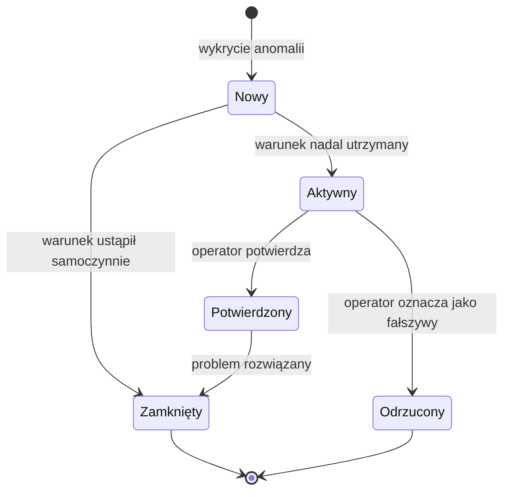
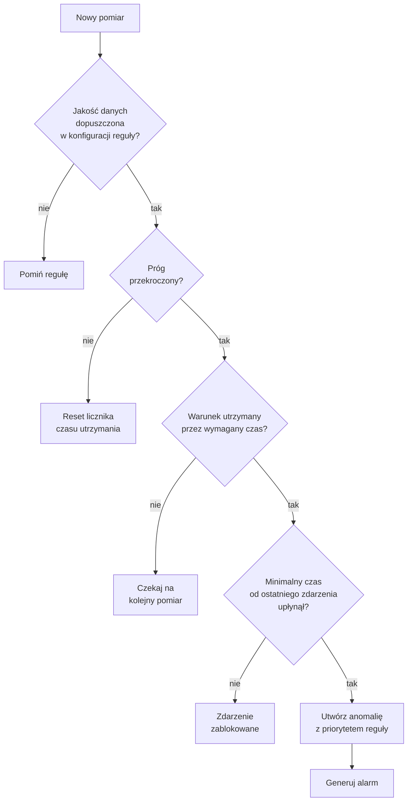
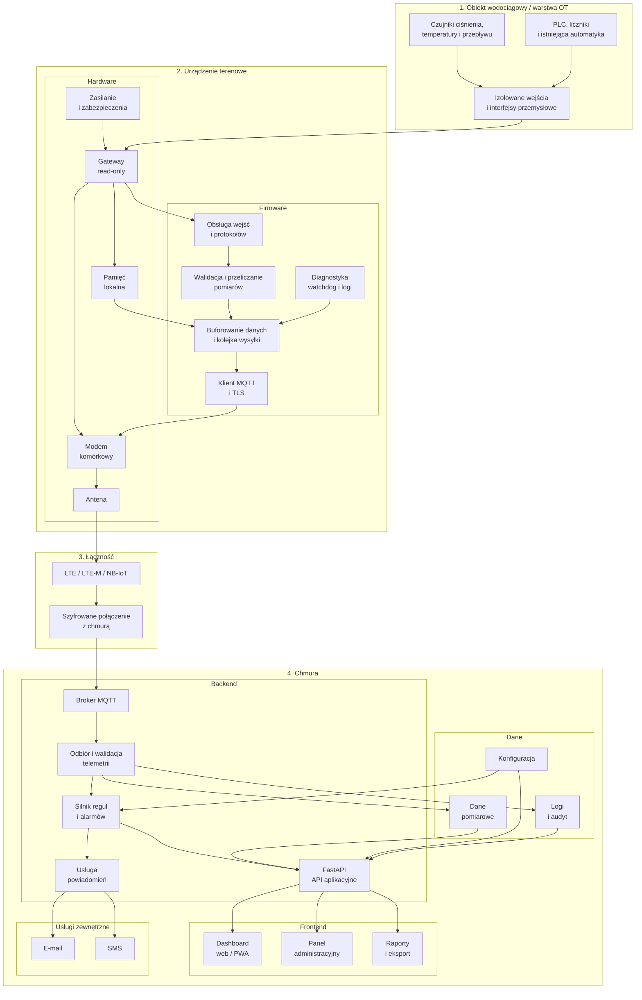
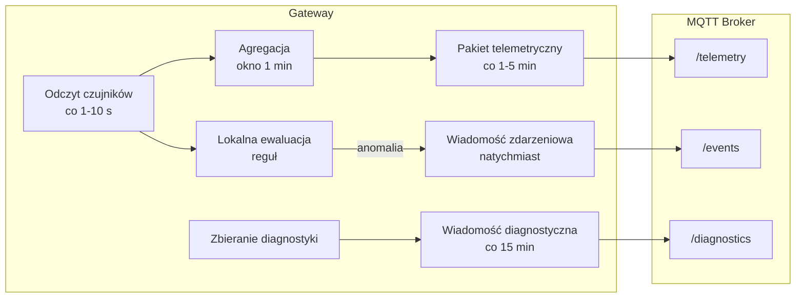
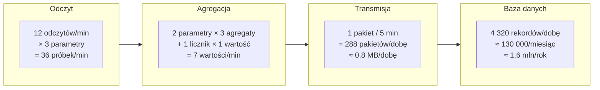
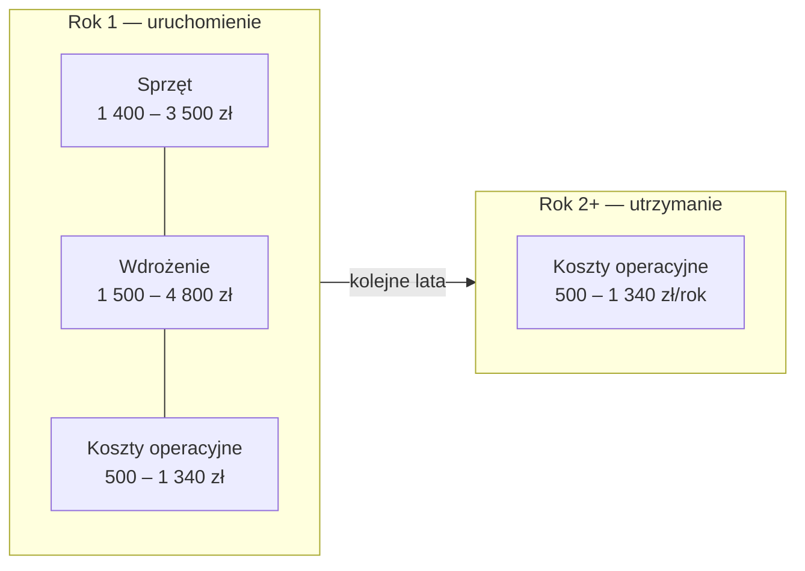
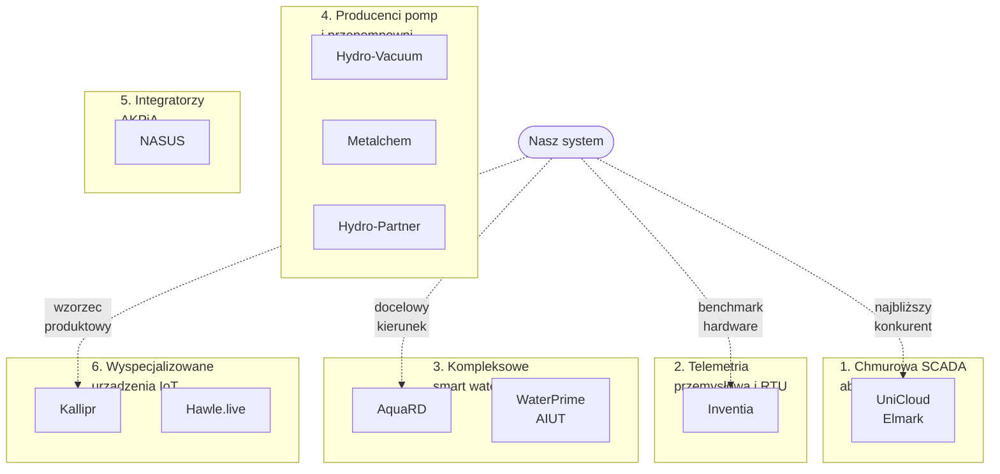
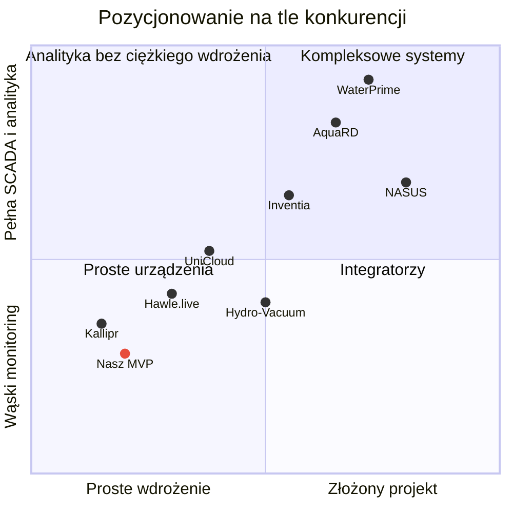
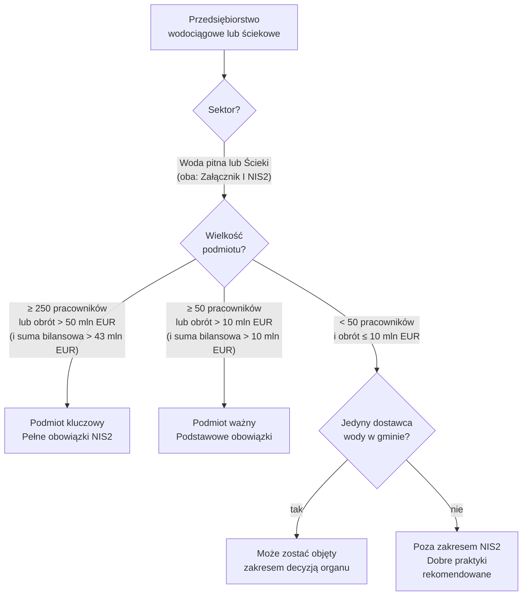
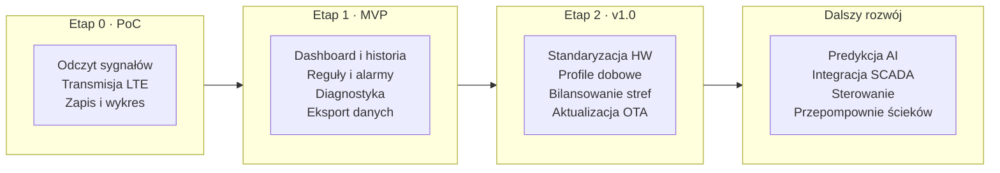

# Platforma Monitoringu Wodociągów — Plan Biznesowy i Dokumentacja Produktowa

**Status:** dokument wiodący
**Wersja:** 3.1
**Ostatnia aktualizacja:** 2026-08-14
**Autorzy:** Zespół projektu

---

## Spis treści

**[Część 1: Wizja i Kontekst Biznesowy](#część-1-wizja-i-kontekst-biznesowy)**
- 1.1 [Streszczenie wykonawcze](#11-streszczenie-wykonawcze)
- 1.2 [Cel projektu](#12-cel-projektu)
- 1.3 [Problem klienta](#13-problem-klienta)
- 1.4 [Propozycja wartości](#14-propozycja-wartości)
- 1.5 [Co już wiemy](#15-co-już-wiemy)

**[Część 2: Analiza Produktowa — Zakres i Funkcjonalność](#część-2-analiza-produktowa--zakres-i-funkcjonalność)**
- 2.1 [Zakres obiektów](#21-zakres-obiektów)
- 2.2 [Zakres MVP](#22-zakres-mvp)
- 2.3 [Kluczowe przypadki użycia](#23-kluczowe-przypadki-użycia)
- 2.4 [Dane i punkty pomiarowe](#24-dane-i-punkty-pomiarowe)
- 2.5 [Alarmy i powiadomienia](#25-alarmy-i-powiadomienia)
- 2.6 [Katalog zdarzeń i alarmów wodociągowych](#26-katalog-zdarzeń-i-alarmów-wodociągowych)
- 2.7 [Klient docelowy i użytkownicy](#27-klient-docelowy-i-użytkownicy)
- 2.8 [Zakres aplikacji użytkownika](#28-zakres-aplikacji-użytkownika)

**[Część 3: Analiza Techniczna — Architektura](#część-3-analiza-techniczna--architektura)**
- 3.1 [Architektura logiczna](#31-architektura-logiczna)
- 3.2 [Urządzenie terenowe (gateway)](#32-urządzenie-terenowe-gateway)
- 3.3 [Integracja z istniejącą automatyką](#33-integracja-z-istniejącą-automatyką)
- 3.4 [Format wiadomości telemetrycznej](#34-format-wiadomości-telemetrycznej)
- 3.5 [Częstotliwość pomiarów i transmisji](#35-częstotliwość-pomiarów-i-transmisji)
- 3.6 [Bezpieczeństwo i nieingerencja](#36-bezpieczeństwo-i-nieingerencja)
- 3.7 [Diagnostyka urządzenia terenowego](#37-diagnostyka-urządzenia-terenowego)
- 3.8 [Szacunek wolumenu danych](#38-szacunek-wolumenu-danych)

**[Część 4: Analiza Biznesowa — Model i Koszty](#część-4-analiza-biznesowa--model-i-koszty)**
- 4.1 [Model biznesowy — przychody](#41-model-biznesowy--przychody)
- 4.2 [Szacunek kosztów jednostkowych](#42-szacunek-kosztów-jednostkowych)

**[Część 5: Analiza Rynku i Konkurencji](#część-5-analiza-rynku-i-konkurencji)**
- 5.1 [Rynki docelowe](#51-rynki-docelowe)
- 5.2 [Analiza konkurencji](#52-analiza-konkurencji)
- 5.3 [Nasze przewagi i słabości](#53-nasze-przewagi-i-słabości)

**[Część 6: Regulacje i Ryzyko](#część-6-regulacje-i-ryzyko)**
- 6.1 [NIS2 i KSC — wpływ na projekt](#61-nis2-i-ksc--wpływ-na-projekt)
- 6.2 [Rejestr ryzyk](#62-rejestr-ryzyk)

**[Część 7: Plan Działania](#część-7-plan-działania)**
- 7.1 [Roadmapa produktu](#71-roadmapa-produktu)
- 7.2 [Decyzje podjęte](#72-decyzje-podjęte)
- 7.3 [Decyzje otwarte](#73-decyzje-otwarte)

**[Część 8: Załączniki](#część-8-załączniki)**
- 8.1 [Źródła kierunkowe](#81-źródła-kierunkowe)
- 8.2 [Powiązane dokumenty](#82-powiązane-dokumenty)

---

# Część 1: Wizja i Kontekst Biznesowy

## 1.1. Streszczenie wykonawcze

Opracowujemy **platformę do zdalnego monitoringu infrastruktury wodociągowej** dla małych gmin i lokalnych zakładów wodociągowych (ZWiK) w Polsce. System zbiera dane z rozproszonych obiektów (przepompownie, hydrofornie, punkty pomiarowe) za pomocą niedrogich urządzeń terenowych (ESP32-S3 + modem LTE-M), przesyła je do chmury i prezentuje w intuicyjnym dashboardzie operacyjnym — bez konieczności wymiany istniejącej automatyki.

| | |
|---|---|
| **Faza obecna** | MVP: temperatura + ciśnienie; testowanie u gminy pilotażowej (od lipca 2026) |
| **Model biznesowy** | Sprzęt (one-time) + subskrypcja (monthly) |
| **Tryb pracy** | Read-only — obserwacja i alarmowanie, bez sterowania pompami/zaworami |

## 1.2. Cel projektu

Celem projektu jest stworzenie systemu zdalnego monitoringu infrastruktury wodociągowej w małych gminach. System ma zbierać dane z przepompowni wody, hydroforni oraz wybranych punktów sieci wodociągowej, przesyłać je do platformy centralnej i przedstawiać w postaci aktualnych parametrów, historii, statusów oraz alarmów.

Pierwszy zakres biznesowy koncentruje się na:

- monitorowaniu ciśnienia i temperatury (kanały gwarantowane MVP — patrz [rozdział 2.2](#22-zakres-mvp)),
- opcjonalnym monitorowaniu przepływu, tam gdzie przepływomierz jest już dostępny na obiekcie,
- tworzeniu historii pomiarów,
- wykrywaniu anomalii mogących wskazywać na pęknięcie rury lub wyciek,
- centralnym podglądzie rozproszonych obiektów.

System nie zastępuje lokalnej automatyki i na obecnym etapie nie steruje pompami, zaworami ani przepustnicami.

## 1.3. Problem klienta

Małe gminy i lokalne zakłady wodociągowe często nie mają jednego systemu prezentującego aktualny stan rozproszonych obiektów i sieci. Dane z czujników, wodomierzy, przepływomierzy oraz sterowników mogą być dostępne wyłącznie lokalnie albo nie są archiwizowane w sposób umożliwiający analizę.

Skutki:

- brak bieżącej informacji o ciśnieniu i przepływie,
- opóźnione wykrywanie wycieków i awarii,
- wykrywanie problemów dopiero po zgłoszeniu mieszkańców,
- konieczność ręcznych kontroli i objazdów,
- brak spójnej historii danych,
- trudność w ocenie miejsca i czasu powstania nieprawidłowości,
- brak danych do późniejszej optymalizacji działania sieci.

## 1.4. Propozycja wartości

System zapewnia gminie jedno miejsce do obserwacji stanu infrastruktury wodociągowej. Pozwala szybciej zauważyć nieprawidłowości, ograniczyć czas od wystąpienia problemu do jego wykrycia oraz gromadzić dane potrzebne do późniejszej analizy sieci.

Najważniejsza wartość dla klienta:

- wcześniejsze wykrywanie potencjalnych awarii,
- centralny podgląd obiektów,
- historia pracy sieci,
- identyfikowanie nietypowych zmian ciśnienia, temperatury i (tam gdzie dostępny) przepływu,
- podstawa do późniejszego wykrywania wycieków, predykcji i automatyzacji.


## 1.5. Co już wiemy
- Rynek potwierdza istnienie problemu (UniCloud, Inventia, AquaRD sprzedają podobne rozwiązania — patrz [rozdział 5.2](#52-analiza-konkurencji)).
- Sprzyjające warunki regulacyjne: próg zamówień publicznych (170 tys. PLN wg Prawa zamówień publicznych; aktualność progu do potwierdzenia) pozwala gminie kupić bez przetargu; wymogi NIS2 zobowiązują gminę do dbałości o cyberbezpieczeństwo (patrz [rozdział 6.1](#61-nis2-i-ksc--wpływ-na-projekt)).
- Nasze podejście read-only (obserwacja, brak sterowania) zmniejsza ryzyko akceptacji po stronie klienta.

---

# Część 2: Analiza Produktowa — Zakres i Funkcjonalność

## 2.1. Zakres obiektów

### 2.1.1. Zakres podstawowy

Pierwsza wersja systemu jest przeznaczona dla:

- przepompowni wody,
- hydroforni,
- ujęć i stacji uzdatniania, jeśli udostępniają wymagane sygnały,
- punktów pomiarowych na sieci wodociągowej,
- komór pomiarowych z przepływomierzem, wodomierzem lub czujnikiem ciśnienia.

Typowa gmina może posiadać od kilku do kilkunastu rozproszonych obiektów, oddalonych od siebie nawet o około 20 km. Zakłada się, że w głównych obiektach dostępne jest zasilanie elektryczne.

### 2.1.2. Zakres przyszły

Przepompownie ścieków stanowią osobny przypadek użycia. Mogą zostać obsłużone przez tę samą platformę w późniejszym etapie, ale wymagają innego zestawu parametrów i alarmów, takich jak poziom ścieków, przepełnienie, czas pracy pomp i brak odpompowywania.

Nie należy mieszać wymagań dla sieci wodociągowej i przepompowni ścieków w pierwszym zakresie produktu.

## 2.2. Zakres MVP

### 2.2.1. MVP obejmuje

Zgodnie z **[ADR-0001](./adr/0001-mvp-scope-temperature-pressure.md)**, MVP testuje dwa **gwarantowane** kanały pomiarowe:

- **temperatura**,
- **ciśnienie**.

Przepływ jest obsługiwany **opcjonalnie** — jeśli przepływomierz jest już dostępny na obiekcie — ale nie jest gwarantowanym kanałem MVP.

Poza kanałami pomiarowymi, MVP obejmuje:

- rejestrację organizacji, obiektów, urządzeń i punktów pomiarowych,
- odczyt danych z istniejącej automatyki lub dodatkowych czujników,
- przesyłanie danych przez sieć komórkową,
- odbiór i walidację telemetrii w chmurze,
- centralny dashboard,
- aktualny status obiektów i punktów pomiarowych,
- historię pomiarów i wykresy,
- podstawowe reguły wykrywania anomalii (miejsce ewaluacji — lokalnie na gatewayu czy w chmurze — jest architektonicznie nierozstrzygnięte, patrz zastrzeżenie na początku [Części 3](#część-3-analiza-techniczna--architektura)),
- ogólny mechanizm alarmów i powiadomień,
- diagnostykę urządzenia terenowego i łączności,
- eksport danych (CSV).

### 2.2.2. MVP nie obejmuje

- sterowania pompami, zaworami i przepustnicami,
- automatycznego ograniczania dobowego przepływu,
- pełnego systemu SCADA,
- gwarantowanego wskazywania dokładnego miejsca pęknięcia rury,
- zaawansowanych modeli predykcyjnych,
- automatycznej optymalizacji hydraulicznej,
- monitoringu przepompowni ścieków jako podstawowego scenariusza,
- poziomu zbiornika, pracy pompy i jakości wody (przeniesione do Phase 2),
- integracji z każdym istniejącym urządzeniem bez wcześniejszej analizy technicznej,
- integracji z innymi systemami gminy (GIS, e-Sanepid).


## 2.3. Kluczowe przypadki użycia

### UC-01: Podgląd bieżącego stanu

Użytkownik widzi listę obiektów wraz z aktualnym statusem, ostatnim kontaktem, temperaturą, ciśnieniem (oraz przepływem, jeśli dostępny) i aktywnymi nieprawidłowościami.

### UC-02: Analiza historii

Użytkownik wybiera obiekt i analizuje zmiany ciśnienia, temperatury oraz — jeśli dostępny — przepływu w określonym okresie. System pokazuje czas pomiaru, jakość danych i przerwy w komunikacji.

### UC-03: Wykrycie możliwego wycieku lub pęknięcia

System rozpoznaje nietypową kombinację parametrów, na przykład nagły spadek ciśnienia połączony ze wzrostem przepływu (tam, gdzie przepływ jest mierzony), i tworzy zdarzenie wymagające weryfikacji.

Zdarzenie powinno być opisane jako **podejrzenie wycieku lub awarii**, a nie jako pewne wykrycie pęknięcia. Jednoznaczna detekcja będzie wymagała odpowiedniego rozmieszczenia punktów pomiarowych, danych bazowych, bilansowania stref i poznania normalnej charakterystyki sieci.

### UC-04: Utrata komunikacji

Jeśli urządzenie nie przesyła danych przez skonfigurowany czas, system oznacza obiekt jako niedostępny i tworzy zdarzenie techniczne.

### UC-05: Raport i eksport

Użytkownik pobiera dane historyczne lub raport prezentujący parametry, anomalie, dostępność urządzeń i zarejestrowane zdarzenia.

## 2.4. Dane i punkty pomiarowe

### 2.4.1. Dane podstawowe

- ciśnienie w bar lub kPa,
- temperatura w °C,
- przepływ chwilowy w m³/h (tam, gdzie dostępny),
- stan licznika lub objętość sumaryczna w m³, jeśli urządzenie ją udostępnia,
- stan zasilania,
- stan komunikacji,
- status urządzenia terenowego,
- jakość sygnału sieci komórkowej.

### 2.4.2. Metadane każdego pomiaru

#### Wysyłane przez firmware

| Pole | Opis |
|---|---|
| `device_id` | Identyfikator urządzenia |
| `seq` | Numer sekwencyjny (detekcja duplikatów/luk) |
| `sent_at` | Timestamp firmware'u |
| `channel_id` | Identyfikator czujnika/kanału |
| `value` | Wartość pomiaru |
| `measurement_time` | Czas pomiaru (może różnić się od `sent_at`) |
| `quality` | Status jakości (`good`, `sensor_error`, itp.); domyślnie `good` |

#### Dodawane backendem (z lookupów na podstawie `device_id` i `channel_id`)

| Pole | Opis |
|---|---|
| `org_id` | Organizacja (z mapowania device_id) |
| `object_id` | Obiekt (z mapowania device_id, 1:1) |
| `parameter_type` | Typ parametru (z profilu kanału) |
| `unit` | Jednostka (z konfiguracji kanału) |
| `platform_receive_time` | Timestamp serwera (server-side) |


### 2.4.3. Jakość danych

Minimalne statusy jakości:

- `good` – poprawny pomiar,
- `stale` – pomiar nieaktualny,
- `out_of_range` – wartość poza zakresem technicznym,
- `sensor_error` – błąd źródła pomiaru,
- `communication_error` – problem komunikacji lokalnej,
- `delayed` – dane dostarczone z opóźnieniem,
- `unknown` – brak możliwości określenia jakości.

Ostatnia poprawna wartość nie może być prezentowana jako bieżąca bez informacji o czasie pomiaru i jakości.

## 2.5. Alarmy i powiadomienia

Na obecnym etapie nie przesądza się kanałów powiadomień ani szczegółowej procedury eskalacji (patrz [rozdział 7.3](#73-decyzje-otwarte)). System powinien jednak rozdzielać:

- zdarzenie pomiarowe,
- wykrytą anomalię,
- alarm wymagający reakcji,
- powiadomienie wysłane do użytkownika.

Minimalne statusy alarmu:

- nowy,
- aktywny,
- potwierdzony,
- zamknięty,
- odrzucony jako fałszywy.



Docelowe kanały mogą obejmować e-mail, SMS, powiadomienie web/PWA lub integrację z systemem klienta. Wybór kanałów pozostaje decyzją otwartą.

## 2.6. Katalog zdarzeń i alarmów wodociągowych

### 2.6.1. Alarmy krytyczne

- bardzo niski poziom ciśnienia,
- bardzo wysokie ciśnienie,
- nagły spadek ciśnienia,
- temperatura wskazująca na ryzyko przemarznięcia lub przegrzania,
- nagły wzrost przepływu (tam, gdzie mierzony),
- jednoczesny spadek ciśnienia i wzrost przepływu,
- duża i utrzymująca się różnica bilansu strefy,
- brak komunikacji z obiektem krytycznym,
- zanik zasilania urządzenia lub obiektu, jeśli sygnał jest dostępny.

### 2.6.2. Ostrzeżenia

- ciśnienie poza typowym zakresem,
- temperatura poza typowym zakresem,
- przepływ poza typowym zakresem,
- nietypowy przepływ nocny,
- stopniowe odchylenie od profilu bazowego,
- słaby sygnał sieci komórkowej,
- opóźnione dane,
- brak odczytu z pojedynczego czujnika,
- wartość poza zakresem technicznym czujnika,
- zapełniający się bufor lokalny.

### 2.6.3. Zdarzenia informacyjne

- powrót komunikacji,
- powrót zasilania,
- powrót parametru do normalnego zakresu,
- restart urządzenia,
- aktualizacja konfiguracji,
- zmiana progu alarmowego,
- wymiana lub ponowna kalibracja czujnika.

Katalog jest punktem wyjścia. Aktywne reguły i ich progi muszą zostać uzgodnione dla konkretnego obiektu. System nie powinien generować alarmów na podstawie danych o jakości innej niż dopuszczona w konfiguracji reguły.

### 2.6.4. Parametry reguł i logika ewaluacji

Każda reguła powinna obsługiwać:

| Parametr | Opis |
|---|---|
| Próg aktywacji | Wartość, przy której reguła się aktywuje |
| Czas utrzymania warunku | Jak długo warunek musi być spełniony zanim alarm zostanie wygenerowany |
| Histerezy | Różnica między progiem aktywacji a progiem deaktywacji (uniknięcie drgań) |
| Warunek zakończenia | Kiedy alarm powinien zostać zamknięty |
| Priorytet | Krytyczny / ostrzeżenie / informacyjny |
| Minimalny czas między zdarzeniami | Deduplikacja — nie generować wielu alarmów w krótkim czasie |
| Wymagana jakość danych | Status jakości (`good`, `sensor_error`, itp.) wymagany do ewaluacji reguły |

Diagram poniżej pokazuje logikę ewaluacji pojedynczej reguły:



## 2.7. Klient docelowy i użytkownicy

### 2.7.1. Klient docelowy

Pierwszym segmentem są małe gminy, lokalne zakłady komunalne oraz małe i średnie przedsiębiorstwa wodociągowe, które posiadają rozproszone obiekty, ale nie mają jednego spójnego systemu monitoringu.

Typowy klient:

- posiada od kilku do kilkunastu przepompowni, hydroforni lub punktów pomiarowych,
- utrzymuje obiekty oddalone od siebie nawet o kilkanaście lub kilkadziesiąt kilometrów,
- korzysta z urządzeń i automatyki różnych producentów,
- wykonuje część kontroli ręcznie,
- nie ma kompletnej, centralnej historii ciśnienia i przepływu,
- chce szybciej wykrywać potencjalne awarie i wycieki.

Kryteria priorytetyzacji klientów (SAM) opisane są w [rozdziale 5.1.2](#512-kryteria-dobrego-klienta-sam).

### 2.7.2. Użytkownicy operacyjni

Pracownik terenowy powinien móc szybko sprawdzić:

- który obiekt wymaga uwagi,
- kiedy wystąpiła nieprawidłowość,
- jakie były wartości ciśnienia, temperatury i przepływu,
- czy dane są aktualne,
- czy działa zasilanie i komunikacja,
- czy wyjazd na obiekt jest uzasadniony.

Kierownik lub dyspozytor powinien mieć dostęp do:

- aktualnego stanu wszystkich obiektów,
- aktywnych oraz historycznych alarmów,
- trendów ciśnienia, temperatury i przepływu,
- informacji o dostępności urządzeń,
- raportów i eksportu danych,
- historii reakcji na zdarzenia.

Zarząd zakładu lub urząd gminy może korzystać z informacji zagregowanych:

- liczby i rodzaju wykrytych nieprawidłowości,
- dostępności monitorowanych obiektów,
- czasu wykrycia i obsługi zdarzeń,
- trendów strat oraz zużycia wody,
- efektów wdrożenia systemu.

### 2.7.3. Wstępne role systemowe

- **Administrator platformy** – zarządza klientami, urządzeniami i konfiguracją techniczną.
- **Administrator klienta** – zarządza obiektami, użytkownikami i progami w obrębie własnej organizacji.
- **Użytkownik operacyjny** – obserwuje dane, potwierdza alarmy i dodaje informacje dotyczące obsługi zdarzenia.
- **Użytkownik tylko do odczytu** – przegląda dashboard, historię i raporty bez możliwości zmiany konfiguracji.

Każda organizacja powinna widzieć wyłącznie swoje obiekty i dane. Szczegółowy model wielokliencki pozostaje do ustalenia (patrz [rozdział 7.3](#73-decyzje-otwarte)).

## 2.8. Zakres aplikacji użytkownika

### 2.8.1. Dashboard główny

Dashboard powinien odpowiadać przede wszystkim na pytanie: **który obiekt wymaga uwagi i dlaczego?**

Minimalny zakres:

- lista obiektów,
- status: poprawny, ostrzeżenie, alarm, brak komunikacji lub brak danych,
- aktualna temperatura, ciśnienie i przepływ (jeśli dostępny),
- czas ostatniego poprawnego pomiaru,
- czas ostatniego kontaktu z gatewayem,
- aktywne alarmy,
- typ ostatniego zdarzenia,
- filtrowanie po statusie, typie obiektu i lokalizacji,
- przejście do szczegółów obiektu.

Mapa obiektów może być funkcją dodatkową, ale nie powinna zastępować czytelnej listy operacyjnej.

### 2.8.2. Widok obiektu

Widok powinien zawierać:

- nazwę, typ i lokalizację obiektu,
- bieżący status,
- aktualne wartości i jednostki,
- jakość oraz czas każdego pomiaru,
- wykresy dla wybranego okresu,
- aktywne i historyczne alarmy,
- historię komunikacji,
- informacje o źródłach pomiaru,
- stan gatewaya i modemu,
- wersję konfiguracji urządzenia,
- możliwość eksportu danych.

### 2.8.3. Widok alarmów

Widok powinien umożliwiać:

- filtrowanie po stanie, priorytecie, obiekcie i czasie,
- wyświetlenie wartości, które uruchomiły regułę,
- potwierdzenie alarmu,
- dodanie komentarza,
- zamknięcie lub oznaczenie alarmu jako fałszywego,
- przejście do wykresu obejmującego okres przed i po zdarzeniu,
- wyświetlenie historii wysłanych powiadomień.

### 2.8.4. Konfiguracja

Docelowo panel konfiguracyjny powinien obejmować:

- organizacje i użytkowników,
- obiekty,
- urządzenia,
- punkty pomiarowe (kanały),
- mapowanie sygnałów na parametry,
- zakresy i jednostki,
- reguły alarmowe,
- odbiorców powiadomień,
- retencję danych,
- ustawienia raportów.

---

# Część 3: Analiza Techniczna — Architektura

> **Status implementacji:** ta część opisuje **docelową architekturę** systemu, nie zawsze dokładny stan bieżącej implementacji pilotażowej. W szczególności: **transport MQTT (§3.1, §3.4) jest architekturą docelową — obecna implementacja firmware/backend używa HTTPS** (`TelemetryHttpClient` przez `ArduinoHttpClient` + `TinyGsmClientSecure`, endpoint FastAPI). Silnik reguł alarmowych (§2.5–§2.6, §3.4.4) jest specyfikacją produktową — obecnie nie ma jeszcze implementacji ani lokalnej (firmware), ani chmurowej (backend).
## 3.1. Architektura logiczna




## 3.2. Urządzenie terenowe (gateway)

Na obecnym etapie nie należy przesądzać jednego, docelowego modelu gatewaya ani modemu dla każdego przyszłego klienta. Każdy nowy obiekt zaczyna się od inwentaryzacji (patrz [rozdział 3.3](#33-integracja-z-istniejącą-automatyką)).

### 3.2.1. Wymagania funkcjonalne

Gateway powinien:

- działać w trybie read-only względem infrastruktury,
- obsługiwać wymagany interfejs obiektowy,
- odczytywać i oznaczać czas pomiaru,
- buforować dane podczas braku łączności,
- automatycznie wznowić transmisję,
- raportować stan urządzenia i modemu,
- posiadać watchdog,
- używać unikalnej tożsamości urządzenia,
- zestawiać wyłącznie połączenia wychodzące,
- umożliwiać bezpieczną zmianę konfiguracji.

### 3.2.2. Kandydaci do prototypu

ESP32-S3 wraz z modułem LTE-M jest wykorzystywane jako podstawa PoC i pierwszego wdrożenia pilotażowego. Rozszerzenie na kolejne obiekty produkcyjne wymaga oceny:

- interfejsów wejściowych,
- separacji galwanicznej,
- warunków środowiskowych,
- niezawodności zasilania,
- ochrony przeciwprzepięciowej,
- kompatybilności elektromagnetycznej,
- sposobu montażu w szafie,
- dostępności serwisu i części.

## 3.3. Integracja z istniejącą automatyką

Zgodnie z **[ADR-0002](./adr/0002-pragmatic-integration-strategy.md)**, nie definiujemy sztywnej listy obsługiwanych urządzeń. Preferowaną strategią jest wykorzystanie istniejących czujników, liczników i sterowników — dodatkowe czujniki montujemy tylko wtedy, gdy potrzebne dane nie są dostępne albo ich jakość jest niewystarczająca.

Podczas inwentaryzacji należy sprawdzić:

- producenta i model PLC,
- producenta i model przepływomierza lub wodomierza,
- producenta i model czujnika ciśnienia i temperatury,
- dostępność Modbus RTU lub Modbus TCP,
- dostępność RS485,
- sygnały 4-20 mA,
- sygnały 0-10 V,
- wyjścia impulsowe,
- styki bezpotencjałowe,
- mapę rejestrów,
- możliwość bezpiecznego równoległego odczytu,
- dostępne zasilanie,
- zasięg operatorów komórkowych,
- miejsce na urządzenie i antenę,
- dokumentację techniczną szafy.


## 3.4. Format wiadomości telemetrycznej

Poniższe formaty opierają się na wymaganiach z [rozdziału 2.4](#24-dane-i-punkty-pomiarowe) (dane i metadane), [rozdziału 3.5](#35-częstotliwość-pomiarów-i-transmisji) (częstotliwość) oraz [rozdziału 3.7](#37-diagnostyka-urządzenia-terenowego) (diagnostyka).

### 3.4.1. Struktura tematów MQTT (architektura docelowa)

> Docelowa architektura — obecnie: HTTPS (patrz zastrzeżenie na początku [Części 3](#część-3-analiza-techniczna--architektura)).

```
v1/{org_id}/{device_id}/telemetry      — pomiary agregowane
v1/{org_id}/{device_id}/diagnostics    — stan urządzenia
v1/{org_id}/{device_id}/events         — zdarzenia alarmowe (natychmiastowe)
```

Wszystkie tematy wychodzące — gateway publikuje, platforma subskrybuje. Brak tematów sterujących w MVP (tryb read-only).

### 3.4.2. Wiadomość pomiarowa

Wysyłana co 1–5 minut. Zawiera agregaty (min, max, avg) z okien 1-minutowych lub pojedyncze wartości dla liczników i stanów.


```json
{
  "v": 1,
  "device_id": "gw-2026-0001",
  "seq": 10542,
  "sent_at": "2026-07-27T14:30:00Z",
  "windows": [
    {
      "window_start": "2026-07-27T14:25:00Z",
      "window_seconds": 60,
      "points": [
        {
          "point_id": "pressure-inlet",
          "type": "pressure",
          "unit": "bar",
          "quality": "good",
          "avg": 3.42,
          "min": 3.38,
          "max": 3.45
        },
        {
          "point_id": "temperature-inlet",
          "type": "temperature",
          "unit": "celsius",
          "quality": "good",
          "avg": 12.1,
          "min": 11.9,
          "max": 12.3
        },
        {
          "point_id": "flow-main",
          "type": "flow_rate",
          "unit": "m3/h",
          "quality": "good",
          "avg": 12.8,
          "min": 12.1,
          "max": 13.4
        },
        {
          "point_id": "counter-main",
          "type": "total_volume",
          "unit": "m3",
          "quality": "good",
          "value": 154832.45
        },
        {
          "point_id": "power-mains",
          "type": "power_status",
          "unit": "bool",
          "quality": "good",
          "value": 1
        }
      ]
    }
  ]
}
```

**Konwencje:**

| Pole | Opis |
|---|---|
| `v` | Wersja formatu wiadomości |
| `seq` | Numer sekwencyjny — umożliwia wykrycie luk i duplikatów |
| `sent_at` | Czas wysłania pakietu (zegar gatewaya) |
| `window_start` | Początek okna agregacji (czas pomiaru) |
| `avg`, `min`, `max` | Agregaty z odczytów w oknie — dla ciśnienia, temperatury i przepływu |
| `value` | Pojedyncza wartość — dla liczników, stanów binarnych, RSSI |
| `quality` | Status jakości wg [rozdziału 2.4.3](#243-jakość-danych) |

**Reguły:**

- Parametry ciągłe (ciśnienie, temperatura, przepływ) → `avg`, `min`, `max`.
- Liczniki i kumulaty (objętość sumaryczna) → `value` (ostatni odczyt w oknie).
- Stany binarne (zasilanie, komunikacja) → `value` (0 lub 1).
- Platforma ustawia `received_at` przy odbiorze — nie jest częścią wiadomości z urządzenia.
- Idempotentny odbiór: para `(device_id, seq)` identyfikuje pakiet jednoznacznie.

### 3.4.3. Wiadomość diagnostyczna

Wysyłana co 15 minut lub na żądanie. Oparta na wymaganiach [rozdziału 3.7](#37-diagnostyka-urządzenia-terenowego). **Specyfikacja — nieukończona implementacja:** w przeciwieństwie do wiadomości pomiarowej (§3.4.2, zaimplementowana i zweryfikowana wobec kodu), kanał diagnostyczny jest na razie projektem, nie zaimplementowanym endpointem. Format poniżej będzie wymagał dopasowania do faktycznego schematu w momencie implementacji.

```json
{
  "v": 1,
  "device_id": "gw-2026-0001",
  "seq": 10543,
  "sent_at": "2026-07-27T14:30:01Z",
  "diagnostics": {
    "firmware_version": "1.0.0",
    "config_version": "2026-07-01-001",
    "uptime_seconds": 864000,
    "last_restart_at": "2026-07-17T14:30:00Z",
    "restart_reason": "watchdog",
    "cellular": {
      "rssi_dbm": -67,
      "technology": "LTE-M",
      "operator": "Plus",
      "last_successful_tx": "2026-07-27T14:25:00Z"
    },
    "buffer": {
      "records_pending": 0,
      "buffer_usage_percent": 0,
      "buffer_capacity_hours": 72
    },
    "interfaces": {
      "modbus_rtu_status": "ok",
      "modbus_rtu_errors_last_hour": 0,
      "analog_input_1_status": "ok"
    },
    "power": {
      "source": "mains",
      "voltage_v": 23.8
    },
    "temperature_c": 28.5
  }
}
```

### 3.4.4. Wiadomość zdarzeniowa (alarm)

Wysyłana natychmiast po wykryciu anomalii przez gateway (patrz [rozdział 2.6](#26-katalog-zdarzeń-i-alarmów-wodociągowych), w tym logika ewaluacji reguł w [2.6.4](#264-parametry-reguł-i-logika-ewaluacji)). **Specyfikacja — nieukończona implementacja:** silnik reguł alarmowych nie jest jeszcze zaimplementowany (ani lokalnie na gatewayu, ani w chmurze — patrz zastrzeżenie na początku [Części 3](#część-3-analiza-techniczna--architektura)); poniższy format jest projektem docelowym.

```json
{
  "v": 1,
  "device_id": "gw-2026-0001",
  "seq": 10544,
  "sent_at": "2026-07-27T14:30:05Z",
  "event": {
    "event_type": "anomaly",
    "rule_id": "pressure-low-critical",
    "priority": "critical",
    "point_id": "pressure-inlet",
    "trigger_value": 1.85,
    "trigger_unit": "bar",
    "threshold": 2.0,
    "condition_duration_seconds": 120,
    "data_quality": "good",
    "detected_at": "2026-07-27T14:29:55Z",
    "message": "Ciśnienie na wejściu poniżej progu krytycznego"
  }
}
```

### 3.4.5. Relacje między typami wiadomości



## 3.5. Częstotliwość pomiarów i transmisji

Należy rozdzielić:

- częstotliwość odczytu czujnika,
- częstotliwość lokalnego zapisu,
- częstotliwość wysyłania paczki,
- częstotliwość odświeżania dashboardu,
- natychmiastowe wysyłanie zdarzeń alarmowych.

Przykładowy punkt wyjścia do testów:

- odczyt co 1-10 sekund,
- obliczenie wartości minimalnej, maksymalnej i średniej w oknie 1 minuty,
- wysłanie paczki co 1-5 minut,
- natychmiastowe wysłanie istotnego zdarzenia,
- lokalny bufor co najmniej 24-72 godzin.

Są to parametry robocze, które trzeba dopasować do dynamiki sieci, kosztu transmisji i wartości diagnostycznej danych.

## 3.6. Bezpieczeństwo i nieingerencja

Podstawowa zasada:

> Awaria urządzenia telemetrycznego nie może zmienić stanu pompy, zaworu, przepustnicy, PLC ani lokalnego układu zabezpieczeń.

Minimalne wymagania:

- brak zdalnego sterowania infrastrukturą w MVP,
- brak wystawiania PLC do internetu,
- szyfrowana komunikacja,
- unikalne poświadczenia każdego urządzenia,
- ograniczenie uprawnień urządzenia do własnych kanałów komunikacji,
- separacja danych klientów,
- rejestrowanie dostępu i zmian konfiguracji,
- kopie zapasowe,
- bezpieczne przechowywanie sekretów,
- separacja galwaniczna tam, gdzie jest wymagana,
- dokumentacja sposobu podłączenia,
- możliwość odłączenia telemetryki bez zatrzymania obiektu.

## 3.7. Diagnostyka urządzenia terenowego

Gateway powinien raportować co najmniej:

- identyfikator urządzenia,
- wersję firmware,
- wersję konfiguracji,
- czas działania od restartu,
- czas ostatniego restartu,
- przyczynę ostatniego restartu, jeśli jest dostępna,
- siłę i jakość sygnału sieci komórkowej,
- operatora i technologię połączenia,
- czas ostatniej poprawnej transmisji,
- stan lokalnego bufora,
- liczbę oczekujących rekordów,
- stan komunikacji z lokalnymi urządzeniami,
- błędy odczytu interfejsów,
- stan zasilania,
- temperaturę urządzenia lub szafy, jeśli jest mierzona.

Diagnostyka musi umożliwić odróżnienie problemu infrastruktury wodociągowej od awarii czujnika, gatewaya, modemu, zasilania lub platformy.

Zdalny restart gatewaya może zostać rozważony jako przyszła funkcja serwisowa. Musi dotyczyć wyłącznie urządzenia telemetrycznego, być autoryzowany i rejestrowany oraz nie może wpływać na PLC ani urządzenia wykonawcze.


## 3.8. Szacunek wolumenu danych

Obliczenia oparte na parametrach roboczych z [rozdziału 3.5](#35-częstotliwość-pomiarów-i-transmisji).

### 3.8.1. Założenia

| Parametr | Wartość przyjęta | Zakres |
|---|---|---|
| Częstotliwość odczytu czujnika | co 5 s | 1–10 s |
| Okno agregacji | 1 min | 1 min |
| Częstotliwość wysyłania pakietu telemetrycznego | co 5 min | 1–5 min |
| Liczba parametrów na obiekt | 3 | ciśnienie + temperatura/przepływ + licznik |
| Agregaty na parametr ciągły | 3 (min, max, avg) | — |
| Rozmiar pojedynczego rekordu pomiarowego | ~150 bajtów | JSON z metadanymi |
| Rozmiar pakietu telemetrycznego | ~2,8 KB | 5 okien × 3 parametry + envelope (wartość spójna z 288 pakietami/dobę ≈ 0,8 MB/dobę niżej) |
| Częstotliwość wysyłania pakietu diagnostycznego | co 15 min | — |
| Rozmiar pakietu diagnostycznego | ~0,5 KB | co 15 minut → 96 pakietów/dobę |

### 3.8.2. Wolumen na obiekt



| Miara | Na dobę | Na miesiąc | Na rok |
|---|---|---|---|
| Pakiety telemetryczne | 288 | 8 640 | ~105 000 |
| Pakiety diagnostyczne | 96 | 2 880 | ~35 000 |
| Rekordy pomiarowe w bazie | 4 320 | ~130 000 | ~1,6 mln |
| Transfer surowy (JSON) telemetria | 0,8 MB | 24 MB | 288 MB |
| Transfer z overhead (TLS) telemetria | ~1 MB | ~30 MB | ~360 MB |
| Dane diagnostyczne | 0,048 MB | 1,44 MB | 17,28 MB |
| **Transfer łączny na obiekt** | **~1,05 MB** | **~31,5 MB** | **~377 MB** |

### 3.8.3. Wolumen dla typowej gminy (15 obiektów)

| Miara | Na miesiąc | Na rok |
|---|---|---|
| Transfer komórkowy łączny | ~472 MB | ~5,6 GB |
| Rekordy w bazie | ~1,95 mln | ~23,4 mln |
| Dane surowe (przed kompresją) | ~472 MB | ~5,6 GB |
| Dane w TimescaleDB (kompresja 5–10×) | ~47–95 MB | ~560 MB – 1,1 GB |

**Ocena:** wolumeny są bardzo małe. TimescaleDB obsługuje miliardy rekordów. Roczna baza 15-obiektowej gminy mieści się w poniżej 1,2 GB po kompresji. Marża na diagnozie oszczędza ~10% transferu rocznie.

### 3.8.4. Wymagania bufora lokalnego

| Czas buforowania | Dane na obiekt | Pamięć wymagana |
|---|---|---|
| 24 h | ~1,2 MB | ESP32 z 4 MB flash: wystarczające (~2 MB wolne po firmware) |
| 72 h | ~3,6 MB | ESP32 z 8 MB flash lub karta SD (4 MB flash nie wystarcza — po firmware zostaje ~1,5–2 MB) |
| 7 dni | ~8,4 MB | Wymaga karty SD lub ESP32 z 16 MB flash |

### 3.8.5. Wymagania karty SIM M2M

| Plan danych | Wystarczający dla | Uwagi |
|---|---|---|
| 50 MB/miesiąc | 1 obiekt (z zapasem) | Najtańszy plan M2M |
| 200 MB/miesiąc | 1 obiekt + diagnostyka + bufor po przerwie | Rekomendowany |
| 500 MB/miesiąc | 1 obiekt + OTA firmware + zapas | Komfortowy |


### 3.8.6. Porównanie technologii komunikacji komórkowej

| Parametr | LTE Cat 1 | LTE-M (Cat-M1) | NB-IoT (Cat-NB1/NB2) |
|---|---|---|---|
| Przepustowość | do 10 Mbps | do 1 Mbps | do 250 kbps |
| Opóźnienie | ~10-50 ms | ~50-100 ms | ~1-10 s |
| Zużycie energii | wysokie | niskie | bardzo niskie |
| Przenikanie do budynków | standardowe | lepsze (~15 dB) | najlepsze (~20 dB) |
| Praca na baterii | dni | miesiące-lata | lata |
| Dostępność w PL (2026) | powszechna | rosnąca (T-Mobile, Orange, Plus) | rosnąca (Orange, T-Mobile) |
| Roaming M2M | standardowy | ograniczony | bardzo ograniczony |
| Koszt modułu | ~80-150 zł | ~60-120 zł | ~50-100 zł |
| Koszt SIM M2M | ~15-30 zł/mies | ~10-20 zł/mies | ~8-15 zł/mies |
| OTA firmware | tak, bez ograniczeń | tak, z limitem transferu | utrudnione (niska przepustowość) |
| **Ocena dla MVP** | **dobry — pewna łączność** | **optymalny — balans kosztu i funkcji** | **możliwy, ale ogranicza OTA i diagnostykę** |

**Rekomendacja:** LTE-M (Cat-M1) jako podstawowa technologia dla MVP. Zapewnia niskie zużycie energii, lepsze przenikanie do metalowych szaf, wystarczającą przepustowość dla telemetrii (~35 MB/mies) i aktualizacji OTA. LTE Cat 1 jako fallback tam, gdzie LTE-M nie jest dostępny. NB-IoT rozważyć dla przyszłych czujników bateryjnych na sieci.


---

# Część 4: Analiza Biznesowa — Model i Koszty

## 4.1. Model biznesowy — przychody

Zgodnie z **[ADR-0003](./adr/0003-revenue-model-hardware-plus-subscription.md)**, gmina płaci **jednorazowo za sprzęt i wdrożenie**, potem **miesięczny abonament** za platformę, SIM i serwis.

### 4.1.1. Wdrożenie (one-time)

- **Sprzęt**: gateway, czujniki, kable, obudowa = **1,4–3,5 tys. PLN na obiekt** (szczegółowy rozkład kosztów — patrz [rozdział 4.2.2](#422-koszt-sprzętu-na-obiekt))
- **Usługi wdrażania**: inwentaryzacja, montaż, konfiguracja, testy = **1,5–4,8 tys. PLN** (w zależności od złożoności integracji — patrz [rozdział 4.2.3](#423-koszt-wdrożenia-na-obiekt))
- **Per-obiekt razem**: **2,9–8,3 tys. PLN** (scenariusz oszczędny–trudny, patrz [rozdział 4.2.5](#425-podsumowanie--koszt-na-obiekt) dla pełnego rozbicia po scenariuszach)


### 4.1.2. Abonament (monthly recurring)

- **Platforma (SaaS)**: dostęp do dashboardu, alarmy, API, retencja danych, wsparcie = **~100–150 PLN/miesiąc/obiekt** (prognoza)
- **SIM i transmisja**: LTE-M, plan danych (50–200 MB/miesiąc) = **~15–25 PLN/miesiąc/obiekt**
- **Razem**: **~130–170 PLN/miesiąc/obiekt** = **~1,6–2 tys. PLN/rok/obiekt**

Szczegóły rozliczenia dodatkowych kanałów (per-kanał vs. ryczałt) pozostają otwarte — ustalane adaptacyjnie z klientami do czasu standaryzacji w Phase 2 (patrz [ADR-0003](./adr/0003-revenue-model-hardware-plus-subscription.md)).

**Własność:** gmina kupuje sprzęt i jest jego właścicielem; dostawca utrzymuje usługę software'ową. 

### 4.1.3. Usługi i upsell (opcjonalne)

- rozszerzenia na kolejne kanały (poziom, pompa, jakość wody),
- custom integracje (adapter do niestandardowego PLC),
- szkolenia dla pracowników gminy.

Cena: negocjowana per-klient.

## 4.2. Szacunek kosztów jednostkowych

Szacunki oparte na publicznie dostępnych cenach komponentów i usług (stan: połowa 2026). Wszystkie kwoty w PLN netto. Dokładne koszty wymagają weryfikacji po inwentaryzacji każdego nowego obiektu.

### 4.2.1. Założenia

- typowa gmina: 10–15 obiektów,
- obiekt standardowy: 2–4 parametry pomiarowe (temperatura + ciśnienie + opcjonalnie przepływ i stan licznika/zasilania),
- integracja przez Modbus RTU lub sygnał analogowy 4-20 mA,
- transmisja LTE-M lub NB-IoT, karta SIM M2M,
- platforma w chmurze publicznej (model współdzielony).

### 4.2.2. Koszt sprzętu na obiekt

| Komponent | PoC / laboratorium | MVP / pole | Uwagi |
|---|---|---|---|
| Mikrokontroler / gateway | 50–100 | 800–2 000 | ESP32 DevKit vs. przemysłowy gateway |
| Moduł LTE / modem | 150–250 | wliczony w gateway | Osobny w PoC, zintegrowany w MVP |
| Moduł wejść izolowanych | 50–100 | 200–500 | Separacja galwaniczna 4-20 mA / RS485 |
| Antena zewnętrzna | — | 50–200 | Wymagana w szafach metalowych |
| Zasilacz DIN | — | 100–200 | 230V AC → 24V DC |
| Ochrona przepięciowa | — | 100–200 | Na linii zasilania i sygnałowej |
| Obudowa / montaż DIN | — | 100–300 | IP65 lub montaż w istniejącej szafie |
| Okablowanie i złącza | 50 | 50–100 | |
| **Razem sprzęt** | **300–500** | **1 400–3 500** | |

### 4.2.3. Koszt wdrożenia na obiekt

| Pozycja | Zakres kosztów | Uwagi |
|---|---|---|
| Inwentaryzacja i audyt | 500–2 000 | Wizja lokalna, dokumentacja, test zasięgu |
| Montaż i podłączenie | 500–1 500 | 4–8 h pracy instalatora |
| Konfiguracja i testy | 300–800 | Profil urządzenia, mapowanie, test danych |
| Dojazd | 200–500 | Zależny od lokalizacji |
| **Razem wdrożenie** | **1 500–4 800** | |

### 4.2.4. Koszty operacyjne na obiekt rocznie

| Pozycja | Zakres kosztów rocznych | Uwagi |
|---|---|---|
| Karta SIM M2M | 120–360 | ~10–30 PLN/miesiąc, plan 50–200 MB |
| Chmura (udział w infrastrukturze) | 180–480 | Maleje przy większej liczbie obiektów |
| Serwis i utrzymanie | 200–500 | Wymiana SIM, diagnostyka, aktualizacje |
| **Razem koszty roczne** | **500–1 340** | |

Uzasadnienie planu SIM — patrz [rozdział 3.8.5](#385-wymagania-karty-sim-m2m).

### 4.2.5. Podsumowanie — koszt na obiekt



| Scenariusz | Rok 1 | Rok 2+ (rocznie) |
|---|---|---|
| **Oszczędny** (PoC hardware, prosty obiekt) | ~3 400 zł | ~500 zł |
| **Typowy** (gateway przemysłowy, standardowy obiekt) | ~5 700 zł | ~900 zł |
| **Trudny** (niestandardowa integracja, daleki dojazd) | ~9 640 zł | ~1 340 zł |

### 4.2.6. Porównanie z UniCloud

| | Nasz system (typowy) | UniCloud (deklarowane) |
|---|---|---|
| Koszt uruchomienia | ~5 700 zł | ~10 000 zł |
| Koszt roczny | ~900 zł | ~1 000 – 3 000 zł |
| Własność sprzętu | klient | do weryfikacji |
| Neutralność sprzętowa | tak | ekosystem Unitronics |
| Sterowanie | nie (read-only MVP) | tak (SCADA) |

**Uwaga:** lewa kolumna to nasz koszt, prawa to cena UniCloud dla klienta

### 4.2.7. Rentowność obiektu


| | Scenariusz oszczędny | Scenariusz typowy | Scenariusz trudny |
|---|---|---|---|
| Przychód z abonamentu | 1 800 zł | 1 800 zł | 1 800 zł |
| Koszty operacyjne | 500 zł | 900 zł | 1 340 zł |
| **Margines roczny (na obiekt)** | **+1 300 zł** | **+900 zł** | **+460 zł** |

Przy 15 obiektach i abonamencie 150 zł/miesiąc, scenariusz typowy:
- roczny przychód z abonamentów: 15 × 1 800 = **27 000 zł**,
- roczne koszty operacyjne: 15 × 900 = **13 500 zł**,
- **suma marginesów pokrycia (nie: zysk firmy)**: 27 000 − 13 500 = 13 500 zł, czyli **~50% przychodu z abonamentów** — zanim odliczy się koszty stałe firmy i czas założycieli.

---

# Część 5: Analiza Rynku i Konkurencji

## 5.1. Rynki docelowe

### 5.1.1. Podstawowy segment (TAM)

**Gminy i ZWiKi w Polsce**: ~1300–1700 potencjalnych klientów (szacunek własny na podstawie danych publicznych, do dalszej weryfikacji)
- **Formalne operatory**: ~486 ZWiK-ów, z czego szacunkowo 75% to jedyni dostawcy wody w swojej gminie,
- **Gminy zarządzające bezpośrednio**: ~800–1200 (jednostki budżetowe, nie korporacyjne),
- **Geografia**: rozsiane po całej Polsce; szczególnie w województwach śląskim, łódzkim, wielkopolskim.

### 5.1.2. Kryteria dobrego klienta (SAM)

Priorytet: **małe gminy (1000–20000 mieszkańców)** z:
- 5–15 rozproszonymi obiektami,
- bieżącymi, lokalnie zorganizowanymi działaniami wodociągowymi,
- dostępem do LTE-M (>80% Polski, do zweryfikowania per lokalizacja),
- chęcią automatyzacji (niekoniecznie tech-first, ale zauważają problem),
- niskim dystansem do nowych technologii (nie boją się współpracy z młodym dostawcą).

**Nie target**: duże miasta, krajowe operatory (mają już SCADA), gminy bez rozwiniętej sieci (liczba obiektów <3).


## 5.2. Analiza konkurencji

### 5.2.1. Ogólny obraz rynku

Rynek jest rozwinięty i obejmuje kilka nakładających się kategorii:

1. **Chmurowa SCADA w modelu abonamentowym** – gotowa platforma, urządzenie lub router w obiekcie, alarmy, historia i dostęp przez przeglądarkę.
2. **Przemysłowa telemetria i RTU** – własne moduły telemetryczne, komunikacja komórkowa, integracja z PLC i systemami SCADA.
3. **Kompleksowe systemy smart water** – pomiary, GIS, SCADA, bilansowanie stref, wykrywanie strat, modelowanie i analityka.
4. **Monitoring producenta pomp lub przepompowni** – telemetria sprzedawana razem z rozdzielnicą, pompą albo całym obiektem.
5. **Integratorzy automatyki i AKPiA** – indywidualne projekty, modernizacje szaf, PLC, telemetria, wizualizacja i serwis.
6. **Wyspecjalizowane urządzenia IoT** – szybki montaż, zasilanie bateryjne, LTE-M lub NB-IoT, platforma chmurowa i zarządzanie flotą urządzeń.

Wniosek podstawowy:

> Samo zbieranie ciśnienia, temperatury i przepływu, przesyłanie danych do chmury, alarmowanie oraz prezentowanie wykresów nie stanowi unikalnej przewagi. Przewaga musi wynikać ze sposobu integracji, prostoty wdrożenia, kosztu całkowitego, neutralności sprzętowej, obsługi małych gmin albo jakości procesu utrzymania.

Poniższa mapa pokazuje sześć kategorii rynkowych i przypisanie konkurentów. Linie przerywane wskazują strategiczne relacje projektowanego systemu z poszczególnymi kategoriami:



### 5.2.2. Najważniejsi konkurenci bezpośredni

#### UniCloud WOD-KAN / Unitronics / Elmark Automatyka

UniCloud jest jednym z najbliższych konkurentów dla planowanego modelu. Rozwiązanie jest pozycjonowane jako chmurowa SCADA dla gmin i obiektów wod-kan, niewymagająca własnego serwera ani rozbudowanego zaplecza IT.

Publicznie komunikowany zakres obejmuje:

- monitoring SUW i przepompowni,
- dane historyczne i wykresy,
- alarmy,
- raportowanie i eksport CSV,
- dostęp przez przeglądarkę lub telefon,
- automatyczne kopie zapasowe i aktualizacje,
- router IIoT lub sterownik UniStream w obiekcie,
- szyfrowane połączenie wychodzące do chmury bez otwierania portów.

Dostawca komunikuje koszt platformy na poziomie około 1-3 tys. zł rocznie za obiekt, koszt startowy do około 10 tys. zł oraz ponad 50 lokalizacji w Polsce. Są to deklaracje marketingowe dostawcy i nie przesądzają pełnego kosztu integracji, urządzeń, montażu oraz serwisu.

**Mocne strony:**
- produkt skierowany dokładnie do małych gmin,
- gotowy model subskrypcyjny,
- dojrzały ekosystem automatyki Unitronics,
- chmurowa architektura i niski próg wejścia,
- mocna komunikacja korzyści dla urzędu i technika.

**Możliwe ograniczenia lub obszary do weryfikacji:**
- stopień zależności od sprzętu i ekosystemu Unitronics,
- koszt integracji niejednorodnych urządzeń innych producentów,
- swoboda budowania własnych profili i adapterów,
- możliwość podłączenia prostych sygnałów bez wymiany istniejącej automatyki,
- eksport danych i integracja z systemami zewnętrznymi.

**Znaczenie dla projektu:** bardzo wysokie. UniCloud potwierdza istnienie popytu na prostszy model chmurowy, ale jednocześnie ustanawia benchmark funkcjonalny oraz cenowy.

Źródła:
- [UniCloud dla wod-kan – strona rozwiązania](https://smart.elmark.com.pl/uni/umc/branze/wod-kan)
- [Opis modelu chmurowej SCADA dla małej gminy](https://www.elmark.com.pl/blog/system-scada-dla-maej-gminy-czy-to-musi-by-drogie-)

#### Inventia

Inventia oferuje przemysłowe moduły telemetryczne, RTU, urządzenia bateryjne, bramy komunikacyjne oraz platformę DataPortal do wizualizacji, alarmowania i raportowania.

Zakres wod-kan obejmuje między innymi:

- przepompownie i tłocznie,
- stacje uzdatniania wody,
- zestawy hydroforowe,
- studnie głębinowe i ujęcia,
- komory pomiarowe i sieć wodociągową,
- pomiar ciśnienia, przepływu, poziomu, jakości wody i przewodności,
- integrację przez RS-232, RS-485, Ethernet, Modbus RTU i Modbus TCP,
- transmisję 2G/LTE, LTE Cat M1, NB-IoT i innych technologii,
- integrację z istniejącymi SCADA, bazami danych i platformami analitycznymi.

Inventia deklaruje (materiały własne firmy) cyberodporność, ciągłość wsparcia, dokumentację, zarządzanie podatnościami oraz certyfikację ISO 9001 i ISO/IEC 27001, a także sieć autoryzowanych partnerów wdrożeniowych.

**Mocne strony:**
- dojrzałe, przemysłowe urządzenia,
- szeroki katalog interfejsów i technologii komunikacyjnych,
- własna platforma nadzoru,
- doświadczenie w infrastrukturze krytycznej,
- sieć partnerów i wsparcie cyklu życia,
- rozwinięte podejście do cyberbezpieczeństwa.

**Możliwe ograniczenia lub obszary do weryfikacji:**
- koszt sprzętu i wdrożenia dla bardzo małej gminy,
- prostota konfiguracji przez lokalnego instalatora,
- zakres samodzielnej konfiguracji profili urządzeń,
- stopień, w jakim kolejne integracje wymagają udziału wyspecjalizowanego integratora.

**Znaczenie dla projektu:** bardzo wysokie po stronie urządzenia terenowego, telemetrii i cyberbezpieczeństwa. To konkurent oraz istotny benchmark jakości produktu przemysłowego.

Źródła:
- [Inventia – rozwiązania WOD-KAN](https://www.inventia.pl/wod-kan/)
- [Inventia – rozwiązania telemetryczne i DataPortal](https://inventia.online/)
- [Inventia – cyberodporna telemetria dla wod-kan](https://www.inventia.pl/baza-wiedzy-telemetron-1-2026-wydanie-o-cyberodpornej-telemetrii-dla-branzy-wod-kan/)

#### AquaRD

AquaRD oferuje kompleksowy ekosystem dla wodociągów: urządzenia CellBOX, HydraNET, AquaGIS, SCADA, automatykę, szafy sterownicze, zdalny odczyt wodomierzy, zarządzanie kartami SIM i usługi serwisowe.

Publicznie prezentowane możliwości obejmują:

- zbieranie i transmisję danych,
- bilansowanie wody,
- monitoring ciśnienia i przepływu,
- wsparcie odczytów wodomierzy,
- GIS i zarządzanie majątkiem,
- SCADA, sterowanie i alarmowanie,
- integrację z istniejącą infrastrukturą,
- komunikację GSM/GPRS, LTE Cat M1, NB-IoT i radiową,
- urządzenia własnej rodziny CellBOX.

Firma deklaruje ponad 23 lata działania w branży, ponad 2 800 projektów, ponad 1 000 zamontowanych szaf oraz ponad 250 klientów.

**Mocne strony:**
- rozwiązanie end-to-end,
- własny hardware i software,
- doświadczenie w modernizacji działających obiektów,
- SCADA, GIS, bilansowanie i telemetria w jednym portfolio,
- doświadczenie w wykrywaniu strat i optymalizacji pracy sieci,
- serwis oraz wsparcie techniczne.

**Możliwe ograniczenia lub obszary do weryfikacji:**
- prawdopodobnie większy zakres i koszt niż potrzebny dla prostego MVP,
- możliwa przewaga podejścia projektowego nad lekkim samoobsługowym SaaS,
- sposób licencjonowania i koszt małej instalacji,
- otwartość profili urządzeń oraz API.

**Znaczenie dla projektu:** bardzo wysokie jako kompleksowy konkurent w obszarze sieci wodociągowej, pomiarów, transmisji i analityki.

Źródła:
- [AquaRD – zarządzanie siecią wodociągową i kanalizacyjną](https://aquard.pl/)
- [AquaRD – CellBOX µH](https://aquard.pl/cellbox-uh/)
- [SUEZ – opis urządzeń CellBOX](https://www.suez.com/pl-pl/polska/inteligentne-rozwiazania/urzadzenia-cellbox)

#### NASUS

NASUS jest integratorem automatyki, systemów pomiarowych, telemetrii, SCADA i HMI. Oferuje projektowanie, prefabrykację szaf, montaż, transmisję GSM/GPRS przez prywatny APN, hosting danych i dostęp przez WWW.

Firma działa między innymi dla wodociągów, kanalizacji, energetyki i ciepłownictwa, a wśród publikowanych klientów wymienia przedsiębiorstwa wodociągowe i gospodarki komunalnej.

**Mocne strony:**
- pełne kompetencje integracyjne i AKPiA,
- doświadczenie z PLC, SCADA, HMI i szafami,
- możliwość realizacji trudnych, indywidualnych wdrożeń,
- prywatny APN oraz rozwiązania telemetryczne dla infrastruktury sieciowej.

**Możliwe ograniczenia lub obszary do weryfikacji:**
- model bardziej usługowy i projektowy niż produktowy,
- prawdopodobnie wyższy udział prac inżynierskich w każdym wdrożeniu,
- brak publicznego, prostego cennika SaaS,
- możliwie mniejsza samoobsługowość konfiguracji.

**Znaczenie dla projektu:** wysokie w zakresie integracji z istniejącymi szafami i automatyką.

Źródła:
- [NASUS – automatyka i telemetria](http://www.nasus.pl/index.php)
- [NASUS – wybrani klienci](https://www.nasus.pl/pl/klienci.html)

### 5.2.3. Konkurenci związani z producentami pomp i szaf

#### Hydro-Vacuum

Hydro-Vacuum oferuje zdalny monitoring tłoczni i przepompowni oparty o GSM/GPRS. Moduł telemetryczny może pełnić funkcję sterownika, modułu SMS i modułu transmisji. System prezentuje stan obiektu, historię, czas pracy i liczbę załączeń pomp, a także umożliwia zdalną ingerencję w obiekt.

**Mocne strony:** marka producenta pomp, integracja sprzętu z monitoringiem, znajomość układów pompowych, możliwość sprzedaży monitoringu razem z obiektem.

**Ryzyko konkurencyjne:** przy zakupie lub modernizacji pomp klient może otrzymać monitoring jako element większej dostawy bez potrzeby wyboru niezależnej platformy.

**Potencjalna przewaga projektu:** neutralność wobec producenta pomp oraz integracja obiektów różnych marek w jednym systemie.

Źródło: [Hydro-Vacuum – zdalny monitoring układów pompowych](https://www.hydro-vacuum.com.pl/monitoring.php)

#### Metalchem-Warszawa

Metalchem oferuje monitoring przepompowni w dwóch wariantach:

- MRT-GSM z alarmami i raportami przez SMS,
- MRM-GPRS z podglądem online, historią i zdalnym sterowaniem.

System monitoruje między innymi stan pomp, poziom, zasilanie, włamanie, suchobieg i stany alarmowe. Rozwiązanie jest powiązane z rozdzielnicami i przepompowniami dostawcy.

**Mocne strony:** prosty wariant SMS, rozwiązanie gotowe razem z rozdzielnicą, doświadczenie w przepompowniach.

**Potencjalna przewaga projektu:** szerzej rozumiana sieć wodociągowa, ciśnienie i przepływ, platforma chmurowa oraz niezależność od jednego producenta szafy.

Źródło: [Metalchem-Warszawa – monitoring przepompowni](https://www.metalchemsa.com.pl/monitoring-przepompowni/)

#### Hydro-Partner

Hydro-Partner realizuje systemy SCADA, monitoring, wizualizację i zdalne sterowanie procesami. Firma obsługuje szeroką gamę łączy komunikacyjnych oraz wiele popularnych systemów SCADA.

**Mocne strony:** kompetencje wykonawcze, modernizacje, automatyka, znajomość wielu platform SCADA oraz możliwość dostarczenia kompletnego rozwiązania.

**Potencjalna przewaga projektu:** węższy, prostszy produkt chmurowy, szybsze wdrożenie i mniejsza zależność od ciężkiego projektu SCADA.

Źródło: [Hydro-Partner – monitoring i SCADA](https://hydro-partner.pl/automatyka-2/monitoring/)

### 5.2.4. Konkurenci w obszarze monitoringu sieci i strat wody

#### Hawle.live

Hawle.live obejmuje stację IoT Hawle.live BOX, aplikację, cyfrowe hydranty i elementy do modernizacji istniejącej armatury. Rozwiązanie monitoruje między innymi ciśnienie, przepływ, poziom i jakość wody, umożliwia alarmowanie, raportowanie i geograficzną prezentację urządzeń.

**Mocne strony:** połączenie armatury z platformą cyfrową, gotowe urządzenia terenowe, produktowa forma rozwiązania, monitoring istniejących hydrantów i zasuw.

**Potencjalna przewaga projektu:** integracja nie tylko armatury Hawle, lecz również istniejących czujników, PLC i szaf różnych producentów.

Źródło: [Hawle.live – inteligentny monitoring sieci](https://www.hawle.com/pl/dla-klienta/serwis-hawle/hawle-live)

#### AIUT WaterPrime

WaterPrime jest platformą informatyczno-analityczną integrującą dane z różnych baz, modeli hydraulicznych, punktów pomiarowych i zdalnych odczytów. Obejmuje bilansowanie stref DMA, wykrywanie anomalii i wycieków, predykcję, poprawę jakości danych oraz zarządzanie majątkiem z użyciem IBM Maximo.

**Mocne strony:** zaawansowana analityka, integracja danych, modele hydrauliczne, wykrywanie strat, wsparcie ekspertów i dojrzały dostawca automatyki.

**Możliwe ograniczenia względem pierwszego segmentu:** rozwiązanie jest znacznie szersze od planowanego MVP i może wymagać większego opomiarowania, audytu, modelu hydraulicznego oraz budżetu.

**Znaczenie dla projektu:** konkurent dla późniejszego etapu analityki, bilansowania stref i predykcji, a nie tylko dla podstawowego gatewaya i dashboardu.

Źródła:
- [WaterPrime – platforma analityczna](https://waterprime.eu/)
- [AIUT – opis WaterPrime](https://aiut.com/us/solutions/iot-utility-monitoring-systems/waterprime/)

### 5.2.5. Zagraniczny wzorzec produktowy

#### Kallipr

Kallipr oferuje przemysłowe rejestratory i sensory połączone z platformą Kallipr Kloud. W scenariuszu pompowni system zbiera stan pompy, poziom i napływ, wykorzystuje LTE Cat M1 lub NB-IoT, generuje alarmy i prezentuje trendy. Dostawca deklaruje szybki, mało inwazyjny montaż i możliwość integracji z istniejącym SCADA.

**Mocne strony:** gotowe urządzenia do trudnych warunków, szybka instalacja, długi czas pracy bateryjnej, device management oraz powtarzalny proces wdrożenia.

**Znaczenie dla projektu:** bardzo dobry benchmark dla docelowego produktu sprzętowego, konfiguratora i zarządzania flotą urządzeń. Pokazuje, że przewaga może wynikać z szybkiego uruchomienia i standaryzacji instalacji, nie tylko z funkcji dashboardu.

Źródło: [Kallipr – monitoring pompowni](https://kallipr.com/solutions/pump-station-monitoring/)

### 5.2.6. Macierz porównawcza

| Dostawca | Główna kategoria | Chmura / WWW | Własny hardware | Integracja z istniejącą automatyką | Alarmy i historia | Zaawansowana analityka | Model dla małych gmin |
|---|---|---|---|---|---|---|---|
| UniCloud / Unitronics / Elmark | chmurowa SCADA | tak | tak / router lub PLC | tak, zakres do weryfikacji | tak | podstawowa / zależna od wdrożenia | bardzo wyraźny |
| Inventia | telemetria przemysłowa i RTU | tak | tak | bardzo szeroka | tak | częściowo | tak, przez pakiety i partnerów |
| AquaRD | kompleksowy smart water | tak | tak | szeroka | tak | szeroka | możliwy, ale oferta jest kompleksowa |
| NASUS | integrator AKPiA i telemetrii | tak | integruje rozwiązania wielu producentów | bardzo szeroka projektowo | tak | zależna od projektu | możliwy |
| Hydro-Vacuum | producent pomp i systemów pompowych | tak / system dyspozytorski | tak | głównie własne systemy i szafy | tak | analiza pracy pomp | tak przy własnych obiektach |
| Metalchem | producent przepompowni i szaf | tak lub SMS | tak | głównie własne rozwiązania | tak | ograniczona | tak |
| Hawle.live | monitoring sieci i armatury | tak | tak | głównie ekosystem produktowy | tak | analiza sieci i zdarzeń | możliwy |
| WaterPrime | analityka sieci i strat | tak | wykorzystuje dane i urządzenia IoT | szeroka na poziomie danych | tak | bardzo szeroka | możliwy, lecz bardziej zaawansowany |
| Kallipr | przemysłowe IoT i device management | tak | tak | tak, przez wejścia i integracje | tak | korelacje i trendy | zagraniczny wzorzec |

Legenda: tabela przedstawia ocenę jakościową na podstawie publicznych informacji, a nie formalnego audytu produktów.

### 5.2.7. Możliwa przewaga konkurencyjna projektowanego systemu

Najbardziej obiecująca pozycja rynkowa to:

> **Lekki, read-only system monitoringu dla małych gmin, który łączy istniejące czujniki, PLC i szafy różnych producentów w jednej platformie bez konieczności wymiany lokalnej automatyki.**

Przewaga powinna opierać się na kilku elementach jednocześnie:



**Neutralność sprzętowa** — system powinien obsługiwać najczęściej spotykane standardy: wejścia cyfrowe i styki bezpotencjałowe, impulsy licznikowe, 4-20 mA, 0-10 V, Modbus RTU, Modbus TCP. Nie należy deklarować zgodności ze wszystkimi urządzeniami. Wiarygodna obietnica brzmi: „Obsługujemy najpopularniejsze standardy przemysłowe i rozwijamy katalog profili urządzeń bez przebudowy całej platformy."

**Profile urządzeń zamiast dedykowanego kodu** — nowy model przepływomierza, licznika lub PLC powinien być dodawany przez konfigurowalny profil zawierający protokół, parametry komunikacji, mapę rejestrów, typ i kolejność bajtów, skalowanie, jednostki, reguły jakości danych. Celem jest ograniczenie sytuacji, w której każdy klient wymaga nowej wersji firmware.

**Bardzo prosty proces wdrożenia** — docelowy proces: inwentaryzacja obiektu → wybór wariantu gatewaya → wybór profilu źródła → mapowanie punktów pomiarowych → podgląd surowej i przeliczonej wartości → test jakości danych → aktywacja alarmów → uruchomienie chmury. Jeśli instalator może uruchomić standardowy obiekt bez programowania, powstaje przewaga skalowalna.

**Bezpieczny tryb read-only** — brak sterowania w MVP może być atutem: mniejsze ryzyko dla procesu technologicznego, prostsza zgoda klienta, mniejsza powierzchnia ataku, możliwość odłączenia telemetryki bez zatrzymania obiektu, szybsze wdrożenie na istniejącej szafie.

**Lokalny partner wdrożeniowy** — połączenie produktu z zespołem posiadającym relacje, wiedzę wodociągową, zdolność montażu i serwisu może być istotniejszą przewagą niż sama technologia. Klient otrzymuje jedną odpowiedzialność za wizję lokalną, montaż, konfigurację i późniejsze wsparcie.

**Transparentny cennik** — rekomendowany model: jednorazowa opłata za audyt, montaż i integrację; stały abonament za obiekt; osobna wycena integracji niestandardowych; jasne określenie kosztu SIM, retencji, SMS i SLA. Takie rozdzielenie zapobiega ukrywaniu kosztownej integracji w abonamencie i pozwala porównywać ofertę z UniCloud oraz klasyczną SCADA.

### 5.2.8. Największe zagrożenia konkurencyjne

1. **Monitoring jako dodatek do nowej szafy lub pompy.** Producent może zaoferować go taniej w ramach większego zamówienia.
2. **Gotowa chmurowa SCADA w podobnej cenie abonamentowej.** Konkurent ma już platformę, referencje i sieć integratorów.
3. **Dojrzalszy hardware przemysłowy.** Konkurenci mają certyfikowane urządzenia, serwis i procedury cyklu życia.
4. **Przewaga referencji.** Gminy mogą preferować dostawcę posiadającego wdrożenia w podobnych jednostkach.
5. **Koszt integracji starszych szaf.** Gdy brak dokumentacji, część wdrożeń może stać się nieopłacalna.
6. **Nadmierna obietnica uniwersalności.** Deklaracja „współpracuje ze wszystkim" może prowadzić do kosztownych wyjątków i odpowiedzialności kontraktowej.
7. **Rozwój wymagań cyberbezpieczeństwa.** Tani gateway bez procesu aktualizacji, dokumentacji i zarządzania podatnościami może nie przejść oceny klienta.

### 5.2.9. Wnioski strategiczne

1. Rynek potwierdza realność problemu i gotowość klientów do kupowania telemetrii oraz chmurowego monitoringu.
2. Projekt nie tworzy nowej kategorii, dlatego musi wyróżniać się wdrożeniem, neutralnością i prostotą, nie samym dashboardem.
3. Najbliższym konkurentem biznesowym jest UniCloud, a najważniejszym benchmarkiem urządzenia terenowego i telemetrii jest Inventia.
4. AquaRD i WaterPrime pokazują docelowy kierunek analityki, bilansowania stref i wykrywania strat, ale wykraczają poza podstawowe MVP.
5. Najbardziej defensywna nisza to modernizacja małych, niejednorodnych instalacji, których właściciel nie chce wymieniać całej automatyki.
6. Produkt powinien standaryzować 80% typowych wdrożeń, a nietypowe protokoły i zmiany PLC traktować jako płatną usługę inżynierską.
7. W pierwszym pilotażu należy mierzyć nie tylko działanie techniczne, lecz także czas inwentaryzacji, konfiguracji i uruchomienia jednego punktu. To pokaże, czy przewaga „łatwej integracji" jest rzeczywista.


## 5.3. Nasze przewagi i słabości

### 5.3.1. Nasze słabe punkty (ryzyka konkurencyjne)

1. **Brak marek**: jesteśmy startupem, nie producentem pomp czy PLC; gminy bardziej ufają znanym markom.
2. **Wsparcie**: montujemy samodzielnie (przynajmniej na start); duzi konkurenci mają sieci partnerów.
3. **Certyfikacja**: nie mamy ISO 9001 ani podobnych certyfikatów; duzi konkurenci to mają.
4. **Referencje**: zaczynamy z jedną gminą pilotażową; konkurenci mają dziesiątki wdrożeń.

### 5.3.2. Nasze przewagi

1. **Read-only, bezpieczne** — nie dotykamy PLC ani pomp → mniejsze ryzyko akceptacji dla gminy.
2. **Neutralność sprzętu** — obsługujemy różne PLC, czujniki i interfejsy bez przywiązania do jednego ekosystemu (np. Siemens/Unitronics).
3. **Pragmatyczna integracja** — adaptujemy się do istniejącej infrastruktury gminy zamiast wymuszać pełny redesign.
4. **Szybkie wdrożenie** — bez projektu SCADA: dni, nie miesiące.
5. **Lokalny partner** — bliskość gminy, znajomość języka i biurokracji.
6. **Cena (potencjał)** — bootstrapped → niższe koszty operacyjne → potencjalnie taniej niż konkurenci.

---

# Część 6: Regulacje i Ryzyko

## 6.1. NIS2 i KSC — wpływ na projekt

Analiza oparta na Dyrektywie NIS2 (2022/2555), publicznie dostępnych informacjach o nowelizacji ustawy o Krajowym Systemie Cyberbezpieczeństwa (KSC) oraz źródłach wymienionych w [rozdziale 8.1](#81-źródła-kierunkowe).

### 6.1.1. Stan prawny

- **Dyrektywa NIS2** (UE 2022/2555) wymienia w Załączniku I sektor **„Woda pitna"** oraz **„Ścieki"** jako sektory podmiotów kluczowych.
- **Nowelizacja KSC** implementuje NIS2 w prawie polskim — wprowadza kategorie **podmiotów kluczowych** i **podmiotów ważnych**.
- Podmioty w sektorze zaopatrzenia w wodę pitną i jej dystrybucji podlegają obowiązkom w zakresie cyberbezpieczeństwa, zarządzania ryzykiem i raportowania incydentów.

### 6.1.2. Klasyfikacja — kogo dotyczy



**Kluczowe rozróżnienie:** zarówno woda pitna, jak i ścieki znajdują się w Załączniku I NIS2 (sektory o wysokiej krytyczności) — to samo traktowanie dla obu. Wielkość podmiotu decyduje o kategorii: **podmiot kluczowy** to duże przedsiębiorstwo (≥ 250 pracowników lub obrót powyżej 50 mln EUR, przy sumie bilansowej powyżej 43 mln EUR); **podmiot ważny** to średnie przedsiębiorstwo (≥ 50 pracowników lub obrót powyżej 10 mln EUR, przy sumie bilansowej powyżej 10 mln EUR) — progi są alternatywne, wystarczy spełnić jeden. Większość małych gminnych zakładów wodociągowych, jeśli w ogóle podlega NIS2, wpadnie w kategorię **podmiotu ważnego**, nie kluczowego. Małe zakłady (poniżej progu podmiotu ważnego) formalnie mogą nie podlegać NIS2, ale jako jedyni dostawcy wody w gminie mogą zostać objęci zakresem decyzją organu. Niezależnie od klasyfikacji, klienci będą coraz częściej pytać o bezpieczeństwo dostarczanego systemu.

### 6.1.3. Kluczowe wymagania NIS2 istotne dla projektu

| Wymaganie NIS2 | Co to oznacza dla naszego systemu |
|---|---|
| Analiza ryzyka i polityki bezpieczeństwa | Dostarczyć klientowi dokumentację bezpieczeństwa systemu |
| Obsługa incydentów | System musi umożliwiać wykrywanie i raportowanie incydentów |
| Ciągłość działania | Bufor lokalny, auto-reconnect, watchdog — zgodne z wymaganiami |
| Bezpieczeństwo łańcucha dostaw | Klient będzie oceniał nas jako dostawcę ICT |
| Szyfrowanie i kontrola dostępu | TLS, unikalne poświadczenia, separacja danych — patrz [rozdział 3.6](#36-bezpieczeństwo-i-nieingerencja) |
| Zarządzanie podatnościami | Proces aktualizacji firmware, monitoring CVE, dokumentacja |
| Raportowanie incydentów | 24h wczesne ostrzeżenie, 72h zgłoszenie, 1 miesiąc raport końcowy |

### 6.1.4. Zgodność projektowanego systemu

Architektura opisana w [rozdziale 3.6](#36-bezpieczeństwo-i-nieingerencja) jest w dużym stopniu zgodna z wymaganiami NIS2:

**Już adresowane:**
- ✅ Tryb read-only — brak sterowania = mniejsza powierzchnia ataku
- ✅ Szyfrowana komunikacja (TLS)
- ✅ Unikalne poświadczenia każdego urządzenia
- ✅ Tylko połączenia wychodzące — brak ekspozycji PLC
- ✅ Separacja danych klientów
- ✅ Rejestrowanie dostępu i zmian konfiguracji
- ✅ Możliwość odłączenia telemetryki bez zatrzymania obiektu

**Wymagające uzupełnienia:**
- ⚠️ Brak formalnego procesu zarządzania podatnościami (CVE tracking)
- ⚠️ Brak opisanej procedury bezpiecznej aktualizacji firmware (OTA)
- ⚠️ Brak formalnej dokumentacji bezpieczeństwa dla klienta
- ⚠️ Brak zdefiniowanej procedury raportowania incydentów
- ⚠️ Brak polityki retencji logów i audytu

### 6.1.5. Rekomendacje

1. **Na etapie MVP:** uzupełnić dokumentację bezpieczeństwa o opis architektury, przepływu danych, granic zaufania i mechanizmów ochrony. Koszt: głównie czas na dokumentację.
2. **Na etapie v1.0:** wdrożyć bezpieczną aktualizację OTA, zarządzanie podatnościami i formalną procedurę incydentową (patrz [rozdział 7.1.3](#713-etap-2-wersja-10)).
3. **Przed sprzedażą:** przygotować dokument „Karta bezpieczeństwa produktu" dla klienta — opisujący co system chroni, jakie ryzyka adresuje i jakie obowiązki pozostają po stronie klienta.
4. **Przewaga konkurencyjna:** transparentne podejście do bezpieczeństwa może być atutem wobec konkurentów, którzy nie komunikują tego tematu. Inventia już używa cyberbezpieczeństwa jako elementu oferty (patrz profil Inventia w [rozdziale 5.2.2](#522-najważniejsi-konkurenci-bezpośredni)).

## 6.2. Rejestr ryzyk

### 6.2.1. Ryzyka techniczne

| Ryzyko | Opis | Mitygacja |
|---|---|---|
| **Różnorodna automatyka / integracja z PLC** | Każdy obiekt może posiadać inne urządzenia, protokoły i standardy wykonania | Inwentaryzacja, katalog obsługiwanych interfejsów, konfiguracja zamiast kodowania każdej instalacji od początku, standaryzowane profile urządzeń (patrz [ADR-0002](./adr/0002-pragmatic-integration-strategy.md)) |
| **Niewystarczająca liczba punktów pomiarowych** | Pojedynczy czujnik może nie wystarczyć do wiarygodnego wykrywania wycieku | Analiza topologii sieci, wydzielanie stref, porównanie przepływów, rozbudowa punktów pomiarowych, ostrożne formułowanie alarmów |
| **Błędne lub nieskalibrowane czujniki** | System może poprawnie przesłać nieprawidłową wartość źródłową; czujnik (np. temperatury) może dryfować | Kontrola zakresów, status jakości, ewidencja kalibracji, porównywanie sygnałów, alarmy diagnostyczne, monitoring dryfu |
| **Słaby zasięg komórkowy / LTE-M** | Metalowa szafa lub lokalizacja obiektu mogą powodować przerwy transmisji; gmina może być w „martwej strefie" | Test zasięgu przed kontraktem; test kilku operatorów; antena zewnętrzna; bufor lokalny; automatyczne wznowienie sesji; SIM M2M; opcja LoRa lub NB-IoT, gdy LTE-M niedostępny |
| **Nadmiar alarmów** | Źle ustawione progi mogą spowodować utratę zaufania do systemu | Histereza, opóźnienia, priorytety, deduplikacja, okres uczenia profilu, analiza fałszywych alarmów |
| **Utrata lub duplikacja danych** | Przerwy łączności i ponowne wysyłanie mogą powodować braki albo duplikaty | Bufor, numery sekwencyjne, idempotentny odbiór, rozdzielenie czasu pomiaru, wysłania i odbioru |
| **Ryzyko urządzenia prototypowego / stabilność gateway'a** | Zestaw deweloperski (ESP32) może nie spełniać wymagań środowiskowych i niezawodnościowych w terenie | Oddzielenie PoC od produktu, izolowane moduły wejściowe, odpowiednia obudowa i zasilanie, watchdog i auto-restart, testy długoterminowe na gminie pilotażowej, docelowo przejście na urządzenie przemysłowe lub własny certyfikowany moduł |
| **Cyberbezpieczeństwo** | Niewłaściwa architektura może utworzyć niebezpieczne połączenie pomiędzy internetem a automatyką | Read-only, połączenia wychodzące, brak ekspozycji PLC, unikalne tożsamości, minimalne uprawnienia, szyfrowanie, logi, zarządzanie podatnościami (patrz [rozdział 6.1](#61-nis2-i-ksc--wpływ-na-projekt)) |
| **Niejasna odpowiedzialność za alarm** | Klient może potraktować platformę jako gwarancję wykrycia każdej awarii | Zdefiniowanie zakresu usługi, jakości danych, dostępności, procedur reakcji i ograniczeń detekcji |

### 6.2.2. Ryzyka biznesowe

| Ryzyko | Opis | Mitygacja |
|---|---|---|
| **Brak drugiego klienta** | Gmina pilotażowa to PoC, ale kolejna nie przychodzi | Już szukamy drugiej gminy o podobnym profilu; budowanie case study; referralne pozyskiwanie |
| **Konkurencja** | UniCloud albo AquaRD sprzedadzą taniej lub lepiej | Nacisk na obsługę klienta, neutralność sprzętową i pragmatyczną integrację — obszarach, w których duzi konkurenci są słabsi |
| **Regulacja NIS2** | Gmina potrzebuje formalnej zgodności/certyfikacji | Już w roadmapie: dokumentacja bezpieczeństwa, logi, OTA firmware (patrz [rozdział 6.1.5](#615-rekomendacje)) |
| **Churn (rezygnacja klienta)** | Gmina rozwiąże umowę po roku | Nacisk na satysfakcję klienta; regularny kontakt; wsparcie techniczne |


# Część 7: Plan Działania

## 7.1. Roadmapa produktu



### 7.1.1. Etap 0: proof of concept

- odczyt jednego lub kilku sygnałów,
- transmisja przez modem komórkowy,
- podstawowy format telemetrii,
- zapis danych,
- prosty wykres,
- test przerwy w łączności i restartu.

### 7.1.2. Etap 1: MVP

- obsługa organizacji, obiektów, urządzeń i punktów pomiarowych,
- temperatura, ciśnienie i stan komunikacji (przepływ opcjonalnie — patrz [rozdział 2.2](#22-zakres-mvp)),
- jakość danych,
- dashboard i historia,
- reguły progowe,
- alarmy,
- ogólny mechanizm powiadomień,
- bufor danych,
- diagnostyka gatewaya,
- eksport danych,
- tryb read-only.

### 7.1.3. Etap 2: wersja 1.0

- standaryzowane warianty sprzętowe,
- SIM M2M i zarządzanie flotą kart,
- zarządzanie konfiguracją urządzeń,
- bezpieczna aktualizacja firmware (OTA),
- bardziej rozbudowane raporty,
- profile dobowe i nocny przepływ minimalny,
- bilansowanie wydzielonych stref,
- integracje z systemami klienta,
- rozwinięta eskalacja powiadomień,
- dodatkowe kanały pomiarowe: poziom zbiornika, praca pompy, jakość wody (chlor, mętność) — priorytetyzacja zależna od feedbacku z pilotażu.

### 7.1.4. Dalszy rozwój

- detekcja anomalii względem profilu bazowego,
- prognozowanie zużycia,
- ocena prawdopodobieństwa wycieku,
- korelacja wielu punktów pomiarowych,
- monitoring przepompowni ścieków jako osobny moduł,
- integracja ze SCADA,
- sterowanie zaworami lub przepustnicami po osobnej analizie bezpieczeństwa,
- lokalne algorytmy sterujące z trybem fail-safe.


## 7.2. Decyzje podjęte

- Pierwszy zakres obejmuje przepompownie lub hydrofornie wody oraz sieć wodociągową.
- MVP mierzy **temperaturę i ciśnienie** jako gwarantowane kanały; przepływ jest obsługiwany opcjonalnie, jeśli dostępny na obiekcie ([ADR-0001](./adr/0001-mvp-scope-temperature-pressure.md)).
- Przepompownia ścieków jest odrębnym, późniejszym przypadkiem użycia.
- Hardware jest dobierany po inwentaryzacji każdego nowego obiektu ([ADR-0002](./adr/0002-pragmatic-integration-strategy.md)).
- Integracja jest pragmatyczna, per-obiekt, bez sztywnej listy obsługiwanych urządzeń ([ADR-0002](./adr/0002-pragmatic-integration-strategy.md)).
- Model biznesowy: sprzęt jednorazowo + abonament miesięczny ([ADR-0003](./adr/0003-revenue-model-hardware-plus-subscription.md)).
- Ambicja: lokalny, organiczny biznes; brak planu zewnętrznego finansowania lub exitu.

## 7.3. Decyzje otwarte

### 7.3.1. Pilne przed projektem kolejnego obiektu

- modele istniejących urządzeń na nowym obiekcie,
- dostępne protokoły i sygnały,
- liczba punktów pomiarowych,
- zakresy ciśnienia, temperatury i (jeśli dotyczy) przepływu,
- częstotliwość pomiarów,
- miejsce montażu,
- wymagania środowiskowe,
- zasięg sieci komórkowej,
- możliwość wykorzystania istniejących danych z PLC.

### 7.3.2. Nadal otwarte

- kanały i eskalacja powiadomień (e-mail, SMS, web/PWA?),
- szczegółowa architektura wielokliencka (multi-tenant),
- retencja danych (dokładny okres),
- poziom SLA,
- odpowiedzialność serwisowa,
- priorytety kanałów Phase 2 (poziom zbiornika vs. praca pompy vs. jakość wody) — odłożone do feedbacku z pilotażu,
- szczegółowy cennik dodatkowych kanałów (per-kanał vs. ryczałt).

---

# Część 8: Załączniki

## 8.1. Źródła kierunkowe

- Ministerstwo Infrastruktury, informacje dotyczące cyberbezpieczeństwa sektorów zaopatrzenia w wodę pitną i jej dystrybucji oraz NIS2.
- Portal gov.pl, informacje o obowiązkach podmiotów kluczowych i ważnych wynikających z nowelizacji KSC.
- Eclipse Foundation, specyfikacja Sparkplug dla systemów MQTT/IIoT.
- Materiały branżowe dotyczące monitoringu przepływu, ciśnienia i temperatury w sieciach wodociągowych.
- Informacje operatorów dotyczące LTE-M, NB-IoT oraz kart M2M.
- Źródła konkurencyjne szczegółowe — patrz przypisy w [rozdziale 5.2](#52-analiza-konkurencji).

## 8.2. Powiązane dokumenty

- **Słownik pojęć**: [docs/CONTEXT.md](./CONTEXT.md)
- **Decyzje architektoniczne**: [docs/adr/](./adr/)
  - [ADR-0001: Zakres MVP — temperatura i ciśnienie](./adr/0001-mvp-scope-temperature-pressure.md)
  - [ADR-0002: Pragmatyczna strategia integracji](./adr/0002-pragmatic-integration-strategy.md)
  - [ADR-0003: Model finansowy — hardware + subskrypcja](./adr/0003-revenue-model-hardware-plus-subscription.md)
- **Plan wdrożenia backendu MVP**: [docs/03_plan_wdrozenia_backend_mvp.md](./03_plan_wdrozenia_backend_mvp.md)
- **Architektura backendu**: [docs/technical/01_backend-architecture.md](../technical/01_backend-architecture.md)
- **Architektura frontendu**: [docs/technical/frontend-architecture.md](../technical/frontend-architecture.md)
