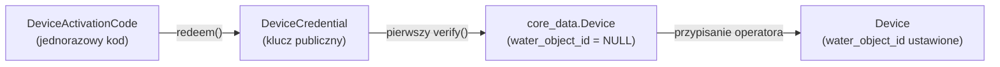
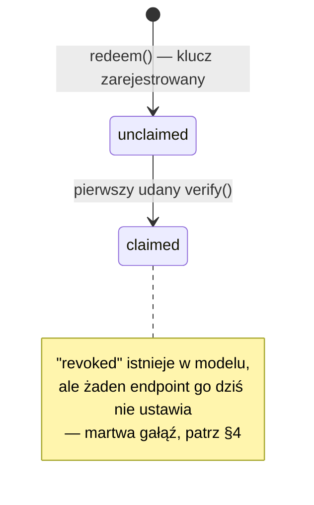
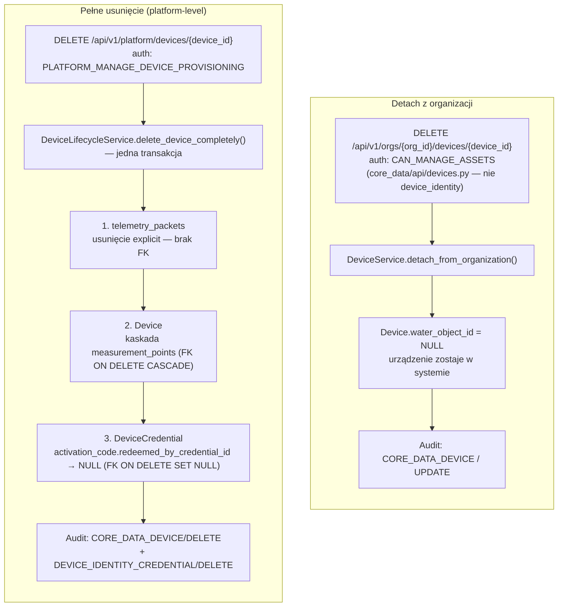

# Moduł `device_identity`

> Część serii dokumentacji per-moduł. Ogólna architektura backendu: [`01_backend-architecture.md`](./01_backend-architecture.md).

## 1. Cel modułu

`device_identity` implementuje asymetryczną autentykację urządzeń IoT (ESP32 gateway'e): każde urządzenie generuje na sobie parę kluczy EC P-256 i dowodzi jej posiadania podpisem (challenge/response) zamiast dzielić sekret z backendem.

Dwie ścieżki provisioningu:
- **Kod aktywacyjny** — operator platformy wystawia jednorazowy kod, urządzenie go zużywa i rejestruje swój klucz publiczny.
- **Ścieżka administracyjna** — bezpośrednia rejestracja gotowego `public_key_pem`, bez kodu (import fabryczny, testy).

Moduł operuje wyłącznie na poziomie urządzenia — org-scoping (przypisanie do gminy) to osobny krok, wykonywany dopiero po zakończeniu auth.

## 2. Model domenowy

### 2.1 Cykl życia od kodu do urządzenia

### 2.2 Stan `DeviceCredential.status`

- `unclaimed` — klucz zarejestrowany, zero udanych `verify()`, brak powiązanego `Device`.
- `claimed` — co najmniej jeden udany `verify()`, `Device` istnieje.
- `revoked` — zarezerwowane na przyszłość (rotacja/dewaluacja klucza).

### 2.3 Uwagi do modelu

- **`DeviceActivationCode`** świadomie nie ma `serial_number` / `organization_id` / `water_object_id` — nie jest z niczym powiązany poza faktem wystawienia. Uzasadnienie w §4.
- **`core_data.Device.water_object_id` jest nullable** (pierwotnie `NOT NULL`):
  - `Device` powstaje od razu przy pierwszym udanym `verify()`, niezależnie od tego, czy operator już go przypisał.
  - Org-scoping (`core_data/repositories/devices.py`) filtruje przez `INNER JOIN` na `WaterObject.id`, więc urządzenie z `water_object_id IS NULL` automatycznie nie pojawia się w żadnym org-view — zero dodatkowej logiki filtrującej.

## 3. Kluczowe reguły i niezmienniki

### 3.1 Endpointy

| Endpointy | Auth | Rola |
|---|---|---|
| `POST /api/v1/platform/device-activation-codes`, `GET` (list), `GET /{id}`, `POST /{id}/cancel` | `PLATFORM_MANAGE_DEVICE_PROVISIONING` | Generowanie i zarządzanie kodami |
| `POST /devices/activation/redeem` | brak (kod = czynnik auth); rate limit 5/min/IP | Zużycie kodu, rejestracja klucza publicznego |
| `POST /devices/auth/challenge`, `POST /devices/auth/verify` | brak | Proof-of-possession klucza, wydanie JWT |
| `POST /api/v1/orgs/{org_id}/devices`, `GET .../devices/claims/{serial_number}` | `CAN_MANAGE_ASSETS` / `CAN_VIEW_ASSETS` | Przypisanie do obiektu wodociągowego (`DeviceClaimService`) |
| `POST /api/v1/platform/device-provisioning` | `PLATFORM_MANAGE_DEVICE_PROVISIONING` | Ścieżka administracyjna — gotowy `public_key_pem`, bez kodu aktywacyjnego |

### 3.2 Niezmienniki

- **Challenge jest jednorazowy i ma TTL**
  - 32 losowe bajty, base64url, TTL `device_challenge_expire_seconds` (domyślnie 300s, `core/config.py`).
  - `verify()` czyści `pending_challenge` niezależnie od wyniku weryfikacji podpisu.
- **Kod aktywacyjny jest jednorazowy**
  - TTL `device_activation_code_expire_seconds` (domyślnie 900s).
  - Idempotency: retry tego samego SN+klucza na już zużytym kodzie zwraca `already_registered` zamiast błędu ([`services/activation_codes.py:232-250`](../../backend/app/modules/device_identity/services/activation_codes.py#L232-L250)) — ochrona przed utraconą odpowiedzią HTTP nad LTE, nie przed powtórnym użyciem przez inne urządzenie.
- **Rozdzielenie „klucz udowodniony" od „przypisany do organizacji"**
  - `DeviceCredential.status="claimed"` mówi o pierwszym, `Device.water_object_id IS NOT NULL` o drugim.
  - Coś może być `claimed` i nieprzypisane jednocześnie — to normalny stan przejściowy.
  - `TelemetryIngestService.ingest()` blokuje ten przypadek `409 DEVICE_NOT_ASSIGNED` (opisane w [`04_telemetry_module.md`](./04_telemetry_module.md#4-nieoczywiste-decyzje-projektowe)).
- **Entity types w audit:**
  - `DEVICE_IDENTITY_ACTIVATION_CODE` — akcje `GENERATE` / `CANCEL` / `REDEEM`.
  - `DEVICE_IDENTITY_CREDENTIAL` — ścieżka administracyjna oraz `DELETE` przy pełnym usunięciu urządzenia (§5).
  - `CORE_DATA_DEVICE` — `CREATE` przy pierwszym `verify()`, `UPDATE` przy przypisaniu/odpięciu od obiektu, `DELETE` przy pełnym usunięciu.

## 4. Nieoczywiste decyzje projektowe

- **Brak bindingu kodu aktywacyjnego do SN/organizacji jest świadomy** — upraszcza model kosztem tego, że kod może zużyć dowolne urządzenie.
  - Akceptowalne, bo: (a) krótkie TTL + wysoka entropia (≥10 znaków, alfabet bez znaków mylących `23456789ABCDEFGHJKMNPQRSTUVWXYZ`, ~50 bitów) czynią zgadywanie niepraktycznym w oknie ważności kodu; (b) samo zużycie kodu tworzy tylko `unclaimed` credential — nie daje dostępu do żadnych danych.
- **Pierwszy `verify()` bezwarunkowo tworzy `Device`**, bez sprawdzania przypisania do organizacji ([`services/device_auth.py:126-129`](../../backend/app/modules/device_identity/services/device_auth.py#L126-L129)).
  - Dowód posiadania klucza i przypisanie do obiektu to świadomie rozdzielone kroki: urządzenie kończy handshake auth natychmiast, przypisanie wykonuje operator później, niezależnym wywołaniem.
- **Rate limiting na `/devices/activation/redeem`** (`@limiter.limit("5/minute")`, per-IP) jest jedyną faktyczną barierą przed zgadywaniem kodu.
  - Hash SHA-256 w bazie chroni przed odczytem jawnego kodu przy wycieku danych, nie przed brute-force.
- **`revoked` to martwa gałąź** — status istnieje w `DeviceCredential.status` z myślą o przyszłej rotacji/dewaluacji klucza.
  - `challenge()` go sprawdza i odrzuca; `verify()` — nie, bo ścieżka jest dziś nieosiągalna (status nigdy nie zmienia się na `revoked`).

## 5. Cykl życia urządzenia — detach i kaskadowe usunięcie

Dwa różne poziomy „usunięcia", z różną autoryzacją i różnym skutkiem:

- **Detach** (`core_data`) zeruje tylko `water_object_id` — urządzenie, jego telemetria historyczna i credential zostają nietknięte, więc może zostać przypisane innej organizacji.
- **Pełne usunięcie** (`device_identity`, orkiestrowane przez `DeviceLifecycleService`) kasuje dane w trzech modułach (telemetry → core_data → device_identity) w jednej transakcji — błąd na dowolnym kroku wycofuje wszystko.
- **Efekt pełnego usunięcia:** numer seryjny zostaje zwolniony i może być zarejestrowany ponownie — wcześniejszy `409 DEVICE_ALREADY_REGISTERED` na ponowny redeem po platform-delete już nie występuje.

## 6. Znane ograniczenia

- Brak widoku „pula nieprzypisanych urządzeń" — operator wpisuje SN ręcznie na podstawie statusu kodu.
- Flash Encryption / Secure Boot firmware — odłożone na później.
