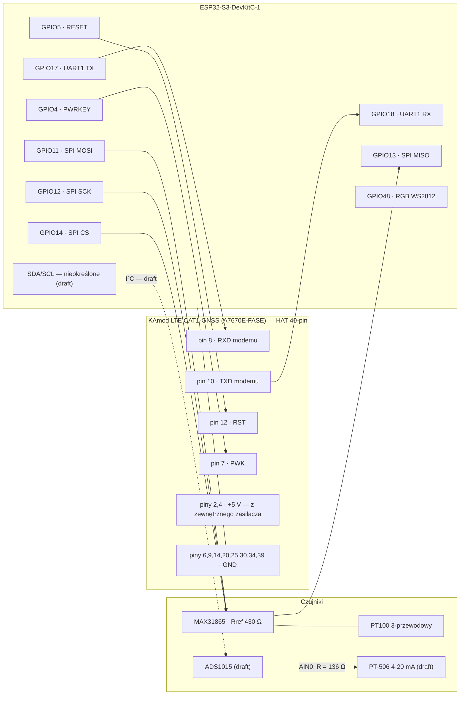
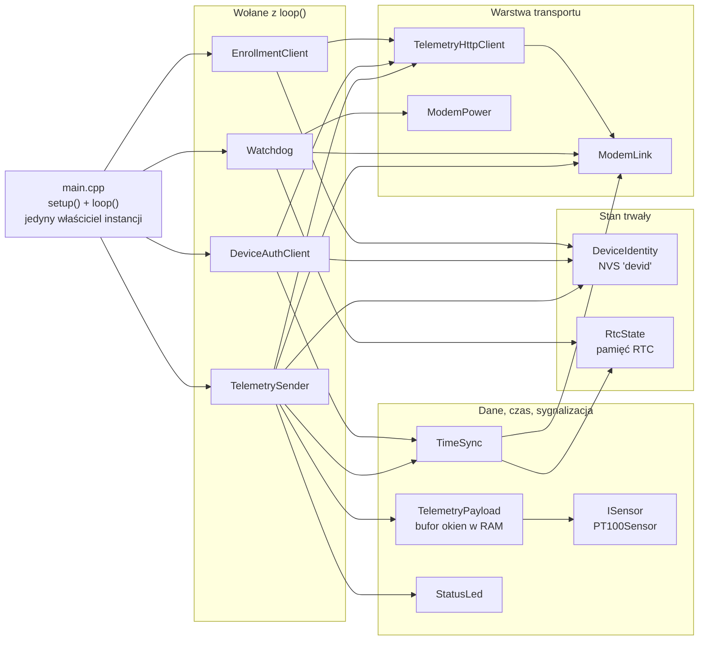
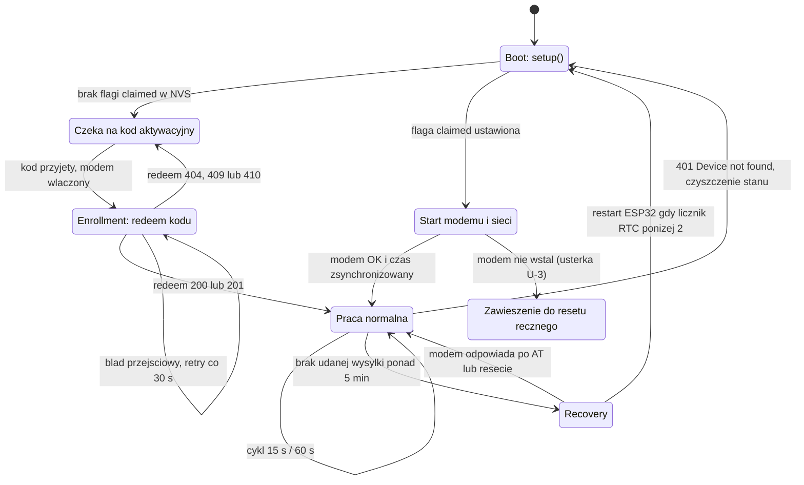
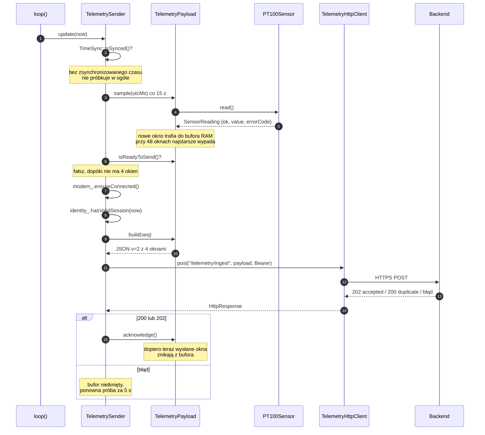

# Firmware i sprzęt gatewaya — przegląd

Punkt wejścia do dokumentacji firmware. Zawiera schemat połączeń, drzewo zasilania, architekturę
bibliotek, diagram stanów urządzenia i sekwencję transmisji — czyli to, co trzeba mieć przed oczami,
zanim wejdzie się w szczegóły w dokumentach `01`–`07`.

**Stan wiedzy:** 2026-09-03. Dokument uzgodniony z kodem na gałęzi `claude/firmware-hardware-docs-7h7dpq`.
Wszystko, czego nie dało się rozstrzygnąć z kodu, jest oznaczone jako `draft` i wypisane w
[§9 Do sprawdzenia na sprzęcie](#9-do-sprawdzenia-na-sprzęcie).

---

## 1. Legenda statusów

Trzy statusy, które w tej dokumentacji **znaczą trzy różne rzeczy** i nie wolno ich mieszać:

| Status | Znaczenie | Jak został nadany |
|---|---|---|
| `zweryfikowane w kodzie` | W repozytorium istnieje kod, który realizuje opisane zachowanie. Nie mówi nic o tym, czy działa na fizycznej płytce. | Przeczytany plik źródłowy, podany link do linii. |
| `zweryfikowane na sprzęcie` | Zachowanie potwierdzone uruchomieniem na fizycznym urządzeniu, z datą i opisem próby. | Wyłącznie z wcześniejszego wpisu w dokumentacji zawierającego datę testu. **W tym przejściu nic nie zostało awansowane do tego statusu** — praca była wyłącznie na kodzie. |
| `draft` | Plan, zamiar albo pozostałość po wcześniejszej wersji. Brak kodu lub brak potwierdzenia. | Brak odpowiednika w repozytorium albo rozstrzygnięcie wymaga płytki. |

Zasada: **status `draft` nigdy nie awansuje na podstawie samego czytania kodu.** Kod może co najwyżej
dać `zweryfikowane w kodzie`.

---

## 2. Mapa dokumentów

| Dokument | Zakres | Kiedy tu zaglądać |
|---|---|---|
| **`00_przeglad.md`** (ten plik) | Schematy, architektura, stany, sekwencja transmisji | Zaczynasz pracę z firmware albo szukasz „gdzie to jest" |
| [`01_hardware.md`](./01_hardware.md) | **Źródło prawdy dla pinów.** Mapa GPIO, moduł KAmod, uwagi krytyczne | Przed dotknięciem GPIO albo okablowania |
| [`02_modem_a7670e_communication.md`](./02_modem_a7670e_communication.md) | Sterowanie modemem, sekwencje power-on i reset, komendy AT, diagnostyka | Modem nie odpowiada, brak sieci, brak IP |
| [`03_esp32_reset_and_recovery.md`](./03_esp32_reset_and_recovery.md) | Watchdog Task WDT, trzypoziomowe recovery, stan w pamięci RTC | Urządzenie się restartuje albo wisi |
| [`04_device_provisioning_flow.md`](./04_device_provisioning_flow.md) | Tożsamość urządzenia, aktywacja, challenge/verify, token | Nowe urządzenie nie wchodzi do systemu |
| [`05_pt100_temperature_sensor.md`](./05_pt100_temperature_sensor.md) | PT100 + MAX31865: podłączenie, kody błędów, kalibracja | Temperatura nie przychodzi albo jest błędna |
| [`06_adding_sensors.md`](./06_adding_sensors.md) | Jak dołożyć nowy czujnik (rejestr → `ISensor` → `main.cpp`) | Dokładasz kanał pomiarowy |
| [`07_montaz_krok_po_kroku.md`](./07_montaz_krok_po_kroku.md) | Instrukcja fizycznego złożenia zestawu | Składasz sprzęt od zera |

Powiązane poza tym katalogiem: [`06_device_identity_module.md`](../backend/06_device_identity_module.md)
(strona backendowa provisioningu) i [`04_telemetry_module.md`](../backend/04_telemetry_module.md)
(strona backendowa ingestu).

---

## 3. Co robi urządzenie

Gateway to **ESP32-S3-DevKitC-1** z modemem **A7670E** na płytce HAT, który co 15 s próbkuje czujniki,
składa próbki w okna pomiarowe, po czterech oknach (≈ 60 s) wysyła paczkę HTTPS POST na
`/telemetry/ingest` i czyści bufor dopiero po potwierdzeniu z backendu. Urządzenie nie steruje niczym —
jest wyłącznie źródłem danych.

---

## 4. Schemat połączeń

> **Dlaczego plik SVG, a nie SVG wklejone w markdown.** GitHub czyści znaczniki `<svg>` z treści
> markdownu — inline SVG w pliku `.md` po prostu nie wyświetli się w repozytorium. Osadzenie
> samodzielnego pliku `.svg` przez `` renderuje się i na GitHubie, i lokalnie, i po
> wklejeniu do Artifactu, a plik nadal nie ma żadnych zewnętrznych zależności. Obie grafiki mają
> zdefiniowane palety dla motywu jasnego i ciemnego oraz zawsze wypełnione tło — nie ma czarnych
> linii na przezroczystym tle.

Ten sam schemat w Mermaid, gdyby SVG się nie załadowało:

### 4.1. Piny — tabela kanoniczna

Wartości przepisane z [`Config.h`](../../../firmware/include/Config.h). **Jeśli ta tabela i `Config.h`
się rozjadą, prawdę ma `Config.h`.**

| GPIO | Stała | Funkcja | Podłączone do | Status |
|---|---|---|---|---|
| 17 | `MODEM_TX_PIN` [`L17`](../../../firmware/include/Config.h#L17) | UART1 TX | RXD modemu (pin 8 HAT-a) | zweryfikowane w kodzie |
| 18 | `MODEM_RX_PIN` [`L16`](../../../firmware/include/Config.h#L16) | UART1 RX | TXD modemu (pin 10 HAT-a) | zweryfikowane w kodzie |
| 4 | `MODEM_PWRKEY_PIN` [`L18`](../../../firmware/include/Config.h#L18) | PWRKEY, active-high | PWK (pin 7 HAT-a) | zweryfikowane w kodzie |
| 5 | `MODEM_RESET_PIN` [`L19`](../../../firmware/include/Config.h#L19) | RESET, active-high | RST (pin 12 HAT-a) | zweryfikowane w kodzie |
| — | `MODEM_POWER_ENABLE_PIN` = `-1` [`L20`](../../../firmware/include/Config.h#L20) | nieużywane | — | zweryfikowane w kodzie |
| 11 | `PT100_SPI_MOSI` [`L27`](../../../firmware/include/Config.h#L27) | SPI MOSI | MAX31865 SDI | zweryfikowane w kodzie |
| 12 | `PT100_SPI_SCK` [`L29`](../../../firmware/include/Config.h#L29) | SPI SCK | MAX31865 CLK | zweryfikowane w kodzie |
| 13 | `PT100_SPI_MISO` [`L28`](../../../firmware/include/Config.h#L28) | SPI MISO | MAX31865 SDO | zweryfikowane w kodzie |
| 14 | `PT100_SPI_CS` [`L26`](../../../firmware/include/Config.h#L26) | SPI CS | MAX31865 CS | zweryfikowane w kodzie |
| 48 | `LED_PIN` [`L15`](../../../firmware/include/Config.h#L15) | RGB WS2812 on-board | — | zweryfikowane w kodzie |

Piny SPI są przekazywane jawnie do `SPI.begin()` w
[`PT100Sensor::init()`](../../../firmware/lib/Sensor/src/PT100Sensor.cpp#L14) — nie polegamy na
domyślnych pinach frameworku.

**Czego w `Config.h` nie ma:** żadnego pinu ADC ani I²C. Ścieżka pomiaru ciśnienia nie istnieje w
kodzie — patrz [§4.3](#43-ścieżka-ciśnienia--draft).

### 4.2. Nastawy czasowe

| Stała | Wartość | Źródło | Znaczenie |
|---|---|---|---|
| `SAMPLE_INTERVAL_MS` | 15 s | [`Config.h:61`](../../../firmware/include/Config.h#L61) | Odstęp między próbkowaniami |
| `WINDOW_SECONDS` | 15 s | [`TelemetryPayload.h:37`](../../../firmware/lib/TelemetryPayload/src/TelemetryPayload.h#L37) | Deklarowana długość okna w payloadzie |
| `WINDOWS_PER_BATCH` | 4 | [`TelemetryPayload.h:34`](../../../firmware/lib/TelemetryPayload/src/TelemetryPayload.h#L34) | Ile okien wchodzi w jedną wysyłkę → transmisja co ≈ 60 s |
| `RETAIN_WINDOWS_MAX` | 48 okien | [`TelemetryPayload.h:35`](../../../firmware/lib/TelemetryPayload/src/TelemetryPayload.h#L35) | Pojemność bufora RAM = **12 minut** danych |
| `MAX_ERRORS` | 64 | [`TelemetryPayload.h:36`](../../../firmware/lib/TelemetryPayload/src/TelemetryPayload.h#L36) | Pojemność bufora błędów |
| `ERROR_RETRY_MS` | 5 s | [`Config.h:62`](../../../firmware/include/Config.h#L62) | Odstęp po nieudanej wysyłce |
| `WATCHDOG_STUCK_MS` | 5 min | [`Config.h:63`](../../../firmware/include/Config.h#L63) | Po tylu minutach bez udanej wysyłki startuje recovery |
| `MAX_RESTART_ATTEMPTS` | 2 | [`Config.h:64`](../../../firmware/include/Config.h#L64) | Limit restartów ESP32 w ramach recovery |
| `CLAIM_POLL_INTERVAL_MS` | 15 s | [`Config.h:65`](../../../firmware/include/Config.h#L65) | Odstęp prób uwierzytelnienia; w kodzie opisane jako testowe |
| `TOKEN_REFRESH_MARGIN_SECONDS` | 4 h | [`Config.h:66`](../../../firmware/include/Config.h#L66) | Zapas przed wygaśnięciem tokenu |
| `ACTIVATION_RETRY_INTERVAL_MS` | 30 s | [`Config.h:67`](../../../firmware/include/Config.h#L67) | Backoff enrollmentu i throttle prób włączenia modemu |
| Task WDT | 15 s | [`platformio.ini:19`](../../../firmware/platformio.ini#L19) | `CONFIG_ESP_TASK_WDT_TIMEOUT_S`, flaga budowania |

### 4.3. Ścieżka ciśnienia — draft

Kanał pomiaru ciśnienia **nie istnieje w firmware**: nie ma klasy czujnika ciśnienia, nie ma
sterownika ADC, nie ma wywołania `analogRead()` ani biblioteki I²C w całym `firmware/`. Jedynym
czujnikiem na liście w [`initializeSensors()`](../../../firmware/src/main.cpp#L94-L99) jest
`PT100Sensor`. Wcześniejsze zdania dokumentacji o „danych syntetycznych (sinus)" dla PT-506
opisywały stan sprzed refaktoru na interfejs `ISensor` i **nie odpowiadają obecnemu kodowi** —
urządzenie nie wysyła dziś żadnej wartości ciśnienia, ani prawdziwej, ani udawanej.

Docelowa topologia przyjęta w planie: przetwornik PT-506 w pętli 4-20 mA zasilanej z 24 V, prąd
zamieniany na napięcie rezystorem **136 Ω (2 × 68 Ω)** na wejściu **AIN0 układu ADS1015** (I²C).

Skąd 136 Ω, a nie 250 Ω z wcześniejszej wersji dokumentacji — **uzasadnienie rachunkowe, nie pomiar**:

| R | U przy 4 mA | U przy 20 mA | Werdykt |
|---|---|---|---|
| 250 Ω | 1,00 V | **5,00 V** | Przekracza zasilanie 3,3 V przetwornika — poza absolutnym maksimum wejścia. Odrzucone. |
| 136 Ω | 0,54 V | **2,72 V** | Mieści się w zakresie PGA ±4,096 V i poniżej napięcia zasilania. Przyjęte. |

Wariant „GPIO1 / ADC1_CH0 + 250 Ω" z wcześniejszych wersji dokumentacji jest **porzucony** — zarówno
z powodu napięcia powyżej, jak i dlatego, że wewnętrzny ADC ESP32-S3 ma gorszą liniowość niż osobny
przetwornik. Nie przenosimy go dalej.

**Piny I²C dla ADS1015 pozostają nierozstrzygnięte.** Nie ma ich w `Config.h`, a zgadywanie numeru
GPIO w dokumentacji sprzętowej jest dokładnie tym błędem, przed którym ten katalog ma chronić.
Pozycja trafia na listę w [§9](#9-do-sprawdzenia-na-sprzęcie).

---

## 5. Drzewo zasilania

**Stan obecny** (`zweryfikowane w kodzie` tylko w części dotyczącej pinów; reszta to wymóg sprzętowy
z dokumentacji producenta modułu): USB-C dev-kitu zasila ESP32-S3 i przez LDO na płytce — MAX31865;
moduł HAT **musi mieć osobne 5 V o wydajności min. 2 A** na pinach 2 i 4, ze wspólną masą.

**Stan docelowy** (`draft`, pochodzi z planu, nie z repozytorium): 230 V AC → zasilacz DIN 24 V DC →
przetwornica XL4015 24 → 5 V / 2 A → wspólne 5 V dla ESP32-S3 i HAT-a; 24 V zasila równolegle pętlę
4-20 mA. Bilans prądowy tego łańcucha nie był liczony w tym zleceniu.

---

## 6. Architektura firmware

Trzynaście własnych bibliotek w [`firmware/lib/`](../../../firmware/lib/) plus `main.cpp` jako jedyne
miejsce, które je łączy. Zależności idą w jedną stronę — żadna biblioteka nie zna `main.cpp`.

**Co diagram świadomie pomija** — wszystkie narysowane strzałki odpowiadają faktycznym zależnościom
w kodzie, ale nie odwrotnie; dla czytelności nie narysowano trzech grup krawędzi:

- **`main.cpp` → wszystko pozostałe.** Poza czterema klasami wołanymi z `loop()` `main.cpp` tworzy
  i trzyma również `StatusLed`, `DeviceIdentity`, `ModemPower`, `ModemLink`, `TelemetryHttpClient`,
  `TelemetryPayload`, listę czujników oraz zmienne w pamięci RTC, a `TimeSync` inicjalizuje
  statycznie. Stąd podpis „jedyny właściciel instancji" — narysowanie tych dziewięciu strzałek
  zamieniłoby rysunek w gwiazdę.
- **`Watchdog` → `TelemetrySender`.** Watchdog odpytuje sender o to, czy ostatni błąd był trwały
  ([`Watchdog.cpp:18`](../../../firmware/lib/Watchdog/src/Watchdog.cpp#L18)); krawędź pominięta, żeby
  nie zamykać cyklu na rysunku.
- **`Logger`.** Nagłówek z makrami, dołączany praktycznie wszędzie — jako węzeł nic nie wnosi.

| Biblioteka | Odpowiedzialność | Stan, który trzyma |
|---|---|---|
| [`DeviceIdentity`](../../../firmware/lib/DeviceIdentity/src/DeviceIdentity.cpp) | Numer seryjny z MAC, klucz EC P-256, flaga aktywacji, token sesji | NVS, namespace `devid` |
| [`EnrollmentClient`](../../../firmware/lib/EnrollmentClient/src/EnrollmentClient.cpp) | Przyjęcie kodu aktywacyjnego i `POST /devices/activation/redeem` | `pending_code_` w RAM |
| [`DeviceAuthClient`](../../../firmware/lib/DeviceAuthClient/src/DeviceAuthClient.cpp) | Challenge/verify, odświeżanie tokenu Bearer | brak — token idzie do `DeviceIdentity` |
| [`ModemPower`](../../../firmware/lib/ModemPower/src/ModemPower.cpp) | Sekwencje PWRKEY i RESET, twardy reset modemu | bezstanowa |
| [`ModemLink`](../../../firmware/lib/ModemLink/src/ModemLink.cpp) | UART, TinyGSM, rejestracja w sieci, kontekst GPRS | uchwyt `TinyGsm*`, parametry APN |
| [`TelemetryHttpClient`](../../../firmware/lib/TelemetryHttpClient/src/TelemetryHttpClient.cpp) | HTTPS POST nad `TinyGsmClientSecure` | uchwyt `HttpClient*` |
| [`TelemetryPayload`](../../../firmware/lib/TelemetryPayload/src/TelemetryPayload.cpp) | Próbkowanie czujników, bufor okien, JSON, bufor błędów | **bufor okien i błędów — tylko RAM** |
| [`Sensor`](../../../firmware/lib/Sensor/include/ISensor.h) (`ISensor`, `PT100Sensor`) | Kontrakt czujnika i implementacja PT100 przez MAX31865 | bezstanowa poza uchwytem SPI |
| [`TelemetrySender`](../../../firmware/lib/TelemetrySender/src/TelemetrySender.cpp) | Harmonogram próbkowania i wysyłki, obsługa odpowiedzi HTTP | znaczniki czasu ostatniej próbki, wysyłki i sukcesu |
| [`TimeSync`](../../../firmware/lib/TimeSync/src/TimeSync.cpp) | Synchronizacja czasu przez modem, znaczniki UTC | statyczne pola + pamięć RTC |
| [`Watchdog`](../../../firmware/lib/Watchdog/src/Watchdog.cpp) | Trzypoziomowe recovery po braku udanej wysyłki | licznik prób + licznik restartów w RTC |
| [`StatusLed`](../../../firmware/lib/StatusLed/src/StatusLed.cpp) | Sygnalizacja WS2812 na GPIO48 | uchwyt `Adafruit_NeoPixel*` |
| [`Logger`](../../../firmware/lib/Logger/include/Logger.h) | Makra logów `[millis][LEVEL][TAG]`, próg kompilacyjny | brak (tylko nagłówek) |

### 6.1. Gdzie leży stan

| Miejsce | Co tam jest | Przeżywa restart? | Przeżywa zanik zasilania? |
|---|---|---|---|
| NVS `devid` | `sn`, `priv`, `claimed`, `tok`, `tok_exp` | tak | tak |
| Pamięć RTC ([`RtcState.h`](../../../firmware/include/RtcState.h)) | `rtcRestartCounter`, `rtcSyncedTimeUtcSec`, `rtcSyncMillis` | tak (`esp_restart()`) | **nie** |
| RAM | bufor okien (do 48), bufor błędów (do 64), `pending_code_`, flagi `TimeSync` | **nie** | nie |

Konsekwencja praktyczna: **każdy restart urządzenia kasuje do 12 minut zebranych pomiarów.**
Patrz [§8](#8-sekwencja-transmisji-i-miejsca-utraty-danych).

---

## 7. Diagram stanów urządzenia

Uwagi do diagramu:

- **Dwie niezależne drogi do pracy normalnej.** Urządzenie już zaprovisionowane wchodzi w telemetrię
  bezpośrednio z `setup()`, bez udziału `EnrollmentClient`. Pierwszy provisioning w całości dzieje się
  w `loop()`. Szczegóły: [`04_device_provisioning_flow.md §5`](./04_device_provisioning_flow.md#5-faza-d--dwie-drogi-do-normalnej-pracy).
- **Modem nie włącza się, dopóki urządzenie nie jest aktywowane** — świadoma decyzja, żeby nieaktywne
  urządzenie nie zużywało energii ani transmisji.
- **Przejście `CzekaNaAktywacje → Enrollment` jest dziś nieosiągalne w kodzie.** Metoda, która miała
  czytać kod z portu szeregowego, jest pustą zaślepką — patrz
  [§10, usterka U-1](#10-usterki-w-kodzie-znalezione-przy-uzgadnianiu-dokumentacji).
- Ścieżka `StartModemu → [*]`: gdy `initializeModemAndNetwork()` zawiedzie, `setup()` kończy się
  przedwcześnie ([`main.cpp:185`](../../../firmware/src/main.cpp#L185)). `loop()` nie odtwarza tej
  ścieżki — bez telemetrii nie ma też `watchdog->check()` z prawdziwym `lastSuccessMs`, więc urządzenie
  zostaje w tym stanie do ręcznego resetu. Patrz [§10, usterka U-3](#10-usterki-w-kodzie-znalezione-przy-uzgadnianiu-dokumentacji).

---

## 8. Sekwencja transmisji i miejsca utraty danych

### 8.1. Gdzie dane mogą zginąć

| # | Miejsce | Skutek | Czy da się to dziś wykryć z zewnątrz |
|---|---|---|---|
| U-A | **Bufor tylko w RAM.** Restart ESP32 (recovery poziom 3, watchdog, zanik zasilania) kasuje wszystkie niewysłane okna. | Do 12 minut pomiarów | Nie — nie ma kodu błędu sygnalizującego utratę bufora przy restarcie |
| U-B | **Przepełnienie bufora.** Po 12 minutach bez łączności najstarsze okno jest usuwane, do payloadu dopisywany jest kod `WINDOW_DROPPED_BUFFER_FULL`. | Najstarsze dane, po jednym oknie na próbkę | Tak — kod błędu dociera do backendu po odzyskaniu łączności |
| U-C | **Brak synchronizacji czasu.** `TelemetrySender::update()` wychodzi natychmiast, gdy `TimeSync::isSynced()` jest fałszem — nie tylko nie wysyła, ale **w ogóle nie próbkuje**. Synchronizacja jest próbowana tylko raz, przy starcie (usterka U-4), więc nieudany NTP przy boocie oznacza brak telemetrii aż do restartu. | Cały czas pracy od nieudanej synchronizacji | Częściowo — po stronie backendu widać brak danych, urządzenie nie zgłasza `TIME_SYNC_FAILED` |
| U-D | **Brak ważnej sesji.** Bez tokenu wysyłka jest pomijana, ale próbkowanie trwa — dane czekają w buforze i podlegają U-B. | Zależny od czasu bez tokenu | Częściowo |
| U-E | **Awaria czujnika blokuje całą wysyłkę.** Nieudany odczyt dopisuje do payloadu kod błędu, którego backend nie akceptuje, więc odrzuca całą paczkę. Bufor nigdy się nie czyści. | Pełny zastój telemetrii na czas awarii czujnika | Tak, ale tylko jako seria odrzuceń 422 w logach backendu — patrz [§10, usterka U-2](#10-usterki-w-kodzie-znalezione-przy-uzgadnianiu-dokumentacji) |

Punkt U-E jest jedynym, który zamienia awarię pojedynczego czujnika w awarię całego urządzenia.

---

## 9. Do sprawdzenia na sprzęcie

Pozycje, których **nie da się rozstrzygnąć z kodu** — wymagają fizycznej płytki. Żadna z nich nie
została w tym przejściu awansowana ze statusu `draft`.

| # | Pytanie | Dlaczego to ma znaczenie |
|---|---|---|
| H-1 | Czy zworka **J_APWK** na spodzie płytki KAmod jest przecięta? | Nieprzecięta oznacza automatyczny power-on modemu przy podaniu zasilania, równolegle do impulsu z `ModemPower::powerOn()`. Dwa impulsy mogą się znieść i modem nie wstanie. |
| H-2 | Czy wszystkie cztery zworki **J2** (TXD, RXD, PWK, RST) są założone? | Bez zworki sygnał nie dociera do złącza 40-pin mimo poprawnego okablowania GPIO. Najczęstsza przyczyna „modem nie odpowiada przy dobrym wiring". |
| H-3 | Czy przełożenie sygnałów HAT → GPIO ESP32-S3 z [`01_hardware.md §7`](./01_hardware.md#7-a7670e-fase--moduł-kamod-lte-cat1-gnss-hat) odpowiada faktycznemu okablowaniu? | Kod definiuje tylko numery GPIO po stronie ESP32; sposób podłączenia do złącza HAT-a nie wynika z repozytorium. |
| H-4 | Który konkretnie wariant modułu ESP32-S3 jest na płytce (N8R2 / N8R8 / N16R8)? | Warianty z pamięcią PSRAM w trybie oktalnym zajmują część GPIO. Bez tego nie da się bezpiecznie wybrać pinów I²C dla ADS1015. |
| H-5 | Które GPIO przeznaczyć na **SDA/SCL** dla ADS1015? | Nie ma tego w `Config.h`. Decyzja wymaga H-4 i oględzin płytki. Do czasu rozstrzygnięcia — nie wpisywać żadnych numerów do dokumentacji. |
| H-6 | Czy zworka **2/3W** na module MAX31865 jest zwarta? | Dla czujnika 3-przewodowego musi być; inaczej odczyt jest systematycznie przesunięty. |
| H-7 | Jaką rzeczywistą rezystancję ma rezystor odniesienia na module MAX31865? | Kod zakłada 430 Ω ([`PT100Sensor.h:22`](../../../firmware/lib/Sensor/src/PT100Sensor.h#L22)). Moduły z 400 Ω dają stały błąd temperatury. |
| H-8 | Czy zasilacz 5 V faktycznie utrzymuje napięcie przy szczycie nadawania LTE? | Zapady napięcia przy nadawaniu są najczęstszą przyczyną resetów modemu wyglądających jak awaria firmware. |

---

## 10. Usterki w kodzie znalezione przy uzgadnianiu dokumentacji

To **nie są** rozbieżności dokumentacyjne — to defekty w firmware, odkryte przy porównywaniu
dokumentacji z kodem. Zostały tu zapisane, bo dokumentacja musi opisywać stan faktyczny, a nie
zamierzony. **Naprawa jest poza zakresem tego zlecenia** — to osobne zadania.

| # | Usterka | Dowód | Skutek |
|---|---|---|---|
| **U-1** | Odbiór kodu aktywacyjnego z portu szeregowego nie działa. `EnrollmentClient::readSerial()` to pusta zaślepka z komentarzem „Serial input disabled", a `processLine()` — jedyna metoda ustawiająca `pending_code_` — nie jest wołana z żadnego miejsca w repozytorium. | [`EnrollmentClient.cpp:78-80`](../../../firmware/lib/EnrollmentClient/src/EnrollmentClient.cpp#L78-L80) | **Fabrycznie nowego urządzenia nie da się aktywować.** `needsModemBringUp()` zawsze zwraca fałsz, więc modem nigdy się nie włącza i redeem nigdy nie rusza. Dotyczy wyłącznie pierwszego uruchomienia — urządzenia z `claimed=true` w NVS działają normalnie. |
| **U-2** | Przy nieudanym odczycie czujnika payload dostaje kod `SENSOR_FAULT` z `severity: "error"`. Rejestr [`sensor_registry.yaml`](../../../sensor_registry.yaml) zna kody `SENSOR_READ_FAILED`, `SENSOR_FAULT_HW` i `SENSOR_OUT_OF_RANGE`, a backend przyjmuje wyłącznie `severity` ∈ {`info`, `warning`, `critical`}. Kod błędu zwrócony przez sam czujnik (`SENSOR_FAULT_HW`) jest w tym miejscu odrzucany. | [`TelemetryPayload.cpp:92`](../../../firmware/lib/TelemetryPayload/src/TelemetryPayload.cpp#L92) wobec [`measurement_packet.py`](../../../backend/app/modules/telemetry/schemas/measurement_packet.py) | Backend odrzuca **całą paczkę** (walidacja Pydantic → 422), firmware nie czyści bufora i ponawia co 5 s. Awaria jednego czujnika zatrzymuje całą telemetrię urządzenia. |
| **U-3** | Gdy `initializeModemAndNetwork()` zawiedzie w `setup()`, funkcja kończy się przez `return` bez utworzenia `telemetrySender`. `loop()` wpada wtedy w gałąź `if (!telemetrySender ...) { delay(10); return; }` i nie próbuje ponowić inicjalizacji. | [`main.cpp:185`](../../../firmware/src/main.cpp#L185) i [`main.cpp:219-222`](../../../firmware/src/main.cpp#L219-L222) | Chwilowy brak zasięgu przy starcie zawiesza zaprovisionowane urządzenie do ręcznego resetu. Watchdog aplikacyjny tego nie łapie, bo `watchdog->check()` też nie jest w tej ścieżce wołany. |
| **U-4** | Czas jest synchronizowany wyłącznie raz, w `setup()`. Nie ma mechanizmu ponownej synchronizacji w `loop()`. | [`main.cpp:186`](../../../firmware/src/main.cpp#L186), [`TimeSync.cpp`](../../../firmware/lib/TimeSync/src/TimeSync.cpp) | Znaczniki czasu dryfują wraz z zegarem `millis()` przez cały czas pracy urządzenia. Nie jest to utrata danych, ale pogorszenie ich jakości rosnące z czasem od restartu. |
| **U-5** | `EnrollmentClient::maskCode()` — maskowanie kodu aktywacyjnego w logach — nie jest wołane z żadnego miejsca. Wraz z usunięciem logów z tej klasy zniknęły też wszystkie miejsca, które go używały. | [`EnrollmentClient.cpp:18`](../../../firmware/lib/EnrollmentClient/src/EnrollmentClient.cpp#L18) | Dziś nieszkodliwe (kod nie trafia do logów w ogóle), ale przy przywracaniu U-1 trzeba pamiętać, żeby logować przez `maskCode()`, a nie surowy kod. |

---

## 11. Rozbieżności naprawione w tym przejściu

Dla porządku — co dokumentacja twierdziła wcześniej i jak jest naprawdę:

| Twierdzenie w dokumentacji | Stan faktyczny w kodzie |
|---|---|
| „PT-506 wysyła dane syntetyczne (sinus)" — wcześniejsza wersja [`01_hardware.md`](./01_hardware.md) | Nie ma żadnej ścieżki ciśnienia — ani prawdziwej, ani syntetycznej |
| „PT-506 przez rezystor 250 Ω na GPIO1/ADC1_CH0" | Porzucone; 250 Ω dałoby 5 V przy 20 mA. Plan docelowy: ADS1015 + 136 Ω, status `draft` |
| „SPI (PT100/MAX31865, draft)" — wcześniejsza sekcja „Interfejsy" w [`01_hardware.md`](./01_hardware.md) | SPI i PT100 są `zweryfikowane w kodzie`, a wg [`05_pt100_temperature_sensor.md`](./05_pt100_temperature_sensor.md) także na sprzęcie (2026-08-24) |
| Odwołania do `firmware/HARDWARE.md` i `firmware/SETUP_GUIDE.md` | Pliki nie istnieją — treść jest w tym katalogu |
| „`esp_task_wdt_init(3, true)` w `setup()`" ([`03_esp32_reset_and_recovery.md`](./03_esp32_reset_and_recovery.md)) | `main.cpp` nie wywołuje `esp_task_wdt_init()`; limit 15 s pochodzi z flagi budowania |
| `TelemetryPayload::readPT100Temperature()`, okno 30 s, payload `v: 1` ([`05_pt100_temperature_sensor.md`](./05_pt100_temperature_sensor.md)) | Odczyt jest w `PT100Sensor::read()` za interfejsem `ISensor`; okno 15 s, batch 4 okien, payload `v: 2` |
| Tryb testowy modemu `#define TEST_MODEM 1` ([`02_modem_a7670e_communication.md §6.3`](./02_modem_a7670e_communication.md)) | Nie ma takiego kodu w `main.cpp` |
| Numery linii `main.cpp` w [`04_device_provisioning_flow.md`](./04_device_provisioning_flow.md) | Nieaktualne po refaktorze — poprawione |
