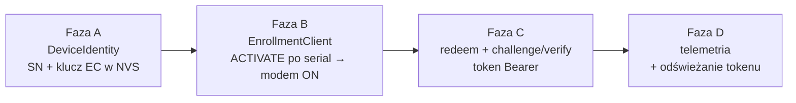
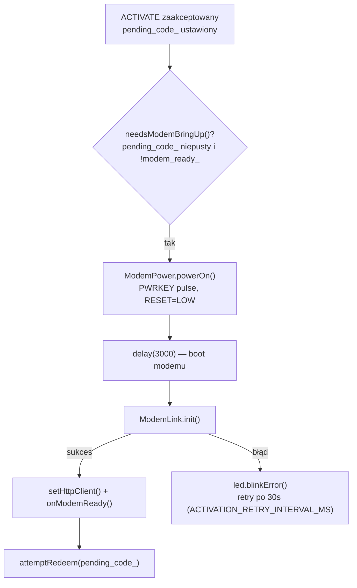
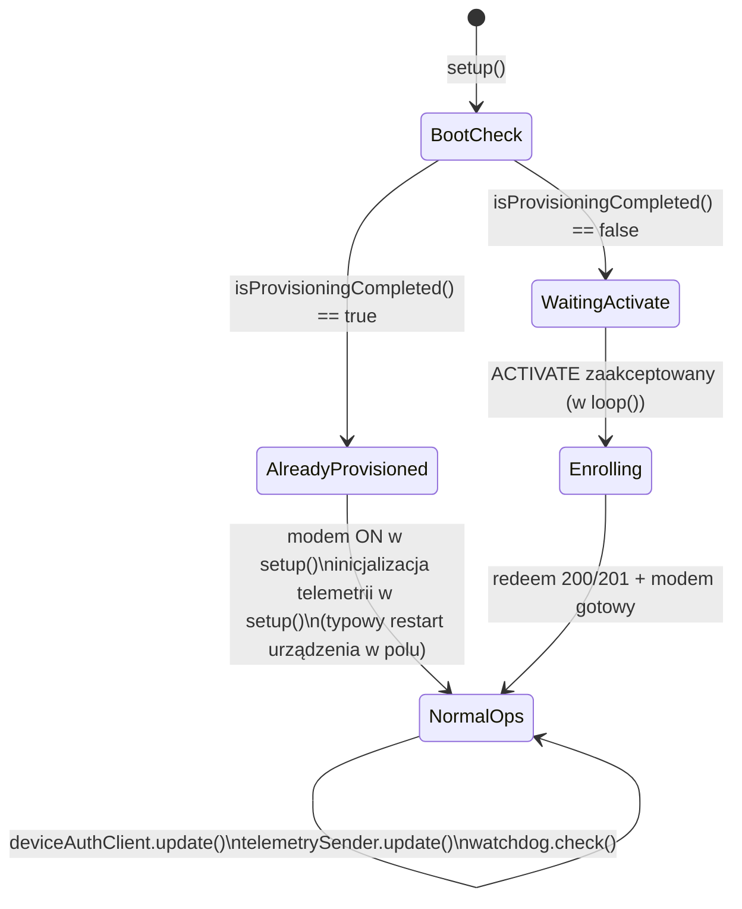

# Firmware: Provisioning urządzenia (od ACTIVATE do telemetrii)

> Cztery fazy: tożsamość urządzenia → odbiór kodu aktywacyjnego → rejestracja i auth przez HTTP → normalna praca. Pełny kontrakt HTTP i logika backendu: [`06_device_identity_module.md`](../backend/06_device_identity_module.md) — ten dokument opisuje wyłącznie stronę firmware.
>
> **Status: zweryfikowane na sprzęcie 2026-08-23** — ESP32-S3 + A7670E, pełny cykl ACTIVATE → telemetria aktywna w ~55s.

## 1. Przegląd



Ważne: po pierwszym provisioningu każdy kolejny restart **pomija fazy B i C całkowicie** — patrz §5, druga ścieżka.

## 2. Faza A — tożsamość urządzenia (NVS)

### 2.1 Numer seryjny

[`lib/DeviceIdentity/src/DeviceIdentity.cpp::generateSerialNumber()`](../../../firmware/lib/DeviceIdentity/src/DeviceIdentity.cpp): wszystkie 6 bajtów adresu MAC (WiFi STA), zapisane jako uppercase hex, ze stałym prefiksem `SN_PREFIX` (`WW-`, `Config.h`).

```
MAC 3C:DC:75:6F:6D:C0  →  WW-3CDC756F6DC0
```

Zawsze pełne 12 znaków hex — nie ma skróconej formy.

### 2.2 Para kluczy EC P-256

- Generowana raz: `mbedtls_ecp_gen_key(MBEDTLS_ECP_DP_SECP256R1, ...)`.
- **Odłożona z `setup()` do pierwszej iteracji `loop()`** ([`src/main.cpp:146-149`](../../../firmware/src/main.cpp#L146-L149)) — operacja trwa ~2-3s CPU-intensywnie; w `setup()` groziłaby timeoutem RTC Watchdog (~9s budżetu na cały boot).
- Klucz publiczny liczony na żądanie z prywatnego (`publicKeyRawPointHex()`): punkt EC nieskompresowany (65 bajtów, prefiks `0x04`) → 130-znakowy hex, wysyłany przy redeem.

### 2.3 Trwałość NVS (namespace `devid`)

| Klucz | Zawartość | Kto zapisuje |
|---|---|---|
| `sn` | Numer seryjny | `generateSerialNumber()`, jednorazowo |
| `priv` | Klucz prywatny EC, 32 bajty | `loadOrGenerateKey()`, jednorazowo |
| `claimed` | Flaga „redeem zakończony sukcesem" | `EnrollmentClient::attemptRedeem()` po 200/201 |
| `tok`, `tok_exp` | Ostatni token Bearer + unix timestamp wygaśnięcia | `DeviceAuthClient` po każdym udanym `verify()` |

**Uwaga terminologiczna — `claimed` w NVS ≠ `status="claimed"` w backendzie.** Flaga NVS oznacza tylko „kod aktywacyjny został zużyty" (redeem się powiódł); backendowy `DeviceCredential.status` przechodzi w `claimed` dopiero po pierwszym udanym `verify()`, co dzieje się osobno i cyklicznie przez cały cykl życia urządzenia (odświeżanie tokenu, §4.2). Po ustawieniu `claimed=true` w NVS redeem nie jest już nigdy ponawiany, nawet po restarcie — patrz §5.

`esp_task_wdt_reset()` wywoływane przed/po operacjach NVS i generowaniu klucza, żeby te operacje nie triggerowały watchdoga (ogólna strategia opisana w [`03_esp32_reset_and_recovery.md`](./03_esp32_reset_and_recovery.md)).

## 3. Faza B — odbiór kodu i wyzwolenie modemu

### 3.1 Zależność kołowa i jej rozwiązanie

`EnrollmentClient` potrzebuje `TelemetryHttpClient` do redeem, ale http client istnieje dopiero po zainicjowaniu modemu — a modem celowo nie włącza się, zanim operator nie poda poprawnego kodu (oszczędność energii/czasu na urządzeniu jeszcze nieaktywowanym). Rozwiązanie: `EnrollmentClient` przyjmuje `TelemetryHttpClient* http = nullptr`, tworzony w `setup()` zanim modem żyje, i dostaje realny wskaźnik później przez `setHttpClient()`, gdy `main.cpp` wykryje, że modem wstał ([`lib/EnrollmentClient/src/EnrollmentClient.h`](../../../firmware/lib/EnrollmentClient/src/EnrollmentClient.h)).

### 3.2 Protokół serial

```
> ACTIVATE YU4N-6HGS-Y3
< ACTIVATION_CODE_ACCEPTED
```

| Odpowiedź | Warunek |
|---|---|
| `ACTIVATION_CODE_ACCEPTED` | Format OK, kod zapamiętany jako `pending_code_` |
| `ACTIVATION_CODE_INVALID_FORMAT` | Mniej niż 10 znaków znaczących lub znak spoza alfabetu |
| `DEVICE_ALREADY_PROVISIONED` | `isProvisioningCompleted()` już `true` |

- Alfabet: `ABCDEFGHJKLMNPQRSTUVWXYZ23456789` (bez `0`/`O`/`1`/`I`) — myślniki dozwolone gdziekolwiek w kodzie, pomijane tylko przy liczeniu znaków znaczących.
- Kod **nie jest** oczyszczany z myślników przed wysyłką — trafia do backendu dokładnie tak, jak został wpisany (spójne z tym, że backend też haszuje kod razem z myślnikami).
- **Kod jest maskowany w logach** (`maskCode()`, [`EnrollmentClient.cpp:20-39`](../../../firmware/lib/EnrollmentClient/src/EnrollmentClient.cpp#L20-L39)) — widoczny tylko pierwszy segment przed myślnikiem, reszta gwiazdkami — żeby jednorazowy sekret nie leżał w pełni jawnym tekście w logu serial/USB.

### 3.3 Wyzwolenie zasilania modemu



Throttle 30s (`ACTIVATION_RETRY_INTERVAL_MS`, `lastModemAttemptMs`) zapobiega ciągłemu re-power-cyclowaniu modemu, gdyby `ModemLink.init()` zawodziło w kółko.

Polaryzacja RESET (GPIO5) i historia regresji z tym związanej opisane w [`02_modem_a7670e_communication.md`](./02_modem_a7670e_communication.md) — nie duplikowane tutaj.

### 3.4 Watchdog podczas `ModemLink::init()`

Sekwencja blokuje łącznie ~7-10s: `delay(5000)` (stabilizacja UART) → 2×`delay(500)` (czyszczenie bufora RX, auto-baud) → do 10s prób `modem_->init()` co 500ms. Każdy krok otoczony `esp_task_wdt_reset()`, bo Task WDT ma tu ciaśniejszy limit niż budżet czasowy samej sekwencji.

## 4. Faza C — redeem, challenge/verify

Pełny kontrakt request/response i logika backendu: [`06_device_identity_module.md §3`](../backend/06_device_identity_module.md#3-kluczowe-reguły-i-niezmienniki). Tu wyłącznie zachowanie firmware.

### 4.1 Redeem — obsługa wyniku (`EnrollmentClient::attemptRedeem`)

| Status HTTP | Firmware robi |
|---|---|
| `200` / `201` | `markProvisioningCompleted()` (NVS `claimed=true`), czyści `pending_code_` → koniec enrollmentu |
| `404` / `409` / `410` | Trwały błąd dla **tego kodu** — czyści `pending_code_`, czeka na nowy `ACTIVATE` |
| inne (błąd sieci, 5xx) | Przejściowy — zachowuje `pending_code_`, retry po 30s (`ACTIVATION_RETRY_INTERVAL_MS`) |

### 4.2 Challenge/verify (`DeviceAuthClient::attemptAuth`)

1. `POST /devices/auth/challenge` → dekoduje base64url nonce, podpisuje SHA-256+ECDSA kluczem prywatnym.
2. `POST /devices/auth/verify` z podpisem DER → zapisuje token i `expires_at` (ISO 8601, parsowany ręcznie na unix time) do NVS.

**Brak rozróżnienia błędów w tym flow** — w odróżnieniu od redeem (§4.1), `attemptAuth()` przy dowolnym niepowodzeniu (404 SN nieznane, 401 revoked/zła sygnatura, 410 challenge wygasł, błąd parsowania) po prostu zwraca `false` i loguje. Nie ma osobnego backoffu ani limitu prób — `DeviceAuthClient::update()` próbuje ponownie przy następnym pollu, niezależnie od przyczyny poprzedniej porażki.

- Poll interval: `CLAIM_POLL_INTERVAL_MS` = 15s (`Config.h`, oznaczone w kodzie jako *„testowe; do dostrojenia"*).
- `update()` nic nie robi, dopóki `TimeSync::isSynced() == false` — porównania ważności tokenu wymagają zsynchronizowanego zegara.
- **Odświeżanie jest proaktywne, nie reaktywne:** `hasValidSession()` uznaje token za nieważny już `TOKEN_REFRESH_MARGIN_SECONDS` (4h) przed faktycznym wygaśnięciem (backend wydaje token na 36h domyślnie). W normalnej pracy urządzenie odświeża token, zanim ten realnie wygaśnie — `401` z `/telemetry/ingest` powinien być rzadkością, nie głównym mechanizmem wyzwalającym reauth.

## 5. Faza D — dwie drogi do normalnej pracy

Kod ma **dwie niezależne ścieżki** dojścia do transmisji telemetrii:



- **Urządzenie już zaprovisionowane** (typowy restart w polu) — `setup()` włącza modem, synchronizuje czas i inicjalizuje telemetrię **bezpośrednio**, bez przechodzenia przez `EnrollmentClient` w ogóle ([`src/main.cpp:80-138`](../../../firmware/src/main.cpp#L80-L138)). To najczęstsza ścieżka w codziennej pracy — faza pierwszego provisioningu (poniżej) zachodzi tylko raz w życiu urządzenia.
- **Pierwszy provisioning** — cała ścieżka A→B→C dzieje się w `loop()`; przejście do telemetrii następuje przy warunku `isProvisioningCompleted() && modemBroughtUp && !telemetryPayload` ([`src/main.cpp:228`](../../../firmware/src/main.cpp#L228)).

Od tego momentu każda iteracja `loop()` woła: `watchdog->check()`, `deviceAuthClient->update()` (§4.2), `telemetrySender->update()` (buduje payload, `POST /telemetry/ingest` z `Authorization: Bearer`).

Przykładowy payload (jeden punkt pomiarowy, jedno okno):

```json
{
  "v": 1,
  "device_id": "WW-3CDC756F6DC0",
  "seq": 1787497190,
  "sent_at": "2026-08-23T14:59:50.321Z",
  "windows": [{
    "window_start": "2026-08-23T14:59:50.321Z",
    "window_seconds": 30,
    "points": [{ "point_id": "sensor_data", "type": "sensor_value", "unit": "mm", "quality": "good", "avg": 70.61, "min": 50, "max": 150, "val": 72.4 }]
  }]
}
```

**`409 DEVICE_NOT_ASSIGNED`** na ingest — token ważny, ale operator jeszcze nie przypisał urządzenia do obiektu wodociągowego (patrz [`06_device_identity_module.md §3`](../backend/06_device_identity_module.md#3-kluczowe-reguły-i-niezmienniki)). Firmware nie ma dla tego specjalnej obsługi poza logowaniem — czeka na kolejny cykl wysyłki.

## 6. Znane problemy i obejścia

| Objaw | Przyczyna | Rozwiązanie |
|---|---|---|
| Urządzenie nie odpowiada po ACTIVATE | Stara zależność kołowa http↔modem | Wstrzykiwanie pustego wskaźnika, §3.1 (obecny kod) |
| Timeout init modemu (10.3s+) | GPIO5 (RESET) trzymane HIGH | Ustaw LOW — patrz [`02_modem_a7670e_communication.md`](./02_modem_a7670e_communication.md) |
| Urządzenie próbuje redeem przy każdym boocie | `claimed` w NVS nie zapisane/odczytane | Sprawdź `markProvisioningCompleted()` i namespace `devid` |
| `DeviceAuthClient` dobija co 15s bez końca do nieistniejącego/revoked SN | Brak rozróżnienia trwały/przejściowy błąd w `attemptAuth()` (§4.2) | Świadome uproszczenie na dziś — brak limitu prób w tym flow |
| „Signature verification failed" (401 na verify) | Zły klucz w NVS lub błędne dekodowanie base64url challenge | Sprawdź `priv` w NVS, `decodeBase64Url()` |

- Konfiguracja: [`firmware/include/Config.h`](../../../firmware/include/Config.h)