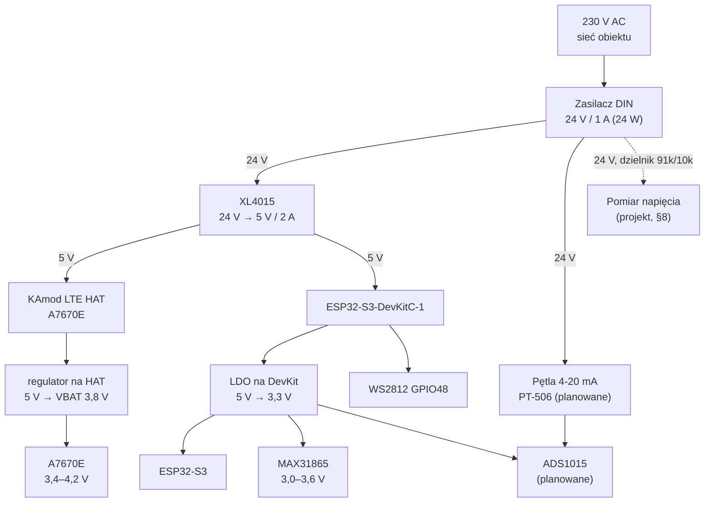
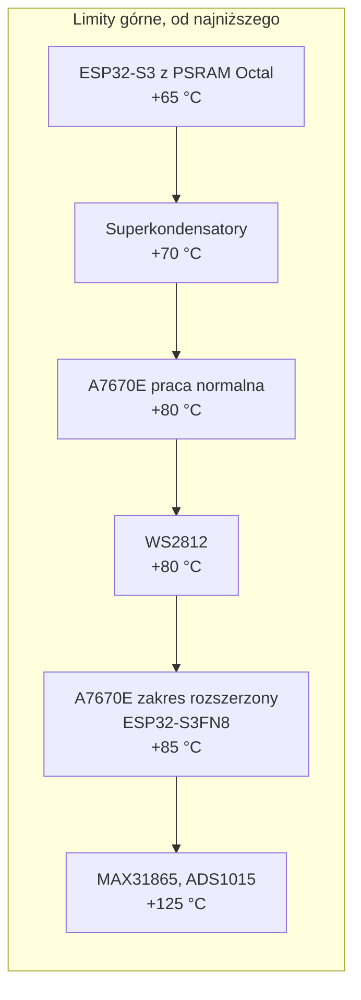

# Budżet energetyczny i tryby zasilania

Analiza poboru mocy gatewaya ESP32-S3 + A7670E, doboru zasilania, podtrzymania przy zaniku 230 V, detekcji zaniku zasilania oraz zasadności trybów uśpienia.

**Status dokumentu:** analiza obliczeniowa na podstawie kart katalogowych i kodu w repozytorium. **Żadna liczba w tym dokumencie nie pochodzi z pomiaru na fizycznym sprzęcie.** Pozycje wymagające pomiaru są zebrane w [§12](#12-do-zmierzenia-na-stanowisku) i oznaczone w tabelach jako `[M]`.

**Konwencja oznaczeń:**

| Znacznik | Znaczenie |
|---|---|
| `[DS]` | wartość z karty katalogowej producenta (źródło w [§14](#14-źródła)) |
| `[OBL]` | wartość wyliczona z `[DS]` — wzór podany w miejscu użycia |
| `[EST]` | oszacowanie inżynierskie, nie ma go w żadnej karcie katalogowej |
| `[M]` | do zmierzenia na stanowisku; obecna wartość to `[EST]` |

---

## 1. Wnioski — skrót

| # | Pytanie z zakresu | Werdykt |
|---|---|---|
| 1 | Bilans prądowy per faza | Średnia **~110 mA @ 5 V ≈ 0,55 W**; szczyt transmisji **1,7–2,1 A @ 5 V** przez <1 ms. Dominuje modem: ~30 mA w spoczynku, 440–530 mA przy nadawaniu. Zob. [§4](#4-bilans-prądowy--per-komponent) i [§5](#5-bilans-prądowy--per-faza-pracy). |
| 2 | Czy łańcuch 24 V 1 A → XL4015 wystarcza | **Średnia z ogromnym zapasem (~29 mA z 1000 mA). Szczyt jest na granicy modułu XL4015 2 A i w pesymistycznym wariancie ją przekracza.** Wymagane: bulk ≥1000 µF przy wejściu 5 V HAT-a. Rekomendacja: moduł przetwornicy o deklarowanym prądzie ≥3 A. Zob. [§6](#6-dobór-zasilania--weryfikacja-obliczeniowa). |
| 3 | Podtrzymanie przy zaniku 230 V | Sam kondensator wyjściowy zasilacza daje **100–500 ms** — starczy na zapis stanu, nie na wysyłkę. Depesza HTTPS przy ciepłym łączu wymaga ~12 J; realizowalne bankiem superkondensatorów 2× 10 F z przetwornicą boost (**50–86 PLN**). **Ale depesza z urządzenia nie może być podstawowym wykrywaczem** — tym musi być backend, [§7.7](#77-zastrzeżenie-które-unieważnia-część-powyższego). Zob. [§7](#7-podtrzymanie-przy-zaniku-230-v). |
| 4 | Detekcja zaniku i pomiar napięcia | Dzielnik 91 k/10 k z szyny **24 V** (nie 5 V) na kanał ADS1015 + **komparator sprzętowy ALERT/RDY** na przerwanie GPIO. Progi i histereza w [§8](#8-detekcja-zaniku-zasilania-i-pomiar-napięcia). **Ścieżka zdarzeń jest dziś zablokowana błędem w [`TelemetryPayload.cpp:92`](../../../firmware/lib/TelemetryPayload/src/TelemetryPayload.cpp#L92)** — zob. [§11](#11-usterki-blokujące-znalezione-przy-okazji). |
| 5 | Czy warto wprowadzać tryby uśpienia | **Nie — przy zasilaniu sieciowym.** Oszczędność ~0,13 W (24% poboru) nie uzasadnia ryzyka. Ale problem, który uśpienie miało rozwiązać, jest realny i ma inną przyczynę: **transfer SIM ~268 MB/mies. zamiast zakładanych 50–200 MB**, przez pełny handshake TLS w każdym cyklu. Zob. [§9](#9-tryby-uśpienia--werdykt). |
| 6 | Punkty bez zasilania sieciowego | **Nie da się bez przebudowy.** Obecna architektura zużywa 14,4 Wh/dobę — ogniwo 18650 starcza na **18 godzin**. Po przebudowie: transmisja co 2–3 h z 2× D LiSOCl₂ na 2–3 lata. Zob. [§10](#10-punkty-pomiarowe-bez-zasilania-sieciowego). |
| 7 | Temperatura pracy | **Wąskim gardłem jest wariant modułu ESP32-S3 na DevKitC-1.** Jeśli jest to wersja z PSRAM Octal (`R8`/`R8V`/`R16V`), limit otoczenia to **+65 °C** — poniżej realnego wnętrza metalowej szafy w lecie. Zob. [§13](#13-temperatura-pracy). |

---

## 2. Stan faktyczny — co jest w kodzie

Punkt wyjścia analizy. Wszystko poniżej zweryfikowane w drzewie repozytorium na commicie `43116cd`.

| Fakt | Dowód w kodzie |
|---|---|
| Nie ma **żadnego** trybu uśpienia — ani ESP32, ani modemu | brak `esp_sleep_*`, `esp_light_sleep_*`, `AT+CSCLK` w całym `firmware/` |
| Nie ma Wi-Fi ani Bluetooth — radio SoC nigdy nie jest inicjalizowane | brak `WiFi`, `esp_wifi_*`, `btStart` w całym `firmware/` |
| `loop()` kręci się w kółko z `delay(10)` | [`main.cpp:228`](../../../firmware/src/main.cpp#L228) |
| Modem po `powerOn()` zostaje włączony na stałe | [`main.cpp:64`](../../../firmware/src/main.cpp#L64); brak wywołania wyłączającego |
| Próbkowanie co 15 s | `SAMPLE_INTERVAL_MS`, [`Config.h:61`](../../../firmware/include/Config.h#L61) |
| Transmisja co ~60 s (4 okna × 15 s) | `WINDOWS_PER_BATCH`, [`TelemetryPayload.h:34`](../../../firmware/lib/TelemetryPayload/src/TelemetryPayload.h#L34); [`TelemetryPayload.cpp:60`](../../../firmware/lib/TelemetryPayload/src/TelemetryPayload.cpp#L60) |
| Bufor RAM ≈ 12 minut (48 okien × 15 s) | `RETAIN_WINDOWS_MAX = 4 × 12`, [`TelemetryPayload.h:35`](../../../firmware/lib/TelemetryPayload/src/TelemetryPayload.h#L35) |
| **Połączenie TLS jest zrywane i budowane od nowa przy każdej wysyłce** | `http_->stop()` przed i po żądaniu, [`TelemetryHttpClient.cpp:23,47`](../../../firmware/lib/TelemetryHttpClient/src/TelemetryHttpClient.cpp#L23) — `connectionKeepAlive()` w linii 25 jest przez to bez efektu |
| Kod błędu `POWER_LOW` istnieje w rejestrze, ale **nic go nie ustawia** | [`sensor_registry.yaml`](../../../sensor_registry.yaml); brak `POWER_LOW` w `firmware/` |
| Nie ma pomiaru napięcia zasilania | brak `analogRead`, brak sterownika ADC, brak ADS1015 w `firmware/lib/` |
| `MODEM_SIGNAL_WEAK` też nigdy nie jest ustawiany | `getSignalQuality()` wołane raz przy starcie i tylko logowane, [`ModemLink.cpp:105`](../../../firmware/lib/ModemLink/src/ModemLink.cpp#L105) |

### 2.1. Rozbieżności między briefem B-11 a stanem repozytorium

Brief zakłada kilka rzeczy, których w repozytorium nie ma. Nie zgaduję ich — zapisuję rozbieżność:

| Założenie briefu | Stan faktyczny |
|---|---|
| „ADS1015 ma **trzy wolne kanały** (AIN1–3 wg `01_hardware.md` §3)" | [`01_hardware.md` §3](./01_hardware.md) **nie wymienia ADS1015**. Wymienia jeden pin draft: GPIO1 / ADC1_CH0 → PT-506 przez rezystor 250 Ω. ADS1015 nie występuje nigdzie w `firmware/` ani w `docs/technical/`. |
| Rezystor pomiarowy pętli 4-20 mA: 136 Ω (2× 68 Ω) wg briefu B-05 | `Config.h` nie zawiera **żadnego** rezystora pomiarowego; `01_hardware.md` §6 mówi o 250 Ω |
| Zasilacz 24 V **1 A**, przetwornica **XL4015** | Nie występują w żadnym pliku repozytorium poza samym briefem. Przyjmuję je jako dane wejściowe od zamawiającego i tak je traktuję w [§6](#6-dobór-zasilania--weryfikacja-obliczeniowa). |

**Konsekwencja dla projektu z [§8](#8-detekcja-zaniku-zasilania-i-pomiar-napięcia):** projektuję tor pomiaru napięcia **pod ADS1015**, bo taka jest intencja briefu i taki układ jest w planie schematu w B-05, ale zapisuję jawnie, że układu nie ma jeszcze ani w kodzie, ani w mapie sprzętowej. Podaję też wariant awaryjny na wbudowanym ADC ESP32-S3, gdyby ADS1015 nie trafił do BOM.

**Nie przypisuję numeru GPIO dla linii ALERT/RDY.** Źródłem prawdy dla pinów jest [`01_hardware.md`](./01_hardware.md) i [`Config.h`](../../../firmware/include/Config.h) — pinów się tu nie zgaduje. Wymaganie do spełnienia przy okablowaniu: **jeden wolny GPIO zdolny do obsługi przerwania**, przypisanie i weryfikacja na płytce przy aktualizacji mapy sprzętowej (zakres B-05).

---

## 3. Drzewo zasilania



Trzy uwagi do drzewa, które mają wpływ na liczby w dalszej części:

1. **Pętla 4-20 mA wisi bezpośrednio na 24 V**, nie za przetwornicą. Jej pobór (do 20 mA × 24 V = **0,48 W**) obciąża zasilacz, ale **nie** obciąża XL4015. To istotne, bo przy pełnym wysterowaniu jest to pozycja większa niż cała reszta układu.
2. **LDO na DevKitC-1 jest regulatorem liniowym.** Prąd wejściowy ≈ prąd wyjściowy, a różnica napięć (5 V − 3,3 V = 1,7 V) zamienia się w ciepło **wewnątrz szafy**. Przy 55 mA to 0,09 W — nieistotne energetycznie, istotne przy ocenie, czy da się schłodzić szafę. Zob. [§13](#13-temperatura-pracy).
3. **Nie wiadomo, czy regulator na HAT-cie to przetwornica impulsowa, czy LDO.** Dokumentacja producenta tego nie podaje ([§14](#14-źródła)). Różnica jest krytyczna dla doboru XL4015 — liczę oba warianty w [§6.2](#62-szczyt--dwa-warianty-i-oba-trzeba-wytrzymać).

---

## 4. Bilans prądowy — per komponent

Wartości surowe z kart katalogowych, na szynie, na której dany układ faktycznie pracuje. Przeliczenie na wspólną szynę 5 V jest w [§5](#5-bilans-prądowy--per-faza-pracy).

### 4.1. ESP32-S3 (szyna 3,3 V)

Radio Wi-Fi/BT nigdy nie jest włączane ([§2](#2-stan-faktyczny--co-jest-w-kodzie)), więc obowiązuje tabela dla trybu Modem-sleep — nie tabele RF. Kolumna „Typ2" (wszystkie zegary peryferiów włączone) jako wariant pesymistyczny.

| Stan | Częstotliwość | Typ1 (mA) | Typ2 (mA) | Kiedy występuje w tym firmware |
|---|---|---|---|---|
| WAITI (rdzenie bezczynne) | 240 MHz | 32,9 | 47,6 `[DS]` | wnętrze `delay(10)` — dominujący stan `loop()` |
| 1 rdzeń aktywny, drugi bezczynny | 240 MHz | 51,2 | 65,9 `[DS]` | budowa JSON, SPI, obsługa UART modemu |
| 2 rdzenie aktywne, dostęp 128-bit | 240 MHz | 91,7 | 107,9 `[DS]` | nie występuje (kod jednowątkowy na rdzeniu Arduino) |
| Light-sleep | — | 0,240 `[DS]` | — | nieużywany |
| Deep-sleep (pamięć RTC włączona) | — | 0,007 `[DS]` | — | nieużywany |

Realny stan pracy leży między WAITI a jednym rdzeniem aktywnym. **Przyjmuję do bilansu 55 mA `[EST][M]`** jako średnią z zakresu 40–70 mA na szynie 5 V dla całej płytki DevKitC-1, co uwzględnia mostek USB-UART, LED zasilania i prąd spoczynkowy LDO — te trzy pozycje nie są w karcie katalogowej SoC i są głównym powodem, dla którego ta liczba trafia na listę do pomiaru.

### 4.2. Modem A7670E (szyna VBAT 3,8 V)

| Stan | Prąd | Uwaga |
|---|---|---|
| LTE-FDD B1 / B3 @ 10 MHz, 23 dBm | **600 mA** typ. `[DS]` | B3 = 1800 MHz, B1 = 2100 MHz — podstawowe pasma LTE w PL |
| LTE-FDD B20 @ 10 MHz, 23 dBm | 540 mA typ. `[DS]` | 800 MHz — najczęstsze pasmo zasięgowe |
| LTE-FDD B8 @ 10 MHz, 23 dBm | 520 mA typ. `[DS]` | 900 MHz |
| LTE-FDD B7 @ 10 MHz, 23 dBm | 540 mA typ. `[DS]` | 2600 MHz |
| GPRS EGSM900 (2Rx, 4Tx) @ PL#5 | 630 mA typ. `[DS]` | średnia przy fallbacku na 2G |
| **Szczyt chwilowy (GSM TX)** | **2 A** `[DS]` | burst ~577 µs w ramce 4,615 ms |
| Idle (zarejestrowany, brak transmisji) | **TBD w karcie katalogowej** | producent nie podaje — zob. niżej |
| Sleep (`AT+CFUN=0`, `AT+CSCLK=1`) | **TBD w karcie katalogowej** | producent nie podaje |
| Power-off (prąd upływu) | 20 µA typ. `[DS]` | |

**To jest luka w danych, nie przeoczenie.** Tabela 46 karty katalogowej SIMCom ma w polach „GSM sleep/idle mode" i „LTE sleep/idle mode" wpisane dosłownie `TBD`. Ponieważ całe zużycie dobowe jest zdominowane przez stan idle (98% czasu), przyjmuję wartość producenta płytki: **~30 mA `[EST][M]`** na wejściu 5 V HAT-a przy aktywnym połączeniu LTE bez transmisji (wiki KamamiLabs). Wartość spotykana dla modułów A7670 w trybie **sleep** z DRX to ~3,8 mA, ale ten tryb wymaga `AT+CSCLK=1` i sterowania linią DTR — czego firmware nie robi i co jest przedmiotem werdyktu w [§9](#9-tryby-uśpienia--werdykt).

### 4.3. MAX31865 (szyna 3,3 V)

| Stan | Prąd | Źródło |
|---|---|---|
| Bias off, ADC off | **1,5 mA** typ. / 3 mA max `[DS]` | karta katalogowa, IDD Shutdown |
| Bias on, aktywna konwersja | 2,0 mA typ. / 3,5 mA max `[DS]` | IDD |
| Prąd obciążenia wyjścia VBIAS | ~3,7 mA `[OBL]` | `V_BIAS / (R_REF + R_RTD)` = 2,0 V / (430 Ω + ~107 Ω) |

Zakresy z `[DS]`: `V_BIAS` = 1,95–2,06 V, `R_REF` = 430 Ω z [`PT100Sensor.h:22`](../../../firmware/lib/Sensor/src/PT100Sensor.h#L22), `R_RTD` ≈ 107 Ω dla PT100 przy 18 °C. Prąd biasu jest **dodatkowy** względem IDD (nota 6 karty katalogowej: „supply current with no load on the bias pin").

**Cykl pracy.** Biblioteka `Adafruit_MAX31865` po `begin()` zostawia bias wyłączony i auto-konwersję wyłączoną, a `readRTD()` włącza bias na `10 ms + 65 ms`, po czym go wyłącza. Przy `SAMPLE_INTERVAL_MS = 15000` daje to cykl pracy **~0,53%**:

```
średnia = 1,5 mA × 0,9947 + (2,0 + 3,7) mA × 0,0053 = 1,52 mA
```

**Wniosek, który ma znaczenie dopiero w [§10](#10-punkty-pomiarowe-bez-zasilania-sieciowego):** sam pomiar temperatury nie kosztuje praktycznie nic. Kosztuje **bezczynny MAX31865 — 1,5 mA non stop**. Układ nie ma niższego stanu; jedyny sposób na zejście poniżej to odcięcie mu VDD. Przy zasilaniu sieciowym nieistotne (1,4% budżetu), przy bateryjnym — zabójcze (119 mWh/dobę, czyli więcej niż cały dzienny budżet w scenariuszu bateryjnym).

### 4.4. ADS1015 (planowany, szyna 3,3 V)

| Stan | Prąd | Źródło |
|---|---|---|
| Konwersja ciągła | 150 µA typ. / 300 µA max `[DS]` | |
| Power-down | 0,5 µA typ. / 5 µA max `[DS]` | |

Nieistotny w bilansie sieciowym (0,14%). Istotny jako **nośnik funkcji** z [§8](#8-detekcja-zaniku-zasilania-i-pomiar-napięcia) — ma wbudowany komparator z wyjściem ALERT/RDY, co pozwala wykryć zanik zasilania sprzętowo zamiast odpytywaniem.

### 4.5. Pozostałe

| Pozycja | Prąd | Źródło |
|---|---|---|
| WS2812 (GPIO48), LED zgaszony | ~0,6–1,0 mA `[EST]` | prąd spoczynkowy sterownika; oscylator pracuje zawsze |
| WS2812, błysk zielony przy pełnej jasności | ~20 mA `[EST]` przez 80–120 ms | `setBrightness(255)`, [`StatusLed.cpp:24`](../../../firmware/lib/StatusLed/src/StatusLed.cpp#L24) |
| Pętla 4-20 mA PT-506 (planowana) | 4–20 mA z **szyny 24 V** | 0,10–0,48 W; nie obciąża XL4015 |
| Dzielnik pomiarowy 91 k/10 k (projekt, §8) | 0,24 mA z szyny 24 V | 5,8 mW |

---

## 5. Bilans prądowy — per faza pracy

### 5.1. Przeliczenie modemu na szynę 5 V

Karta katalogowa podaje prądy na VBAT (3,8 V). Na szynę 5 V przeliczam przez bilans mocy regulatora na HAT-cie:

```
I_5V = (V_BAT × I_BAT) / (5 V × η),   η = 0,90 [EST]
```

| Stan modemu | I na VBAT `[DS]` | I na 5 V `[OBL]` |
|---|---|---|
| LTE-FDD B1/B3 @ 23 dBm | 600 mA | **507 mA** |
| LTE-FDD B20 @ 23 dBm | 540 mA | 456 mA |
| LTE-FDD B8 @ 23 dBm | 520 mA | 439 mA |
| GPRS EGSM900, średnia | 630 mA | 532 mA |
| **GSM, szczyt chwilowy** | **2000 mA** | **1689 mA** |

Sprawdzenie wiarygodności: producent HAT-a wymaga zasilania 5 V o wydajności **min. 2 A**. Mój wynik 1,69 A + margines na resztę układu i sprawność regulatora daje dokładnie ten rząd wielkości — obliczenie odtwarza wymaganie producenta, więc model jest sensowny.

### 5.2. Fazy pracy — prąd na szynie 5 V

| Faza | ESP32-S3 | MAX31865 | WS2812 | Modem | **Razem @ 5 V** | Czas trwania |
|---|---|---|---|---|---|---|
| **A. Bezczynność** (między transmisjami) | 55 `[EST]` | 1,5 | 1,0 | 30 `[EST]` | **~88 mA (0,44 W)** | ~54 s z każdych 60 s |
| **B. Próbkowanie PT100** | 66 | 5,7 | 1,0 | 30 | ~103 mA | 80 ms co 15 s |
| **C. Próbkowanie ADS1015** (planowane) | 66 | 1,5 | 1,0 | 30 | ~99 mA | <5 ms co 15 s |
| **D. Rejestracja w sieci LTE** | 55 | 1,5 | 1,0 | 150–250 `[EST]` | **~210–310 mA** | 15–110 s, przy starcie i po utracie łącza |
| **E. Transmisja HTTPS, LTE** | 55 | 1,5 | 1,0 | 150–507 | **~210–565 mA** | 2–6 s co 60 s |
| **F. Transmisja, fallback GPRS/EDGE** | 55 | 1,5 | 1,0 | 532 | ~590 mA | jw., przy braku LTE |
| **G. Szczyt nadawania GSM** | 55 | 1,5 | 1,0 | 1689 | **~1,75 A** | 577 µs w ramce 4,615 ms |

Zakres w fazach D i E odzwierciedla realną zmienność: modem nadaje z pełną mocą 23 dBm tylko na skraju zasięgu; w dobrych warunkach sterowanie mocą schodzi znacznie niżej, a i tak nadaje przez ułamek okna transmisji (reszta to oczekiwanie na odpowiedź serwera).

### 5.3. Średnia w cyklu 60 s

| Wariant | Wyliczenie | Średnia @ 5 V | Moc |
|---|---|---|---|
| Realistyczny (dobry zasięg) | (54 s × 88 mA + 6 s × 300 mA) / 60 s | **109 mA** | **0,54 W** |
| Pesymistyczny (skraj zasięgu, TX pełną mocą) | (54 s × 114 mA + 6 s × 565 mA) / 60 s | **159 mA** | **0,80 W** |

Do dalszych obliczeń przyjmuję **0,60 W** jako wartość projektową (realistyczny + zapas).

### 5.4. Obciążenie zasilacza 24 V

| Pozycja | Pobór z 24 V |
|---|---|
| Układ elektroniczny przez XL4015 (0,60 W przy η = 0,85) | **29 mA** (0,71 W) |
| Pętla 4-20 mA PT-506 przy pełnym wysterowaniu | 20 mA (0,48 W) |
| Dzielnik pomiarowy z §8 | 0,24 mA (0,006 W) |
| **Razem, średnio** | **~50 mA z 1000 mA dostępnych (5%)** |

Uwaga do sprawności: XL4015 to przetwornica **asynchroniczna**, z diodą Schottky'ego w gałęzi zwrotnej. Reklamowane „do 96%" dotyczy małych przełożeń napięcia. Przy 24 V → 5 V współczynnik wypełnienia wynosi ~21%, więc dioda przewodzi przez ~79% cyklu i sam jej spadek (~0,5 V przy 5 V wyjściowych) kosztuje ~8 punktów procentowych. **Przyjmuję η = 0,85 `[EST]`** — i to jest wartość ostrożna, nie optymistyczna.

---

## 6. Dobór zasilania — weryfikacja obliczeniowa

Pytanie z briefu: czy łańcuch **zasilacz 24 V / 1 A → XL4015 24→5 V / 2 A** wystarcza w szczycie. Rozkładam je na trzy niezależne pytania, bo odpowiedzi są różne.

### 6.1. Średnia — z zapasem, sprawa zamknięta

| Poziom | Obciążenie | Dostępne | Wykorzystanie |
|---|---|---|---|
| Zasilacz 24 V | 50 mA (1,2 W) | 1000 mA (24 W) | **5%** |
| XL4015 (wyjście 5 V) | 109 mA | 2000 mA | **5,5%** |

Zapas jest tak duży, że pozostawia miejsce na drugi i trzeci czujnik oraz na pętle 4-20 mA bez zmiany zasilacza.

### 6.2. Szczyt — dwa warianty i oba trzeba wytrzymać

Wynik zależy od tego, czym jest regulator na płytce KAmod — a tego producent nie podaje. Liczę oba przypadki:

| Wariant regulatora na HAT | Prąd na 5 V przy szczycie 2 A / VBAT | Razem z resztą układu | Werdykt wobec modułu 2 A |
|---|---|---|---|
| Przetwornica impulsowa, η = 0,90 | 1,69 A `[OBL]` | **1,75 A** | na granicy — 12% zapasu |
| LDO (prąd przechodzi 1:1) | 2,00 A | **2,06 A** | **przekracza nominał modułu** |

**Werdykt:** deklarowany prąd 2 A modułu XL4015 nie daje wiarygodnego zapasu. Sam układ scalony XL4015 jest specyfikowany na 5 A, więc ograniczeniem jest konkretny moduł — dławik (prąd nasycenia), dioda i termika. **Rekomendacja: moduł o deklarowanym prądzie ciągłym ≥3 A, albo weryfikacja prądu nasycenia dławika w konkretnym egzemplarzu.**

**Ale najważniejsze zastrzeżenie brzmi inaczej: szczytu 2 A w ogóle nie ma na LTE.** Burst 577 µs to zjawisko GSM/GPRS (TDMA). LTE Cat 1 nadaje w sposób ciągły, z płynnym poborem 507 mA @ 5 V. Szczyt 2 A pojawia się **tylko przy fallbacku na 2G**, czyli w lokalizacji o słabym pokryciu LTE — a więc dokładnie tam, gdzie i tak zaczynają się problemy. Traktuję to jako warunek brzegowy do wytrzymania, nie jako stan normalny.

Zasilacz 24 V nawet w szczycie nie jest problemem: 8,75 W na wyjściu 5 V + 1,54 W strat na przetwornicy to **429 mA z szyny 24 V** `[OBL]` — 43% jego wydajności.

### 6.3. Pojemność bufora — tu jest realne ryzyko

Przetwornica pracująca na 180 kHz ma pasmo pętli regulacji rzędu pojedynczych kiloherców. Skok obciążenia o 1,2 A w 577 µs jest **szybszy niż zdolność regulacji** — nadąży za nim wyłącznie kondensator. Ładunek, który musi dostarczyć:

```
ΔQ = (I_szczyt − I_średni_w_ramce) × t_burst
```

| Scenariusz | ΔQ | C przy ΔV = 0,25 V | C przy ΔV = 0,5 V |
|---|---|---|---|
| GSM, 1 slot TX (0,577 ms) | 0,67 mC | 2670 µF | 1335 µF |
| GPRS multislot, 4 sloty TX (2,31 ms) | 2,67 mC | 10 700 µF | 5340 µF |

Ile spadku wolno? Ogranicznikiem jest **LDO na DevKitC-1**, nie modem — modem ma własny bufor na VBAT. Typowy AMS1117-3.3 wymaga ~0,5–0,9 V nadwyżki przy tym prądzie, więc szyna 5 V nie może zejść poniżej ~4,2 V. **Budżet: ΔV ≤ 0,5 V.**

**Rekomendacja:**

| Element | Wartość | Uzasadnienie |
|---|---|---|
| Kondensator bulk przy wejściu 5 V HAT-a | 2× 2200 µF / 10 V low-ESR (równolegle) | pokrywa GPRS multislot przy ΔV = 0,5 V; równoległe łączenie połowi ESR |
| Wymaganie na ESR | ≤ 50 mΩ łącznie | przy 1,69 A daje 84 mV spadku `[OBL]`, mieści się w budżecie |
| Kondensator ceramiczny obok | 100 nF + 1 µF | filtracja HF, zgodnie z zaleceniem SIMCom |
| Okablowanie 5 V do HAT-a | możliwie krótkie, przekrój ≥0,5 mm² | 1,7 A przez cienki przewód to kolejne dziesiątki mV spadku |

Producent modemu wymaga **≥300 µF na VBAT** przy zasilaniu zdolnym do 2 A, albo **≥600 µF**, jeśli źródło 2 A nie zapewnia. Ta pojemność jest po stronie HAT-a i zakładam, że producent ją zamontował — **do weryfikacji wzrokowej na płytce** ([§12](#12-do-zmierzenia-na-stanowisku)).

### 6.4. Tętnienia i termika

| Parametr | Wartość | Ocena |
|---|---|---|
| Tętnienia XL4015 | ~50 mV `[EST]`, dane modułu | Nieistotne. Modem widzi je przez własny regulator, ESP32 przez LDO (PSRR >60 dB). Dla ADS1015 w torze pomiaru napięcia — bez znaczenia, bo mierzy szynę 24 V, nie 5 V. |
| Straty XL4015, średnio | 0,10 W `[OBL]` | bez radiatora, bez znaczenia |
| Straty XL4015, ciągłe TX LTE | 0,50 W `[OBL]` | bez radiatora OK, ale w gorącej szafie warto rozważyć — zob. [§13](#13-temperatura-pracy) |
| Straty LDO na DevKitC-1 | 1,7 V × 57 mA = **0,10 W** `[OBL]` | ciepło oddawane wewnątrz szafy |
| Całkowita moc rozpraszana w szafie (bez zasilacza DIN) | ~0,8 W średnio `[OBL]` | zob. [§13](#13-temperatura-pracy) |

**Werdykt §6:** łańcuch jest **wystarczający pod względem energii i nadmiarowy pod względem średniego prądu**, ale jego poprawne działanie zależy od dwóch rzeczy, których w briefie nie ma i których nie widać w BOM: **pojemności bufora przy wejściu 5 V modemu** i **rzeczywistej obciążalności konkretnego egzemplarza modułu XL4015**. Bez nich układ może działać na biurku i przestać w terenie, przy pierwszym fallbacku na 2G.

---

## 7. Podtrzymanie przy zaniku 230 V

### 7.1. Ile czasu naprawdę potrzeba

Sekwencja od zaniku napięcia do bezpiecznego stanu:

| Krok | Czas | Uzasadnienie |
|---|---|---|
| 1. Wykrycie zaniku | 10–50 ms | komparator sprzętowy ADS1015 + debounce, [§8](#8-detekcja-zaniku-zasilania-i-pomiar-napięcia) |
| 2. Zapis stanu do NVS | ~200–300 ms `[EST]` | licznik restartów, znacznik „zanik zasilania", ostatni timestamp |
| 3. Zbudowanie i wysłanie depeszy HTTPS | **2–6 s przy ciepłym łączu, 15–30 s przy zimnym** | pełny handshake TLS przy każdej wysyłce, [`TelemetryHttpClient.cpp:23`](../../../firmware/lib/TelemetryHttpClient/src/TelemetryHttpClient.cpp#L23) |

Energia:

| Cel | Wymagana energia |
|---|---|
| Sam zapis stanu (krok 1–2) | **0,13 J** `[OBL]` |
| Zapis + jedna próba POST przy ciepłym łączu (6 s @ 2,0 W) | **12 J** `[OBL]` |
| Zapis + POST wymagający ponownej rejestracji (30 s @ 1,2 W) | **36 J** `[OBL]` |

### 7.2. Co daje sam układ, bez dokładania niczego

Kondensator wyjściowy zasilacza DIN podtrzymuje szynę 24 V, dopóki XL4015 ma z czego regulować (zejdzie do ~7 V wejściowych):

| Pojemność wyjściowa zasilacza `[EST]` | Energia 24 V → 15 V | Czas przy 0,71 W |
|---|---|---|
| 470 µF | 0,082 J | **116 ms** |
| 1000 µF | 0,176 J | **247 ms** |
| 2200 µF | 0,386 J | **544 ms** |

**Wniosek:** darmowe podtrzymanie to rząd **100–500 ms**. To wystarcza na zapis stanu do NVS i **na nic więcej**. Depesza HTTPS jest poza zasięgiem o dwa rzędy wielkości.

### 7.3. Dlaczego zwykłe kondensatory elektrolityczne odpadają

Energia użyteczna z szyny 5 V przy dopuszczalnym zejściu do 4,3 V:

| Element | Energia użyteczna | Czas przy 2,0 W (transmisja) |
|---|---|---|
| 4700 µF | 0,015 J | 8 ms |
| 47 000 µF (10× 4700 µF) | 0,153 J | 76 ms |

Żeby uzyskać 12 J na szynie 5 V przy ΔV = 0,7 V, potrzeba **3,7 F**. Elektrolity odpadają nie „trochę", tylko o czynnik ~800. **Sprawa rozstrzygnięta arytmetycznie — nie ma o czym dyskutować.**

### 7.4. Warianty realne

#### Wariant A — bank superkondensatorów na szynie 5 V

Dwa kondensatory 2,7 V w szereg dają 5,4 V napięcia znamionowego przy pojemności zastępczej `C/2`.

| Konfiguracja | C zastępcze | Bez boosta (5,0→4,3 V) | Z przetwornicą boost (5,0→2,0 V, η = 0,88) |
|---|---|---|---|
| 2× 1 F / 2,7 V | 0,5 F | 1,6 J → 0,8 s @2 W | 4,6 J → **2 s** @2 W |
| **2× 10 F / 2,7 V** | 5 F | 16,3 J → 8,1 s @2 W | **46 J → 23 s** @2 W |
| 2× 22 F / 2,7 V | 11 F | 35,8 J → 17,9 s @2 W | 102 J → 51 s @2 W |

Przetwornica boost zmienia wszystko: bez niej wykorzystujemy 26% zgromadzonej energii (bo schodzimy tylko z 5,0 do 4,3 V), z nią — 84%. **To najtańsze 3× w całym dokumencie.**

Zastrzeżenia projektowe, bez których wariant nie zadziała:

| Problem | Rozwiązanie |
|---|---|
| Ładowanie 5 F wygląda dla przetwornicy jak zwarcie przy każdym starcie | rezystor ograniczający + bocznikujący MOSFET po naładowaniu, albo dławik/PTC; nie wolno wpiąć banku bezpośrednio |
| Nierówny rozdział napięcia między ogniwami w szeregu | pasywny balanser (2× rezystor równolegle do ogniw) lub aktywny; bez tego jedno ogniwo pracuje powyżej 2,7 V i degraduje się |
| Bank musi się rozładowywać w układ, a nie z powrotem w przetwornicę | dioda Schottky'ego albo ideal-diode ORing |
| Prąd upływu superkondensatorów (setki µA – mA) | dodatkowe stałe obciążenie, akceptowalne przy zasilaniu sieciowym |
| **Zakres temperatury: typowo −25…+70 °C** | wąskie gardło termiczne — zob. [§13](#13-temperatura-pracy); wybierać serię 85 °C |

#### Wariant B — zasilacz buforowy DIN z akumulatorem

Zamiana zasilacza 24 V na buforowy 13,8 V z ładowarką i akumulatorem AGM (np. klasa Mean Well DRC-40A). Podtrzymanie liczone w **godzinach**, nie sekundach — urządzenie nie tylko wysyła depeszę, ale **dalej monitoruje obiekt w czasie awarii zasilania**, co jest funkcją produktową, a nie ratunkową.

Konsekwencje: XL4015 pracuje z 13,8 V zamiast 24 V (wyższa sprawność, ~90%); pętla 4-20 mA dostaje 13,8 V zamiast 24 V — **do sprawdzenia, czy przetwornik PT-506 to zaakceptuje** przy spadku na rezystorze pomiarowym; akumulator AGM jest materiałem eksploatacyjnym (2–3 lata, krócej w gorącej szafie) i generuje koszt serwisowy.

#### Wariant C — akumulator Li-ion / LiFePO₄ z ładowarką

Odrzucony jako rozwiązanie domyślne. Li-ion w metalowej szafie latem to ryzyko pożarowe i szybka degradacja; ładowania poniżej 0 °C nie wolno prowadzić. LiFePO₄ znosi warunki lepiej (rozładowanie −20…+60 °C), ale nadal nie w 65 °C i nadal wymaga BMS-a oraz układu ładowania. Przy potrzebie liczonej w sekundach jest to nadmiarowe; przy potrzebie liczonej w godzinach **wariant B jest prostszy i tańszy w serwisie**.

### 7.5. Rekomendacja

**Dwa poziomy, wybierane per obiekt:**

| Poziom | Kiedy | Rozwiązanie | Co gwarantuje |
|---|---|---|---|
| **Podstawowy (domyślny, w każdym urządzeniu)** | zawsze | bank 2× 10 F / 2,7 V + boost 5 V + ORing + soft-start | zapis stanu **gwarantowany**, jedna próba depeszy HTTPS **przy ciepłym łączu** |
| **Rozszerzony (opcja)** | obiekty krytyczne, gdzie monitoring musi działać w czasie awarii zasilania | zasilacz buforowy DIN + akumulator | godziny pracy, depesza gwarantowana, „powrót zasilania" wykrywalny bez restartu |

### 7.6. BOM podtrzymania

Ceny netto, rynek polski, orientacyjnie na 2026 — **do potwierdzenia ofertą przed zamówieniem**, nie do wklejenia do wyceny.

| Poziom | Pozycja | Ilość | Cena jedn. | Razem |
|---|---|---|---|---|
| Podstawowy | Superkondensator 10 F / 2,7 V | 2 | 12–20 PLN | 24–40 PLN |
| Podstawowy | Moduł boost 5 V (np. na MT3608 / TPS61088) | 1 | 8–20 PLN | 8–20 PLN |
| Podstawowy | Dioda Schottky'ego + rezystory balansujące + soft-start | 1 kpl. | ~10 PLN | ~10 PLN |
| Podstawowy | Kondensatory bulk 2200 µF / 10 V low-ESR (z [§6.3](#63-pojemność-bufora--tu-jest-realne-ryzyko)) | 2 | 4–8 PLN | 8–16 PLN |
| | **Razem poziom podstawowy** | | | **50–86 PLN** |
| Rozszerzony | Zasilacz buforowy DIN 13,8 V (klasa DRC-40A) | 1 | 120–170 PLN | 120–170 PLN |
| Rozszerzony | Akumulator AGM 12 V / 7 Ah | 1 | 70–100 PLN | 70–100 PLN |
| | **Razem poziom rozszerzony** (zamiast zasilacza 24 V) | | | **190–270 PLN** |

Odniesienie: [`01_plan_biznesowy.md` §4.2.2](../../business/01_plan_biznesowy.md) wycenia sprzęt na obiekt na 1400–3500 PLN w wariancie MVP. Poziom podstawowy to **1,5–6% BOM** — nie jest to pozycja, o którą warto się spierać.

### 7.7. Zastrzeżenie, które unieważnia część powyższego

**Depesza „zanik zasilania" wysyłana z urządzenia nie może być podstawowym mechanizmem wykrywania zaniku zasilania.** Powody wynikają z liczb powyżej:

- przy zimnym łączu wysyłka kosztuje ~36 J, czyli bank 2× 22 F i przetwornicę boost — i nadal jest to loteria, bo rejestracja w sieci LTE bywa dłuższa niż 30 s ([`ModemLink.cpp:84,116`](../../../firmware/lib/ModemLink/src/ModemLink.cpp#L84) dopuszczają 60 s + 30 s);
- zanik zasilania obiektu bardzo często idzie w parze z zanikiem zasilania stacji bazowej albo z awarią, która i tak zrywa łącze.

**Podstawowym wykrywaczem musi być backend**, który zauważa brak pakietów. Przy transmisji co 60 s trzy brakujące pakiety to alarm po **~3 minutach** — mechanizm niezawodny, niezależny od energii w urządzeniu i zerowy kosztowo. Katalog alarmów w [`01_plan_biznesowy.md` §2.6.1](../../business/01_plan_biznesowy.md) wymienia zresztą „brak komunikacji z obiektem krytycznym" jako osobny alarm krytyczny — to jest ten mechanizm.

Pomiar napięcia na urządzeniu ([§8](#8-detekcja-zaniku-zasilania-i-pomiar-napięcia)) pozostaje wart zrobienia, ale z innego powodu niż depesza:

1. **Rozróżnia przyczynę.** „Brak pakietów" nie odpowiada na pytanie, czy padło zasilanie obiektu, modem, sieć czy platforma. Ostatni pakiet z `POWER_LOW` odpowiada.
2. **Ostrzega przed, a nie po.** Próg ostrzegawczy przy 20 V łapie zapadnięcie napięcia zanim urządzenie się wyłączy.
3. **Umożliwia zdarzenie „powrót zasilania"** (kategoria informacyjna w [§2.6.3](../../business/01_plan_biznesowy.md) planu biznesowego) — bez pomiaru napięcia po restarcie nie wiadomo, czy to był zanik zasilania, czy watchdog.
4. **Jest warunkiem koniecznym dla wariantu bateryjnego** z [§10](#10-punkty-pomiarowe-bez-zasilania-sieciowego).

---

## 8. Detekcja zaniku zasilania i pomiar napięcia

### 8.1. Co mierzyć — szynę 24 V, nie 5 V

Pomiar musi trafić na **szynę 24 V, przed przetwornicą**. Trzy powody:

1. **Wcześniejsze ostrzeżenie.** Szyna 5 V jest stabilizowana — XL4015 utrzyma 5 V dopóki wejście nie spadnie do ~7 V. Na szynie 5 V zanik zasilania jest niewidoczny aż do momentu, w którym jest już za późno.
2. **Więcej zgromadzonej energii.** Kondensator wyjściowy zasilacza przy 24 V trzyma `½CV²` z `V = 24`, czyli ~23× więcej niż ten sam kondensator przy 5 V. To jest te 100–500 ms z [§7.2](#72-co-daje-sam-układ-bez-dokładania-niczego).
3. **Rozróżnialność awarii.** Spadek na 24 V to zanik zasilania obiektu; spadek na 5 V przy dobrym 24 V to awaria przetwornicy. Mierząc 5 V nie da się tego rozdzielić.

### 8.2. Dzielnik napięcia

```
24 V ──[ R1 = 91 kΩ, 1% ]──┬── AIN3 (ADS1015)
                            │
                    R2 = 10 kΩ, 1%    C = 100 nF
                            │              │
GND ────────────────────────┴──────────────┴──── GND
```

| Parametr | Wartość | Uzasadnienie |
|---|---|---|
| Przekładnia | 10 kΩ / 101 kΩ = **0,0990** | |
| Napięcie na wejściu ADC przy 24,0 V | **2,376 V** `[OBL]` | wygodnie poniżej pełnej skali |
| Napięcie przy 30 V (górny przypadek) | 2,970 V `[OBL]` | poniżej `VDD + 0,3 V` = 3,6 V — **warunek bezwzględny ADS1015** |
| Pełna skala PGA = 1 | ±4,096 V `[DS]` | rozdzielczość 2 mV/LSB przy 12 bitach → **20 mV na szynie 24 V** |
| Prąd dzielnika | 24 V / 101 kΩ = **238 µA** `[OBL]` | 5,7 mW — 0,2% budżetu, akceptowalne |
| Impedancja Thévenina | 9,01 kΩ `[OBL]` | na granicy dla wejścia z przełączanym kondensatorem — stąd `C = 100 nF` jako bufor ładunku |

**Uwaga o pełnej skali:** przy PGA = 1 zakres ±4,096 V przekracza VDD = 3,3 V. Wynik powyżej VDD i tak nie wystąpi (wejście fizycznie nie może przekroczyć VDD + 0,3 V), więc górna część zakresu jest niewykorzystana — to celowe, dla marginesu na przepięcia i tolerancję zasilacza.

**Wariant awaryjny bez ADS1015** (gdyby układ nie trafił do BOM): ten sam dzielnik na `ADC1` ESP32-S3, przeskalowany tak, żeby przy 30 V nie przekroczyć ~2,9 V (tłumienie ATTEN3). Kosztuje to dokładność — całkowity błąd ADC ESP32-S3 przy ATTEN3 to **±50 mV** `[DS]` wobec kilku mV dla ADS1015 — oraz **traci komparator sprzętowy**, co wymusza odpytywanie i psuje czas reakcji z [§8.4](#84-czas-reakcji--dlaczego-odpytywanie-nie-wystarcza). Wariant gorszy, ale wykonalny.

### 8.3. Progi i histereza

Zasilacz 24 V z tolerancją ±5% daje pod obciążeniem 22,8–25,2 V.

| Stan | Warunek wejścia | Warunek wyjścia (histereza) | Reakcja |
|---|---|---|---|
| `MAINS_OK` | `V24 ≥ 21,5 V` przez 5 s | — | zdarzenie **„powrót zasilania"** (informacyjne) przy przejściu z innego stanu |
| `MAINS_LOW` | `V24 < 20,0 V` przez 1 s | `V24 ≥ 21,5 V` przez 5 s | błąd **`POWER_LOW`** (`severity: warning`) w najbliższym pakiecie |
| `MAINS_LOST` | `V24 < 15,0 V` (natychmiast) | `V24 ≥ 21,5 V` przez 5 s | zapis stanu do NVS + próba wysyłki priorytetowej |

Uzasadnienie progów:

- **20,0 V** — 12% poniżej dolnej granicy tolerancji zasilacza. Zasilacz pod normalnym obciążeniem (5% wydajności) nigdy tam nie zejdzie, więc próg nie generuje fałszywych alarmów, a łapie realne zapadnięcie napięcia sieci.
- **15,0 V** — XL4015 nadal reguluje 5 V (potrzebuje ~7 V), więc urządzenie jeszcze żyje i ma czas na reakcję. Poniżej 15 V spadek jest już nieodwracalny.
- **21,5 V przy powrocie** — 1,5 V histerezy zapobiega oscylacji stanu przy niestabilnej sieci; 5 s opóźnienia zapobiega raportowaniu „powrotu zasilania" przy każdym mrugnięciu.
- **1 s zwłoki dla `MAINS_LOW`**, ale **0 s dla `MAINS_LOST`** — ostrzeżenie może poczekać, alarm nie ma czasu.

Progi trafiają do `Config.h` jako stałe, nie jako liczby rozsiane po kodzie.

### 8.4. Czas reakcji — dlaczego odpytywanie nie wystarcza

Z [§7.2](#72-co-daje-sam-układ-bez-dokładania-niczego): od zaniku 230 V do rozpadu szyny 5 V mija **116–544 ms**. Odpytywanie ADC z pętli `loop()` (`delay(10)`) plus debounce z trzech próbek daje ~30–50 ms — teoretycznie mieści się. Ale `loop()` **nie jest szybką pętlą**: pojedyncza wysyłka HTTPS blokuje ją na 2–6 s ([`TelemetryHttpClient.cpp`](../../../firmware/lib/TelemetryHttpClient/src/TelemetryHttpClient.cpp), synchroniczne `post()`), a `ModemLink::init()` nawet na 90 s. **Zanik zasilania w trakcie wysyłki byłby wykryty dopiero po jej zakończeniu — czyli nigdy.**

**Rozwiązanie: komparator sprzętowy ADS1015.** Układ ma rejestry `Lo_thresh` / `Hi_thresh` i wyjście `ALERT/RDY` — w trybie komparatora tradycyjnego zmienia stan wyjścia bez udziału procesora. Wyjście podpięte do GPIO ESP32-S3 z przerwaniem daje wykrycie **niezależne od tego, czym akurat zajęta jest pętla główna**.

```mermaid
sequenceDiagram
    participant PSU as Szyna 24 V
    participant ADS as ADS1015<br/>(komparator)
    participant ISR as ESP32 ISR
    participant LOOP as loop()
    participant BE as Backend

    PSU->>ADS: napięcie < próg Lo
    ADS->>ISR: ALERT/RDY ↓ (sprzętowo, ~ms)
    ISR->>ISR: ustaw flagę volatile<br/>(bez I/O w przerwaniu)
    LOOP->>LOOP: obsłuż flagę przy<br/>najbliższym przebiegu
    LOOP->>LOOP: zapis stanu do NVS (~300 ms)
    LOOP->>BE: próba wysyłki priorytetowej<br/>(best effort)
    Note over BE: alarm pewny: brak 3 pakietów ≈ 3 min
```

**Konfiguracja komparatora:**

| Rejestr | Wartość | Odpowiada napięciu na 24 V |
|---|---|---|
| `Lo_thresh` | próg odpowiadający 15,0 V | wyjście aktywne poniżej |
| `Hi_thresh` | próg odpowiadający 21,5 V | wyjście nieaktywne powyżej — **histereza realizowana sprzętowo** |
| `COMP_MODE` | traditional comparator | nie „window" |
| `COMP_LAT` | latching | zdarzenie nie ucieknie, jeśli napięcie zdąży wrócić |
| `COMP_QUE` | assert po 2 konwersjach | sprzętowy debounce |
| Tryb pracy | konwersja ciągła, 250 SPS | 8 ms na konwersję → assert po ~16 ms |

Odczyt wartości napięcia do telemetrii odbywa się osobno, przy okazji próbkowania co 15 s — komparator służy wyłącznie do wykrycia zdarzenia.

### 8.5. Ścieżka transmisji — kanał już istnieje

Brief każe sprawdzić, czy kanał zdarzeń istnieje. **Istnieje i nie trzeba nic projektować od zera:**

| Element | Gdzie | Stan |
|---|---|---|
| Tablica `errors[]` w pakiecie telemetrycznym | [`TelemetryPayload::addError()`](../../../firmware/lib/TelemetryPayload/src/TelemetryPayload.cpp), schemat `ErrorEntry` w [`measurement_packet.py`](../../../backend/app/modules/telemetry/schemas/measurement_packet.py) | **gotowe** |
| Kod błędu `POWER_LOW`, `severity: warning` | [`sensor_registry.yaml`](../../../sensor_registry.yaml) | **gotowe, waliduje się po stronie backendu** |
| Zapis do bazy | model `TelemetryError`, [`telemetry_error.py`](../../../backend/app/modules/telemetry/models/telemetry_error.py) | **gotowe** |
| Typ punktu `battery_voltage`, jednostka `V` | [`sensor_registry.yaml`](../../../sensor_registry.yaml) | **gotowe** |
| Auto-rejestracja nowego punktu pomiarowego | `MeasurementPointService.get_or_create_internal()`, [`ingest.py`](../../../backend/app/modules/telemetry/services/ingest.py) | **gotowe — zero zmian w backendzie** |

**Napięcie zasilania wysyłamy jako zwykły punkt pomiarowy**, np. `supply_voltage` typu `battery_voltage` w jednostce `V`. Backend utworzy go automatycznie przy pierwszym pakiecie. Zaletą jest to, że napięcie trafia do normalnej historii pomiarów i wykresów, a nie tylko do logu błędów.

Trzy rzeczy do zrobienia po stronie firmware:

1. **Nowy `ISensor` dla napięcia zasilania** — zgodnie z [`06_adding_sensors.md`](./06_adding_sensors.md). Zwraca `V24` przeliczone z surowego odczytu ADS1015. Zero zmian w `TelemetryPayload`.
2. **Wywołanie `addError("POWER_LOW", nullptr, "warning", "...")`** przy przejściu w stan `MAINS_LOW`. Uwaga: `ErrorItem` przechowuje `const char*` z gwarancją czasu życia do `acknowledge()` ([`TelemetryPayload.h`](../../../firmware/lib/TelemetryPayload/src/TelemetryPayload.h)) — komunikat **musi być literałem**, więc nie da się w nim umieścić zmierzonej wartości. Wartość idzie punktem pomiarowym, nie tekstem.
3. **Ścieżka priorytetowa dla `MAINS_LOST`** — najmniejsza możliwa zmiana:
   - `TelemetryPayload::sample()` raz, natychmiast (schemat backendu wymaga `windows` o długości ≥1);
   - flaga wymuszająca pominięcie warunku `isReadyToSend()` ([`TelemetryPayload.cpp:60`](../../../firmware/lib/TelemetryPayload/src/TelemetryPayload.cpp#L60), dziś wymaga 4 okien);
   - wyzerowanie `next_send_attempt_ms_` w `TelemetrySender`, żeby nie czekać do końca bieżącego odstępu.

   To jest ~20 linii, bez nowego endpointu i bez zmiany kontraktu API. Zaprojektowane tak, żeby dało się to później przenieść do ogólnego interfejsu diagnostycznego, gdyby taki powstał: cała logika siedzi w jednym miejscu (`TelemetrySender`), a nośnikiem jest istniejące pole `errors[]`.

### 8.6. Czego świadomie nie używam

Rejestr ma typ punktu `power_status` z jednostką `enum`. **Nie da się go dziś użyć**: schemat `MeasurementPoint` w backendzie deklaruje `value: float | int | bool | None` — łańcuch znaków (`"on_mains"`, `"on_battery"`) nie przejdzie walidacji. Jeśli stan zasilania ma być raportowany jako enum, wymaga to zmiany kontraktu API, czyli osobnego zlecenia. **Do czasu takiej zmiany: `battery_voltage` (liczba) + `POWER_LOW` (błąd) wystarczają w zupełności** i nie wymagają dotykania backendu.

---

## 9. Tryby uśpienia — werdykt

Brief formułuje trzy powody, dla których uśpienie mogłoby się opłacać: **zużycie energii**, **transfer SIM** i **temperatura w szafie**. Rozstrzygam każdy osobno, liczbami.

### 9.1. Energia — nie ma sprawy

| Pozycja | Wartość |
|---|---|
| Pobór średni | 0,60 W `[OBL]` |
| Zużycie roczne | 5,3 kWh `[OBL]` |
| Koszt energii przy 0,80 PLN/kWh | **~4 PLN/rok** |

Nawet gdyby uśpienie zredukowało zużycie o połowę, oszczędność to 2 PLN rocznie. **Argument energetyczny nie istnieje przy zasilaniu sieciowym.**

### 9.2. Transfer SIM — tu jest realny problem, ale przyczyna jest inna

Rozmiar ładunku wyliczony z rzeczywistej struktury generowanej przez [`TelemetryPayload::build()`](../../../firmware/lib/TelemetryPayload/src/TelemetryPayload.cpp):

| Składnik | Rozmiar |
|---|---|
| JSON, 4 okna × 1 punkt (PT100) | **795 B** `[OBL]` |
| JSON, 4 okna × 2 punkty (PT100 + PT-506) | 1159 B `[OBL]` |
| Nagłówki HTTP żądania (z tokenem Bearer) | ~250 B `[EST]` |
| Odpowiedź backendu z nagłówkami | ~150 B `[EST]` |
| **Handshake TLS 1.2 z łańcuchem certyfikatów** | **~4000–6000 B** `[EST]` |

| Scenariusz | Na cykl | **Miesięcznie (1440 cykli/dobę)** |
|---|---|---|
| **Stan obecny** — pełny handshake TLS w każdym cyklu | ~6,2 kB | **~268 MB** |
| Utrzymane połączenie / wznowienie sesji TLS | ~1,8 kB | **~78 MB** |

[`01_plan_biznesowy.md` §4.2.4](../../business/01_plan_biznesowy.md) zakłada kartę SIM M2M z **planem 50–200 MB** za 10–30 PLN/mies. **Stan obecny przekracza górną granicę tego założenia o ~34%.**

Przyczyną nie jest częstotliwość próbkowania ani brak uśpienia. Przyczyną jest **jedna linia**:

```cpp
http_->stop();                 // TelemetryHttpClient.cpp:23  — zrywa poprzednie połączenie
http_->connectionKeepAlive();  // TelemetryHttpClient.cpp:25  — bez efektu, bo stop() już poszedł
...
http_->stop();                 // TelemetryHttpClient.cpp:47  — zrywa po każdym żądaniu
```

Sesja TLS jest zrywana i budowana od nowa co 60 sekund. Handshake to ~4–6 kB, czyli **65–75% całego ruchu urządzenia**. Ładunek użyteczny to niecały kilobajt.

**Wniosek, który jest ważniejszy niż całe pytanie o uśpienie:** żaden tryb uśpienia nie naprawi transferu SIM — uśpienie zmniejsza liczbę cykli, ale każdy cykl nadal będzie kosztował 6 kB. Naprawa jest po stronie transportu, nie zasilania:

| Środek | Efekt na transfer | Efekt na energię | Koszt wdrożenia |
|---|---|---|---|
| Utrzymanie sesji TCP/TLS między wysyłkami (usunięcie `stop()`) | **268 → ~78 MB/mies.** | krótsze okno TX, ~0,05 W mniej | mały, ale wymaga obsługi zerwania sesji |
| Wznowienie sesji TLS (session resumption) | podobny, gdy trzymanie sesji nie wchodzi w grę | jw. | zależy od możliwości stosu TLS w A7670E |
| Zwiększenie `WINDOWS_PER_BATCH` z 4 na 20 (transmisja co 5 min) | **268 → ~54 MB/mies.** | ~0,03 W mniej | jedna stała; bufor RAM ma zapas (48 okien) |
| Deep sleep z cyklowaniem modemu | **bez zmian lub gorzej** (ponowny attach = dodatkowy ruch sygnalizacyjny) | 0,3–0,4 W mniej | duży, zob. [§9.4](#94-dlaczego-deep-sleep-nie-działa-przy-tej-kadencji) |

Najtańszy, najskuteczniejszy ruch to **zwiększenie `WINDOWS_PER_BATCH`** — jedna stała w [`TelemetryPayload.h:34`](../../../firmware/lib/TelemetryPayload/src/TelemetryPayload.h#L34), zero zmian architektonicznych, mieszczące się w istniejącym buforze 48 okien. Kosztem jest opóźnienie danych do 5 minut, co przy monitoringu wodociągowym jest bez znaczenia — ale **wydłuża wykrycie „braku komunikacji"** z ~3 do ~15 minut, co trzeba świadomie zaakceptować albo skompensować progiem alarmu po stronie backendu.

### 9.3. Temperatura — argument słabszy, niż się wydaje

| Źródło ciepła w szafie | Moc |
|---|---|
| Układ elektroniczny (przez XL4015) | 0,71 W `[OBL]` |
| Pętla 4-20 mA (planowana, pełne wysterowanie) | 0,48 W `[OBL]` |
| Straty własne zasilacza DIN 24 W przy 5% obciążenia | ~1–2 W `[EST]` |
| **Razem** | **~2–3 W** |

Dla małej metalowej obudowy IP65 (orientacyjnie 200×150×80 mm, powierzchnia ~0,13 m², współczynnik przenikania ~5,5 W/m²K `[EST]`):

```
ΔT = P / (k × A) = 2,5 W / (5,5 × 0,13) ≈ 3,5 K
```

**Samo-nagrzewanie podnosi wnętrze szafy o ~3,5 K.** Uśpienie zredukowałoby to o ~1 K. Realnym problemem termicznym nie jest własna moc urządzenia, tylko **nagrzewanie słoneczne obudowy** — zob. [§13](#13-temperatura-pracy). Uśpienie tego nie rozwiąże.

### 9.4. Dlaczego deep sleep nie działa przy tej kadencji

Koszt wybudzenia liczony z **własnych limitów czasowych kodu**:

| Krok | Czas | Źródło |
|---|---|---|
| `modemPower.powerOn()` + `delay(3000)` | 4,3 s | [`ModemPower.cpp`](../../../firmware/lib/ModemPower/src/ModemPower.cpp), [`main.cpp:65`](../../../firmware/src/main.cpp#L65) |
| Start UART + czyszczenie bufora + autobauding | 7,0 s | [`ModemLink.cpp:18`](../../../firmware/lib/ModemLink/src/ModemLink.cpp#L18) |
| `modem.init()` | do 10 s | [`ModemLink.cpp`](../../../firmware/lib/ModemLink/src/ModemLink.cpp) |
| Rejestracja w sieci | **do 60 s** | [`ModemLink.cpp:84`](../../../firmware/lib/ModemLink/src/ModemLink.cpp#L84) |
| Zestawienie kontekstu GPRS/LTE | **do 30 s** | [`ModemLink.cpp:116`](../../../firmware/lib/ModemLink/src/ModemLink.cpp#L116) |
| **Razem, najgorszy przypadek** | **~111 s** | komentarz w [`main.cpp`](../../../firmware/src/main.cpp) mówi wprost „may take up to 90s" |

Przy transmisji **co 60 s** urządzenie musiałoby być online dłużej, niż trwa cały cykl — **arytmetycznie niewykonalne**. Przy 5 minutach (300 s) rejestracja zajmuje 20–110 s, czyli **7–37% cyklu przy prądzie 3–8× wyższym niż spoczynkowy**. Uwzględniając, że modem w spoczynku bierze ~30 mA, a rejestracja ~200 mA, oszczędność jest bliska zeru albo ujemna.

Do tego dochodzi problem, którego nie widać w bilansie prądowym: **bufor pomiarowy nie przeżyje deep sleepu**. `windows_buffer_` to `std::vector<MeasurementWindow>` na stercie ([`TelemetryPayload.h`](../../../firmware/lib/TelemetryPayload/src/TelemetryPayload.h)) — pamięć RAM jest tracona przy deep sleepie. W `RTC_DATA_ATTR` są dziś tylko trzy `uint32_t` ([`RtcState.h`](../../../firmware/include/RtcState.h)). Przeniesienie bufora do pamięci RTC (8 kB) to przebudowa `TelemetryPayload` na strukturę o stałym rozmiarze — zlecenie samo w sobie.

### 9.5. Werdykt

> **Nie wprowadzać trybów uśpienia przy zasilaniu sieciowym.** Ani deep sleep ESP32, ani light sleep, ani sleep modemu (`AT+CSCLK=1`).

Uzasadnienie punkt po punkcie:

| Argument za uśpieniem | Rozstrzygnięcie |
|---|---|
| Oszczędność energii | 4 PLN/rok. Nie ma sprawy. |
| Transfer SIM | Realny problem (268 MB vs. 50–200 MB planu), ale **przyczyną jest handshake TLS, nie kadencja**. Uśpienie go nie naprawi. |
| Temperatura w szafie | Samo-nagrzewanie to ~3,5 K. Uśpienie oszczędza ~1 K. Nieistotne wobec nagrzewania słonecznego. |
| Ryzyko | Sleep modemu wymaga sterowania DTR i grozi przegapieniem wybudzenia; deep sleep wymaga przebudowy bufora. Ryzyko regresji **przewyższa korzyść**. |

**Zamiast uśpienia, w kolejności opłacalności:**

1. **Zwiększyć `WINDOWS_PER_BATCH` z 4 na 20** (transmisja co 5 min) — jedna stała, transfer spada do ~54 MB/mies., mieści się w planie SIM. Skorygować próg alarmu „brak komunikacji" po stronie backendu.
2. **Przestać zrywać sesję TLS przy każdej wysyłce** — usunąć `http_->stop()` z [`TelemetryHttpClient.cpp:23,47`](../../../firmware/lib/TelemetryHttpClient/src/TelemetryHttpClient.cpp#L23) i faktycznie wykorzystać już wywoływane `connectionKeepAlive()`, z obsługą zerwania po stronie serwera. Największy pojedynczy zysk na transferze.
3. Jeżeli po tych dwóch krokach transfer nadal będzie problemem — dopiero wtedy wracać do tematu uśpienia.

**Punkt 1 i 2 są poza zakresem tego zlecenia** (dotyczą transportu telemetrii, nie zasilania), ale bez nich założenie o karcie SIM z planu biznesowego jest nieprawdziwe. Zapisane tutaj, bo analiza budżetu energetycznego jest miejscem, w którym to wyszło.

---

## 10. Punkty pomiarowe bez zasilania sieciowego

[`01_plan_biznesowy.md` §2.2](../../business/01_plan_biznesowy.md) zakłada, że „w głównych obiektach dostępne jest zasilanie elektryczne", ale zakres produktu obejmuje też **punkty pomiarowe na sieci** i **komory pomiarowe**, gdzie 230 V bywa niedostępne. Pytanie briefu: czy obecna architektura ma tam jakąkolwiek szansę.

### 10.1. Werdykt dla architektury bez zmian

| Miara | Wartość |
|---|---|
| Zużycie dobowe | **14,4 Wh/dobę** `[OBL]` (0,60 W × 24 h) |
| Ogniwo 18650 Li-ion 3000 mAh (11,1 Wh) | **18,5 godziny** `[OBL]` |
| Bateria 2× D LiSOCl₂ (~137 Wh, ~100 Wh użytecznych) | **~7 dni** `[OBL]` |

> **Nie da się. Bez przebudowy — nie ma o czym rozmawiać.** Nie chodzi o dobranie większej baterii; chodzi o to, że architektura „modem stale włączony, brak uśpienia" zużywa w dobę tyle, co porządne ogniwo litowe mieści w całości.

### 10.2. Trzy blokady, które trzeba usunąć zanim liczby zaczną mieć sens

Zanim policzy się jakikolwiek rytm pracy, trzeba wiedzieć, że **prąd spoczynkowy jest dziś zdominowany przez rzeczy, które nie mają nic wspólnego z pomiarem ani transmisją**:

| Blokada | Pobór spoczynkowy | Dobowo | Uwaga |
|---|---|---|---|
| **ESP32-S3-DevKitC-1** — LDO, mostek USB-UART, LED zasilania | ~1 mA @ 5 V `[EST]` | **120 mWh** | SoC w deep sleepie bierze 7 µA `[DS]`; płytka developerska bierze ~140× tyle. Wariant bateryjny **wymaga własnej płytki** albo modułu ESP32-S3-WROOM lutowanego bezpośrednio. |
| **MAX31865** — brak stanu niższego niż 1,5 mA | 1,5 mA @ 3,3 V `[DS]` | **119 mWh** | Zob. [§4.3](#43-max31865-szyna-33-v). Konieczne **bramkowanie zasilania** tranzystorem P-MOS. |
| **WS2812 na GPIO48** | ~0,6–1,0 mA `[EST]` | ~100 mWh | Oscylator sterownika pracuje zawsze. Do usunięcia albo do bramkowania. |

Suma trzech blokad: **~340 mWh/dobę**. Dla porównania, cały budżet dobowy w scenariuszu „2× D LiSOCl₂ na 3 lata" wynosi **91 mWh/dobę**. Trzy pozycje, których nikt nie planował jako obciążenia, zjadają budżet 3,7×.

Po ich usunięciu prąd spoczynkowy dedykowanej płytki (ESP32-S3 deep sleep + modem power-off + wszystko bramkowane) to ~60 µA @ 3,6 V ≈ **5,2 mWh/dobę** `[OBL]`.

### 10.3. Jaki rytm pracy się spina

Koszt jednego cyklu wybudzenia (płytka dedykowana, modem od zera):

| Krok | Czas | Prąd @ 5 V | Ładunek |
|---|---|---|---|
| Rejestracja w sieci (optymistycznie) | 20 s | 200 mA `[EST]` | 1,11 mAh |
| Transmisja HTTPS | 5 s | 500 mA | 0,69 mAh |
| ESP32 czuwający przez cały cykl | 30 s | 40 mA | 0,33 mAh |
| **Razem** | | | **2,14 mAh @ 5 V = 10,7 mWh** `[OBL]` |

| Zakładana żywotność | Budżet dobowy | Po odjęciu spoczynku | Cykli/dobę | **Rytm transmisji** |
|---|---|---|---|---|
| 2 lata | 137 mWh | 132 mWh | 12,3 | **co ~2 godziny** |
| 3 lata | 91 mWh | 86 mWh | 8,1 | **co ~3 godziny** |

*(Założenie: 2× D LiSOCl₂ 3,6 V / 19 Ah w szeregu, ~100 Wh użytecznych po uwzględnieniu sprawności przetwornicy i degradacji w niskiej temperaturze.)*

### 10.4. Czego jeszcze wymaga wariant bateryjny

Poza usunięciem trzech blokad z [§10.2](#102-trzy-blokady-które-trzeba-usunąć-zanim-liczby-zaczną-mieć-sens):

1. **Bufor w pamięci RTC.** Deep sleep kasuje `windows_buffer_` ([§9.4](#94-dlaczego-deep-sleep-nie-działa-przy-tej-kadencji)). Struktura o stałym rozmiarze w `RTC_DATA_ATTR` (8 kB) zamiast `std::vector`.
2. **Zaakceptowanie ryzyka rejestracji.** Nieudany attach kosztuje pełne 111 s przy wysokim prądzie ([§9.4](#94-dlaczego-deep-sleep-nie-działa-przy-tej-kadencji)) i nic nie daje. Kilka takich pod rząd potrafi zjeść dzienny budżet. Konieczny backoff i limit prób na dobę.
3. **Pomiar napięcia baterii.** Dokładnie ten tor z [§8](#8-detekcja-zaniku-zasilania-i-pomiar-napięcia), z innymi progami. `POWER_LOW` i typ punktu `battery_voltage` z rejestru nabierają wtedy pierwotnego znaczenia.
4. **Rozważenie NB-IoT / LTE-M zamiast LTE Cat 1.** A7670E to Cat 1 — moduły NB-IoT/LTE-M mają PSM i eDRX, projektowane właśnie pod taki cykl pracy. **To jednak zmiana modemu, czyli inne zlecenie** (styk z B-10, analiza portu na inną platformę).

### 10.5. Zasilanie solarne

Dla **obecnej** architektury (14,4 Wh/dobę, praca ciągła):

| Parametr | Wartość |
|---|---|
| Uzysk grudniowy w Polsce na 1 Wp (0,6 PSH × 0,70 strat systemowych) | 0,42 Wh/dobę `[EST]` |
| **Wymagany panel** | **~34 Wp** `[OBL]` |
| Bank na 5 dni autonomii | 72 Wh (6 Ah @ 12 V) `[OBL]` |
| Bank na 7 dni autonomii | 101 Wh (8,4 Ah @ 12 V) `[OBL]` |
| Orientacyjny koszt kompletu (panel + MPPT + LiFePO₄ + maszt) | 600–900 PLN `[EST]` + montaż |

**Technicznie wykonalne, praktycznie bez sensu w tym zastosowaniu.** Powody:

- **Komora pomiarowa jest pod ziemią.** Panel wymaga masztu nad włazem — konstrukcja narażona na wandalizm i wymagająca uzgodnień z zarządcą terenu.
- **Podziemna komora z metalową pokrywą to jednocześnie najgorsze warunki propagacji LTE.** Modem będzie nadawał z pełną mocą 23 dBm i dłużej się rejestrował, czyli **zużyje więcej niż zakładają liczby z [§10.3](#103-jaki-rytm-pracy-się-spina)** — dokładnie tam, gdzie energii jest najmniej.
- Koszt kompletu solarnego (600–900 PLN) jest porównywalny z **całą resztą sprzętu na obiekt** w wariancie PoC (300–500 PLN wg [`01_plan_biznesowy.md` §4.2.2](../../business/01_plan_biznesowy.md)).

**Rekomendacja:** dla punktów bez 230 V iść w stronę **baterii pierwotnej LiSOCl₂ + rytmu 2–3 h** z [§10.3](#103-jaki-rytm-pracy-się-spina), a nie w stronę solara. Solar rozważać wyłącznie tam, gdzie punkt jest naziemny, nasłoneczniony i zabezpieczony — czyli w praktyce przy obiekcie, gdzie i tak zwykle jest prąd.

---

## 11. Usterki blokujące, znalezione przy okazji

Projekt z [§8.5](#85-ścieżka-transmisji--kanał-już-istnieje) korzysta z istniejącego kanału `errors[]`. Przy weryfikacji tego kanału wyszły dwie usterki. **Pierwsza blokuje ścieżkę `POWER_LOW`**, więc nie da się jej pominąć.

### 11.1. `SENSOR_FAULT` — nieprawidłowy kod błędu i nieprawidłowy `severity`

[`TelemetryPayload.cpp:92`](../../../firmware/lib/TelemetryPayload/src/TelemetryPayload.cpp#L92):

```cpp
addError("SENSOR_FAULT", sensor->pointId(), "error", "Read failed");
```

Dwa niezależne błędy w jednej linii:

| Element | Wartość w kodzie | Co dopuszcza kontrakt | Skutek |
|---|---|---|---|
| kod błędu | `"SENSOR_FAULT"` | rejestr zna `SENSOR_READ_FAILED`, `SENSOR_FAULT_HW`, `SENSOR_OUT_OF_RANGE` — **nie zna `SENSOR_FAULT`** | walidator `ErrorEntry.validate_error_code` odrzuca |
| `severity` | `"error"` | `Literal["info", "warning", "critical"]` w [`measurement_packet.py`](../../../backend/app/modules/telemetry/schemas/measurement_packet.py) | Pydantic odrzuca |

Walidacja zachodzi na poziomie **całego pakietu**, więc backend zwraca **422 i odrzuca wszystkie pomiary z tej paczki**, nie tylko wpis błędu.

**Skutki:**

1. **Awaria czujnika kasuje dane.** `PT100Sensor::read()` zwraca `ok = false` przy każdym bicie usterki MAX31865 ([`PT100Sensor.cpp`](../../../firmware/lib/Sensor/src/PT100Sensor.cpp)) — a wtedy cały pakiet z 4 oknami przepada. Awaria czujnika jest dokładnie tym momentem, w którym dane są najbardziej potrzebne.
2. **Ścieżka `POWER_LOW` z [§8.5](#85-ścieżka-transmisji--kanał-już-istnieje) trafi w to samo.** Jeśli `POWER_LOW` poleci w pakiecie, w którym jest też `SENSOR_FAULT` (a awaria zasilania i awaria czujnika lubią chodzić parami), zostanie odrzucona razem z nim.
3. **`PT100Sensor` już zwraca poprawny kod.** `SensorReading::errorCode` jest ustawiane na `"SENSOR_FAULT_HW"` — kod, który **jest** w rejestrze. `TelemetryPayload::build()` po prostu go ignoruje i wpisuje własny literał.

**Poprawka** (poza zakresem tego zlecenia, ale warunkiem koniecznym dla [§8](#8-detekcja-zaniku-zasilania-i-pomiar-napięcia)): użyć `reading.errorCode` zamiast literału i `"critical"` zamiast `"error"` — zgodnie z tym, co rejestr przypisuje `SENSOR_FAULT_HW`.

**Uwaga o testach:** ta usterka przeżyła, bo `static_assert(SensorRegistry::isValidErrorCode("SENSOR_FAULT_HW"))` w [`PT100Sensor.cpp`](../../../firmware/lib/Sensor/src/PT100Sensor.cpp) sprawdza kod, którego `build()` nie używa. W `TelemetryPayload.cpp` nie ma analogicznej asercji dla literałów faktycznie wysyłanych. Materiał dla zlecenia B-06.

### 11.2. `MODEM_SIGNAL_WEAK` — kod istnieje, nic go nie ustawia

Rejestr definiuje `MODEM_SIGNAL_WEAK` (`severity: info`), a [`01_plan_biznesowy.md` §2.6.2](../../business/01_plan_biznesowy.md) wymienia „słaby sygnał sieci komórkowej" jako ostrzeżenie. `modem_->getSignalQuality()` jest wołane **raz, przy starcie, i tylko logowane** ([`ModemLink.cpp:105`](../../../firmware/lib/ModemLink/src/ModemLink.cpp#L105)).

Dlaczego to jest istotne akurat tutaj: **RSSI jest najlepszym predyktorem poboru mocy modemu.** Słaby sygnał oznacza nadawanie pełną mocą (600 mA zamiast ~150 mA), dłuższą rejestrację i większe ryzyko fallbacku na 2G ze szczytem 2 A. Bez RSSI w telemetrii nie da się po fakcie wyjaśnić, dlaczego jedno urządzenie zużywa dwa razy więcej niż drugie ani dlaczego akurat w tym obiekcie zasilanie okazało się za słabe.

Rejestr ma gotowy typ punktu `modem_rssi` w `dBm`, a backend auto-rejestruje nowe punkty — **koszt dodania to jeden `ISensor`, zero zmian w backendzie.** Rekomendacja: dołożyć razem z czujnikiem napięcia z [§8.5](#85-ścieżka-transmisji--kanał-już-istnieje), bo to ta sama praca.

---

## 12. Do zmierzenia na stanowisku

Lista pozycji, które wymagają przyrządu. Bez nich dokument pozostaje analizą obliczeniową — z nimi staje się bilansem. Kolejność według wpływu na wnioski.

| # | Co zmierzyć | Jak | Co weryfikuje | Wartość przyjęta w dokumencie |
|---|---|---|---|---|
| 1 | **Spadek napięcia na szynie 5 V w trakcie burstu GSM** | oscyloskop, sonda na wejściu 5 V HAT-a, wymuszony fallback na 2G (`AT+CNMP=13`); mierzyć bez i z kondensatorem bulk | **kluczowe go/no-go dla XL4015** oraz dobór pojemności z [§6.3](#63-pojemność-bufora--tu-jest-realne-ryzyko) | ΔV ≤ 0,5 V przy 2200–4400 µF `[OBL]` |
| 2 | **Prąd wejściowy 5 V modułu KAmod** w trzech stanach: idle zarejestrowany, transmisja HTTPS, obwiednia burstu | bocznik 0,1 Ω + oscyloskop (burst) i multimetr z uśrednianiem (idle) | luka `TBD` w karcie katalogowej SIMCom; wpływa na **cały** [§5](#5-bilans-prądowy--per-faza-pracy) | ~30 mA idle `[EST]` |
| 3 | **Rzeczywisty transfer SIM przez 24 h** | licznik operatora albo `AT+CGCONTRDP` / statystyki PDP | wniosek z [§9.2](#92-transfer-sim--tu-jest-realny-problem-ale-przyczyna-jest-inna) o przekroczeniu planu 50–200 MB | ~268 MB/mies. `[EST]` |
| 4 | **Czas od odcięcia 230 V do spadku szyny 5 V poniżej 4,3 V** | oscyloskop w trybie single, wyłącznik na wejściu zasilacza; osobno bez i z bankiem superkondensatorów | budżet czasowy z [§7.2](#72-co-daje-sam-układ-bez-dokładania-niczego) i progi z [§8.3](#83-progi-i-histereza) | 116–544 ms `[OBL]` |
| 5 | **Prąd płytki ESP32-S3-DevKitC-1 na wejściu 5 V**, bez modemu | multimetr szeregowo w linii 5 V | zakres 40–70 mA jest za szeroki; wpływa na wszystkie sumy | 55 mA `[EST]` |
| 6 | **Temperatura wnętrza szafy przez tydzień lata** przy pilotażu | rejestrator albo drugi punkt pomiarowy w telemetrii (zob. [§13.3](#133-rekomendacje)) | czy limit +65 °C z [§13](#13-temperatura-pracy) jest przekraczany | ΔT ≈ 3,5 K nad otoczeniem `[OBL]`, samo-nagrzewanie |
| 7 | **Czas rejestracji LTE i RSSI w docelowej lokalizacji** | `AT+CSQ`, pomiar czasu do `CGATT=1` | czy 60 s timeoutu wystarcza; ryzyko fallbacku na 2G | 15–110 s `[EST]` z limitów w kodzie |
| 8 | **Prąd spoczynkowy modułu MAX31865 na konkretnym breakoucie** | multimetr w linii 3,3 V modułu | breakout Adafruit ma własny LDO i konwertery poziomów — dodają do 1,5 mA z karty katalogowej | 1,5 mA `[DS]`, sam układ scalony |
| 9 | **Pojemność bulk zamontowana na płytce KAmod** | oględziny + odczyt oznaczeń kondensatorów | czy producent spełnił własne zalecenie ≥300 µF | zakładane, niezweryfikowane |
| 10 | **Wariant modułu ESP32-S3 na posiadanej płytce** | odczyt oznaczenia na ekranie modułu (`N8`, `N8R2`, `N8R8`, `N16R8`) | **rozstrzyga limit temperatury: +65 °C czy +105 °C** ([§13](#13-temperatura-pracy)) | nieznany — **największa niepewność w dokumencie** |

Pozycja 10 nie wymaga przyrządu, tylko spojrzenia na płytkę, a rozstrzyga najpoważniejsze ryzyko w całym dokumencie.

---

## 13. Temperatura pracy

Scenariusz z briefu: **metalowa szafa w hydroforni latem**.

### 13.1. Zakresy pracy komponentów

| Komponent | Zakres pracy | Źródło |
|---|---|---|
| **ESP32-S3** (goły układ, bez PSRAM w obudowie) | −40…**+105 °C** | `[DS]` Tabela 1-1 |
| **ESP32-S3FN8** (8 MB flash Quad, bez PSRAM) | −40…**+85 °C** | `[DS]` Tabela 1-1 |
| **ESP32-S3R8 / R8V / R16V** (PSRAM Octal) | −40…**+65 °C** | `[DS]` Tabela 1-1 — z ECC do +85 °C kosztem 1/16 pojemności PSRAM |
| **A7670E**, praca normalna | −30…+80 °C | `[DS]` Tabela 44 |
| **A7670E**, zakres rozszerzony | −40…+85 °C | `[DS]` Tabela 44 — „performance will be reduced slightly from the 3GPP specifications" |
| **MAX31865** | −40…+125 °C | `[DS]` |
| **ADS1015** | −40…+125 °C | `[DS]` |
| **WS2812** (GPIO48) | −25…+80 °C `[EST]` | typowe dla rodziny |
| **Superkondensatory** (rekomendowane w [§7](#7-podtrzymanie-przy-zaniku-230-v)) | typowo **−25…+70 °C** | serie 85 °C dostępne, droższe |
| Akumulator AGM (wariant rozszerzony §7.4) | praca do ~50 °C | żywotność spada ~2× na każde +10 K |
| Kondensatory elektrolityczne bulk (§6.3) | 105 °C, ale **żywotność spada 2× na każde +10 K** | wybierać serie 105 °C, nie 85 °C |

### 13.2. Gdzie jest wąskie gardło



Realistyczna temperatura wnętrza szafy:

| Składnik | Wartość |
|---|---|
| Projektowa temperatura otoczenia, lato w Polsce | 35 °C `[EST]` |
| Nagrzewanie słoneczne metalowej obudowy w pełnym słońcu | **+25…+35 K** `[EST]` |
| Samo-nagrzewanie od elektroniki ([§9.3](#93-temperatura--argument-słabszy-niż-się-wydaje)) | +3,5 K `[OBL]` |
| **Wnętrze szafy, przypadek pesymistyczny** | **~65–75 °C** |

Zestawienie tego z tabelą limitów:

> **Jeśli na płytce jest moduł z PSRAM Octal (`R8`, `R8V`, `R16V` — a taki jest domyślny w większości sprzedawanych ESP32-S3-DevKitC-1 z serii N8R8), limit +65 °C jest w tym scenariuszu przekroczony.** Superkondensatory z [§7](#7-podtrzymanie-przy-zaniku-230-v) w standardowej serii 70 °C — również. Modem A7670E wychodzi poza zakres normalny (+80 °C) tylko w najgorszym przypadku, i to wciąż w zakresie rozszerzonym.

To jest **jedyne miejsce w dokumencie, w którym analiza kończy się na „poza specyfikacją", a nie na „z zapasem"**. Zauważalne jest przy tym, że decyduje o tym pamięć PSRAM, której to firmware **w ogóle nie używa** — nie ma Wi-Fi ani żadnego bufora wymagającego PSRAM.

### 13.3. Rekomendacje

W kolejności od najtańszej:

| # | Środek | Koszt | Efekt |
|---|---|---|---|
| 1 | **Sprawdzić oznaczenie modułu na posiadanej płytce** (poz. 10 w [§12](#12-do-zmierzenia-na-stanowisku)) | 0 | rozstrzyga, czy problem w ogóle istnieje |
| 2 | **Montaż wewnątrz budynku hydroforni, poza bezpośrednim nasłonecznieniem** | 0 | eliminuje +25…+35 K — usuwa cały problem |
| 3 | **Dodanie punktu pomiarowego „temperatura szafy"** — wbudowany czujnik ESP32-S3 albo drugi `ISensor` | 0 PLN BOM, ~30 linii | platforma **widzi** problem zamiast się go domyślać; typ punktu `temperature` już w rejestrze, backend auto-rejestruje |
| 4 | Obudowa jasna / z daszkiem przeciwsłonecznym zamiast ciemnej metalowej | 0–50 PLN | −10…−20 K |
| 5 | Superkondensatory w serii 85 °C zamiast standardowej 70 °C | +10–20 PLN | usuwa drugie wąskie gardło |
| 6 | Docelowo: moduł **bez PSRAM Octal** (`N8` / `FN8`) na płytce produkcyjnej | 0 (raczej taniej) | limit z +65 °C na +85 °C |
| 7 | Ostateczność: włączenie ECC dla PSRAM | 0 | +65 → +85 °C kosztem 1/16 pojemności PSRAM (nieużywanej) |

**Punkt 3 jest wart osobnego podkreślenia.** Kosztuje jeden `ISensor`, nie kosztuje ani złotówki w BOM i zamienia najbardziej niepewne założenie tego dokumentu w mierzoną wielkość — na każdym obiekcie, przez cały czas, a nie raz w tygodniu testowym. Przy okazji dostarcza danych do decyzji o wyborze obudowy przy kolejnych wdrożeniach.

---

## 14. Źródła

### Repozytorium

Cały kod cytowany w dokumencie pochodzi z gałęzi `main`, commit `43116cd`. Odnośniki wskazują konkretne pliki i linie.

### Karty katalogowe

| Dokument | Wersja | Skąd wzięte liczby |
|---|---|---|
| [ESP32-S3 Series Datasheet](https://www.espressif.com/sites/default/files/documentation/esp32-s3_datasheet_en.pdf), Espressif | v2.2 | Tab. 1-1 (temperatury otoczenia per wariant), Tab. 5-2 (napięcia), Tab. 5-6 (błąd ADC), Tab. 5-9 (Modem-sleep), Tab. 5-10 (tryby niskiego poboru) |
| [A7672X/A7670X Series Hardware Design](https://files.waveshare.com/wiki/A7670E-Cat-1-GNSS-HAT/A7672X_A7670X_Series_Hardware_Design_V1.03.pdf), SIMCom | V1.03 | Tab. 8 (VBAT, szczyt 2 A, upływ), §3.1.1 (wymagana pojemność 300/600 µF, spadek ≤300 mV), Tab. 44 (temperatury), Tab. 45 (tryby pracy), **Tab. 46 (prądy — pola sleep/idle mają `TBD`)** |
| [MAX31865 RTD-to-Digital Converter](https://docs.rs-online.com/9ed0/0900766b813b73b4.pdf), Maxim/ADI | — | Electrical Characteristics: IDD shutdown 1,5/3 mA, IDD bias on 2/3,5 mA, VBIAS 1,95–2,06 V, prąd wyjścia biasu 0,2–5,75 mA, czasy konwersji, zakres −40…+125 °C |
| [ADS1015 Datasheet](https://www.ti.com/lit/ds/symlink/ads1015.pdf), Texas Instruments | — | IVDD operating 150/300 µA, power-down 0,5/5 µA, zakres −40…+125 °C, FSR PGA, wymaganie `V_IN ≤ VDD + 0,3 V`, komparator ALERT/RDY |

### Dokumentacja producenta modułu

| Dokument | Skąd wzięte liczby |
|---|---|
| [Wiki KamamiLabs — KAmod LTE CAT1-GNSS z A7670E-FASE](https://wiki.kamamilabs.com/index.php?title=KAmod_LTE_CAT1-GNSS_z_modu%C5%82em_A7670E-FASE_(PL)) | wymaganie 5 V / 2 A, **~30 mA w stanie idle**, zworki J2 i J_APWK, diody PWR/STA/NET |
| [Karta produktu KAmod, kamami.pl](https://kamami.pl/moduly-komunikacyjne/1200196-kamod-lte-cat1-gnss-hat-gsmgprsgnss-z-modulem-a7670e-fase-do-raspberry-pi-5902186333727.html) | opis modułu, złącza anten |

### Biblioteka zewnętrzna

| Element | Skąd |
|---|---|
| Cykl pracy MAX31865 (`begin()` zostawia bias i auto-convert wyłączone; `readRTD()` włącza bias na 10 ms + 65 ms) | [Adafruit_MAX31865.cpp](https://github.com/adafruit/Adafruit_MAX31865/blob/master/Adafruit_MAX31865.cpp) |

### Ceny

Ceny w [§7.6](#76-bom-podtrzymania) i [§10.5](#105-zasilanie-solarne) to orientacyjne stawki netto z rynku polskiego (2026), zebrane z ofert dystrybutorów (Farnell PL, Compax, Ceneo, morele.net). **Nie są to oferty ani wyceny** — przed zamówieniem wymagają potwierdzenia u dostawcy. Podane jako rzędy wielkości do decyzji „opłaca się / nie opłaca się", nie do kosztorysu.

### Czego w źródłach nie ma

Uczciwie, żeby nikt nie szukał:

- **Prądu idle i sleep modemu A7670E** — karta katalogowa SIMCom ma w tych polach `TBD`. Użyta liczba (~30 mA) pochodzi od producenta płytki, nie od producenta modułu.
- **Typu regulatora na płytce KAmod** (impulsowy czy LDO) — nie podaje go żadna dostępna dokumentacja. Stąd dwa warianty w [§6.2](#62-szczyt--dwa-warianty-i-oba-trzeba-wytrzymać).
- **Pojemności wyjściowej zasilacza DIN** — zależy od konkretnego modelu, który nie jest wybrany. Stąd zakres 470–2200 µF w [§7.2](#72-co-daje-sam-układ-bez-dokładania-niczego).
- **Danych o zasilaczu 24 V / 1 A i module XL4015** — nie ma ich w repozytorium; przyjęte za briefem B-11 jako dane wejściowe.
