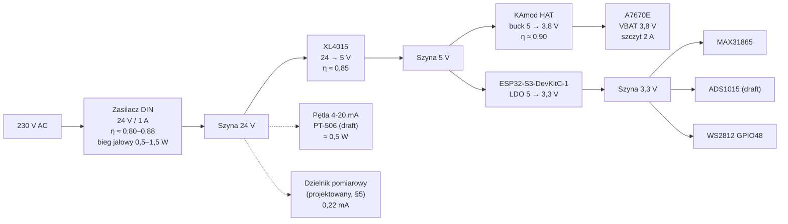

# Budżet energetyczny i tryby zasilania

> Status: **analiza projektowa (2026-09-04)** — obliczenia, nie pomiary. Nie było dostępu do przyrządów ani do fizycznej płytki. Każda liczba jest albo wyprowadzona z kodu w repo (wysoka pewność), albo z kart katalogowych / dokumentacji producenta (średnia pewność), albo oznaczona jako **szacunek** wymagający potwierdzenia. Lista „co zmierzyć i jak" — [§9](#9-do-zmierzenia-na-stanowisku).
>
> Zakres: pobór mocy gatewaya W1 (ESP32-S3-DevKitC-1 + KAmod A7670E HAT), dobór łańcucha zasilania, podtrzymanie przy zaniku 230 V, detekcja zaniku zasilania, werdykt w sprawie trybów uśpienia, praca bez zasilania sieciowego, zakres temperatur.
>
> Powiązane: [`01_hardware.md`](./01_hardware.md) (mapa pinów, §7 moduł KAmod), [`02_modem_a7670e_communication.md`](./02_modem_a7670e_communication.md) (sekwencje czasowe modemu), [`01_plan_biznesowy.md` §3.8](../../business/01_plan_biznesowy.md) (wolumen transferu), [`04_telemetry_module.md`](../backend/04_telemetry_module.md) (kontrakt pakietu v2).

---

## 0. Werdykty w skrócie

| Pytanie | Odpowiedź | Gdzie |
|---|---|---|
| Czy zasilacz 24 V / 1 A wystarcza w szczycie? | **Tak, z zapasem ~2,7× po stronie 24 V.** Wąskim gardłem nie jest zasilacz, tylko szyna 5 V: XL4015 2 A vs szczyt 1,77 A (zapas 13%) i **brak kondensatora bulk przy złączu HAT-a**. | [§3](#3-dobór-zasilania--łańcuch-230-v--24-v--5-v--33-v) |
| Ile czasu potrzeba na wysłanie alarmu „zanik zasilania"? | **Typowo 1,6–5,9 s; cel projektowy ≥ 10 s** z zapasem. | [§4.1](#41-budżet-czasu--ile-sekund-trzeba-kupić) |
| Czym to podtrzymać? | **Kondensatory same tego nie kupią** (potrzeba ~117 000 µF na 24 V). Rekomendacja: **zasilacz buforowy DIN + akumulator AGM** (+150–250 zł/obiekt) — daje godziny zamiast sekund i zamienia „zanik zasilania" z alarmu ostatniego tchnienia w normalnie monitorowany stan. | [§4.2](#42-warianty-podtrzymania), [§4.4](#44-bom-podtrzymania) |
| Jak wykryć zanik zasilania? | Dzielnik napięcia na **szynie 24 V** (nie 5 V — 5 V jest stabilizowane i nie ostrzega), próg + histereza + potwierdzenie 3 próbek. Dwa komplety progów: wariant niebuforowany i buforowany. | [§5](#5-detekcja-zaniku-zasilania-i-pomiar-napięcia) |
| Czy trzeba zmieniać backend, żeby to wysłać? | **Nie.** `sensor_registry.yaml` ma już `battery_voltage`, `power_status` i kod `POWER_LOW`; backend auto-provisionuje punkt pomiarowy. Potrzebne: nowy `ISensor`, dwa nowe kody błędu w YAML i ~15 linii ścieżki „wyślij natychmiast" w firmware. | [§5.5](#55-kanał-transmisji--co-już-jest-w-repo) |
| Czy warto wprowadzać deep sleep? | **Nie.** Cały roczny rachunek za prąd tego urządzenia to **7–18 zł**. Deep sleep łamie kontrakt próbkowania co 15 s, a rozruch modemu kosztuje **minimum 14,3 s samych `delay()`** wpisanych w kod. | [§6](#6-tryby-uśpienia--werdykt) |
| To co jest prawdziwym problemem obecnego rytmu pracy? | **Transfer SIM, nie prąd.** Obecne firmware zużywa **~250–370 MB/miesiąc** zamiast planowanych 31,5 MB — bo każda transmisja to pełny handshake TLS (`http_->stop()` kasuje keep-alive). | [§6.2](#62-prawdziwy-koszt-obecnego-rytmu--transfer-sim) |
| Czy obecna architektura ma szansę na baterii/solarze? | **Nie, bez przebudowy.** 0,37–0,78 W ciągle → akumulator 12 V/7 Ah starcza na **~3,4 doby**. Po przebudowie (interwał ≥1 h, deep sleep, modem wyłączany) — ~0,15 Wh/dobę, czyli ok. **9 miesięcy** z tego samego akumulatora. | [§7](#7-punkty-pomiarowe-bez-zasilania-sieciowego) |
| Czy komponenty przeżyją lato w szafie? | **Ryzyko.** `ESP32-S3-WROOM-1 R8/R16V` (wariant z PSRAM, prawdopodobny na DevKitC-1) ma zakres **−40…+65 °C** — w nasłonecznionej szafie metalowej realny worst case to 50–60 °C, czyli margines ~5 K. | [§8](#8-temperatura-pracy) |

---

## 1. Podstawa obliczeń — co faktycznie jest w kodzie

### 1.1 Fakty z repozytorium (wysoka pewność)

| Fakt | Dowód |
|---|---|
| Nigdzie nie ma trybu uśpienia — brak `esp_deep_sleep`, `esp_light_sleep`, `setCpuFrequencyMhz` | `grep` po `firmware/` — zero trafień |
| Wi-Fi i Bluetooth nigdy nie są inicjalizowane (brak `WiFi.begin`, `esp_wifi_*`) → radio SoC pozostaje wyłączone | `grep` po `firmware/` — zero trafień |
| Modem nigdy nie jest usypiany — brak `AT+CSCLK` / `sleepEnable()` | `grep` po `firmware/` — zero trafień |
| `loop()` kręci się z `delay(10)` | [`main.cpp:228`](../../../firmware/src/main.cpp#L228) |
| Próbkowanie co 15 s, okno 15 s, 4 okna na pakiet → **transmisja co ~60 s** | [`Config.h:61`](../../../firmware/include/Config.h#L61), [`TelemetryPayload.h:34-37`](../../../firmware/lib/TelemetryPayload/src/TelemetryPayload.h#L34-L37) |
| Bufor RAM: `RETAIN_WINDOWS_MAX = 4 × 12 = 48` okien × 15 s = **12 minut** | [`TelemetryPayload.h:35`](../../../firmware/lib/TelemetryPayload/src/TelemetryPayload.h#L35) |
| Modem po `powerOn()` zostaje włączony na stałe; ponownie dotykany tylko przez `Watchdog::attemptRecovery()` | [`main.cpp:62-80`](../../../firmware/src/main.cpp#L62-L80), [`Watchdog.cpp`](../../../firmware/lib/Watchdog/src/Watchdog.cpp) |
| Kod błędu `POWER_LOW` istnieje w rejestrze, ale **nic go nigdy nie ustawia** | [`sensor_registry.yaml:60`](../../../sensor_registry.yaml#L60); `grep POWER_LOW firmware/` — zero trafień |
| Jedyny zaimplementowany czujnik to PT100; PT-506 nie ma sterownika | [`main.cpp:96`](../../../firmware/src/main.cpp#L96), [`01_hardware.md` §5](./01_hardware.md#5-znane-ograniczenia) |
| Każda transmisja HTTPS zaczyna się i kończy `http_->stop()`, więc `connectionKeepAlive()` nie ma efektu → **pełny handshake TLS na każdy pakiet** | [`TelemetryHttpClient.cpp:24,48`](../../../firmware/lib/TelemetryHttpClient/src/TelemetryHttpClient.cpp#L24) |
| `seq` pakietu = uniksowa sekunda; backend odrzuca duplikat `(device_id, seq)` | [`TelemetrySender.cpp:51,59`](../../../firmware/lib/TelemetrySender/src/TelemetrySender.cpp#L51), [`ingest.py:173`](../../../backend/app/modules/telemetry/services/ingest.py#L173) |
| Trwały zapis stanu jest dostępny (NVS przez `Preferences`, namespace `devid`) | [`DeviceIdentity.cpp:13,19`](../../../firmware/lib/DeviceIdentity/src/DeviceIdentity.cpp#L13) |

### 1.2 Koszt czasowy rozruchu modemu — liczony z kodu

To jest liczba, której potrzebuje [§6](#6-tryby-uśpienia--werdykt), więc wyprowadzam ją wprost z `delay()`-ów w repo, a nie z przeczucia:

| Krok | Czas stały (`delay`) | Czas warunkowy (timeout) | Źródło |
|---|---|---|---|
| `ModemPower::powerOn()` — puls PWRKEY | 4 300 ms | — | [`ModemPower.cpp:19-27`](../../../firmware/lib/ModemPower/src/ModemPower.cpp#L19-L27) |
| `delay(3000)` po power-on w `main` | 3 000 ms | — | [`main.cpp:65`](../../../firmware/src/main.cpp#L65) |
| `ModemLink::init()` — start UART, czyszczenie bufora, auto-baud | 7 000 ms | + do ~2 000 ms (auto-baud) | [`ModemLink.cpp:18-32`](../../../firmware/lib/ModemLink/src/ModemLink.cpp#L18-L32) |
| `modem.init()` — pętla ponowień | — | do 10 000 ms (zmierzone 132 ms przy sprawnym modemie) | [`ModemLink.cpp:41`](../../../firmware/lib/ModemLink/src/ModemLink.cpp#L41), [`02_modem…md` §7](./02_modem_a7670e_communication.md) |
| `waitForNetwork()` — rejestracja w sieci | — | do 60 000 ms | [`ModemLink.cpp:84`](../../../firmware/lib/ModemLink/src/ModemLink.cpp#L84) |
| `connectGprs()` — kontekst PDP | — | do 30 000 ms | [`ModemLink.cpp:116`](../../../firmware/lib/ModemLink/src/ModemLink.cpp#L116) |
| `TimeSync::sync()` — NTP przez modem | 500 ms | + kilka s | [`TimeSync.cpp:34`](../../../firmware/lib/TimeSync/src/TimeSync.cpp#L34) |
| **Razem** | **14 800 ms nieusuwalnych `delay()`** | **do ~110 s w najgorszym przypadku** | |

Punkt odniesienia zweryfikowany na sprzęcie: pełny cykl `ACTIVATE` → aktywna telemetria zajął **~55 s** ([`04_device_provisioning_flow.md`](./04_device_provisioning_flow.md), test 2026-08-23).

**Wniosek:** każde wybudzenie z wyłączonym modemem kosztuje **minimum ~15 s**, realistycznie 20–40 s, w najgorszym razie ~110 s. To jest twarda granica dla wszystkiego, co dotyczy cyklicznego wyłączania modemu.

### 1.3 Czego w repo nie ma — założenia przyjęte za briefem

Brief B-11 podaje elementy łańcucha zasilania, których **nie ma ani w kodzie, ani w [`01_hardware.md`](./01_hardware.md)**. Przyjmuję je jako dane wejściowe zadania i oznaczam jako niepotwierdzone w repo:

- zasilacz DIN 230 V AC → **24 V DC / 1 A**,
- przetwornica **XL4015, 24 → 5 V, 2 A**,
- **ADS1015** jako ADC dla pętli 4-20 mA, z wolnymi kanałami AIN1–3.

Rozbieżności wokół tych elementów — [§10](#10-rozbieżności-do-rozstrzygnięcia). Projekt detekcji w [§5](#5-detekcja-zaniku-zasilania-i-pomiar-napięcia) jest podany w **dwóch wariantach**: z ADS1015 i bez niego (na ADC ESP32-S3), żeby nie zależał od rozstrzygnięcia tej rozbieżności.

### 1.4 Drzewo zasilania



---

## 2. Bilans prądowy per faza

### 2.1 Dane wejściowe komponentów

| Komponent | Parametr | Wartość | Pewność / źródło |
|---|---|---|---|
| ESP32-S3 (SoC) | pobór przy wyłączonym radiu, 80–240 MHz | **13–107 mA** (zależnie od częstotliwości, peryferiów i obciążenia rdzeni) | karta katalogowa, tab. „Current Consumption in Modem-sleep Mode" — [datasheet](https://www.espressif.com/sites/default/files/documentation/esp32-s3_datasheet_en.pdf) |
| ESP32-S3 | light-sleep / deep-sleep | ~240 µA / ~7 µA (RTC on) | jw. |
| ESP32-S3-WROOM-1 | prąd z zasilacza zewnętrznego | do **0,5 A** | [karta katalogowa modułu](https://www.mouser.com/datasheet/2/891/esp32_s3_wroom_1_wroom_1u_datasheet_en-2930317.pdf) |
| ESP32-S3-DevKitC-1 | pobór płytki (LDO + mostek USB-UART + LED) w spoczynku | **35–70 mA @ 5 V** | ⚠ **szacunek** — do zmierzenia ([§9](#9-do-zmierzenia-na-stanowisku), poz. 1) |
| A7670E | VBAT | 3,4–4,2 V, typ. 3,8 V | [SIMCom A7670 Hardware Design](https://www.ktron.in/wp-content/uploads/2022/10/A7670-Series_Hardware-Design-V1.03-1.pdf) |
| A7670E | wymagany prąd szczytowy zasilania | **2 A** | jw.; powtórzone w [`01_hardware.md` §7](./01_hardware.md#uwagi-krytyczne-przed-podłączeniem) („5 V / min. 2 A") |
| A7670E | moc nadawania | klasa 3, 23 dBm ±2,7 dB | jw. |
| A7670E | sleep (AT+CSCLK) | 0,7–4,6 mA zależnie od trybu | jw. — **w firmware niewłączone** |
| A7670E | zarejestrowany, PDP aktywny, bez ruchu | **20–60 mA** | ⚠ **szacunek** — do zmierzenia (poz. 1) |
| A7670E | średnia w trakcie transmisji LTE | **300–650 mA** | ⚠ **szacunek** wyprowadzony z klasy mocy i szczytu 2 A — do zmierzenia (poz. 2) |
| MAX31865 | pobór | ~10 mA typ. wg [`05_pt100…md` §1](./05_pt100_temperature_sensor.md) | ⚠ liczba z dokumentacji repo, wyższa niż typowa dla tego układu — do zweryfikowania (poz. 1) |
| MAX31865 | bias RTD włączony tylko na czas konwersji (~75 ms) | duty 0,5% przy próbkowaniu co 15 s | biblioteka Adafruit: `enableBias(true)` → `delay(10)` → 1-shot → `delay(65)` → `enableBias(false)` |
| ADS1015 | pobór w trybie ciągłej konwersji | **150 µA** typ., zasilanie 2,0–5,5 V | [TI ADS1015](https://www.ti.com/lit/ds/symlink/ads1015.pdf) |
| WS2812 (GPIO48) | zielony, pełna jasność | ~18 mA przez 2 × 80 ms po udanej wysyłce → **0,05 mA średnio** | [`StatusLed.cpp`](../../../firmware/lib/StatusLed/src/StatusLed.cpp) |
| XL4015 (moduł) | sprawność 24 → 5 V | **0,85** (przyjęte; producent deklaruje „≤96%", ale przy tak dużym stosunku zejścia realnie 0,80–0,90) | [karta modułu](https://www.handsontec.com/dataspecs/module/XL4015-5A-PS.pdf) |
| XL4015 | częstotliwość przełączania | 180 kHz | jw. |

Przeliczniki użyte niżej:
- modem: `I₅ᵥ = I₃,₈ᵥ × 3,8 / (5 × 0,90) = I₃,₈ᵥ × 0,844`
- szyna 24 V: `I₂₄ᵥ = P₅ᵥ / (24 × 0,85)`

### 2.2 Tabela poboru per faza

| # | Faza | ESP32-S3 + peryferia @ 5 V | Modem @ 5 V | Razem @ 5 V | Moc @ 5 V | Prąd @ 24 V |
|---|---|---|---|---|---|---|
| 1 | **Bezczynność** — modem zarejestrowany, PDP aktywny, bez ruchu (stan przez ~95% czasu) | 45–80 mA | 17–51 mA | **62–131 mA** | 0,31–0,66 W | 15–32 mA |
| 2 | **Próbkowanie PT100** (MAX31865, 75 ms co 15 s) | +10 mA przez 0,5% czasu → **+0,05 mA średnio** | — | pomijalne | pomijalne | pomijalne |
| 3 | **Próbkowanie ADS1015** (tryb ciągły) | +0,15 mA | — | pomijalne | pomijalne | pomijalne |
| 4 | **Rejestracja w sieci LTE** (attach, 15–60 s po power-on) | 45–80 mA | 84–253 mA | **129–333 mA** | 0,65–1,67 W | 32–82 mA |
| 5 | **Transmisja HTTPS** (handshake TLS + POST, 1–3 s) | 45–80 mA | 253–549 mA | **298–629 mA** | 1,49–3,15 W | 73–154 mA |
| 6 | **Szczyt nadawania** (ms) | 45–80 mA | 1 688 mA | **1 733–1 768 mA** | **8,7–8,8 W** | **425–433 mA** |

Uwagi do wiersza 6:
- W **LTE** transmisja jest quasi-ciągła (podramki 1 ms), więc 2 A to worst case przy 23 dBm w słabym zasięgu, a nie krótki impuls.
- W **GSM/2G** (A7670E obsługuje fallback) nadawanie jest impulsowe: **577 µs co 4,6 ms**, duty 1/8. To ten przypadek dyktuje pojemność bulk na szynie 5 V — patrz [§3.3](#33-pojemność-bulk-na-szynie-5-v--obliczenie).

### 2.3 Średnia i koszt energii

Cykl 60 s = 57 s w fazie 1 + ~3 s w fazie 5:

| Wielkość | Minimum | Maksimum |
|---|---|---|
| Moc średnia na szynie 5 V | 0,369 W | 0,784 W |
| Moc średnia na wejściu 24 V (η 0,85) | 0,43 W | 0,92 W |
| Moc pobierana z 230 V (η zasilacza 0,80–0,88 + bieg jałowy 0,5–1,5 W) | **~1,0 W** | **~2,5 W** |
| Energia roczna | 8,8 kWh | 21,9 kWh |
| **Koszt energii rocznie** (0,80 zł/kWh) | **~7 zł** | **~18 zł** |

To jest liczba, która rozstrzyga [§6](#6-tryby-uśpienia--werdykt): **oszczędzanie prądu w tym urządzeniu nie ma sensu ekonomicznego**. Cały roczny rachunek jest niższy niż koszt jednej godziny pracy nad optymalizacją, i mieści się w szumie kosztów operacyjnych obiektu (500–1 340 zł/rok wg [§4.2.4 planu biznesowego](../../business/01_plan_biznesowy.md)).

Zauważ też, że **bieg jałowy samego zasilacza DIN (0,5–1,5 W) jest porównywalny z poborem całego urządzenia**. Zasilacz 24 V / 1 A pracuje przy ~4% obciążenia znamionowego, gdzie sprawność zasilaczy impulsowych jest najgorsza. Mniejszy zasilacz (24 V / 0,5 A) byłby efektywniejszy, ale różnica to kilka złotych rocznie — nie warto zmieniać, tym bardziej że rezerwa 1 A przyda się na pętlę 4-20 mA i przyszłe czujniki.

---

## 3. Dobór zasilania — łańcuch 230 V → 24 V → 5 V → 3,3 V

### 3.1 Czy 24 V / 1 A wystarcza?

| Kryterium | Wartość | Ocena |
|---|---|---|
| Moc znamionowa zasilacza | 24 W | — |
| Szczyt zapotrzebowania (faza 6, przeliczony na wejście 24 V) | 8,8 W / 0,85 = **10,4 W** | zapas **2,3×** |
| Prąd szczytowy z szyny 24 V | **433 mA** | 43% prądu znamionowego |
| Średnie obciążenie | 0,43–0,92 W | 2–4% mocy znamionowej |
| Rezerwa na pętlę 4-20 mA PT-506 (24 V × 20 mA) | 0,5 W | mieści się |

**Werdykt: zasilacz 24 V / 1 A ma nadmiarowy zapas i nie jest wąskim gardłem.** Nawet gdyby wszystkie szczyty zbiegły się w czasie, obciążenie nie przekracza połowy prądu znamionowego.

### 3.2 Czy XL4015 wystarcza?

| Kryterium | Wartość | Ocena |
|---|---|---|
| Deklarowany prąd wyjściowy modułu (wg briefu) | 2 A | — |
| Szczyt zapotrzebowania na 5 V | **1,77 A** | zapas **13%** — **cienko** |
| Strata mocy w przetwornicy przy szczycie | 10,4 − 8,8 = **1,55 W** | moduł bez radiatora wyraźnie się grzeje; przy średnim obciążeniu 0,07 W — bez znaczenia |
| Strata w stanie średnim | 0,07–0,16 W | pomijalna |
| Tętnienia wyjściowe (180 kHz) | typ. 30–50 mV p-p | **bez znaczenia dla modemu** — HAT re-reguluje 5 V → 3,8 V, więc tętnienia nie trafiają wprost na VBAT |
| Odpowiedź na skok obciążenia | pętla regulacji ~50–200 µs | **nadąża za LTE, nie nadąża za impulsem GSM (577 µs)** |

**Werdykt: XL4015 formalnie wystarcza, ale zapas 13% jest za mały jak na komponent, którego karta jest deklaracją sprzedawcy, a nie producenta.** Dwie konkretne konsekwencje:

1. **Nie tętnienia są problemem, tylko spadek dynamiczny** przy impulsie nadawania. Rozwiązanie to pojemność bulk lokalnie przy HAT-cie, nie mocniejsza przetwornica.
2. Jeśli moduł jest w wersji „XL4015 5 A" (chip XL4015 jest 5-amperowy, a wiele modułów jest tak sprzedawanych), zapas rośnie do 2,8× i problem znika. **Do sprawdzenia na fizycznym module** ([§9](#9-do-zmierzenia-na-stanowisku), poz. 4).

### 3.3 Pojemność bulk na szynie 5 V — obliczenie

Warunek projektowy: skok prądu ΔI = 1,7 A, czas trwania impulsu Δt = 577 µs (najgorszy przypadek — nadawanie GSM), dopuszczalny spadek napięcia ΔV = 200 mV.

```
C ≥ ΔI · Δt / ΔV = 1,7 A × 577 µs / 0,2 V = 4 900 µF
```

Do tego składnik od ESR: `ΔV_ESR = ΔI × ESR`. Przy 1,7 A i ESR = 100 mΩ spadek wynosi 170 mV — czyli ESR jest tu równie ważny jak pojemność.

**Rekomendacja:** przy złączu zasilania HAT-a (piny 2/4 złącza 40-pin), na jak najkrótszych przewodach:

| Element | Wartość | Uzasadnienie |
|---|---|---|
| 2× kondensator elektrolityczny low-ESR | 2 200 µF / 16 V, ESR ≤ 50 mΩ każdy, **105 °C, ≥5 000 h** | 4 400 µF łącznie ≈ wymagane 4 900 µF; dwa równolegle halvują ESR do ~25 mΩ (spadek 43 mV zamiast 170 mV); klasa temperaturowa — patrz [§8](#8-temperatura-pracy) |
| 1× MLCC | 10 µF / 25 V X7R | pokrywa pasmo, którego elektrolit nie obsługuje |
| 1× MLCC | 100 nF / 50 V X7R | odsprzęganie wysokoczęstotliwościowe |

**Spadek na przewodach 5 V** — równie istotny i często pomijany:

| Przekrój przewodu | Rezystancja | Długość pętli (tam i z powrotem) | Spadek przy 1,7 A | Ocena |
|---|---|---|---|---|
| 0,14 mm² (przewód „dupont") | 0,13 Ω/m | 2 × 1,0 m | **440 mV** | ❌ nie do przyjęcia |
| 0,25 mm² | 0,07 Ω/m | 2 × 0,5 m | 119 mV | ⚠ granicznie |
| **0,5 mm²** | 0,036 Ω/m | 2 × 0,3 m | **37 mV** | ✅ |

**Wymaganie: przewody zasilania 5 V do HAT-a ≥ 0,5 mm², długość ≤ 0,5 m, wspólna masa prowadzona osobnym przewodem tego samego przekroju.** Zasilanie HAT-a z pinu 5 V dev-kitu przez przewody połączeniowe jest rozwiązaniem, które przy nadawaniu wywoła reset modemu — dokładnie to, przed czym ostrzega [`01_hardware.md` §7](./01_hardware.md#uwagi-krytyczne-przed-podłączeniem).

### 3.4 Ograniczenie 0,5 A po stronie ESP32

Karta katalogowa modułu `ESP32-S3-WROOM-1` podaje **do 0,5 A z zasilacza zewnętrznego**. Nasze zapotrzebowanie po stronie 3,3 V (SoC + MAX31865 + ADS1015 + LED) to ~50–90 mA — mieści się z zapasem 5×. **Bez zastrzeżeń**, pod warunkiem że modem **nie jest** zasilany z pinu 5 V/3,3 V dev-kitu, tylko z własnej gałęzi (co potwierdza [`01_hardware.md` §7](./01_hardware.md#7-a7670e-fase--moduł-kamod-lte-cat1-gnss-hat)).

---

## 4. Podtrzymanie przy zaniku 230 V

### 4.1 Budżet czasu — ile sekund trzeba kupić

Od chwili zaniku 230 V do chwili, gdy backend ma alarm:

| Krok | Czas typowy | Czas najgorszy | Uwaga |
|---|---|---|---|
| Detekcja: 3 kolejne próbki co 200 ms + filtr | 0,6 s | 1,0 s | [§5.4](#54-algorytm-w-firmware) |
| Przerwanie pętli, zbudowanie pakietu JSON | < 0,05 s | 0,1 s | `TelemetryPayload::build()` |
| Odczekanie na zmianę `seq` (o ile potrzebne) | 0 s | 1,0 s | patrz pułapka w [§5.5](#55-kanał-transmisji--co-już-jest-w-repo) |
| TCP + pełny handshake TLS (modem już zarejestrowany, PDP aktywny) | 0,6–2,5 s | — | ⚠ szacunek, do zmierzenia (poz. 5) |
| POST + odpowiedź 200/202 | 0,3–1,2 s | — | jw. |
| Zapis stanu do NVS (`Preferences.putString`) | 0,02 s | 0,1 s | pojedynczy zapis do flash |
| Timeout odpowiedzi HTTP, gdy sieć nie odpowiada | — | **30 s** | [`TelemetryHttpClient.cpp:26`](../../../firmware/lib/TelemetryHttpClient/src/TelemetryHttpClient.cpp#L26) |
| **Razem** | **1,6–5,9 s** | **do 32 s** | |

**Cel projektowy: utrzymać szynę 5 V przez ≥ 10 s przy obciążeniu fazy transmisji (0,5 A @ 5 V = 2,5 W).**

Uzasadnienie „10 s, a nie 32 s": pokrywanie najgorszego przypadku (30-sekundowy timeout HTTP) kosztowałoby 3× więcej energii, a i tak nic nie gwarantuje — jeśli sieć nie odpowiada, alarmu nie da się dostarczyć niezależnie od zapasu. **W trybie awaryjnym firmware powinien skrócić timeout do 5 s i po nieudanej próbie odpuścić**, zapisując zdarzenie do NVS zamiast wyczerpywać rezerwę.

Energia do zmagazynowania: `E = 2,5 W × 10 s = 25 J` na szynie 5 V, czyli **~29 J** licząc na szynie 24 V (η XL4015 = 0,85).

### 4.2 Warianty podtrzymania

#### Wariant A — kondensatory elektrolityczne na szynie 24 V

XL4015 wymaga ≥ 8 V na wejściu, więc energia użyteczna to zakres 24 V → 9 V:

```
E = ½ · C · (V₁² − V₂²) = ½ · C · (576 − 81) = 247,5 J na farad
C = 29 J / 247,5 J/F = 0,117 F = 117 000 µF
```

**117 000 µF to około 25 sztuk 4 700 µF / 35 V.** Fizycznie: ~25 puszek 18 × 36 mm, cena 250–500 zł, i prąd załączeniowy, który wywali zabezpieczenie zasilacza DIN, jeśli nie doda się układu soft-start.

**Werdykt: kondensatory same nie kupią 10 s. Odrzucone.**

Co realnie kupią? 10 000 µF (2× 4 700 µF, ~25 zł) da 2,5 J na 24 V → 2,1 J na 5 V → **~0,85 s** przy 2,5 W. To wystarczy na detekcję i czysty zapis do NVS, ale nie na wysłanie pakietu HTTPS.

#### Wariant B — superkondensatory na szynie 5 V

Zakres użyteczny 5,0 → 4,3 V (poniżej ~4,2 V przetwornica HAT-a przestaje trzymać 3,8 V):

```
E = ½ · C · (25 − 18,49) = 3,25 J na farad
```

| Konfiguracja | Pojemność wypadkowa | Energia użyteczna | Czas przy 2,5 W | Koszt (kondensatory) |
|---|---|---|---|---|
| 2× 10 F / 2,7 V szeregowo | 5 F / 5,4 V | 16,3 J | **6,5 s** | ~20 zł |
| 2× 25 F / 2,7 V szeregowo | 12,5 F / 5,4 V | 40,7 J | **16 s** | ~50–60 zł |

Wymaga dodatkowo: rezystorów balansujących (superkondensatory szeregowo nie dzielą napięcia równo), ogranicznika prądu ładowania (rozładowany superkondensator to zwarcie) oraz diody blokującej wsteczny przepływ do XL4015. Realny koszt układu: **60–100 zł**.

**Blokada:** typowy superkondensator 10 F / 2,7 V ma zakres pracy **−40…+70 °C**, a jego trwałość gwałtownie spada powyżej 60 °C. W szafie, dla której [§8](#8-temperatura-pracy) przewiduje 50–60 °C latem, to komponent na granicy. **Wariant technicznie poprawny, ale ryzykowny w tej konkretnej aplikacji.**

#### Wariant C — zasilacz buforowy DIN + akumulator AGM ✅ rekomendowany

Zasilacz buforowy (np. Mean Well DRC-60B: 27,6 V, 60 W, ładowarka akumulatora ołowiowego, wyjście na szynę DIN) plus 2× akumulator 12 V / 1,2 Ah AGM.

- Napięcie wyjściowe 27,6 V (float) mieści się w zakresie wejściowym XL4015 (8–36 V) — **nie trzeba zmieniać przetwornicy**.
- Pozostaje ~24–27 V dla pętli 4-20 mA PT-506 (typowe zasilanie przetwornika: 9–36 V) — **to jest powód, dla którego DRC-60B (27,6 V), a nie tańszy DRC-40A (13,8 V)**.

Czas podtrzymania — rząd wielkości:

```
Pojemność:      2 × 12 V × 1,2 Ah = 28,8 Wh
Użyteczne ~60% (do 21 V, żeby nie zniszczyć AGM): ≈ 17 Wh
Pobór z akumulatora: 0,43–0,92 W (urządzenie) / 0,85 (tor DC zasilacza) + ~0,4 W (bieg jałowy DRC) ≈ 0,9–1,5 W
Czas:           17 Wh / 0,9…1,5 W = 11–19 h
```

**Podtrzymanie liczone w godzinach, nie w sekundach — 4 rzędy wielkości ponad wymagane 10 s.**

To zmienia jakościowo, czym jest „zanik zasilania" w systemie: przestaje być alarmem ostatniego tchnienia, a staje się **normalnie monitorowanym stanem**. Urządzenie dalej mierzy, dalej raportuje, dalej reaguje na alarmy ciśnieniowe — tyle że z flagą „na akumulatorze" i malejącym napięciem, które backend widzi jako punkt pomiarowy. Katalog alarmów z [§2.6 planu biznesowego](../../business/01_plan_biznesowy.md) dostaje wtedy komplet: alarm krytyczny „zanik zasilania", ostrzeżenie „niskie napięcie zasilania" i zdarzenie informacyjne „powrót zasilania" — wszystkie trzy realnie wykrywalne.

### 4.3 Rekomendacja — dwa poziomy

| Poziom | Co | Kiedy | Koszt |
|---|---|---|---|
| **Poziom 0 — obowiązkowy, niezależnie od reszty** | Kondensatory bulk 2× 2 200 µF/16 V low-ESR + 10 µF + 100 nF przy złączu HAT-a ([§3.3](#33-pojemność-bulk-na-szynie-5-v--obliczenie)) | zawsze, także w obecnym PoC | ~15 zł |
| **Poziom 1 — obowiązkowy dla wersji polowej** | Zasilacz buforowy DIN + 2× akumulator 12 V/1,2 Ah AGM (wariant C) | zanim pierwsze urządzenie trafi do gminy | +150–250 zł ponad zwykły zasilacz |

Poziom 0 **nie jest podtrzymaniem** — to wymaganie zasilania modemu, którego dziś nie ma i którego brak najprawdopodobniej objawia się resetami modemu przy nadawaniu w słabym zasięgu.

Poziom 1 zastępuje zwykły zasilacz DIN, więc kosztem netto jest różnica cen (~150–250 zł), a nie pełna cena zasilacza buforowego. Wobec BOM sprzętu 1 400–3 500 zł na obiekt ([§4.2.2 planu](../../business/01_plan_biznesowy.md)) to **+5…+15%** — i jest to jedyna pozycja w tej analizie, która realnie zmienia BOM.

### 4.4 BOM podtrzymania

| Poz. | Element | Ilość | Cena jedn. | Razem | Uwagi |
|---|---|---|---|---|---|
| **Poziom 0** | | | | | |
| 1 | Kondensator elektrolityczny 2 200 µF / 16 V, low-ESR, **105 °C, ≥5 000 h** | 2 | ~6 zł | ~12 zł | przy złączu zasilania HAT-a |
| 2 | MLCC 10 µF / 25 V X7R | 1 | ~1 zł | ~1 zł | |
| 3 | MLCC 100 nF / 50 V X7R | 1 | ~0,5 zł | ~0,5 zł | |
| 4 | Przewód zasilania 5 V, 0,5 mm², ≤0,5 m (para) | 1 kpl. | ~3 zł | ~3 zł | [§3.3](#33-pojemność-bulk-na-szynie-5-v--obliczenie) |
| | **Razem poziom 0** | | | **~17 zł** | |
| **Poziom 1 (zastępuje zwykły zasilacz DIN)** | | | | | |
| 5 | Zasilacz buforowy DIN Mean Well **DRC-60B** (27,6 V / 60 W, ładowarka AGM) | 1 | **138–200 zł** | ~170 zł | [ceny 2026-09](https://www.ceneo.pl/37632371); zastępuje zasilacz 24 V/1 A (~50–100 zł) |
| 6 | Akumulator AGM 12 V / 1,2 Ah | 2 | 21–66 zł | 42–130 zł | [ceny 2026-09](https://allegro.pl/listing?string=akumulator+%C5%BCelowy+12v+1,2ah); w szeregu → 24 V |
| 7 | Uchwyt / półka akumulatorów + bezpiecznik + przewody | 1 kpl. | ~25 zł | ~25 zł | |
| | **Razem poziom 1 (brutto)** | | | **240–325 zł** | |
| | **Koszt netto ponad obecny wariant** | | | **+150–250 zł** | po odjęciu ceny zwykłego zasilacza DIN |
| **Wariant B (odrzucony, dla porządku)** | | | | | |
| 8 | Superkondensator 25 F / 2,7 V | 2 | ~28 zł | ~56 zł | [ceny 2026-09](https://www.ceneo.pl/126940741); + układ ładowania/balansowania ~30 zł; **ograniczenie +70 °C** |

**Koszt eksploatacji poziomu 1:** akumulator AGM wymaga wymiany co 3–5 lat w temperaturze 25 °C, ale **jego trwałość spada o połowę na każde +10 °C** — w szafie o temperaturze 45 °C realny cykl wymiany to ~1–2 lata. Przy 25–65 zł za sztukę to 25–130 zł co 2 lata na obiekt, czyli **13–65 zł/rok** — mieści się w pozycji „serwis i utrzymanie 200–500 zł/rok" z [§4.2.4 planu](../../business/01_plan_biznesowy.md), ale trzeba to tam świadomie ująć. Argument za montażem akumulatora w najzimniejszym miejscu szafy (nisko, z dala od zasilacza i przetwornicy).

---

## 5. Detekcja zaniku zasilania i pomiar napięcia

### 5.1 Gdzie mierzyć

**Na szynie 24 V, przed przetwornicą XL4015.** Uzasadnienie:

- szyna 5 V jest stabilizowana — trzyma 5,00 V aż do chwili, gdy wejście przetwornicy spadnie poniżej ~8 V, czyli **ostrzega dopiero wtedy, gdy jest już za późno**;
- szyna 24 V zaczyna opadać w chwili zaniku 230 V, z szybkością zależną od pojemności buforowej — daje maksymalny czas wyprzedzenia;
- w wariancie buforowanym ([§4.2](#42-warianty-podtrzymania), wariant C) napięcie szyny 24 V **jest jednocześnie napięciem akumulatora**, czyli jeden pomiar obsługuje trzy stany: sieć obecna (float 27,6 V), praca na akumulatorze (25,5 → 21 V) i akumulator wyczerpany.

### 5.2 Dzielnik napięcia — dwa warianty

Warunek wspólny: przy maksymalnym spodziewanym napięciu wejściowym (**30 V** — margines na float 27,6 V + tolerancję + przepięcia sieciowe) napięcie na wejściu ADC nie może przekroczyć jego zakresu.

#### Wariant 1 — ADS1015 (rekomendowany, jeśli układ jest zamontowany)

| Element | Wartość |
|---|---|
| R1 (góra, do +24 V) | **180 kΩ, 1%, ≥0,25 W** |
| R2 (dół, do GND) | **20 kΩ, 1%** |
| C (równolegle do R2) | **100 nF, X7R** |
| Kanał | **AIN1** (wolny wg briefu B-11) |
| PGA | ±4,096 V |

| Napięcie wejściowe | Napięcie na AIN1 |
|---|---|
| 21,0 V (próg krytyczny) | 2,100 V |
| 24,0 V (nominalne) | 2,400 V |
| 27,6 V (float buforowanego) | 2,760 V |
| 30,0 V (maksimum projektowe) | **3,000 V** ✅ < 3,3 V (VDD) |

- Rozdzielczość: ADS1015 to 12-bit ze znakiem → 2 048 zliczeń pełnej skali przy ±4,096 V = **2 mV/LSB**, czyli **20 mV/LSB na szynie 24 V**. Z nadmiarem.
- Dokładność: błąd wzmocnienia ADS1015 ±0,15% typ. + tolerancja rezystorów 1% → **~±1,5%**, czyli ±0,36 V przy 24 V. Wystarczy do progowania; jeśli potrzebna lepsza — rezystory 0,1% albo jednorazowa kalibracja (stała zapisana w NVS).
- Obciążenie dzielnika: 24 V / 200 kΩ = **120 µA (2,9 mW)** — pomijalne, także jako obciążenie rezerwy podczas podtrzymania.
- Stała czasowa filtru: (180 k ∥ 20 k) × 100 nF = 18 kΩ × 100 nF = **1,8 ms**. ADS1015 ma wysoką impedancję wejściową, więc 18 kΩ źródła nie przeszkadza.

#### Wariant 2 — ADC ESP32-S3 (gdy ADS1015 nie jest zamontowany — stan faktyczny repo)

| Element | Wartość |
|---|---|
| R1 (góra, do +24 V) | **100 kΩ, 1%, ≥0,25 W** |
| R2 (dół, do GND) | **8,2 kΩ, 1%** |
| C (równolegle do R2) | **100 nF, X7R** |
| Pin | **GPIO2 = ADC1_CH1** — status **draft**, do potwierdzenia na płytce |
| Tłumienie | `ADC_ATTEN_DB_12` (zakres użyteczny ~0,15–2,9 V) |

| Napięcie wejściowe | Napięcie na GPIO2 |
|---|---|
| 21,0 V | 1,594 V |
| 24,0 V | 1,822 V |
| 27,6 V | 2,095 V |
| 30,0 V | **2,277 V** ✅ < 2,9 V (górna granica obszaru liniowego) |

- Dlaczego GPIO2: należy do **ADC1** (ADC2 jest niedostępny przy aktywnym Wi-Fi — dziś Wi-Fi nie jest używane, ale nie ma powodu wchodzić w tę pułapkę), **nie jest pinem strappingowym** ESP32-S3 (strappingowe to GPIO0, GPIO3, GPIO45, GPIO46), nie koliduje z SPI MAX31865 (GPIO 11–14) ani z rezerwacją GPIO1 pod PT-506 ([`01_hardware.md` §3](./01_hardware.md#3-piny--draft-planowane-nie-w-kodzie)).
- Impedancja źródła: 100 k ∥ 8,2 k = **7,6 kΩ** — mieści się w zaleceniu (< 10 kΩ) dla ADC ESP32.
- Obciążenie dzielnika: 24 V / 108,2 kΩ = **222 µA (5,3 mW)** — pomijalne.
- **Ostrzeżenie:** ADC ESP32-S3 jest wyraźnie nieliniowy i szumny. Wymagana kalibracja przez `esp_adc_cal` (eFuse) **oraz** uśrednianie 16–64 próbek. Bez tego błąd może przekroczyć ±5%, co dla progów odległych o 2 V (histereza) jest jeszcze akceptowalne, ale dla raportowania napięcia jako punktu pomiarowego — nie.

#### Zabezpieczenie (oba warianty)

Dzielnik jest podłączony do szyny, na której mogą pojawić się przepięcia (zwłaszcza w szafie w hydroforni, bez ochrony przepięciowej — patrz [`01_plan_biznesowy.md` §4.2.2](../../business/01_plan_biznesowy.md)):

- rezystor szeregowy **1 kΩ** między odczepem dzielnika a pinem ADC (ogranicza prąd do diod zaciskowych),
- dioda Schottky'ego (np. BAT54S, para) do szyny 3,3 V i do GND — zacisk na wypadek, gdyby przepięcie przebiło się przez dzielnik,
- R1 dobrany na **≥ 0,25 W** i na napięcie robocze ≥ 100 V (przy 30 V rozprasza 8 mW, ale liczy się wytrzymałość napięciowa przy udarze).

### 5.3 Progi i histereza

Progi są **różne dla dwóch wariantów zasilania**, bo w wariancie buforowanym napięcie nominalne to 27,6 V (float), a nie 24 V.

#### Wariant niebuforowany (obecny: zasilacz DIN 24 V / 1 A)

| Stan | Próg | Potwierdzenie | Akcja |
|---|---|---|---|
| `MAINS_OK` | U > **20,0 V** | 3 próbki | stan normalny |
| `POWER_LOW` (ostrzeżenie) | U < **21,0 V** | 3 próbki | dodaj `POWER_LOW` do `errors[]` w najbliższym pakiecie; **nie** wysyłaj natychmiast |
| `MAINS_LOST` | U < **18,0 V** | 3 próbki | **natychmiastowa wysyłka** pakietu z `POWER_MAINS_LOST` |
| `CRITICAL` | U < **15,0 V** | 1 próbka | przerwij transmisję, zapisz stan do NVS, zatrzymaj pętlę |
| `MAINS_RESTORED` | U > **20,0 V** | utrzymane przez **5 s** | `POWER_MAINS_RESTORED` w najbliższym pakiecie |

Histereza: **2,0 V** (18,0 V w dół / 20,0 V w górę) + 5 s zwłoki na powrocie — chroni przed migotaniem przy niestabilnej sieci. Zasilacz DIN o tolerancji ±5% nigdy nie zejdzie do 21 V w normalnej pracy (najniższe dopuszczalne napięcie to 22,8 V), więc `POWER_LOW` przy 21 V nie generuje fałszywych alarmów, a wykrywa degradację samego zasilacza.

#### Wariant buforowany (DRC-60B 27,6 V + 2× AGM 12 V)

| Stan | Próg | Potwierdzenie | Akcja |
|---|---|---|---|
| `MAINS_OK` | U > **26,5 V** | 3 próbki | sieć obecna, akumulator ładowany (float 27,6 V) |
| `ON_BATTERY` | U < **25,5 V** | utrzymane przez **5 s** | **natychmiastowa wysyłka** `POWER_MAINS_LOST`; przełącz raportowanie napięcia na częstsze |
| `POWER_LOW` (ostrzeżenie) | U < **22,5 V** | 3 próbki | ~50% pojemności AGM; `POWER_LOW` w najbliższym pakiecie |
| `CRITICAL` | U < **21,0 V** | 3 próbki | wyślij ostatni pakiet, zapisz NVS, zatrzymaj pętlę — **chroni AGM przed głębokim rozładowaniem** |
| `MAINS_RESTORED` | U > **26,0 V** | utrzymane przez **10 s** | `POWER_MAINS_RESTORED` |

Zwłoka 5 s przy przejściu na akumulator jest tu **korzystna**: krótkie zapady sieci (przełączenia w SN, rozruch pompy) nie wygenerują alarmu, a akumulator ma zapas na godziny, więc nie ma pośpiechu.

### 5.4 Algorytm w firmware

```
co 200 ms w loop():
    raw    = odczyt ADC (16–64× oversampling, mediana z 5)
    U      = raw × współczynnik_dzielnika × kalibracja_z_NVS
    U_filt = 0,7 × U_filt + 0,3 × U          // filtr IIR, τ ≈ 0,5 s

    maszyna stanów z progami z §5.3:
      przejścia w dół  → licznik potwierdzeń 3 próbek (600 ms)
      przejścia w górę → licznik zwłoki 5 s (25 próbek)

przy przejściu do MAINS_LOST / ON_BATTERY:
    1. TelemetryPayload::sample(now)              // domknij bieżące okno
    2. addError("POWER_MAINS_LOST", "supply_voltage", "critical", …)
    3. TelemetrySender::flushNow()                // ścieżka omijająca isReadyToSend()
       - z timeoutem HTTP skróconym do 5 s
    4. Preferences: zapisz {ostatni_stan, znacznik_czasu, U_filt}
    5. jeśli flushNow() zawiódł → zapisz do NVS flagę „alarm niewysłany",
       wyślij ją przy najbliższym starcie
```

Koszt: pomiar co 200 ms to ~5 odczytów ADC na sekundę — **poniżej 0,1% czasu CPU i poniżej 1 mA średnio**. Nie zmienia bilansu z [§2](#2-bilans-prądowy-per-faza).

Napięcie zasilania jest **jednocześnie zwykłym punktem pomiarowym** raportowanym w każdym oknie — dzięki temu backend widzi przebieg, a nie tylko zdarzenie progowe, i reguła alarmowa może być skonfigurowana po stronie platformy zamiast być zaszyta w firmware.

### 5.5 Kanał transmisji — co już jest w repo

Brief każe sprawdzić, czy kanał do wysłania takiego zdarzenia istnieje. **Istnieje, i nie wymaga zmian w backendzie.**

| Element | Stan | Dowód |
|---|---|---|
| Typ punktu `battery_voltage` (jednostka `V`, opis „Device battery or power supply voltage") | **jest w rejestrze** | [`sensor_registry.yaml:25-27`](../../../sensor_registry.yaml#L25-L27) |
| Typ punktu `power_status` (jednostka `enum`) | **jest w rejestrze** | [`sensor_registry.yaml:37-39`](../../../sensor_registry.yaml#L37-L39) |
| Kod błędu `POWER_LOW` (severity `warning`) | **jest w rejestrze**, przyjmowany przez walidator | [`sensor_registry.yaml:60-62`](../../../sensor_registry.yaml#L60-L62), [`measurement_packet.py:50-59`](../../../backend/app/modules/telemetry/schemas/measurement_packet.py#L50-L59) |
| Backend automatycznie tworzy `MeasurementPoint` dla nieznanego `point_id` | **tak** | [`ingest.py:190`](../../../backend/app/modules/telemetry/services/ingest.py#L190) |
| Backend zapisuje `errors[]` do `telemetry_errors` i aktualizuje `Device.last_diagnostics_at` | **tak** | [`ingest.py:147-154`](../../../backend/app/modules/telemetry/services/ingest.py#L147-L154) |
| Rejestr ładowany z YAML w runtime (nie zaszyty w kodzie) | **tak** — nowy kod błędu wymaga tylko restartu backendu, bez migracji | [`registry.py`](../../../backend/app/modules/core_data/registry.py) |

Wobec tego **minimalny sposób transmisji to nie nowy kanał, tylko trzy drobne zmiany po stronie firmware plus dwa wpisy w YAML:**

1. **Nowy czujnik `SupplyVoltageSensor : ISensor`** — `pointId() = "supply_voltage"`, `pointType() = "battery_voltage"`, `unit() = "V"`. Wchodzi do `initializeSensors()` jak każdy inny ([`06_adding_sensors.md`](./06_adding_sensors.md)). Napięcie ląduje w każdym oknie pomiarowym. Koszt: **+~95 B na okno, +380 B na pakiet** przy obecnych 4 oknach.
2. **Dwa nowe kody w [`sensor_registry.yaml`](../../../sensor_registry.yaml)**:
   ```yaml
   - code: POWER_MAINS_LOST
     severity: critical
     description: "Mains power lost; device running on backup or about to shut down"

   - code: POWER_MAINS_RESTORED
     severity: info
     description: "Mains power restored after an outage"
   ```
   Uzasadnienie: katalog alarmów w [§2.6 planu biznesowego](../../business/01_plan_biznesowy.md) klasyfikuje zanik zasilania jako **alarm krytyczny**, a powrót jako **zdarzenie informacyjne**. `POWER_LOW` ma w rejestrze severity `warning` i inne znaczenie („napięcie poniżej progu"), więc przeciążanie go zafałszowałoby klasyfikację. Zmiana dotyka jednego pliku: skrypt pre-build regeneruje `SensorRegistry.h`, backend wczytuje YAML przy starcie.
3. **Ścieżka `TelemetrySender::flushNow()`** — ~15 linii omijających `isReadyToSend()`. `TelemetryPayload::build()` już radzi sobie z niepełnym buforem (`i < WINDOWS_PER_BATCH && i < windows_buffer_.size()`), a schemat backendu dopuszcza okno bez punktów (`points: min_length=0`), wymagając tylko co najmniej jednego okna (`windows: min_length=1`). Jedyne, czego brakuje, to obejście warunku gotowości.

> ⚠ **Pułapka do obejścia przy implementacji: kolizja `seq`.**
> `seq` jest ustawiane jako uniksowa **sekunda** ([`TelemetrySender.cpp:51,59`](../../../firmware/lib/TelemetrySender/src/TelemetrySender.cpp#L51)), a backend odrzuca pakiet o powtórzonej parze `(device_id, seq)` jako `duplicate` — **cicho, ze statusem 200** ([`ingest.py:170-178`](../../../backend/app/modules/telemetry/services/ingest.py#L170-L178)). Jeśli awaryjny `flushNow()` wypadnie w tej samej sekundzie co planowa wysyłka, **alarm zostanie po cichu porzucony**. Obejście minimalne: przed awaryjną wysyłką odczekać do następnej sekundy. Obejście właściwe: zamienić `seq` na monotoniczny licznik trzymany w pamięci RTC (`RTC_DATA_ATTR`, tak jak `rtcRestartCounter` w [`RtcState.h`](../../../firmware/include/RtcState.h)). To dotyczy nie tylko alarmu zasilania — to istniejąca podatność każdej ścieżki, która wysyła dwa pakiety w tej samej sekundzie.

**Dlaczego nie osobny endpoint diagnostyczny:** `MeasurementPacketRequest` ma `model_config = ConfigDict(extra="forbid")` ([`measurement_packet.py:63`](../../../backend/app/modules/telemetry/schemas/measurement_packet.py#L63)), więc nowego pola najwyższego poziomu i tak nie dałoby się dodać bez zmiany backendu. Ale nie trzeba — `errors[]` i `windows[].points[]` niosą wszystko, czego potrzeba. Gdyby w przyszłości powstał ogólny interfejs diagnostyczny (pełny kanał z RSSI, uptime, stanem bufora — niezrealizowana specyfikacja z [§3.7 planu](../../business/01_plan_biznesowy.md)), przeniesienie jest trywialne: `SupplyVoltageSensor` zostaje tam, gdzie jest, a dwa kody błędu zmieniają tylko adresata.

**Czego świadomie nie projektuję:** typ `power_status` (jednostka `enum`) mógłby nieść `on_mains` / `on_battery` jako wartość liczbową, ale rejestr nie definiuje mapowania enumeracji, a `value` przyjmuje `float | int | bool`. Wymyślanie mapowania na własną rękę stworzyłoby niejawny kontrakt między firmware a frontendem. **Rekomendacja:** dopisać mapowanie wprost do pola `description` w `sensor_registry.yaml` w osobnym zadaniu; do tego czasu stan zasilania niosą kody błędów, a napięcie — punkt pomiarowy.

---

## 6. Tryby uśpienia — werdykt

### 6.1 Deep sleep: nie

Trzy niezależne powody, każdy wystarczający:

**1. Kontrakt próbkowania.** `SAMPLE_INTERVAL_MS = 15 s` i `WINDOW_SECONDS = 15` są częścią modelu danych — `window_seconds` trafia do bazy jako atrybut okna pomiarowego. Deep sleep oznacza restart z `setup()`, czyli utratę bufora RAM i pełny rozruch modemu przy każdym wybudzeniu. Utrzymanie próbkowania co 15 s przy deep sleep wymagałoby przeniesienia odczytu PT100 do koprocesora ULP — a ULP nie obsłuży SPI z MAX31865 w sensowny sposób. **Deep sleep łamie kontrakt danych, nie tylko optymalizuje prąd.**

**2. Arytmetyka czasu.** Rozruch modemu kosztuje **minimum 14,8 s samych `delay()`** ([§1.2](#12-koszt-czasowy-rozruchu-modemu--liczony-z-kodu)), realistycznie 20–40 s. Przy transmisji co 60 s to 25–67% cyklu spędzone na wstawaniu:

| Interwał transmisji | Rozruch (15 s, best case) | Rozruch (30 s, realistycznie) | Ocena |
|---|---|---|---|
| 60 s | 25% cyklu | **50% cyklu** | ❌ nie spina się |
| 5 min | 5% cyklu | 10% cyklu | ⚠ technicznie możliwe |
| 15 min | 1,7% cyklu | 3,3% cyklu | ✅ sensowne |
| 1 h | 0,4% cyklu | 0,8% cyklu | ✅ tak działają urządzenia bateryjne |

Do tego dochodzi koszt sieciowy: cykliczny attach/detach co minutę obciąża sygnalizację operatora, a część operatorów M2M aktywnie ogranicza takie zachowanie.

**3. Ekonomia.** Oszczędność deep sleep to co najwyżej różnica między 0,37–0,78 W a ~0,15 W, czyli ~0,3 W → **2,6 kWh/rok → ~2 zł/rok**. Przy zasilaniu sieciowym to nie jest argument. Cały roczny rachunek za prąd urządzenia to **7–18 zł** ([§2.3](#23-średnia-i-koszt-energii)).

### 6.2 Prawdziwy koszt obecnego rytmu — transfer SIM

Brief słusznie zauważa, że transmisja co ~60 s „podbija zużycie transferu SIM". Policzone, jest gorzej, niż sugeruje sam interwał — bo **każda transmisja to pełny handshake TLS**.

Dowód z kodu: [`TelemetryHttpClient::post()`](../../../firmware/lib/TelemetryHttpClient/src/TelemetryHttpClient.cpp#L24) wywołuje `http_->stop()` **przed** żądaniem i **po** nim. `connectionKeepAlive()` ustawia nagłówek, ale gniazdo i tak jest zamykane, więc każdy pakiet zaczyna od nowego TCP + pełnego uzgadniania TLS z łańcuchem certyfikatów.

Rozmiary policzone na rzeczywistej strukturze pakietu v2:

| Składnik | Rozmiar |
|---|---|
| JSON, 1 czujnik (stan dzisiejszy), 4 okna | **779 B** |
| JSON, 3 czujniki (PT100 + PT-506 + napięcie), 4 okna | **1 535 B** |
| JSON, 3 czujniki, 20 okien (interwał 5 min) | **7 263 B** |
| Nagłówki HTTP żądania (z tokenem Bearer) | ~510 B |
| Odpowiedź HTTP | ~400 B |
| **Pełny handshake TLS z łańcuchem certyfikatów** | **4 000–6 000 B** |
| Narzut TCP/IP + rekordy TLS | ~5% |

| Scenariusz | Na transmisję | Na dobę | **Na miesiąc** |
|---|---|---|---|
| **Stan dzisiejszy** (1 czujnik, 60 s, handshake za każdym razem) | 5,7–7,7 kB | 8,2–11,1 MB | **246–333 MB** |
| Po dodaniu PT-506 i napięcia (3 czujniki, 60 s) | 6,5–8,5 kB | 9,4–12,2 MB | **281–367 MB** |
| A) 60 s + działający keep-alive | ~2,6 kB | 3,8 MB | **112 MB** |
| B) 5 min (`WINDOWS_PER_BATCH = 20`) + handshake za każdym razem | ~13,8 kB | 4,0 MB | **119 MB** |
| C) 5 min + działający keep-alive | ~8,6 kB | 2,5 MB | **78 MB** |
| **Założenie planu biznesowego** ([§3.8.2](../../business/01_plan_biznesowy.md)) | — | ~1,05 MB | **~31,5 MB** |

**Obecne firmware zużywa 8–12× więcej transferu, niż zakłada plan biznesowy, i przekracza rekomendowany plan 200 MB/miesiąc ([§3.8.5](../../business/01_plan_biznesowy.md)) około 1,5×.** Najtańszy plan M2M (50 MB) jest przekroczony ~6×.

Rekomendacje w kolejności zwrotu z nakładu:

1. **Naprawić keep-alive** — usunąć `http_->stop()` poprzedzające żądanie i utrzymywać gniazdo między pakietami. **−60% transferu, ~2 linie kodu.** Zastrzeżenie: bezczynne gniazdo TCP za NAT-em operatora jest wycinane po 30–300 s, więc keep-alive działa dobrze przy 60 s, a słabo przy 5 min. To jedyny argument **za** utrzymaniem obecnego rytmu.
2. **Podnieść `WINDOWS_PER_BATCH` z 4 na 20** (transmisja co 5 min, zgodnie z założeniem planu biznesowego). Efekt uboczny, korzystny: `RETAIN_WINDOWS_MAX` rośnie z 48 do 240 okien, czyli bufor RAM z 12 min do **60 min** — a to zbliża się do wymagania 24 h buforowania z [§3.8.4 planu](../../business/01_plan_biznesowy.md). Koszt pamięci przy 3 czujnikach: ~30 kB SRAM z 512 kB — pomijalny.
3. Warianty A i B dają praktycznie ten sam transfer (112 vs 119 MB). **Wybór między nimi nie jest kwestią transferu, tylko opóźnienia alarmu:** przy 60 s dane trafiają do reguł alarmowych w ≤1 min, przy 5 min — w ≤5 min. Ścieżka `flushNow()` z [§5.5](#55-kanał-transmisji--co-już-jest-w-repo) wysyła alarmy natychmiast niezależnie od rytmu, więc dotyczy to tylko alarmów liczonych przez backend z przebiegu (np. „nagły spadek ciśnienia").
4. **Poza zakresem tego zlecenia, ale warte zgłoszenia:** plan biznesowy zakłada wysyłanie **agregatów** (avg/min/max na okno), a firmware wysyła **surowe wartości** co 15 s. Schemat backendu obsługuje oba (`avg`/`min`/`max` obok `value` w [`measurement_packet.py:18-21`](../../../backend/app/modules/telemetry/schemas/measurement_packet.py#L18-L21)). Przejście na agregaty zmniejszyłoby liczbę rekordów w bazie ~4× i transfer o kolejne ~30%. To decyzja produktowa (utrata rozdzielczości 15 s), nie energetyczna.

### 6.3 Cykliczne wyłączanie modemu: nie przy zasilaniu sieciowym

Dla porządku — bilans energii przy cyklu 60 s:

| Wariant | Energia na 60 s | Moc średnia |
|---|---|---|
| Modem stale włączony (stan obecny) | 30,5 J | 0,51 W |
| Modem wyłączany, rozruch 15 s + transmisja 2,5 s | 16,3 J | 0,27 W |

Oszczędność ~0,24 W = **~2 zł/rok**, kosztem: 29% cyklu w stanie rozruchu, braku łączności przez większość czasu (alarmu nie da się wysłać natychmiast — co bezpośrednio kłóci się z [§5](#5-detekcja-zaniku-zasilania-i-pomiar-napięcia)), obciążenia sygnalizacyjnego sieci i ryzyka, że rozruch czasem trwa 110 s zamiast 15 s.

**Werdykt: nie. Przy zasilaniu sieciowym modem zostaje włączony na stałe.**

Jedna rzecz z tego obszaru **jest** warta zrobienia i jest tania: włączyć **sleep modemu** (`AT+CSCLK` / `TinyGsm::sleepEnable()`) **bez wyłączania rejestracji**. Modem zostaje w sieci (alarm da się wysłać natychmiast), a pobór w bezczynności spada z 20–60 mA do 1–5 mA — czyli ~0,1 W. To nie zmienia rachunku za prąd, ale **wydłuża podtrzymanie akumulatorowe o ~20%** i obniża temperaturę modemu w szafie. Warunek: linia DTR musi być wyprowadzona i sterowana, czego obecna mapa pinów ([`01_hardware.md` §2](./01_hardware.md#2-piny--zweryfikowane-w-kodzie)) nie przewiduje. **Zgłoszone jako opcja, nie jako rekomendacja — wymaga zmiany okablowania i osobnej weryfikacji.**

---

## 7. Punkty pomiarowe bez zasilania sieciowego

Werdykt: **nie da się bez przebudowy.**

### 7.1 Obecna architektura na baterii

| Wielkość | Wartość |
|---|---|
| Pobór średni (na wejściu 24 V) | 0,43–0,92 W → przyjmij 0,68 W |
| Zużycie dobowe | **16,3 Wh/dobę** |
| Akumulator AGM 12 V / 7 Ah = 84 Wh, użyteczne 50% = 42 Wh | **2,6 doby** |
| Akumulator AGM 12 V / 18 Ah = 216 Wh, użyteczne 50% = 108 Wh | 6,6 doby |
| Akumulator AGM 12 V / 100 Ah = 1 200 Wh, użyteczne 50% | 37 dób, masa ~30 kg |

Dla nieobsługiwanej komory pomiarowej **jakikolwiek wynik liczony w dobach jest bezużyteczny** — wymagałby wizyty serwisowej co tydzień, co kosztuje więcej (dojazd 200–500 zł wg [§4.2.3 planu](../../business/01_plan_biznesowy.md)) niż cała wartość pomiaru.

### 7.2 Wariant solarny

| Wielkość | Wartość |
|---|---|
| Zapotrzebowanie dobowe | 16,3 Wh |
| Nasłonecznienie w Polsce, grudzień (miesiąc wymiarujący) | ~0,6–0,9 h szczytowych/dobę |
| Sprawność systemu (MPPT + ładowanie + straty) | ~0,7 |
| **Wymagana moc panelu (bilans grudniowy)** | 16,3 / 0,75 / 0,7 ≈ **31 Wp minimum**, praktycznie 50–80 Wp z zapasem |
| Autonomia 5 dni bez słońca | 82 Wh użyteczne → AGM 12 V / 18 Ah |
| Koszt (panel 50 Wp + MPPT + AGM 18 Ah + konstrukcja) | **600–1 000 zł/punkt** |

Do tego dochodzi problem, którego nie da się rozwiązać pieniędzmi: **w komorze pomiarowej nie ma słońca**. Panel musiałby stać na powierzchni — czyli w miejscu narażonym na wandalizm i kradzież, wymagającym zgody na zajęcie terenu, z przepustem kablowym do komory. Dla punktu pomiarowego na sieci w pasie drogowym to jest osobny projekt, nie akcesorium.

### 7.3 Co musiałaby dać przebudowa

| Element | Dziś | Wymagane na baterii |
|---|---|---|
| Interwał transmisji | 60 s | **≥ 1 h** |
| Interwał próbkowania | 15 s | 5–15 min (przez ULP/RTC albo light-sleep) |
| Stan ESP32 między cyklami | pełna praca 240 MHz | **deep sleep (~7 µA)** |
| Stan modemu między cyklami | zarejestrowany na stałe | **wyłączony albo PSM** |
| Transport | pełny handshake TLS na pakiet | sesja wznawiana albo protokół bez TLS-per-pakiet (DTLS z session resumption / MQTT-SN / CoAP) |
| Moduł radiowy | A7670E (LTE Cat 1 — brak sensownego zysku z PSM przy tym duty) | **LTE-M / NB-IoT z realnym PSM i eDRX** |
| Kontrakt danych | `window_seconds = 15` | wymaga renegocjacji z backendem |

Bilans po takiej przebudowie (24 cykle/dobę × 15 s rozruchu × 0,7 W + 2,5 s × 2,3 W transmisji, ESP w deep sleep, próbkowanie co 15 min w light-sleep):

```
Modem + transmisja:  24 × 16,25 J    = 390 J   = 0,108 Wh/dobę
ESP32 deep sleep:    24 h × 7 µA × 3,3 V ≈ 0,0006 Wh/dobę
Próbkowanie (96 × 2 s po 0,3 W):      = 0,016 Wh/dobę
────────────────────────────────────────────────────────
Razem:                                 ≈ 0,13 Wh/dobę
```

Ten sam akumulator 12 V / 7 Ah (42 Wh użyteczne) starcza wtedy na **~320 dób**, czyli blisko rok — a panel 10 Wp z nadmiarem pokrywa nawet grudzień.

**Wniosek: różnica to 125×, i nie leży w komponentach, tylko w rytmie pracy.** Obecna architektura jest architekturą urządzenia zasilanego sieciowo i nie da się jej „dostroić" do pracy bateryjnej — trzeba ją przeprojektować. Jeśli punkty bez 230 V mają realnie wejść do zakresu produktu, to jest osobne zlecenie, nie modyfikacja tego firmware'u. Rozsądny wariant pośredni: **na punktach bez zasilania używać gotowego modułu bateryjnego LTE-M/NB-IoT** (kierunek W2/W3 z briefu B-01) zamiast portować własny gateway.

---

## 8. Temperatura pracy

### 8.1 Zakresy komponentów

| Komponent | Zakres pracy | Źródło | Ocena |
|---|---|---|---|
| **ESP32-S3-WROOM-1, warianty R8 / R16V (z PSRAM)** | **−40…+65 °C** | [karta katalogowa modułu](https://www.mouser.com/datasheet/2/891/esp32_s3_wroom_1_wroom_1u_datasheet_en-2930317.pdf) | ⚠ **najsłabsze ogniwo** |
| ESP32-S3-WROOM-1, warianty bez PSRAM | −40…+85 °C | jw. | ✅ |
| A7670E | −40…+85 °C (rozszerzony; poza zakresem normalnym parametry 3GPP mogą się pogorszyć) | [SIMCom](https://www.ktron.in/wp-content/uploads/2022/10/A7670-Series_Hardware-Design-V1.03-1.pdf) | ✅ |
| MAX31865 | −40…+125 °C | [Analog Devices](https://www.analog.com/media/en/technical-documentation/data-sheets/max31865.pdf) | ✅ |
| ADS1015 | −40…+125 °C | [TI](https://www.ti.com/lit/ds/symlink/ads1015.pdf) | ✅ |
| Moduł XL4015 | chip do +85 °C złącza; kondensatory na module zwykle 85 °C (tańsze wersje) | [karta modułu](https://www.handsontec.com/dataspecs/module/XL4015-5A-PS.pdf) | ⚠ do sprawdzenia na module |
| **Karta SIM konsumencka** | −25…+85 °C | typowe dla kart plastikowych | ⚠ **wymienić na SIM przemysłową M2M (−40…+105 °C)** |
| Kondensatory elektrolityczne (bulk 5 V) | zależy od klasy — patrz niżej | | ⚠ specyfikować świadomie |
| Superkondensator 10 F / 2,7 V | **−40…+70 °C** | [sensim.pl](https://sensim.pl/elektrolityczne/1052-superkondensator-10f-2-7v.html) | ⚠ powód odrzucenia wariantu B ([§4.2](#42-warianty-podtrzymania)) |
| Akumulator AGM | praca −15…+50 °C, ale **trwałość spada o połowę na każde +10 °C powyżej 25 °C** | typowe dla VRLA | ⚠ wpływa na koszt eksploatacji |

### 8.2 Ile realnie będzie w szafie

Ciepło własne urządzenia jest **nieistotne**: cała elektronika rozprasza 1–3 W. Wg metody IEC/TR 60890, dla szafy 300 × 400 × 150 mm (powierzchnia oddawania ciepła ~0,4 m², współczynnik ~5,5 W/(m²·K)):

```
ΔT = P / (A · k) = 3 W / (0,4 m² × 5,5 W/(m²·K)) ≈ 1,4 K
```

**Problemem jest otoczenie, nie własne straty.** Nieprzewietrzana szafa metalowa w bezpośrednim nasłonecznieniu pracuje 15–25 K powyżej temperatury powietrza. Polska fala upałów (35 °C na zewnątrz) daje **50–60 °C wewnątrz szafy**.

### 8.3 Werdykt i mitygacja

**Przy prawdopodobnym wariancie DevKitC-1 z PSRAM (N8R8 / N16R8) margines wynosi ~5 K i jest niewystarczający.** Powyżej 65 °C moduł nie ma gwarantowanych parametrów — najczęściej objawia się to błędami PSRAM i losowymi restartami, czyli dokładnie tym, co watchdog będzie raportował jako `WATCHDOG_RESTART` bez wskazania przyczyny.

Mitygacje, od najtańszej:

| # | Działanie | Koszt | Skuteczność |
|---|---|---|---|
| 1 | **Zmierzyć, zamiast zgadywać** — dodać pomiar temperatury wewnątrz szafy jako punkt pomiarowy (drugi PT100 na wolnym kanale albo tani czujnik I²C) | ~30–60 zł | zamienia to ryzyko w dane; **rób to niezależnie od pozostałych** |
| 2 | Montaż w cieniu / wewnątrz budynku hydroforni, nie na zewnętrznej ścianie południowej | 0 zł | 10–20 K |
| 3 | Daszek przeciwsłoneczny nad szafą | 50–150 zł | 10–15 K |
| 4 | Wariant modułu **bez PSRAM** (zakres −40…+85 °C) | 0 zł przy zakupie | podnosi margines z 5 K do 25 K — **argument wprost dla analizy portu na ESP32-WROOM (B-10)** |
| 5 | Kratki wentylacyjne z labiryntem (utrzymujące IP) | 60–120 zł | 5–10 K |
| 6 | Termostat DIN + wentylator | 80–150 zł | 10–15 K, ale wprowadza część ruchomą i filtr do serwisowania |

**Rekomendacja: (1) + (2 lub 3) + (4).** Pozycja 4 jest praktycznie darmowa, jeśli zapadnie przy zakupie następnej partii, i sama rozwiązuje problem — dlatego wynik tej sekcji powinien trafić do zlecenia B-10 (analiza portu na ESP32-WROOM), które i tak rozważa zmianę modułu.

Do specyfikacji BOM, niezależnie od powyższego:
- kondensatory elektrolityczne (bulk 5 V i ewentualne podtrzymanie): **105 °C, ≥5 000 h**. Uzasadnienie: trwałość elektrolitu podwaja się na każde −10 °C. Element 2 000 h / 105 °C przy 60 °C daje `2 000 × 2^((105−60)/10) ≈ 45 000 h ≈ 5 lat`; element 5 000 h / 105 °C przy tej samej temperaturze — **~12 lat**. Różnica w cenie: kilka złotych.
- **karta SIM przemysłowa M2M**, nie konsumencka. Karta konsumencka (+85 °C) formalnie mieści się w zakresie, ale plastikowe karty w cyklach termicznych tracą kontakt — a wymiana SIM jest już ujęta jako koszt serwisowy w [§4.2.4 planu](../../business/01_plan_biznesowy.md).

---

## 9. Do zmierzenia na stanowisku

Lista wynika wprost z pozycji oznaczonych wyżej jako ⚠. Każda pozycja zmienia wnioski tego dokumentu, jeśli wyjdzie inaczej, niż przyjęto.

| # | Co zmierzyć | Jak | Co się zmieni, jeśli wynik będzie inny |
|---|---|---|---|
| 1 | **Prąd w stanie ustalonym** na szynie 5 V (modem zarejestrowany, brak transmisji) | Multimetr w szeregu z przewodem 5 V między XL4015 a rozgałęzieniem; uśrednianie 60 s. Osobno: ESP32 i HAT, rozłączając gałęzie | Cała tabela [§2.2](#22-tabela-poboru-per-faza), czas podtrzymania [§4.2](#42-warianty-podtrzymania), bilans bateryjny [§7.1](#71-obecna-architektura-na-baterii) |
| 2 | **Prąd szczytowy przy transmisji** — osobno LTE i po wymuszeniu fallbacku na 2G (`AT+CNMP=13`) | Rezystor bocznikowy 0,1 Ω / 1% / 2 W w gałęzi 5 V do HAT-a, oscyloskop na boczniku, 200 µs/dz., wyzwalanie na zboczu. Alternatywnie profiler mocy (Nordic PPK2, Otii) | Dobór XL4015 [§3.2](#32-czy-xl4015-wystarcza), pojemność bulk [§3.3](#33-pojemność-bulk-na-szynie-5-v--obliczenie) |
| 3 | **Spadek napięcia na szynie 5 V przy złączu HAT-a** podczas nadawania | Oscyloskop AC-sprzężony bezpośrednio na pinach 2/4 złącza 40-pin, 100 mV/dz., wyzwalanie na spadku. Powtórzyć bez i z kondensatorem bulk | Wartość pojemności z [§3.3](#33-pojemność-bulk-na-szynie-5-v--obliczenie); jeśli spadek >300 mV — modem będzie się resetował przy nadawaniu |
| 4 | **Rzeczywisty typ i sprawność modułu XL4015** | Odczytać oznaczenie na module (2 A vs 5 A). Zmierzyć U i I na wejściu i wyjściu przy obciążeniu 0,5 A i 1,5 A | Zapas w [§3.2](#32-czy-xl4015-wystarcza); przy wersji 5 A zapas rośnie z 13% do 180% |
| 5 | **Rzeczywisty rozmiar transmisji HTTPS** | Najprościej: licznik transferu u operatora SIM po 24 h pracy. Dokładniej: zliczanie bajtów na interfejsie AT (log UART) albo licznik po stronie backendu | Cała [§6.2](#62-prawdziwy-koszt-obecnego-rytmu--transfer-sim) i wybór planu SIM |
| 6 | **Czas rozruchu modemu z zimnego startu**, 10 powtórzeń, różne pory doby | Log już to raportuje: `Modem ready in %lu ms` ([`main.cpp:76`](../../../firmware/src/main.cpp#L76)). Wystarczy zebrać 10 restartów | Werdykt [§6.1](#61-deep-sleep-nie) i [§7.3](#73-co-musiałaby-dać-przebudowa) |
| 7 | **Temperatura wewnątrz szafy przez tydzień w lipcu** | Rejestrator temperatury położony obok ESP32; docelowo pozycja 1 z tabeli mitygacji w [§8.3](#83-werdykt-i-mitygacja) | [§8](#8-temperatura-pracy) — jeśli maksimum < 55 °C, problem znika |
| 8 | **Rzeczywisty czas podtrzymania** po wdrożeniu wybranego wariantu | Odciąć 230 V, zapisać znacznik czasu ostatniego pakietu przyjętego przez backend. Powtórzyć 3×, także po miesiącu pracy (starzenie akumulatora) | Weryfikacja [§4.2](#42-warianty-podtrzymania); jedyny wiarygodny test tego projektu |
| 9 | **Stała kalibracyjna dzielnika** | Podać na szynę znane 24,00 V (zasilacz laboratoryjny), odczytać surową wartość ADC, zapisać współczynnik w NVS | Dokładność progów [§5.3](#53-progi-i-histereza); bez tego wariant 2 (ADC ESP32) ma błąd do ±5% |
| 10 | **Pobór MAX31865** (weryfikacja liczby „~10 mA" z [`05_pt100…md`](./05_pt100_temperature_sensor.md)) | Multimetr w szeregu z zasilaniem 3,3 V płytki MAX31865, osobno w trakcie konwersji i między konwersjami | Wiersz 2 tabeli [§2.2](#22-tabela-poboru-per-faza); przy 10 mA ciągle to ~15% budżetu strony ESP32 |

---

## 10. Rozbieżności do rozstrzygnięcia

Nie są to rzeczy do rozstrzygnięcia w tym zleceniu, ale każda podważa jakąś liczbę powyżej i powinna trafić na czyjąś listę.

| # | Rozbieżność | Gdzie | Wpływ |
|---|---|---|---|
| 1 | **ADS1015 nie istnieje w [`01_hardware.md`](./01_hardware.md).** Brief B-11 pkt. 4 powołuje się na „§3 — wolne kanały AIN1–3", ale §3 tego dokumentu wymienia wyłącznie `GPIO1 / ADC1_CH0` dla PT-506 przez rezystor 250 Ω. ADS1015 pojawia się tylko w [`03_plan_wdrozenia_backend_mvp.md:43`](../../business/03_plan_wdrozenia_backend_mvp.md) i w briefach B-01/B-06 | `01_hardware.md` §3 vs briefy | Dlatego [§5.2](#52-dzielnik-napięcia--dwa-warianty) podaje **dwa** projekty dzielnika. Rozstrzygnięcie wymaga oględzin fizycznego zestawu |
| 2 | **Rezystor pętli 4-20 mA: 250 Ω czy 136 Ω?** [`01_hardware.md` §3 i §6](./01_hardware.md#6-interfejsy) mówi 250 Ω (do ADC ESP32), brief B-06 (linia 324) mówi 136 Ω (do ADS1015) | jw. | Nie dotyczy tego dokumentu bezpośrednio, ale ta sama niepewność |
| 3 | **Zasilacz 24 V / 1 A i XL4015 nie są udokumentowane w repo** — znane tylko z briefu B-11 | brak w `01_hardware.md` | [§3](#3-dobór-zasilania--łańcuch-230-v--24-v--5-v--33-v) opiera się na danych z briefu. Gdy skład zostanie potwierdzony, powinien trafić do `01_hardware.md` jako nowa sekcja „drzewo zasilania" |
| 4 | **Interwał w [`05_pt100_temperature_sensor.md`](./05_pt100_temperature_sensor.md) mówi „co 30 sekund"**, a `Config.h` mówi 15 s przy 4 oknach na pakiet (czyli 15 s próbkowania, 60 s transmisji) | `05_…md` vs `Config.h:61` | Podstawa obliczeń transferu w [§6.2](#62-prawdziwy-koszt-obecnego-rytmu--transfer-sim); przyjęto wartości z kodu |
| 5 | **Pobór MAX31865 „~10 mA typ."** w [`05_pt100…md` §1](./05_pt100_temperature_sensor.md) jest wyraźnie wyższy niż typowy dla tego układu | `05_…md` | Poz. 10 w [§9](#9-do-zmierzenia-na-stanowisku); przyjęto wartość z repo jako konserwatywną |
| 6 | **Kolizja `seq`** — dwa pakiety w tej samej sekundzie są cicho odrzucane jako duplikat | [`TelemetrySender.cpp:51`](../../../firmware/lib/TelemetrySender/src/TelemetrySender.cpp#L51) + [`ingest.py:173`](../../../backend/app/modules/telemetry/services/ingest.py#L173) | **Blokuje awaryjną wysyłkę alarmu** z [§5.5](#55-kanał-transmisji--co-już-jest-w-repo). Istniejąca podatność, niezależna od tego zlecenia |
| 7 | **`connectionKeepAlive()` nie działa**, bo `http_->stop()` poprzedza każde żądanie | [`TelemetryHttpClient.cpp:24`](../../../firmware/lib/TelemetryHttpClient/src/TelemetryHttpClient.cpp#L24) | Największa pojedyncza pozycja w rachunku transferu ([§6.2](#62-prawdziwy-koszt-obecnego-rytmu--transfer-sim)) |
| 8 | **Wariant modułu ESP32-S3-WROOM-1** (z PSRAM czy bez) nie jest nigdzie zapisany | brak w `01_hardware.md` | Rozstrzyga, czy górny zakres pracy to 65 °C czy 85 °C — [§8](#8-temperatura-pracy) |

---

## 11. Źródła

**Repozytorium** (najwyższa wiarygodność, cytowane bezpośrednio w tekście): [`firmware/src/main.cpp`](../../../firmware/src/main.cpp), [`firmware/include/Config.h`](../../../firmware/include/Config.h), [`ModemPower.cpp`](../../../firmware/lib/ModemPower/src/ModemPower.cpp), [`ModemLink.cpp`](../../../firmware/lib/ModemLink/src/ModemLink.cpp), [`TelemetryHttpClient.cpp`](../../../firmware/lib/TelemetryHttpClient/src/TelemetryHttpClient.cpp), [`TelemetrySender.cpp`](../../../firmware/lib/TelemetrySender/src/TelemetrySender.cpp), [`TelemetryPayload.h`](../../../firmware/lib/TelemetryPayload/src/TelemetryPayload.h), [`sensor_registry.yaml`](../../../sensor_registry.yaml), [`backend/app/modules/telemetry/`](../../../backend/app/modules/telemetry/), [`01_hardware.md`](./01_hardware.md), [`02_modem_a7670e_communication.md`](./02_modem_a7670e_communication.md), [`01_plan_biznesowy.md`](../../business/01_plan_biznesowy.md).

**Karty katalogowe i dokumentacja producentów** (średnia wiarygodność — patrz zastrzeżenie niżej):

- ESP32-S3: [karta katalogowa SoC (Espressif)](https://www.espressif.com/sites/default/files/documentation/esp32-s3_datasheet_en.pdf)
- ESP32-S3-WROOM-1 / 1U: [karta katalogowa modułu](https://www.mouser.com/datasheet/2/891/esp32_s3_wroom_1_wroom_1u_datasheet_en-2930317.pdf)
- SIMCom A7670: [A7670 Series Hardware Design V1.03](https://www.ktron.in/wp-content/uploads/2022/10/A7670-Series_Hardware-Design-V1.03-1.pdf), [A7672X/A7670X Hardware Design V1.03](https://files.waveshare.com/wiki/A7670E-Cat-1-GNSS-HAT/A7672X_A7670X_Series_Hardware_Design_V1.03.pdf), [strona produktowa SIMCom](https://www.simcom.com/product/A7670X.html)
- Analog Devices MAX31865: [karta katalogowa](https://www.analog.com/media/en/technical-documentation/data-sheets/max31865.pdf)
- Texas Instruments ADS1015: [karta katalogowa](https://www.ti.com/lit/ds/symlink/ads1015.pdf)
- Moduł XL4015: [specyfikacja modułu (Handsontec)](https://www.handsontec.com/dataspecs/module/XL4015-5A-PS.pdf)
- Moduł KAmod LTE CAT1-GNSS: [instrukcja PL (PDF)](https://download.kamami.pl/p1200196-KAmod%20LTE%20CAT1-GNSS%20z%20modu%C5%82em%20A7670E-FASE%20%28PL%29-2364.pdf), [wiki KamamiLabs](https://wiki.kamamilabs.com/index.php?title=KAmod_LTE_CAT1-GNSS_z_modu%C5%82em_A7670E-FASE_(PL))
- ESP-IDF, ADC i tryby uśpienia ESP32-S3: [ADC](https://docs.espressif.com/projects/esp-idf/en/stable/esp32s3/api-reference/peripherals/adc/index.html), [Sleep Modes](https://docs.espressif.com/projects/esp-idf/en/stable/esp32s3/api-reference/system/sleep_modes.html)

**Ceny komponentów** (sprawdzone 2026-09-04, rynek polski, brutto):

- Zasilacz buforowy Mean Well DRC-60B: [Ceneo](https://www.ceneo.pl/37632371) (138–200 zł)
- Akumulator AGM 12 V / 1,2 Ah: [Allegro](https://allegro.pl/listing?string=akumulator+%C5%BCelowy+12v+1,2ah) (21–66 zł)
- Superkondensator 10 F / 2,7 V: [Ceneo](https://www.ceneo.pl/126940741), [Sensim](https://sensim.pl/elektrolityczne/1052-superkondensator-10f-2-7v.html) (8–12 zł)

**Metoda cieplna:** IEC/TR 60890 (obliczanie przyrostu temperatury w rozdzielnicach), stosowana m.in. przez kalkulator Rittal Therm.

> ⚠ **Zastrzeżenie metodyczne.** Środowisko, w którym powstał ten dokument, ma zablokowany bezpośredni dostęp sieciowy do serwerów producentów, więc **kart katalogowych nie udało się pobrać i odczytać bezpośrednio** — wartości z tabel katalogowych pochodzą z indeksu wyszukiwarki i cytowanych fragmentów. Odnośniki wskazują dokumenty źródłowe, ale **każda liczba oznaczona w tekście jako „szacunek" wymaga potwierdzenia w PDF-ie przed użyciem w decyzji zakupowej**. Liczby wyprowadzone z kodu w repozytorium ([§1](#1-podstawa-obliczeń--co-faktycznie-jest-w-kodzie), [§6.2](#62-prawdziwy-koszt-obecnego-rytmu--transfer-sim)) tego zastrzeżenia nie wymagają — są policzone bezpośrednio na źródle.
